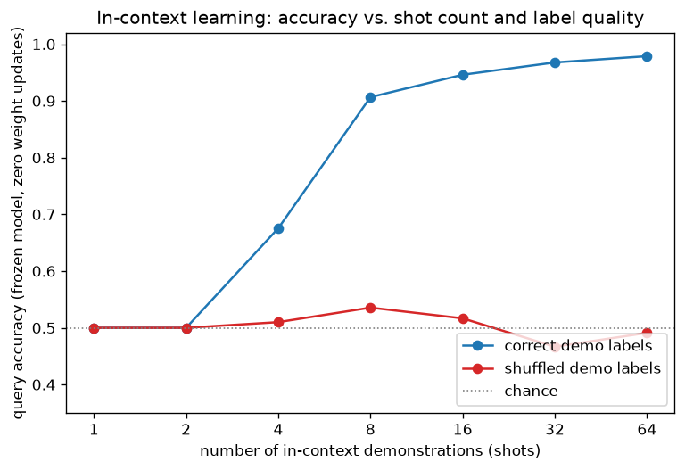

# Day 70 — In-Context Learning & Prompting

## 🧠 CONCEPT OF THE DAY

**Intuition.** Every concept from Day 1 through Day 69 shared one assumption: to make a model better at a task, you compute gradients and update $\theta$. Day 69's fine-tuning still needs backprop and a training loop, just starting from a good $\theta_{\text{pre}}$ instead of random init. In-context learning (ICL) breaks that assumption entirely: you freeze $\theta$ completely — zero gradient steps, zero backward passes — and instead *adapt the model's behavior purely by what you put in its input*. Show a large pretrained language model a handful of `(input, output)` examples in the prompt, then ask it to complete a new input, and it often produces the right kind of output — not because it learned the task just now, but because "recognize a pattern from examples and continue it" is itself a skill the model absorbed during pretraining on trillions of tokens containing exactly this structure (worked examples, Q&A pairs, tables, code with docstrings). You're not teaching the model a new skill; you're *retrieving and conditioning* a skill it already has, the same way showing someone three analogy examples ("hot:cold :: up:___") lets them infer the pattern without you re-teaching them what antonyms are.

**The math.** Formally, a frozen language model defines a conditional distribution over next tokens given a context $C$:

$$p_\theta(y \mid C, x)$$

where $\theta$ is fixed (no gradient updates), $C = (x_1, y_1, x_2, y_2, \ldots, x_k, y_k)$ is a sequence of $k$ demonstration pairs concatenated into the prompt, and $x$ is the new query. Compare this to fine-tuning's objective from Day 69:

$$\theta_{\text{target}} = \arg\min_\theta \mathcal{L}_{\text{target}}(\theta)$$

ICL never touches $\theta$ at all — the "adaptation" happens entirely inside the forward pass, where self-attention (Day 54–56) lets each query token attend back over every demonstration token in $C$. A useful way to think about *why* this works mathematically: recent theory (Von Oswald et al., 2022, and others) shows that for simple cases like linear regression, a transformer's forward pass over in-context examples can implement something functionally equivalent to one or more steps of gradient descent — computed implicitly through attention weights, not through $\nabla_\theta \mathcal{L}$. The model isn't literally running SGD, but the attention mechanism has enough expressive power to approximate it, which is a genuinely satisfying answer to "how can a *frozen* function learn anything from its input?"

Two knobs matter enormously in practice, and both are visible in today's graph:
- **Shot count $k$** — zero-shot ($k{=}0$, task description only), few-shot ($k$ small, typically 1–32). More demonstrations generally help, often with a sharp knee rather than a smooth curve — the model needs *enough* examples to disambiguate the task format before performance takes off.
- **Demonstration quality and order** — which examples, in what order, and critically, whether their input→label *mapping* is even correct. Min et al. (2022) showed something unintuitive: for many tasks, replacing demonstration labels with *random* labels barely hurts accuracy, because much of the benefit comes from showing the model the input distribution and output *format*, not the label mapping itself. Today's graph reproduces the more common and more expected pattern — real accuracy gains from correct labels — precisely so the gap makes that literature's surprising finding legible: notice how much of the *shape* of the curve (the format signal) survives even when labels are shuffled.

**Why it matters / where it leads.** This is the practical reason prompting became its own discipline: if you can't afford to fine-tune a 70B-parameter model (or don't have enough target data to do it safely — recall Day 69's catastrophic forgetting risk), ICL gives you task adaptation for free at inference time, at the cost of longer prompts and the O(n²) attention cost from Day 63. It's also precisely why prompt engineering is real: since demonstration *selection*, *order*, and *format* measurably change output distributions without changing a single weight, "prompting" is legitimately an optimization problem over the input, not a soft skill. This sets up Day 71 (instruction tuning) directly — instruction tuning is what you do at *pretraining-adjacent* time to make a base model reliably responsive to zero-shot natural-language instructions, reducing how many demonstrations you need to hand it at inference time.

**Interview question:** *A frozen 70B model gets 40% accuracy zero-shot on a classification task, and 85% with 16 correctly-labeled few-shot demonstrations. A teammate proposes fine-tuning on those same 16 examples instead of using them as a prompt. Why might that plausibly perform worse than few-shot prompting here, even though fine-tuning updates real weights?*

(Answer at the very bottom.)



Frozen "model" here is a k-nearest-neighbor lookup over demonstrations — a deliberately simple stand-in for what attention does over the prompt: retrieve and weight relevant context, no weight updates. With correct labels, accuracy rises sharply between 2 and 8 shots and saturates near ceiling — the classic ICL "knee." With shuffled labels (same inputs, same format, same $k$, only the label mapping destroyed), accuracy stays pinned near chance, because this particular task's structure genuinely depends on the input→label mapping rather than the input distribution alone. The gap between the two curves *is* "how much of ICL's benefit is coming from correct labels versus from format/distribution exposure" — the exact question the ICL literature investigates on real LLMs.

---

## 🐍 PYTHONIC EDGE

Building few-shot prompts by hand with string concatenation is the single most common source of silent prompt bugs — invisible whitespace differences, inconsistent example counts, and off-by-one label alignment. Here's the sloppy way versus a clean, inspectable way.

```python
# ---- BAD: manual string concatenation, easy to misalign examples/labels ----
examples = [("great movie", "positive"), ("waste of time", "negative")]
prompt = ""
for ex in examples:
    prompt += "Review: " + ex[0] + "\n" + "Sentiment: " + ex[1] + "\n\n"  # + is Python's concat op; C++ needs std::string operator+ overload same way, but this is easy to typo
prompt += "Review: " + "not bad at all" + "\n" + "Sentiment:"
# fragile: forgetting a "\n\n" here silently merges two demonstrations into one

# ---- GOOD: a small dataclass-like structure + f-strings + a generator expression ----
from dataclasses import dataclass                     # no C++ equivalent import syntax -- "import X as Y" aliasing works the same way for modules
from typing import List                                 # List[Tuple[str, str]] annotation -- Python type hints are optional/erased at runtime, unlike C++ templates

@dataclass                                               # decorator -- no C++ equivalent; auto-generates __init__, __repr__, __eq__
class Demo:
    review: str
    sentiment: str

def build_prompt(demos: List[Demo], query: str, k: int = None) -> str:
    k = len(demos) if k is None else k                  # None is Python's null -- distinct from C++'s nullptr, works for any type not just pointers
    selected = demos[:k]                                 # slice notation [:k] -- no direct C++ std::vector equivalent, this copies a sub-list
    blocks = (f"Review: {d.review}\nSentiment: {d.sentiment}" for d in selected)  # generator expression -- lazy, no C++ equivalent
    return "\n\n".join(blocks) + f"\n\nReview: {query}\nSentiment:"  # str.join consumes any iterable, including the generator above

demos = [Demo("great movie", "positive"), Demo("waste of time", "negative")]
prompt = build_prompt(demos, query="not bad at all", k=2)  # k is a keyword argument here -- keyword-only if declared after a bare * in the signature
print(repr(prompt))  # repr() shows escaped \n so you can SEE whitespace bugs instead of guessing
```

The real trick isn't the dataclass — it's `repr()`. `print(prompt)` renders newlines invisibly, so a missing blank line between demonstrations looks identical to a correct prompt until the model's accuracy mysteriously drops. `repr(prompt)` shows literal `\n` characters, turning an invisible formatting bug into something you can diff by eye. This matters more in ICL than almost anywhere else in ML code, because unlike a shape mismatch, a malformed prompt doesn't throw an exception — it just silently degrades accuracy, and you find out from a confused eval score, not a stack trace.

---

## 📡 SIGNAL LAB

In-context learning's "retrieve and condition on similar context, no parameter update" behavior is structurally close to **matched filtering / template correlation** in DSP: instead of redesigning a detector from scratch for each new signal instance, you correlate the incoming signal against a bank of known reference templates (your "demonstrations") and let the similarity scores themselves determine the output — the detector's own parameters never change. More demonstrations in ICL is analogous to a richer template bank: better coverage of the input distribution, sharper matches, until you saturate because your handful of templates already spans the relevant signal subspace.

**Worked example.** A 1-D signal is either "clean tone" or "tone + chirp artifact." Classify a query signal by correlating it against a growing bank of labeled reference templates — no model training, purely similarity-based, exactly like the frozen-model k-NN lookup used for today's main graph:

```python
import numpy as np

np.random.seed(42)
n = 64
t = np.linspace(0, 1, n)

def clean_tone():
    return np.sin(2 * np.pi * 5 * t) + 0.1 * np.random.randn(n)

def chirp_artifact():
    return np.sin(2 * np.pi * (5 + 10 * t) * t) + 0.1 * np.random.randn(n)

# growing "demonstration bank": reference templates with known labels
bank_size = 12
templates = [clean_tone() for _ in range(bank_size // 2)] + \
            [chirp_artifact() for _ in range(bank_size // 2)]
labels = [0] * (bank_size // 2) + [1] * (bank_size // 2)

query = chirp_artifact()  # unlabeled query -- what we're classifying

# matched filter score: normalized cross-correlation against each template
def match_score(sig, template):
    sig_n = (sig - sig.mean()) / sig.std()
    tmpl_n = (template - template.mean()) / template.std()
    return np.correlate(sig_n, tmpl_n, mode="valid")[0] / n

scores = [match_score(query, tmpl) for tmpl in templates]
best_idx = int(np.argmax(scores))
predicted_label = labels[best_idx]
print(f"predicted label: {predicted_label} (true: 1, chirp)")
```

Correlating against *more* templates (bigger `bank_size`) gives the detector more coverage of within-class variation (noise realizations, phase shifts), so its effective decision boundary sharpens — the exact same "more shots → sharper implicit decision boundary" effect from today's ICL graph, just implemented as explicit cross-correlation instead of implicit attention.

**So what:** when you're evaluating whether a frequency-domain forensics model needs *fine-tuning* on a new generator family versus just needing better *reference examples* at inference time (a "prompt" of known real/fake spectral signatures), this correlation framing is the right first question to ask — sometimes the frozen feature space already separates the classes fine, and what's missing is coverage in your reference bank, not weight updates.

---

## 🏋️ THE GAUNTLET

**K Closest Points to Origin.** Given an array of points on the 2D plane and an integer `k`, return the `k` closest points to the origin `(0, 0)`, in any order.

**Constraints:** $1 \le k \le \text{points.length} \le 10^4$, $-10^4 \le x_i, y_i \le 10^4$.

**Hints (escalating):**
1. "Closest to origin" only ever needs squared Euclidean distance for comparison — never take a square root, it's wasted computation and introduces float precision noise for no benefit.
2. Sorting all $n$ points fully by distance costs $O(n \log n)$ and works, but you only need the *smallest k*, not a full order. Is there a structure that keeps track of "the k best seen so far" without ever fully sorting everything?
3. Maintain a max-heap of size $k$ over (negative) squared distance. Push each point; if the heap exceeds size $k$, pop the farthest. At the end the heap holds exactly the $k$ closest points. Think about why a *max*-heap (not min-heap) is the right structure when you're bounding the heap to size $k$.

**Pattern:** heap-based top-k selection — the same "bounded max-heap, evict the worst" idea reappears anytime you need the k best/closest/smallest items from a stream without sorting everything. **Target complexity:** O(n log k) time, O(k) space.

---

## 🏗️ BLUEPRINT

**Serving few-shot prompts at scale: prompt caching.** When many requests share the same long demonstration prefix (your fixed few-shot examples) followed by a short, varying query, recomputing the K/V projections (Day 54) for that shared prefix on every single request is pure waste — it's identical work repeated thousands of times. Production LLM serving systems (this is what Day 100's KV cache and Day 103's continuous batching build toward) cache the attention K/V state for the shared prefix once and reuse it across requests, only running the forward pass fresh for the short suffix that actually differs. The tradeoff: cache hit rate depends entirely on how many requests share an *exact* prefix, so prompt design for high-traffic systems increasingly puts static content (instructions, demonstrations) first and dynamic content (the user's actual query) last — a purely engineering-driven reason to prefer that ordering, on top of any accuracy argument.

---

## 🗺️ MARCHING ORDERS

You now have the vocabulary to say precisely what a "prompt" is doing mathematically — conditioning a frozen distribution, not training anything — which is the dividing line between engineering a good input and actually adapting a model. Tomorrow pushes the *base* model itself to be more responsive to zero-shot instructions in the first place, so you need fewer demonstrations to begin with.

Tomorrow: Concept 71 — Instruction tuning

---

🔓 GAUNTLET SOLUTION

```cpp
#include <vector>
#include <queue>
using namespace std;

vector<vector<int>> kClosest(vector<vector<int>>& points, int k) {
    // max-heap keyed on squared distance: top() is always the CURRENT farthest
    // of the k points we're keeping, so it's the right one to evict.
    priority_queue<pair<long long, int>> maxHeap;  // {squared_dist, index}

    for (int i = 0; i < (int)points.size(); i++) {
        long long dist = (long long)points[i][0] * points[i][0]
                        + (long long)points[i][1] * points[i][1];
        maxHeap.push({dist, i});
        if ((int)maxHeap.size() > k) {
            maxHeap.pop();  // evict the current farthest point
        }
    }

    vector<vector<int>> result;
    while (!maxHeap.empty()) {
        result.push_back(points[maxHeap.top().second]);
        maxHeap.pop();
    }
    return result;
}
```

Each of the $n$ points does one $O(\log k)$ heap push and at most one $O(\log k)$ pop (heap never exceeds size $k+1$ before trimming), giving $O(n \log k)$ total — strictly better than full $O(n \log n)$ sorting whenever $k \ll n$. `priority_queue` in C++ is a max-heap by default, which is exactly what's needed here: we want cheap access to the *current worst* of our kept set so we can evict it in $O(\log k)$.

💡 CONCEPT ANSWER

Fine-tuning on only 16 examples with a 70B-parameter model is an extreme case of the overfitting risk from Day 69: 16 examples give gradient descent almost no signal to constrain how billions of parameters move, so it's very easy for the optimizer to overfit hard to those exact 16 points — memorizing surface patterns (exact phrasing, example order effects baked into weights) rather than the general task — and catastrophically forget unrelated capabilities in the process, since nothing in a 16-example loss term regularizes toward preserving them. Few-shot prompting, by contrast, never modifies $\theta$ at all — the "16 examples" only ever influence a single forward pass's attention pattern, so there's no way for the model to overfit its permanent weights to them, and every one of the model's other pretrained capabilities stays fully intact for the next prompt. The general lesson: with very little target data, an inference-time adaptation method with zero degrees of freedom to overfit can beat a training-time method with billions of degrees of freedom and no regularization strong enough to control them.
