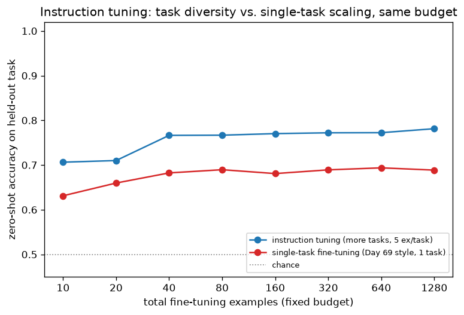

# Day 71 — Instruction Tuning

## 🧠 CONCEPT OF THE DAY

**Intuition.** Day 69's fine-tuning and Day 70's in-context learning both start from a base model and adapt it to *one task at a time* — either by updating $\theta$ on that task's examples, or by conditioning a frozen $\theta$ on that task's demonstrations in the prompt. Instruction tuning asks a different question: what if, instead of adapting to one task, you fine-tune the base model once on *thousands of different tasks at the same time*, each phrased as a natural-language instruction plus its correct response — "Summarize this," "Translate this to French," "Is this review positive or negative?" — so that the model learns the *meta-skill* of mapping an instruction's surface form to the right kind of behavior, not any single task's content. The base model already has all the raw capability (it was pretrained on internet text containing summaries, translations, and reviews); what it's missing is the habit of treating an imperative sentence as a literal command to execute rather than just another string to continue. Instruction tuning is the training-time investment that pays off as fewer, or zero, demonstrations needed at inference time — it's the reason a modern chat model gets a new zero-shot task right on the first try, when a 2019-era LM would need you to hand-craft a few-shot prompt just to get it to understand what you're asking.

**The math.** The training objective looks identical to any supervised fine-tuning loss — next-token cross-entropy —

$$\mathcal{L}(\theta) = -\mathbb{E}_{(I, R) \sim \mathcal{D}} \sum_{t=1}^{|R|} \log p_\theta\big(r_t \mid r_{<t}, I\big)$$

where $I$ is an instruction (optionally with an input), $R = (r_1, \ldots, r_{|R|})$ is the target response, and critically $\mathcal{D}$ is a **mixture of thousands of distinct tasks**, each reformatted into instruction-response pairs — this is the entire difference from Day 69. One crucial implementation detail: the loss is only computed over the *response* tokens $r_t$, never over the instruction tokens $I$ — you mask $I$'s positions out of the loss (more on this in Pythonic Edge below), because you want the model to learn to *produce* good responses conditioned on instructions, not to learn to predict the instructions themselves, which would waste capacity modeling something the user already supplies at inference time.

The single most important empirical finding here, from the FLAN paper (Wei et al., 2021) and reproduced in today's graph: held-out task performance scales with the **number of distinct tasks** in $\mathcal{D}$, far more than with the number of examples per task. Fine-tune on 1 task with 10,000 examples and you get a model that's excellent at that 1 task and no better than the base model at anything else — Day 69's catastrophic-forgetting risk in a new costume. Fine-tune on 1,000 tasks with 10 examples each (same total budget) and the model learns something closer to "how to follow instructions in general," which transfers zero-shot to task #1,001 it never saw.

**Why it matters / where it leads.** This directly determines how much prompt engineering you need at inference time: a well instruction-tuned model needs zero demonstrations for many tasks, collapsing Day 70's whole shot-count curve toward its ceiling at $k{=}0$. But instruction tuning alone only teaches the model to imitate the *style* of good responses present in $\mathcal{D}$ — it says nothing about which of several plausible, well-formatted responses a human actually *prefers*. That gap — closing the space between "grammatically matches the training distribution" and "is the response a human rates as most helpful and safe" — is exactly what tomorrow's concept, RLHF, is built to close, by fitting a reward model to human preferences and optimizing against it, since preference isn't something cross-entropy on a fixed target sequence can express.

**Interview question:** *You instruction-tune a base model on 2,000 diverse tasks and it gets much better at zero-shot generalization, as expected. But its performance on your single most important task — the one your product actually ships — quietly gets worse compared to just fine-tuning on that one task alone with the same total compute budget. Why would that happen, and what's the standard fix?*

(Answer at the very bottom.)



Toy model: every task's true decision rule is $w_{\text{task}} = w_{\text{shared}} + \text{noise}_{\text{task}}$, where $w_{\text{shared}}$ is common to all tasks (the "general instruction-following" direction) and $\text{noise}_{\text{task}}$ is that task's private quirk. Fitting many *distinct* tasks and averaging the estimates cancels the private noise terms — the same law-of-large-numbers logic behind any Monte Carlo average — recovering something close to $w_{\text{shared}}$, which transfers to a new held-out task. Fitting one task harder (more examples, same task) only shrinks *estimation* noise; that task's own private quirk never washes out, so accuracy on an unrelated held-out task plateaus early and stays capped, at the same total example budget.

---

## 🐍 PYTHONIC EDGE

The detail every instruction-tuning implementation gets wrong at least once: forgetting to mask the instruction tokens out of the loss. Compute cross-entropy over the *whole* sequence and the model spends gradient signal learning to predict your own prompt text back to you — wasted capacity at best, degraded instruction-following at worst, since the model partially learns "continue this prompt" instead of "answer this prompt."

```python
import torch
import torch.nn.functional as F

# ---- BAD: loss computed over the full sequence, instruction included ----
# input_ids = [instruction_tokens..., response_tokens...]
logits = model(input_ids)                      # calling model(...) invokes __call__, which wraps forward() -- never call model.forward() directly, it skips hooks
loss_bad = F.cross_entropy(
    logits[:, :-1].reshape(-1, logits.size(-1)),  # [:-1] slice: predict token t from tokens <t -- classic shift-by-one for causal LM
    input_ids[:, 1:].reshape(-1),
)
# every instruction token is also a target here -- the model gets gradient
# signal for "predict the next word of MY OWN QUESTION", pure waste

# ---- GOOD: mask instruction positions with the ignore_index sentinel ----
labels = input_ids.clone()                      # .clone() -- explicit copy; Python assignment (`labels = input_ids`) would alias the same tensor, not copy it
labels[:, :instruction_len] = -100              # -100 is PyTorch's reserved "ignore this position" label id
# in-place slice assignment mutates `labels` directly -- no C++ equivalent
# operator, this is Python's slice-assignment protocol (__setitem__)

logits = model(input_ids)
loss_good = F.cross_entropy(
    logits[:, :-1].reshape(-1, logits.size(-1)),
    labels[:, 1:].reshape(-1),
    ignore_index=-100,                          # positions labeled -100 contribute exactly zero to the loss and its gradient
)
```

`ignore_index=-100` isn't a magic constant you need to memorize as arbitrary — it's PyTorch's documented default sentinel specifically so functions like `cross_entropy` and `nll_loss` can skip positions without you having to build and multiply by a separate boolean mask tensor yourself. The instruction tokens still flow through the forward pass in full (the model needs to *attend to* them to generate a correct response) — only their contribution to the *loss* is zeroed out. Mixing those two up — masking positions out of attention instead of out of the loss — is the more dangerous version of this bug, because it silently breaks the model's ability to even read the instruction, and unlike the loss-masking bug it usually doesn't converge to anything at all, so it's caught faster in practice, not slower.

---

## 📡 SIGNAL LAB

Loss masking has a clean DSP analogue: it's **windowing before an FFT**. When you compute a discrete Fourier transform of a finite signal segment, an implicit rectangular window (just truncating the signal to $N$ samples) has sharp edges in the time domain, which smear energy across many frequency bins in the spectrum — spectral leakage — because a rectangular window's own frequency response is a sinc function with slowly-decaying sidelobes. Applying a tapered window (Hann, Hamming) before the FFT suppresses the edge discontinuity and concentrates energy back into the true frequency bins. In both cases you're deciding *which region of your data actually deserves weight in the downstream computation* — loss masking says "only the response region should generate gradient," windowing says "only the tapered-interior region should dominate the spectral estimate," and skipping either step lets irrelevant structure (instruction tokens; window edge artifacts) leak into a result that's supposed to reflect only the signal you care about.

**Worked example.** Compare the spectrum of a pure 5 Hz tone under a rectangular window versus a Hann window, both truncated to the same short segment:

```python
import numpy as np

np.random.seed(42)
fs = 64          # sampling rate, Hz
N = 64           # short segment -- truncation is unavoidable, edges WILL be sharp
t = np.arange(N) / fs
freq_true = 5.0
signal = np.sin(2 * np.pi * freq_true * t)

# rectangular window = no window at all, just the raw truncated segment
spec_rect = np.abs(np.fft.rfft(signal))

# Hann window: tapers the segment to zero at both edges before the FFT
hann = np.hanning(N)
spec_hann = np.abs(np.fft.rfft(signal * hann))

freqs = np.fft.rfftfreq(N, d=1 / fs)

# how much energy leaked OUTSIDE the true 5 Hz bin, as a fraction of total
def leakage_fraction(spec, freqs, true_freq, tol=1.0):
    in_band = spec[np.abs(freqs - true_freq) <= tol].sum()
    return 1.0 - in_band / spec.sum()

print(f"rectangular window leakage: {leakage_fraction(spec_rect, freqs, freq_true):.3f}")
print(f"Hann window leakage:        {leakage_fraction(spec_hann, freqs, freq_true):.3f}")
```

The Hann-windowed spectrum concentrates far more of its energy inside the true 5 Hz bin; the rectangular window's sidelobes leak measurable energy into neighboring bins purely from the edge discontinuity, not from anything in the underlying signal. **So what:** this is precisely the failure mode of un-masked instruction-tuning loss — training signal "leaks" from the instruction region into places it shouldn't influence, degrading the estimate (the model's learned response distribution) the same way spectral leakage degrades a frequency estimate. When you're doing frequency-domain forensics on generative-model outputs, the same instinct applies in reverse: always ask what window function produced the spectrum you're analyzing before you trust a spectral signature as evidence of anything.

---

## 🏋️ THE GAUNTLET

**Task Scheduler.** You're given a list of CPU tasks, represented by uppercase letters, and a non-negative integer `n` — the cooldown period: the same task cannot run again until `n` other tasks (or idle slots) have passed. Return the minimum number of time units the CPU needs to finish all tasks.

**Constraints:** $1 \le \text{tasks.length} \le 10^4$, tasks are drawn from 26 uppercase letters, $0 \le n \le 100$.

**Hints (escalating):**
1. Only the *most frequent* task(s) can force idle time — a task that appears once is never the bottleneck. Start by counting frequencies.
2. Picture arranging the most frequent task with `(max_count - 1)` gaps between its occurrences, each gap needing size `n` before that task can repeat.
3. Other tasks (and other tasks tied for max frequency) fill those gaps for free, up to a point. The answer is the larger of: the raw number of tasks (no idle needed once you have enough variety), or `(max_count - 1) * (n + 1) + count_of_tasks_at_max_frequency`.

**Pattern:** greedy scheduling via frequency counting — the "let the bottleneck resource dictate the layout, then see what fits for free around it" idea reappears anytime one high-frequency item constrains a schedule. **Target complexity:** O(n) time (single pass + O(26) counting), O(1) extra space.

---

## 🏗️ BLUEPRINT

No blueprint today.

---

## 🗺️ MARCHING ORDERS

You now know precisely what separates "a model that was fine-tuned" from "a model that follows instructions" — task diversity at training time, not task depth — and why that investment pays for itself every time a user doesn't have to write a few-shot prompt. Tomorrow closes the remaining gap: instruction tuning teaches the model to produce *plausible* responses in the right format, but says nothing about which of several plausible responses humans actually prefer.

Tomorrow: Concept 72 — RLHF overview

---

🔓 GAUNTLET SOLUTION

```cpp
#include <vector>
#include <array>
#include <algorithm>
using namespace std;

int leastInterval(vector<char>& tasks, int n) {
    array<int, 26> counts{};
    for (char c : tasks) counts[c - 'A']++;  // frequency count, O(26) space

    int maxCount = *max_element(counts.begin(), counts.end());
    int numAtMax = count(counts.begin(), counts.end(), maxCount);
    // numAtMax: how many distinct tasks are TIED for the highest frequency --
    // each of them needs its own slot in the final "row" of the last gap

    // (maxCount - 1) full gaps, each of size (n + 1): the most frequent task
    // itself, plus n cooldown slots. The final occurrence of the max-count
    // task(s) doesn't need a trailing gap, hence numAtMax appended once at the end.
    int scheduleLength = (maxCount - 1) * (n + 1) + numAtMax;

    // if there's enough task variety, the natural task count already exceeds
    // the idle-padded schedule -- no idle slots needed at all, answer is just n tasks
    return max((int)tasks.size(), scheduleLength);
}
```

The greedy insight: only the count of the *most frequent* task (and how many tasks tie for that count) determines whether idle slots are forced at all. Every other, less-frequent task can always be slotted into one of the `(maxCount - 1)` gaps between repeats of the bottleneck task, because by definition there are fewer of them to place than there are gap-slots available — so the formula never needs to simulate the actual schedule, just count.

💡 CONCEPT ANSWER

This is the standard multi-task fine-tuning tradeoff: training on 2,000 diverse tasks with a fixed compute/parameter budget means gradient updates are now shared across all 2,000 objectives, and updates that help the *average* task can actively conflict with the gradient direction your one specific priority task wants — the model's capacity gets spread thin, and if your target task's data distribution is a small fraction of the instruction-tuning mixture, its signal gets diluted by the other 1,999 tasks' gradients. Fine-tuning solely on your one task, by contrast, lets every gradient step serve that task with zero competing objectives. The standard fix is **mixture upweighting**: oversample or upweight your priority task's examples within the instruction-tuning mixture (a common real-world recipe: replicate the target task's data, or assign it explicit sampling probability far above its natural frequency) so the model still gets the generalization benefit of diverse tasks while treating your priority task as a first-class citizen rather than 1-of-2000 equal voices — or alternatively, instruction-tune broadly first, then do a final short single-task fine-tuning pass on top (this is close to what "instruction-tuned base model → task-specific fine-tune" pipelines do in practice), trading some of instruction tuning's zero-shot generality back for priority-task performance.
