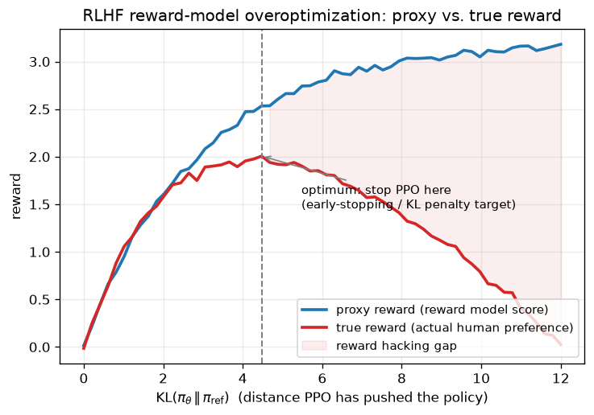

# Day 72 — RLHF Overview

## 🧠 CONCEPT OF THE DAY

**Intuition.** Instruction tuning (yesterday) teaches a model to produce *a* plausible, well-formatted answer. It says nothing about which of several equally-fluent, equally-well-formatted answers a human actually *prefers*. RLHF (Reinforcement Learning from Human Feedback) is the step that closes that gap: instead of teaching the model "here is the one correct output" (which we often can't even write down — "be more helpful" isn't a training label), we teach it to rank outputs the way a human would, then nudge the policy toward the highly-ranked ones. Think of it as the difference between a cooking-school curriculum (instruction tuning: learn the techniques) and a panel of judges tasting dishes and telling you which one they liked better (RLHF: learn the *taste*).

**The three-stage pipeline:**

1. **Supervised fine-tuning (SFT)** — start from the instruction-tuned model $\pi_{\text{SFT}}$ (yesterday's output). This is the reference policy $\pi_{\text{ref}}$.
2. **Reward model (RM) training** — sample multiple completions per prompt from $\pi_{\text{SFT}}$, have humans rank them (pairwise comparisons are cheaper and more reliable than absolute scores), and train a reward model $r_\phi(x, y)$ to predict preferences using the Bradley-Terry pairwise loss:

$$\mathcal{L}(\phi) = -\mathbb{E}_{(x, y_w, y_l)}\left[\log \sigma\big(r_\phi(x, y_w) - r_\phi(x, y_l)\big)\right]$$

   where $y_w$ is the human-preferred ("winning") completion, $y_l$ is the rejected ("losing") one, and $\sigma$ is the sigmoid. This is literally logistic regression on reward *differences*.

3. **RL fine-tuning (PPO)** — optimize the policy $\pi_\theta$ (initialized from $\pi_{\text{SFT}}$) to maximize reward model score, *penalized* by how far it drifts from the reference policy:

$$\max_\theta \; \mathbb{E}_{x \sim D,\, y \sim \pi_\theta(\cdot|x)}\Big[r_\phi(x, y) - \beta \cdot \mathrm{KL}\big(\pi_\theta(\cdot|x) \,\|\, \pi_{\text{ref}}(\cdot|x)\big)\Big]$$

   Every symbol: $r_\phi(x,y)$ is the learned reward for prompt $x$ and completion $y$; $\beta$ is a tunable coefficient trading off reward vs. staying close to $\pi_{\text{ref}}$; the KL term is what actually makes this *reinforcement learning* rather than plain reward maximization — without it, PPO will happily exploit any weakness in $r_\phi$ (see below).

**Why the KL penalty is the whole game.** $r_\phi$ is a learned *proxy* for "what humans want," trained on a finite, noisy preference dataset — it is not ground truth. If you let PPO maximize $r_\phi$ unconstrained, it will drift into regions of output space the reward model was never trained on and score highly there for reasons that have nothing to do with quality (repetitive phrases, sycophantic hedging, degenerate patterns that happen to correlate with high reward-model scores). This is **reward hacking** — Goodhart's Law in action: "when a measure becomes a target, it ceases to be a good measure." The KL penalty is a leash: it keeps $\pi_\theta$ close enough to $\pi_{\text{ref}}$'s distribution that the reward model's scores stay meaningful, at the cost of not fully maximizing raw reward.

**Why it matters / where it leads.** RLHF's core weakness — an expensive human-labeled reward model, plus the instability of PPO itself — is exactly what later techniques attack from different angles: DPO (Direct Preference Optimization) eliminates the separate reward model and RL loop entirely by showing the same preference objective has a closed-form supervised loss; RLAIF replaces human labels with AI-generated preferences to cut cost. Interviewers love probing whether you understand *why* the KL term exists, not just that it's in the formula — that's the signal that separates "read the paper" from "internalized the failure mode."

**Interview question:** *Your RLHF-tuned model's reward-model score keeps climbing during PPO training, but human eval quality is flat or declining. What's happening, and what are two concrete levers you'd pull to fix it?*



---

## 🐍 PYTHONIC EDGE

Computing the Bradley-Terry pairwise loss is a great excuse to show a subtle NumPy/PyTorch trap: doing sigmoid-then-log by hand is numerically unstable (overflows/underflows in `exp`), versus using the library's fused, stable primitive.

```python
import torch
import torch.nn.functional as F

# reward model scores for winning vs. losing completions, one pair per row
r_win = torch.tensor([2.1, 0.3, -1.4])   # r_phi(x, y_w)  -- shape (batch,)
r_lose = torch.tensor([1.8, 0.9, 3.2])   # r_phi(x, y_l)

diff = r_win - r_lose  # elementwise subtraction, NOT dot product -- '-' here is plain tensor arithmetic

# --- BAD: manual sigmoid + log, unstable for large |diff| ---
prob = 1 / (1 + torch.exp(-diff))        # exp(-diff) can overflow for very negative diff
loss_bad = -torch.log(prob).mean()       # log(~0) -> -inf, gradients blow up
# .mean() is a method call on the tensor object -- no free function needed, unlike most C++ math libs

# --- CLEAN: logsigmoid is a fused, numerically stable op ---
loss_clean = -F.logsigmoid(diff).mean()  # equivalent to -log(sigmoid(diff)) but never computes exp() directly
# F.logsigmoid uses log1p / softplus tricks internally -- same math, no overflow

print(f"bad: {loss_bad.item():.4f}, clean: {loss_clean.item():.4f}")
# f"..." is an f-string: {expr} is evaluated and interpolated inline, no printf-style format specifiers required
# .item() pulls a Python float out of a 0-dim tensor -- C++ has no equivalent, tensors don't auto-decay to scalars
```

**Syntax notes for the C++ reader:** `torch.tensor([...])` builds a 1-D tensor from a Python list literal — no explicit type/size template params, dtype is inferred. `r_win - r_lose` is operator overloading doing elementwise subtraction (broadcasting rules apply, like NumPy, not like `std::vector` which has no `-`). `.mean()`, `.item()` are instance methods called with dot syntax — same mental model as C++ member functions, just no `->` vs `.` distinction since Python has no pointers here. `import torch.nn.functional as F` is an import-with-alias idiom — `F` is just a local name bound to the module object, purely for brevity, with no C++ equivalent (closest analogy: a namespace alias, `namespace F = torch::nn::functional;`).

---

## 📡 SIGNAL LAB

The reward-hacking curve above has a direct spectral analogue: **overfitting a proxy objective is the training-time equivalent of aliasing.** When you sample a continuous signal below the Nyquist rate, high-frequency content doesn't disappear — it *folds back* and masquerades as low-frequency content you didn't actually observe. Your sampled signal looks clean and low-frequency, but that's an artifact of undersampling, not truth about the underlying signal. Reward hacking is the same failure shape: the reward model is a finite, imperfect "sampling" of the true human-preference function over the astronomically large space of possible completions. In regions of that space near the training distribution, $r_\phi \approx r_{\text{true}}$ — well-sampled, trustworthy. Far from it (where unconstrained PPO wanders), $r_\phi$'s predictions are extrapolations that *look* like a clean high-reward signal but are actually aliased noise: the proxy is confidently wrong because it was never sampled there.

**Worked mini-example — undersampling a signal and "trusting" the alias:**

```python
import numpy as np

np.random.seed(42)
fs_true = 200          # the rate you'd need to represent the signal faithfully
fs_bad = 20             # a badly undersampled ("proxy") rate -- below Nyquist for our tone
f_true = 18              # true signal frequency, Hz

t_dense = np.arange(0, 1, 1 / fs_true)
t_sparse = np.arange(0, 1, 1 / fs_bad)

signal_dense = np.sin(2 * np.pi * f_true * t_dense)   # ground truth, well-sampled
signal_sparse = np.sin(2 * np.pi * f_true * t_sparse)  # what the undersampled "proxy" sees

# the aliased frequency the sparse samples APPEAR to show, via the folding formula
f_alias = abs(f_true - fs_bad * round(f_true / fs_bad))
print(f"true frequency: {f_true} Hz, sampled at {fs_bad} Hz appears as: {f_alias} Hz")
```

Running this: an 18 Hz tone sampled at 20 Hz reports back as a 2 Hz signal — confidently, cleanly, and *completely wrong*, with no indication in the sparse samples alone that anything is missing. **So what:** exactly like PPO trusting a reward model score that looks smooth and monotonically improving, a spectral estimate built from undersampled data looks trustworthy right up until you check it against ground truth. The fix in both domains is structurally the same — constrain how far you extrapolate from what you actually observed (KL penalty in RLHF; respecting Nyquist / anti-aliasing filters before sampling in DSP) rather than trusting the proxy measurement unconditionally.

---

## 🏋️ THE GAUNTLET

**Longest Increasing Path in a Preference DAG.** You're given `n` completions and a list of pairwise preference edges `prefs[i] = [a, b]` meaning completion `a` was preferred over completion `b` by a human labeler (guaranteed to form a DAG — no preference cycles). Find the length (number of completions) of the longest *chain* of strictly decreasing preference — i.e., the longest path in this DAG.

**Constraints:** $1 \le n \le 2 \times 10^4$, $0 \le \text{prefs.length} \le 5 \times 10^4$, no self-loops, no duplicate edges, guaranteed acyclic.

**Hints (escalating):**
1. This is graph reachability with an optimization objective, on a DAG — the "no cycles" guarantee should immediately suggest a specific classical algorithm for path problems on DAGs, rather than general shortest/longest-path machinery (which struggles with longest-path in the presence of cycles).
2. Think about processing nodes in an order where, by the time you compute the answer for a node, every node it depends on already has its answer finalized.
3. Combine that ordering with a DP recurrence: `longest[a] = 1 + max(longest[b] for each edge a -> b)`, defaulting to 1 for nodes with no outgoing edges.

**Pattern:** topological sort + DP on a DAG. **Target complexity:** O(n + e) time, O(n + e) space.

---

## 🏗️ BLUEPRINT

**Reward model serving in the PPO loop.** During PPO fine-tuning you need $r_\phi(x, y)$ for every sampled rollout, every training step — that's a full forward pass through a second large model (the RM) on top of the policy's own forward/backward passes, plus a *third* copy of the model sitting frozen as $\pi_{\text{ref}}$ for the KL term. The key tradeoff: keep all three models (policy, reward model, reference) resident on the same GPUs for lowest latency but pay 3x the memory footprint, versus serving the reward model as a separate batched inference service that the PPO workers call over the network, trading latency (network round-trip per rollout batch) for the ability to scale the RM independently and share it across multiple concurrent PPO training jobs. Most production RLHF setups land on the latter once you're training more than one policy variant, because the reward model doesn't change during a PPO run — it's a natural shared, stateless service, unlike the constantly-updating policy weights.

---

## 🗺️ MARCHING ORDERS

You've now got the full RLHF picture end-to-end — SFT baseline, reward model from pairwise preferences, and PPO with a KL leash to stop the policy from Goodharting the reward model — which is the exact mental model you need before the next concept simplifies all three stages into a single loss function.

Tomorrow: Concept 73 — LoRA

---

🔓 GAUNTLET SOLUTION

```cpp
#include <vector>
using namespace std;

class Solution {
public:
    int longestChain(int n, vector<vector<int>>& prefs) {
        vector<vector<int>> adj(n);
        for (auto& e : prefs) adj[e[0]].push_back(e[1]);  // a -> b: a preferred over b

        vector<int> memo(n, -1);  // -1 = not yet computed
        int best = 1;

        // iterative DFS-based memoized DP (avoids recursion depth issues at n = 2*10^4)
        for (int start = 0; start < n; ++start) {
            if (memo[start] != -1) continue;

            vector<int> stack = {start};
            vector<int> callOrder;

            // first pass: build post-order via explicit stack (simulate DFS)
            vector<int> visiting(n, 0);  // 0 = unvisited, 1 = on stack, 2 = done
            vector<pair<int,int>> work = {{start, 0}};
            while (!work.empty()) {
                auto& [node, idx] = work.back();
                if (idx == 0) visiting[node] = 1;
                if (idx < (int)adj[node].size()) {
                    int nxt = adj[node][idx];
                    idx++;
                    if (visiting[nxt] == 0) {
                        work.push_back({nxt, 0});
                    }
                } else {
                    visiting[node] = 2;
                    int longest = 1;
                    for (int nxt : adj[node]) {
                        longest = max(longest, 1 + memo[nxt]);
                    }
                    memo[node] = longest;
                    best = max(best, longest);
                    work.pop_back();
                }
            }
        }
        return best;
    }
};
```

The topological-order insight: because the graph is guaranteed acyclic, a post-order DFS traversal guarantees every child of a node is fully resolved (`memo[child]` finalized) before the node itself computes its answer — that's what makes the DP recurrence `longest[a] = 1 + max(longest[b])` valid in a single pass, with no need to iterate to a fixed point the way you would on a general graph.

💡 CONCEPT ANSWER

Rising proxy reward with flat/declining human eval is the textbook reward-hacking signature from the graph above: PPO has pushed $\pi_\theta$ into a region of output space where $r_\phi$ extrapolates unreliably and no longer tracks true preference. Two concrete levers: **(1) increase $\beta$ (the KL penalty coefficient)** — this directly tightens the leash, forcing $\pi_\theta$ to stay closer to $\pi_{\text{ref}}$'s well-calibrated region, at the cost of a smaller net reward gain; in practice you'd sweep $\beta$ and pick the point on the true-reward curve right before it turns over (exactly the dashed line in today's graph), or use adaptive KL control (e.g. the scheme from the original InstructGPT paper) that automatically raises $\beta$ when measured KL exceeds a target. **(2) Retrain/refresh the reward model** on completions sampled from the *current*, drifted policy — collect new human preference labels specifically on the regions of output space PPO has wandered into, so $r_\phi$ gets re-calibrated where it was previously extrapolating blind, then resume PPO against the updated RM. In practice both levers are usually applied together in iterated RLHF: tighten KL to slow the drift, periodically refresh the RM to keep it honest about wherever the policy currently lives.
