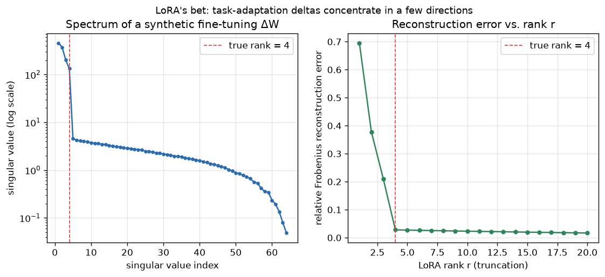

# Day 73 — Concept 73: LoRA (Low-Rank Adaptation)

## 🧠 CONCEPT OF THE DAY

**Intuition.** Full fine-tuning of a large pretrained model means updating *every* weight matrix — for a $d \times k$ weight, that's $d \cdot k$ trainable numbers, times however many layers. But when you adapt a model to a new task, the *change* you actually need rarely requires that much freedom. Think of the pretrained weight matrix as a huge, already-competent map of the terrain; adapting it to a new task is more like drawing a few new roads on top, not redrawing the whole map. LoRA's bet: that "new roads" update, $\Delta W$, lives in a low-dimensional subspace — it's well-approximated by a low-rank matrix, even though the original $W$ is full-rank. Day 69 (transfer learning) established *that* we reuse pretrained weights; LoRA answers *how* to adapt them without touching most of them.

**The math.** Freeze the pretrained weight $W_0 \in \mathbb{R}^{d \times k}$. Instead of learning a full update $\Delta W$, factor it as a product of two skinny matrices:

$$W = W_0 + \Delta W = W_0 + \frac{\alpha}{r}BA$$

where $B \in \mathbb{R}^{d \times r}$, $A \in \mathbb{R}^{r \times k}$, and the rank $r \ll \min(d, k)$. $\alpha$ is a fixed scaling constant (a learning-rate-like knob for the adapter). Trainable parameter count drops from $d \cdot k$ to $r(d + k)$ — for $d=k=4096, r=8$, that's roughly a 250x reduction. Critically, at initialization $A$ is drawn from a small random Gaussian and $B$ is initialized to **all zeros**, so $\Delta W = 0$ at step 0: training starts as an exact no-op relative to the pretrained model, then gradually carves out the task-specific update.

At inference time, $B A$ can be added back into $W_0$ directly (no extra latency), or kept separate and hot-swapped per task (small adapters, one frozen base model).

**Why it matters / where it leads.** LoRA is the practical bridge between "fine-tuning works" (Day 69) and "you can actually afford to do it" — it turns fine-tuning a 70B-parameter model from a multi-GPU, days-long job into something that fits on a single consumer GPU. Tomorrow's concept (quantization & QLoRA) stacks directly on top: quantize the frozen $W_0$ to 4-bit to shrink memory further, keep the LoRA adapters in higher precision since they're what's actually being learned.

**Interview-style question:** *Why is $B$ initialized to zero while $A$ is initialized randomly — why not initialize both to zero, or both randomly?*

---

## 🐍 PYTHONIC EDGE

The trick: freezing a base layer and attaching trainable low-rank matrices as a thin wrapper `nn.Module`, instead of hand-toggling `requires_grad` all over a model with fragile name-matching.

```python
import torch
import torch.nn as nn

# ---- BAD: manually hunting for parameters by name string ----
def freeze_bad(model):
    for name, param in model.named_parameters():
        # in "in" checks a substring — brittle: breaks silently if naming changes
        if "lora" not in name:
            param.requires_grad = False  # explicit attribute set, no return value

# ---- CLEAN: LoRA as an explicit, self-contained module ----
class LoRALinear(nn.Module):                 # class X(Base): single inheritance, unlike C++'s `class X : public Base`
    def __init__(self, base: nn.Linear, r: int = 8, alpha: int = 16):
        super().__init__()                    # parent ctor call; C++ instead uses an initializer list: LoRALinear() : Base()
        self.base = base                       # instance attribute, set at runtime (C++: declared in header, init'd in body)
        self.base.weight.requires_grad_(False) # trailing underscore -> in-place op (C++ has no naming convention for this)
        d_out, d_in = base.weight.shape        # tuple unpacking: a, b = fn() has no direct C++ equivalent
        self.A = nn.Parameter(torch.randn(r, d_in) * 0.01)  # * is elementwise/scalar mult (not matmul)
        self.B = nn.Parameter(torch.zeros(d_out, r))        # zero init -> delta_w starts at exactly 0
        self.scaling = alpha / r               # plain float division, no operator overload surprises

    def forward(self, x):
        base_out = self.base(x)                # calling base(x) invokes __call__, which wraps forward() + hooks
        lora_out = (x @ self.A.T) @ self.B.T    # @ is matrix multiplication (Python 3.5+ operator, no C++ equivalent)
        return base_out + self.scaling * lora_out


layer = nn.Linear(512, 512)
adapted = LoRALinear(layer, r=8)
trainable = [p for p in adapted.parameters() if p.requires_grad]  # list comprehension: no C++ equivalent, filters + collects in one line
print(f"trainable tensors: {len(trainable)}")  # f-string: embeds expressions directly, unlike C++ printf/iostream
```

`self` is Python's explicit version of C++'s implicit `this` — every instance method takes it as the first parameter by convention. Note also that calling `adapted(x)` (not `adapted.forward(x)`) is what you'd do in practice — `__call__` (inherited from `nn.Module`) is what registers forward/backward hooks, so calling `.forward()` directly silently skips them.

---

## 📡 SIGNAL LAB

LoRA's core assumption — "the task-adaptation delta is low-rank" — is exactly the same claim that underlies **separable filter approximation** in image processing: a full 2D convolution kernel $K \in \mathbb{R}^{d \times k}$ can often be well-approximated by a sum of a few rank-1 outer products of 1D kernels, $K \approx \sum_{i=1}^r u_i v_i^\top$, letting you replace one $O(d \cdot k)$ 2D convolution with $r$ cheaper separable 1D passes. In both cases you're asking: *how much of this matrix's energy is captured by its top few singular vectors?*

**Worked example.** Take a synthetic weight-update matrix (same one behind today's graph): built from 4 dominant rank-1 components plus Gaussian noise. Compute its SVD, $\Delta W = U \Sigma V^\top$, and truncate to rank $r$:

```python
import numpy as np
np.random.seed(42)

d, k, true_rank = 64, 64, 4
delta_w = sum((true_rank - i) * 2.0 * np.random.randn(d, 1) @ np.random.randn(1, k)
              for i in range(true_rank))          # generator expression fed straight into sum() — no C++ equivalent
delta_w += 0.3 * np.random.randn(d, k)

U, S, Vt = np.linalg.svd(delta_w, full_matrices=False)
r = 4
approx = (U[:, :r] * S[:r]) @ Vt[:r, :]            # negative-free slice [:r] takes the first r columns/rows
rel_err = np.linalg.norm(delta_w - approx) / np.linalg.norm(delta_w)
print(f"relative reconstruction error at rank {r}: {rel_err:.3f}")
```



Running it: the singular values fall off a cliff right after index 4, and truncating at $r=4$ already recovers ~97% of the Frobenius energy — adding more rank past that mostly just fits noise. **So what:** this is precisely why LoRA can use $r=4$–$16$ on billion-parameter models and still recover almost all of full fine-tuning's benefit — real task-adaptation deltas are empirically low-rank, just like natural image kernels are empirically separable. If your matrix's singular values decayed slowly and flatly instead (no elbow), that would be the signature of a genuinely high-rank, incompressible update — and a signal that LoRA (or a separable filter bank) would be the wrong tool.

---

## 🏋️ THE GAUNTLET

**Sliding Window Maximum**

Given an integer array `nums` of size `n` and a window size `k`, return an array of the maximum value in each contiguous window of size `k` as it slides from left to right.

**Constraints:** $1 \le k \le n \le 10^6$, $-10^4 \le \texttt{nums[i]} \le 10^4$. Target: **O(n) time**, O(k) extra space. A naive O(n·k) re-scan of every window will TLE at this size.

**Hints (escalating):**
1. You don't need to know the max of *every* element in the window — only elements that could still become the max of some future window matter. Once a smaller element sits behind a larger one, can it ever "win"?
2. Maintain a data structure of *candidate* indices where the corresponding values are strictly decreasing front-to-back — the front is always the current window's max.
3. Use a deque of indices (not values). Before pushing index `i`, pop from the back while `nums[back] <= nums[i]`. Before reading the front as the answer, pop it if it has fallen outside the window (`front <= i - k`).

**Pattern:** Monotonic deque. **Target complexity:** O(n) time — each index is pushed and popped at most once.

---

## 🏗️ BLUEPRINT

No blueprint today.

---

## 🗺️ MARCHING ORDERS

You now know how to make a 70B-parameter model trainable on a single GPU without touching 99.6% of its weights — that's not a toy trick, it's the default fine-tuning recipe in production today. Sit with the SVD intuition; it'll pay off again tomorrow.

Tomorrow: Concept 74 — Quantization (int8/int4) & QLoRA

---

🔓 GAUNTLET SOLUTION
```cpp
#include <vector>
#include <deque>
using namespace std;

vector<int> maxSlidingWindow(vector<int>& nums, int k) {
    deque<int> dq;           // stores indices, values strictly decreasing front-to-back
    vector<int> result;
    result.reserve(nums.size() - k + 1);

    for (int i = 0; i < (int)nums.size(); ++i) {
        // drop indices that fell out of the window on the left
        while (!dq.empty() && dq.front() <= i - k) {
            dq.pop_front();
        }
        // drop indices whose values can never beat nums[i] again
        while (!dq.empty() && nums[dq.back()] <= nums[i]) {
            dq.pop_back();
        }
        dq.push_back(i);

        if (i >= k - 1) {
            result.push_back(nums[dq.front()]);
        }
    }
    return result;
}
```
Each index enters and leaves the deque at most once, so total work across the whole array is O(n) despite the nested-looking while loops.

💡 CONCEPT ANSWER
Both-zero would mean $\Delta W = BA = 0$ forever — the gradient with respect to $A$ is proportional to $B^\top \cdot (\text{upstream grad})$, and if $B=0$ that gradient is also zero, so $A$ would never move and the adapter would be permanently stuck at zero (a saddle point it can't escape). Both-random would mean training starts by injecting a large, unstructured random perturbation into a model that was otherwise a well-trained checkpoint, destabilizing its behavior from step 1. Zero-init on $B$ *combined with* random-init on $A$ gets the best of both: $\Delta W = BA = 0$ exactly at init (so training starts identical to the pretrained model, and loss curves start clean rather than spiking), while $A$'s random values still give $B$'s gradient the nonzero, non-degenerate signal it needs to start learning immediately.
