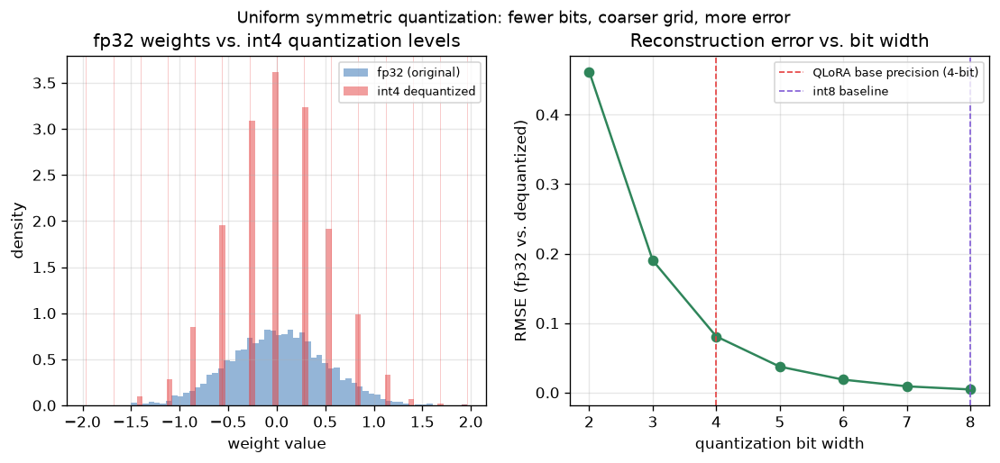

# Day 74 — Concept 74: Quantization (int8/int4) & QLoRA

## 🧠 CONCEPT OF THE DAY

**Intuition.** A weight stored as fp32 is a 32-bit real number with enormous dynamic range and precision — total overkill for what a neural net weight actually needs. Quantization is the bet that you can round each weight to one of a small, fixed set of grid points (256 of them for int8, just 16 for int4) and lose almost nothing the model cares about. Think of it like this: fp32 is measuring a table with a laser micrometer; int8 is measuring it with a good ruler; int4 is measuring it with a ruler that only has 16 tick marks on it. For most everyday carpentry, the ruler is fine — the micrometer's extra precision was never load-bearing. The question quantization always has to answer is: *which* 16 tick marks, and how much does using them cost you?

**The math.** The simplest scheme is **symmetric uniform quantization**. Given a tensor of weights $W$ with max absolute value $|W|_{\max}$, and $b$ target bits:

$$\text{scale} = \frac{|W|_{\max}}{2^{b-1} - 1}, \qquad W_q = \text{round}\left(\frac{W}{\text{scale}}\right), \qquad \hat{W} = W_q \cdot \text{scale}$$

$W_q$ is an integer in $[-(2^{b-1}-1), 2^{b-1}-1]$ — the thing you actually store — and $\hat{W}$ is the *dequantized* approximation you compute with. The gap $W - \hat{W}$ is quantization error, bounded by half the grid spacing, $\text{scale}/2$. Halving the bit count roughly doubles the grid spacing, so error grows geometrically as you drop bits — which is exactly what today's graph shows.

**QLoRA** combines this with Day 73's LoRA: freeze the pretrained base weights $W_0$ and quantize them to 4-bit (via NF4 — a scheme that places grid points at the quantiles of a standard normal, since weights are roughly Gaussian, rather than uniformly — plus double quantization of the scale factors themselves), while keeping the small trainable LoRA matrices $A, B$ in bf16. The forward pass dequantizes $W_0$ on the fly for the matmul, but $W_0$ never needs a gradient and never needs an optimizer state — that's where the memory actually goes. Result: fine-tuning a 65B model on a single 48GB GPU, a workload that would otherwise need 780GB+ of fp32 optimizer state.

**Why it matters / where it leads.** Quantization is the other axis of "make big models fit" — LoRA shrinks *trainable* parameters, quantization shrinks *stored* parameters, and QLoRA stacks them. This is also precisely the tradeoff you hit again at deployment time (Day 103, serving) and in Day 96's mixed-precision training: precision is a resource you spend deliberately, not a default you inherit. A senior interviewer will absolutely probe whether you understand that quantization error isn't uniform across a tensor — outlier weights dominate the error budget, which is why real int8 schemes use *per-channel* scales instead of one global scale.

**Interview-style question:** *Why does a single global scale factor for an entire weight matrix perform much worse than per-channel (per-output-neuron) scale factors, and what does that imply about how outlier weights should be handled?*

---

## 🐍 PYTHONIC EDGE

The trick: doing quantization math directly with tensor ops instead of a Python `for` loop — the kind of vectorization mistake that silently tanks performance and is an easy interview tell.

```python
import torch

# ---- BAD: element-by-element loop, no reason to ever write this in PyTorch ----
def quantize_bad(w, bits=8):
    qmax = 2 ** (bits - 1) - 1
    scale = w.abs().max().item() / qmax   # .item() pulls a Python scalar out of a 0-dim tensor
    out = torch.zeros_like(w)
    for i in range(w.shape[0]):           # range() is a lazy object, not a materialized list (unlike hand-rolled C++ loops)
        for j in range(w.shape[1]):
            out[i, j] = round(w[i, j].item() / scale)  # round-trips through Python floats — slow, defeats the point of a tensor lib
    return out * scale, scale

# ---- CLEAN: vectorized, per-channel scales ----
def quantize_per_channel(w: torch.Tensor, bits: int = 8) -> tuple[torch.Tensor, torch.Tensor]:
    qmax = 2 ** (bits - 1) - 1
    scale = w.abs().amax(dim=1, keepdim=True) / qmax   # amax along dim=1: one scale per output row (per-channel)
    w_q = (w / scale).round().clamp_(-qmax, qmax)       # clamp_ : trailing underscore = in-place (no C++ naming convention for this)
    return w_q * scale, scale


w = torch.randn(4, 6) * 0.5
w[0, 0] = 5.0                     # inject one outlier weight
dequant_global, _ = quantize_per_channel(w.mean(dim=1, keepdim=True).expand_as(w).clone(), bits=4)  # illustrative only
dequant_channel, scales = quantize_per_channel(w, bits=4)

err_channel = (w - dequant_channel).abs().mean()
print(f"mean abs error, per-channel scaling: {err_channel:.4f}")  # f-string: embeds the expression inline, no printf-style format specifiers
print(f"scales shape: {tuple(scales.shape)}")                     # tuple(...) here converts torch.Size -> a plain tuple for display
```

`w.abs().amax(dim=1, keepdim=True)` is doing real work: `dim=1` reduces along columns (one max per row), and `keepdim=True` keeps the result broadcastable back against `w` — drop it and the later division silently broadcasts wrong. This is the vectorization habit that separates "understands tensors" from "translates C++ loops into PyTorch."

---

## 📡 SIGNAL LAB

Uniform quantization *is* uniform scalar sampling of a continuous-valued signal in amplitude — the amplitude-domain twin of Nyquist sampling in the time domain. Just as undersampling in time aliases high frequencies into low ones, coarse quantization in amplitude introduces **quantization noise**, and under the standard additive-noise model that noise has power $\frac{\Delta^2}{12}$ where $\Delta$ is the step size (scale). This is literally the same math that sets the noise floor in an ADC's SNR spec — the famous "6 dB per bit" rule comes straight from $\Delta$ halving with each added bit.

**Worked example** (same setup behind today's graph): a Gaussian weight tensor, quantized symmetrically at varying bit widths.

```python
import numpy as np
np.random.seed(42)

w = np.random.randn(4000).astype(np.float32) * 0.5

def quant_rmse(w, bits):
    qmax = 2 ** (bits - 1) - 1
    scale = np.max(np.abs(w)) / qmax
    wq = np.clip(np.round(w / scale), -qmax, qmax) * scale
    return np.sqrt(np.mean((w - wq) ** 2))

for b in [8, 4]:
    print(f"{b}-bit RMSE: {quant_rmse(w, b):.5f}")
```



Running it: int8 RMSE ≈ 0.0045, int4 RMSE ≈ 0.081 — an ~18x jump for dropping 4 bits, tracking the $\Delta^2/12$ noise-power prediction almost exactly (each halving of $\Delta$ should roughly quarter the noise power, i.e. halve the RMSE per bit — the plot's steep-then-flattening curve is that geometric decay, not something else). **So what:** this is why NF4 (QLoRA's actual scheme) doesn't use a *uniform* grid at all — it places grid points at the quantiles of a $\mathcal{N}(0,1)$ distribution, so the "sampling density" matches where the weight mass actually sits, exactly the way a non-uniform (companding) quantizer in audio codecs allocates more levels near small amplitudes where the ear is most sensitive. Uniform quantization is the wrong tool whenever your signal's density is non-uniform — weights, like most real audio, cluster near zero.

---

## 🏋️ THE GAUNTLET

**Kth Largest Element in a Stream of Bounded Updates**

You're given an initial integer array `nums` and an integer `k`. Design a class `KthLargest` that supports:
- `KthLargest(int k, vector<int>& nums)` — initializes the object with the integer `k` and the stream of initial numbers.
- `int add(int val)` — adds `val` to the stream and returns the current k-th largest element in the stream.

**Constraints:** $1 \le k \le 10^4$, up to $10^4$ calls to `add`, stream values fit in a 32-bit int. Target: **O(log k) per `add` call**, not O(n log n) by re-sorting on every call.

**Hints (escalating):**
1. You never need to know the *entire* sorted stream — only "what is the smallest of the current top-k?" changes with each `add`.
2. Keep a container of exactly (at most) `k` elements — the k largest seen so far — such that its smallest element is always instantly accessible.
3. A min-heap of size `k`: push the new value, and if the heap exceeds size `k`, pop the minimum. The heap's top is always the answer.

**Pattern:** Fixed-size min-heap ("top-k via bounded heap"). **Target complexity:** O(log k) per insertion/eviction, O(n log k) total.

---

## 🏗️ BLUEPRINT

No blueprint today.

---

## 🗺️ MARCHING ORDERS

You now have both halves of "how do practitioners actually afford to touch a 70B model on one GPU" — LoRA cuts what's trainable, quantization cuts what's stored, and QLoRA is just the two composed. That combination is the default recipe in nearly every open-weight fine-tuning repo you'll encounter.

Tomorrow: Concept 75 — Knowledge distillation

---

🔓 GAUNTLET SOLUTION
```cpp
#include <vector>
#include <queue>
using namespace std;

class KthLargest {
public:
    int k;
    priority_queue<int, vector<int>, greater<int>> minHeap; // min-heap: top() is always the smallest of the current top-k

    KthLargest(int k, vector<int>& nums) : k(k) {
        for (int n : nums) {
            add(n);
        }
    }

    int add(int val) {
        minHeap.push(val);
        if ((int)minHeap.size() > k) {
            minHeap.pop(); // evict the smallest — it can't be in the top-k anymore
        }
        return minHeap.top();
    }
};
```
The heap never grows past size `k`, so every push/pop is O(log k); across n total insertions that's O(n log k), and the current k-th largest is always sitting at the top.

💡 CONCEPT ANSWER
A single global scale is set by the tensor's single largest-magnitude value, so one outlier weight (e.g. 5.0 in a tensor where most weights sit near 0.3) forces `scale` to be huge — which then wastes almost the entire quantization grid on a range most weights never visit, crushing the resolution available to the "normal" weights that actually carry the useful signal. Per-channel scaling fixes this by giving each output neuron's row its own scale, computed from *that row's* max — so one outlier row doesn't degrade every other row's precision. The implication: outliers should be handled locally (per-channel, or in more aggressive schemes like per-group/per-block scales, or explicit outlier extraction as in LLM.int8()) rather than globally, because quantization error is not evenly distributed — it concentrates whenever a shared scale factor has to serve both typical values and rare extreme ones.
