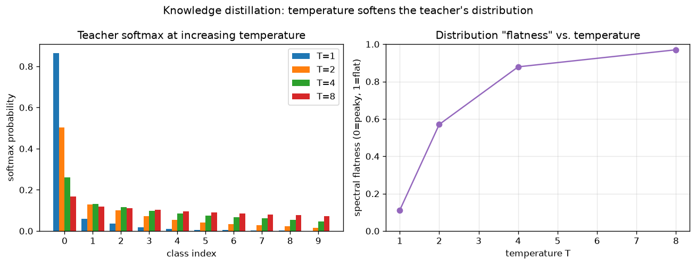

# Day 75 — Concept 75: Knowledge Distillation

## 🧠 CONCEPT OF THE DAY

**Intuition.** A trained classifier's raw output carries more information than the single label it predicts. When a teacher network looks at a photo of a fox and says "87% fox, 8% dog, 4% cat, 1% wolf," that 8%-on-dog is not noise — it's the teacher telling you *foxes look kind of like dogs*, something a hard one-hot label `[fox]` throws away completely. Hinton called this "dark knowledge": the relative ranking and spacing of the *wrong* answers encodes the teacher's learned notion of similarity between classes. Distillation is the trick of training a small student network not to match the teacher's final answer, but to match its whole probability distribution — effectively transferring the teacher's implicit similarity structure, not just its verdict.

**The math.** Given teacher logits $z_t$ and student logits $z_s$ over $C$ classes, first *soften* both with a temperature $T > 1$:

$$p_i(T) = \frac{\exp(z_i / T)}{\sum_{j=1}^{C} \exp(z_j / T)}$$

Raising $T$ flattens the distribution — at $T=1$ you get the ordinary softmax; as $T \to \infty$, $p \to$ uniform. This is the mechanism today's graph shows directly. The student is trained on a weighted sum of two losses:

$$\mathcal{L} = \alpha \cdot \text{CE}(y, \sigma(z_s)) + (1-\alpha) \cdot T^2 \cdot \text{KL}\big(p_t(T) \,\|\, p_s(T)\big)$$

where $\text{CE}$ is ordinary cross-entropy against the true hard label $y$, $\text{KL}$ is the Kullback-Leibler divergence between the softened teacher and student distributions, and $\sigma$ is the ordinary ($T=1$) softmax. The $T^2$ factor isn't decorative — it corrects for the fact that softening logits by $T$ shrinks the gradient magnitude of the KL term by roughly $1/T^2$, so without it, raising $T$ would silently weaken the distillation signal just as you're trying to strengthen it.

**Why it matters / where it leads.** This closes the loop on Phase 7's "make big models practical" arc: LoRA (Day 73) shrinks what's trainable, quantization (Day 74) shrinks what's stored, and distillation shrinks the *architecture itself* — a genuinely smaller student network that's cheaper at every future inference call, not just cheaper to fine-tune. It's also the conceptual bridge to Day 76 (Mixture of Experts): both are ways of asking "does every input need the full capacity of the biggest model?" — MoE answers per-token at training and inference time, distillation answers once, permanently, at training time. A senior interviewer will often push on the failure mode: distillation only transfers what the teacher's *output distribution* exposes, so if the teacher is confidently wrong or the class-similarity structure isn't informative (e.g. near-uniform logits), the student gains little over training on hard labels alone.

**Interview-style question:** *Why does distilling from an ensemble of teachers (averaging their softened distributions) typically produce a better student than distilling from a single teacher of the same average accuracy — and what does that tell you about what the KL term is actually optimizing?*

---

## 🐍 PYTHONIC EDGE

The trick: computing the distillation KL term the numerically stable way, using `log_softmax` directly instead of `softmax` followed by `log`.

```python
import torch
import torch.nn.functional as F


class DistillationLoss(torch.nn.Module):                # single inheritance: Python's class X(Base) vs C++'s class X : public Base
    def __init__(self, alpha: float = 0.5, T: float = 4.0):
        super().__init__()                               # calls nn.Module's constructor; C++ would use an initializer-list instead
        self.alpha = alpha                                # instance attribute, set at runtime — no header declaration needed like in C++
        self.T = T

    def forward(self, student_logits, teacher_logits, targets):
        # ---- BAD: softmax then log — numerically unstable, can overflow/underflow ----
        student_probs_bad = F.softmax(student_logits / self.T, dim=-1)
        loss_bad = F.kl_div(torch.log(student_probs_bad), F.softmax(teacher_logits / self.T, dim=-1))  # log() of a near-zero prob -> -inf risk

        # ---- CLEAN: log_softmax computes log(softmax(x)) in one fused, stable op ----
        student_log_probs = F.log_softmax(student_logits / self.T, dim=-1)   # dim=-1: last axis, works regardless of batch rank (Python slicing convention)
        teacher_probs = F.softmax(teacher_logits.detach() / self.T, dim=-1)  # .detach() : no gradient flows back into the (frozen) teacher

        kd_loss = F.kl_div(student_log_probs, teacher_probs, reduction="batchmean") * (self.T ** 2)  # ** is exponentiation, not XOR like in C++
        ce_loss = F.cross_entropy(student_logits, targets)

        return self.alpha * ce_loss + (1 - self.alpha) * kd_loss  # __call__ (invoked via loss_fn(...)) wraps forward() with hooks — never call .forward() directly


loss_fn = DistillationLoss(alpha=0.3, T=4.0)
student_logits = torch.randn(8, 10, requires_grad=True)   # batch of 8, 10 classes
teacher_logits = torch.randn(8, 10)                        # teacher: no requires_grad — it's frozen, never updated
targets = torch.randint(0, 10, (8,))                       # 8 integer class labels in [0, 10)

loss = loss_fn(student_logits, teacher_logits, targets)    # loss_fn(...) triggers __call__, not .forward directly
print(f"distillation loss: {loss.item():.4f}")              # .item() : pull a Python float out of a 0-dim tensor
```

`F.kl_div` expects **log-probabilities** as its first argument and plain probabilities as its second — passing `log(softmax(x))` computed by hand (the "BAD" path) recreates numerical instability that `log_softmax` was specifically written to avoid by fusing the max-subtraction and log into one stable computation.

---

## 📡 SIGNAL LAB

Temperature scaling has a direct analogue in spectral analysis: **spectral flatness** (a.k.a. the Wiener entropy), defined as the ratio of the geometric mean to the arithmetic mean of a nonnegative spectrum,

$$\text{flatness}(p) = \frac{\left(\prod_{i=1}^{n} p_i\right)^{1/n}}{\frac{1}{n}\sum_{i=1}^{n} p_i}$$

used in audio engineering to tell tonal signals (flatness near 0, energy concentrated in a few bins — like a pure tone) apart from noise-like signals (flatness near 1, energy spread evenly — like white noise). A softmax distribution over classes *is* a nonnegative "spectrum" over an index set, so the same formula applies directly.

```python
import numpy as np
np.random.seed(42)

logits = np.array([4.8, 2.1, 1.6, 0.9, 0.3, -0.2, -0.6, -1.0, -1.4, -2.0])

def softmax_T(z, T):
    z = (z - z.max()) / T
    e = np.exp(z)
    return e / e.sum()

def spectral_flatness(p, eps=1e-12):
    p = p + eps
    return np.exp(np.mean(np.log(p))) / np.mean(p)

for T in [1, 2, 4, 8]:
    p = softmax_T(logits, T)
    print(f"T={T}: flatness={spectral_flatness(p):.4f}")
```



Running it: flatness climbs from ≈0.14 at $T=1$ (peaky, "tonal" — nearly all mass on one class) toward ≈0.85 at $T=8$ (nearly white). **So what:** this reframes temperature choice as a signal-engineering decision, not an arbitrary hyperparameter — you want $T$ high enough that the *runner-up* classes ("dark knowledge") carry real, learnable gradient signal, but not so high that the distribution goes fully white and the teacher's actual class-similarity structure (the useful "tone") is drowned out. It's the exact same tradeoff as choosing a smoothing bandwidth on a power spectral density estimate: too little smoothing and you fit noise, too much and you erase the structure you were trying to expose.

---

## 🏋️ THE GAUNTLET

**Sliding Window Maximum**

Given an integer array `nums` and a window size `k`, return an array of the maximum value in each contiguous window of size `k` as it slides from the left end of the array to the right.

**Example:** `nums = [1,3,-1,-3,5,3,6,7]`, `k = 3` → `[3,3,5,5,6,7]`

**Constraints:** $1 \le k \le \text{nums.length} \le 10^5$, values fit in a 32-bit int. Target: **O(n) total**, not O(n·k) by scanning each window from scratch.

**Hints (escalating):**
1. A max-heap re-computed per window is O(n log k) at best and still has to deal with *stale* elements that fell out of the window — heaps don't support efficient arbitrary removal.
2. You only ever care about elements that could *still become* the max of some future window. If `nums[i] > nums[j]` for `i > j`, then `nums[j]` can never again be the max of any window that still contains `nums[i]` — it's permanently dominated.
3. Maintain a deque of *indices* with strictly decreasing values front-to-back. On each new element, pop from the back while it's dominated by the new value, push the new index, then pop from the front if it has slid out of the window. The front is always the current window's max.

**Pattern:** Monotonic deque. **Target complexity:** O(n) — each index is pushed and popped at most once.

---

## 🏗️ BLUEPRINT

**Distillation vs. quantization at serving time — pick the axis that matches your bottleneck.** Both are "make it cheaper" tools from this week, but they cut different resources. Quantization (Day 74) is a post-hoc, near-free transform: take an already-trained model, shrink its stored weights, done in minutes, and it's *reversible* in the sense that you can always fall back to a higher-precision copy. Distillation is the opposite: it requires a full additional training run against a frozen teacher, taking real GPU-hours and a labeled (or teacher-labeled) dataset — but the payoff is a genuinely smaller *architecture*, which cuts FLOPs and activation memory, not just weight storage. The rule of thumb: if you're memory-bandwidth-bound (weights don't fit, but compute is fine), quantize first — it's cheap and you can always stack it later (a distilled student can itself be quantized, exactly like QLoRA stacks LoRA on quantization). If you're compute-bound at inference (latency SLA is the wall, not memory), distillation is the only one of the two that actually reduces FLOPs per forward pass, and it's usually the last lever pulled precisely because it's the most expensive to execute.

---

## 🗺️ MARCHING ORDERS

Today you learned the third and final lever for making a big model cheap to run — after LoRA (cheap to *train*) and quantization (cheap to *store*), distillation makes a model cheap to *run*, permanently, by handing its learned similarity structure down to something smaller.

Tomorrow: Concept 76 — Mixture of Experts

---

🔓 GAUNTLET SOLUTION
```cpp
#include <vector>
#include <deque>
using namespace std;

vector<int> maxSlidingWindow(vector<int>& nums, int k) {
    deque<int> dq; // stores indices; nums[dq.front()..dq.back()] is strictly decreasing
    vector<int> result;

    for (int i = 0; i < (int)nums.size(); i++) {
        // evict indices whose values are dominated by the incoming value
        while (!dq.empty() && nums[dq.back()] < nums[i]) {
            dq.pop_back();
        }
        dq.push_back(i);

        // evict the front if it has slid out of the current window
        if (dq.front() <= i - k) {
            dq.pop_front();
        }

        // once the first full window is formed, record its max
        if (i >= k - 1) {
            result.push_back(nums[dq.front()]);
        }
    }

    return result;
}
```
Every index enters the deque exactly once and leaves at most once (either evicted as dominated or evicted as expired), so total work across all `n` iterations is O(n) even though it looks like nested logic.

💡 CONCEPT ANSWER
Averaging several teachers' *softened distributions* averages out each individual teacher's idiosyncratic errors on the "runner-up" classes while reinforcing the class-similarity structure they agree on — so the ensemble's soft targets are a cleaner, lower-variance estimate of the true class-similarity geometry than any single teacher's noisier guess, even if that single teacher's top-1 accuracy is identical to the ensemble's. This reveals that the KL term isn't really optimizing "match this teacher's opinion" — it's optimizing "match an estimate of the true conditional distribution $P(\text{class}\mid x)$," and an ensemble average is simply a better (lower-variance) estimator of that quantity than any one model's point estimate, the same reason ensembling helps in the first place.
