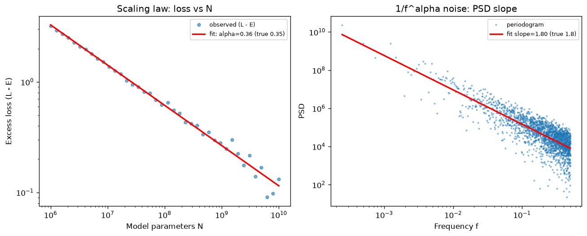

# Day 77 — Scaling Laws

*Phase 7 finale: language models, tuning, and efficiency. Tomorrow we step into Phase 8 — generative models.*

---

## 🧠 CONCEPT OF THE DAY

**Intuition first.** Every other concept this phase has been about squeezing more out of a fixed model (LoRA, quantization, distillation, MoE). Scaling laws ask the opposite question: if you're *not* fixed — if you can buy more compute — what's the best way to spend it? The empirical answer, discovered by OpenAI (Kaplan et al., 2020) and refined by DeepMind (Hoffmann et al., 2022, "Chinchilla"), is startlingly regular: test loss falls as a **power law** in model size, dataset size, and compute, over many orders of magnitude, with almost no bumps. It's the closest thing deep learning has to a physical law — not a proof, but a curve so clean that labs plan billion-dollar training runs off of it.

**The math.** Holding the other two factors abundant, loss as a function of parameters $N$, data tokens $D$, or compute $C$ each follows:

$$L(N) = \left(\frac{N_c}{N}\right)^{\alpha_N}, \qquad L(D) = \left(\frac{D_c}{D}\right)^{\alpha_D}, \qquad L(C) = \left(\frac{C_c}{C}\right)^{\alpha_C}$$

where $\alpha_N, \alpha_D, \alpha_C$ are small exponents (empirically around 0.05–0.4 depending on setup) and $N_c, D_c, C_c$ are fitted constants. Chinchilla's joint form adds an irreducible floor $E$ — the entropy of natural text/data that no model will ever predict away:

$$L(N, D) = E + \frac{A}{N^{\alpha}} + \frac{B}{D^{\beta}}$$

The practically important result: for a fixed compute budget $C \approx 6ND$ (FLOPs per token times tokens times an update-cost constant), there's an **optimal split** between $N$ and $D$. OpenAI's original scaling laws implied "make the model as big as you can, data is secondary" — this is why GPT-3-scale models were trained on relatively few tokens per parameter. Chinchilla showed that was wrong: the compute-optimal ratio is close to **$D \approx 20N$** — a 70B model wants ~1.4T tokens, not the ~300B GPT-3 used. Most large models before 2022 were badly *undertrained* relative to their size, not "as good as their parameter count allowed."

**Why it matters / where it leads.** Scaling laws are why frontier labs can commit nine-figure compute budgets to a training run *before* it finishes — they fit $\alpha$ and the constants on small-scale runs (10,000× smaller) and extrapolate the final loss with high confidence. It's also the throughline into everything downstream: emergent capabilities (Day 70's in-context learning), why bigger context and better data curation both showed up as levers, and why MoE (yesterday) is attractive — it decouples parameter count from per-token compute, letting you buy $N$ without paying the $C \approx 6ND$ tax on every forward pass.

> **Interview-style question:** You're given a fixed compute budget $C$ and told to train the best possible language model. Using Chinchilla's compute-optimal scaling, would you rather (a) double the model size and keep tokens fixed, or (b) double the tokens and keep model size fixed? What does "compute-optimal" actually optimize for, and why might a real deployment choose differently?
> *(Answer at the very bottom.)*

---

## 🐍 PYTHONIC EDGE

Fitting a scaling-law exponent is just linear regression in log-log space. The mistake people make: writing the regression by hand instead of trusting `numpy` to vectorize it.

```python
import numpy as np

# BAD: manual loop-based slope estimation — verbose and easy to get the
# summation formula wrong under pressure
def slope_bad(log_N, log_L):
    n = len(log_N)                      # len(x) is Python's built-in size query (no x.size() call)
    sum_x = sum_y = sum_xy = sum_xx = 0.0
    for i in range(n):                  # range(n) is a lazy iterator object, not a materialized list/array
        sum_x += log_N[i]
        sum_y += log_L[i]
        sum_xy += log_N[i] * log_L[i]
        sum_xx += log_N[i] * log_N[i]
    return (n * sum_xy - sum_x * sum_y) / (n * sum_xx - sum_x ** 2)  # ** is Python's power op (C++: std::pow)

# CLEAN: vectorized fit via np.polyfit, wrapped so the fit is reusable
class PowerLawFit:                      # no explicit base class -> implicitly inherits from `object`
    def __init__(self, N, L):           # constructor; self is explicit (C++'s implicit `this`)
        self.log_N = np.log(N)          # instance attrs assigned directly — no header declare+init split like C++
        self.log_L = np.log(L)

    def fit(self):
        # np.polyfit(x, y, deg) returns [slope, intercept] for the deg=1 line log_L = slope*log_N + intercept
        slope, log_A = np.polyfit(self.log_N, self.log_L, 1)
        return -slope, np.exp(log_A)    # sign convention: L ~ A * N^-alpha, so alpha = -slope

N = np.array([1e6, 1e7, 1e8, 1e9])      # NumPy array, not a Python list — contiguous, typed, vectorized ops
L = np.array([3.2, 2.1, 1.4, 0.95])
alpha, A = PowerLawFit(N, L).fit()      # .fit() is a plain method call — no __call__ / forward() indirection here
print(f"alpha={alpha:.3f}, A={A:.3f}")  # f-string interpolates {expr:format} inline, unlike C++ stream chaining
```

`np.polyfit` is doing the same closed-form least-squares as `slope_bad`, but in compiled C under the hood and without you re-deriving the normal equations. The general lesson: **any time you're computing a sum over paired arrays in a Python `for` loop, that's a `numpy` vectorized op waiting to happen** — it's faster and it's the version you won't get wrong on a whiteboard.

---

## 📡 SIGNAL LAB

Here's the punchline of today's graph: **estimating a scaling-law exponent and estimating a $1/f^\alpha$ noise exponent are the same regression.**

Natural images and many real-world signals have power spectral densities that fall off as $S(f) \propto 1/f^\alpha$ (with $\alpha \approx 2$ for many natural image statistics — this is exactly the "spectral signature" you'll formalize on Day 88 when distinguishing real from generated images). To recover $\alpha$ from a signal:

1. Take the periodogram: $S(f) = |\text{FFT}(x)|^2$.
2. Go to log-log axes: $\log S(f) = -\alpha \log f + c$.
3. Fit a line — the slope *is* $-\alpha$.

**Worked solution** (see `graph_DAY_77.py`, right panel): I synthesize white noise, shape its spectrum by $1/f^{\alpha/2}$ in amplitude (so power scales as $1/f^\alpha$) with $\alpha = 1.8$, inverse-FFT back to the time domain, then re-estimate $\alpha$ from the periodogram slope via the exact same `np.polyfit` log-log regression as the scaling-law fit. Recovered slope: **1.80**, dead on.



**So what:** power-law slope estimation via log-log regression is a recurring primitive that shows up whenever a phenomenon is scale-free — LLM loss curves, $1/f$ noise in images and audio, fractal/self-similar textures, even earthquake magnitude distributions (Gutenberg–Richter). When you see "does quantity $Y$ scale as a power of $X$?" anywhere — in a paper, in your own generative-model artifact analysis — reach for exactly this two-line `np.polyfit` on logged data before reaching for anything fancier.

---

## 🏋️ THE GAUNTLET

**Compute-Optimal Split**

You're allocating a fixed sequence of training-stage costs across a bounded number of GPU clusters. Given an integer array `nums` of `n` positive stage costs and an integer `m`, split `nums` into `m` **non-empty contiguous** subarrays (each subarray = one cluster's assigned stages, run sequentially) to **minimize the largest subarray sum** (i.e., minimize the worst-case cluster's total compute budget).

Return that minimized largest sum.

**Constraints:**
- `1 <= n <= 10^5`
- `1 <= nums[i] <= 10^6`
- `1 <= m <= min(50, n)`

**Hints (escalating):**
1. Suppose someone hands you a candidate answer $X$ — a proposed cap on the max subarray sum. Ask a simpler yes/no question: *can `nums` be split into $\le m$ contiguous groups such that no group's sum exceeds $X$?* Is that feasibility function monotonic in $X$?
2. Given that monotonicity, you don't need to search over splits directly — binary-search over $X$ itself, in the range $[\max(\text{nums}),\ \text{sum}(\text{nums})]$, and use the feasibility check as your predicate.
3. Feasibility check in $O(n)$: greedily accumulate a running sum; the moment adding the next element would exceed $X$, close the current group and start a new one at that element. Count groups; feasible iff the count is $\le m$.

**Pattern:** Binary Search on the Answer + Greedy feasibility check. **Target complexity:** $O(n \log(\text{sum}(\text{nums})))$.

---

## 🏗️ BLUEPRINT

No blueprint today.

---

## 🗺️ MARCHING ORDERS

You've now covered every concept from tokenization through scaling laws — that's the full "how do you actually build and ship an LLM" arc. Sit with today's Chinchilla ratio for a second: it's a genuinely load-bearing number in how every frontier lab spends its compute budget, and you can now derive *why* from the loss equation instead of citing it.

Tomorrow: Concept 78 — Autoencoders

---
---

## 🔓 GAUNTLET SOLUTION

```cpp
#include <vector>
#include <algorithm>
#include <numeric>
using namespace std;

class Solution {
public:
    int splitArray(vector<int>& nums, int m) {
        long long lo = *max_element(nums.begin(), nums.end());
        long long hi = accumulate(nums.begin(), nums.end(), 0LL);

        auto feasible = [&](long long cap) -> bool {
            int groups = 1;
            long long cur = 0;
            for (int x : nums) {
                if (cur + x > cap) {
                    groups++;
                    cur = x;
                    if (groups > m) return false;
                } else {
                    cur += x;
                }
            }
            return true;
        };

        while (lo < hi) {
            long long mid = lo + (hi - lo) / 2;
            if (feasible(mid)) {
                hi = mid;       // mid works; try to shrink further
            } else {
                lo = mid + 1;   // mid too tight; need a larger cap
            }
        }
        return (int)lo;
    }
};
```

The search space is $[\max(\text{nums}), \text{sum}(\text{nums})]$ because the answer can never be smaller than the single largest element (that element must land in *some* group) and never needs to be larger than putting everything in one group. Each `feasible` check is $O(n)$, and binary search does $O(\log(\text{sum}))$ iterations, giving $O(n \log(\text{sum}(\text{nums})))$ overall — far better than enumerating splits.

---

## 💡 CONCEPT ANSWER

**(b) — double the tokens, keep model size fixed** is closer to compute-optimal starting from a typical pre-2022 checkpoint, *if* that model was trained at a GPT-3-style low tokens-per-parameter ratio, because it was undertrained relative to Chinchilla's $D \approx 20N$ ratio. In general, neither answer is universally right — compute-optimal training solves $\min_{N,D} L(N,D)$ subject to $C = 6ND$ fixed, and the optimum is a *specific split*, not "always favor data." If you're already near the optimal ratio, doubling compute should go roughly proportionally into both $N$ and $D$, not all into one.

The catch a strong candidate raises: **"compute-optimal" minimizes *training* loss for a given *training* compute budget — it says nothing about inference cost.** A model that's compute-optimal at training time may be far from optimal once you account for serving it at scale for years: a smaller model trained on (more than compute-optimal) tokens can match a larger compute-optimal model's quality while being cheaper per inference call forever after. This is exactly why models like LLaMA were deliberately trained "past Chinchilla-optimal" on more tokens than the training-compute-minimizing point — they're optimizing total cost of ownership (train + serve), not training FLOPs alone.
