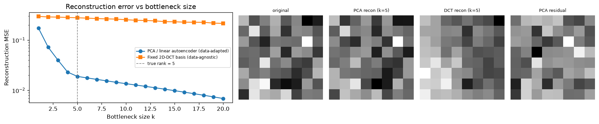

# Day 78 — Autoencoders

*Phase 8 opens: generative models. Everything from here through Day 88 builds toward diffusion — and it starts with the simplest possible generative-adjacent idea: compress, then reconstruct.*

---

## 🧠 CONCEPT OF THE DAY

**Intuition first.** An autoencoder is a network trained to output its own input — which sounds pointless until you force the information through a narrow bottleneck first. Squeeze a 64-dimensional patch down to 5 numbers, then ask a decoder to rebuild the original from just those 5. If it can, those 5 numbers must have captured whatever mattered about the input. The bottleneck is the entire point: without it, the network would just learn the identity function and tell you nothing. With it, "reconstruct me" becomes a forcing function for "find a compact, informative description of me" — the same instinct behind PCA, JPEG, and every representation-learning method downstream of this one.

**The math.** An autoencoder is two functions trained jointly:

$$z = f_\theta(x), \qquad \hat{x} = g_\phi(z)$$

where $f_\theta$ (the **encoder**) maps input $x \in \mathbb{R}^d$ to a latent code $z \in \mathbb{R}^k$ with $k \ll d$, and $g_\phi$ (the **decoder**) maps $z$ back to $\mathbb{R}^d$. Training minimizes reconstruction error end-to-end:

$$\mathcal{L}(\theta, \phi) = \mathbb{E}_x \left[ \| x - g_\phi(f_\theta(x)) \|^2 \right]$$

with plain gradient descent through both halves — no labels required, this is self-supervised by construction. The bottleneck ($k < d$, "**undercomplete**") is what prevents the trivial identity solution; if $k \ge d$ ("**overcomplete**"), the network needs a different constraint — sparsity, noise injection (denoising autoencoders), or an explicit penalty — or it will just memorize.

Here's the fact that makes today's math tractable: **if $f_\theta$ and $g_\phi$ are both linear and the loss is MSE, the optimal solution is exactly PCA.** The encoder's optimal weight matrix spans the same subspace as the top-$k$ principal components (Eckart–Young theorem), and the minimum achievable reconstruction error is the sum of the discarded eigenvalues. A linear autoencoder can't beat PCA — it can only rediscover it by gradient descent instead of an eigendecomposition. The entire value proposition of a *nonlinear* autoencoder (ReLU/GELU activations from Day 3) is that it can bend that flat subspace into a curved manifold and capture structure PCA is blind to.

**Why it matters / where it leads.** This is the conceptual seed for everything in Phase 8. Tomorrow's VAE turns the deterministic code $z$ into a distribution — the one change that makes the decoder a genuine generator you can sample from instead of just a reconstructor. GANs (Day 81) and diffusion (Day 83–84) are different answers to "how do we get $g_\phi(z)$ to produce realistic new samples," but the encoder/decoder-as-compressor intuition you're building today underlies all of them. It also shows up constantly outside generative modeling: anomaly detection (things that reconstruct badly are out-of-distribution), denoising, and pretraining representations for downstream tasks.

> **Interview-style question:** You train a linear autoencoder with bottleneck $k$ on mean-centered data and compare its learned encoder weights to the top-$k$ PCA components computed via SVD. The reconstructions are numerically identical, but the learned encoder weight *matrix* is not equal to the PCA component matrix. Why not — what's the source of the difference, and what does it tell you about what gradient descent actually recovers versus what SVD recovers?
> *(Answer at the very bottom.)*

---

## 🐍 PYTHONIC EDGE

The single most common autoencoder bug that isn't a bug in your math: calling `.forward()` directly instead of calling the module.

```python
import torch
import torch.nn as nn

# a minimal autoencoder — encoder/decoder as separate submodules
class Autoencoder(nn.Module):                      # single inheritance from nn.Module (C++: class Autoencoder : public Module)
    def __init__(self, in_dim, latent_dim):         # constructor; self is explicit (C++'s implicit `this`)
        super().__init__()                          # runs nn.Module's constructor first (C++: initializer-list base call)
        self.encoder = nn.Sequential(                # instance attr, assigned directly (no header decl + body init split)
            nn.Linear(in_dim, 32), nn.ReLU(),
            nn.Linear(32, latent_dim),
        )
        self.decoder = nn.Sequential(
            nn.Linear(latent_dim, 32), nn.ReLU(),
            nn.Linear(32, in_dim),
        )

    def forward(self, x):                            # defines the computation graph; NOT the call interface
        z = self.encoder(x)                           # calling a submodule invokes __call__, not .forward() directly
        return self.decoder(z)

model = Autoencoder(in_dim=64, latent_dim=5)
x = torch.randn(16, 64)                               # batch of 16 flattened patches

# BAD: bypasses nn.Module.__call__, which registers hooks (grad tracking
# hooks, DDP sync hooks, torch.compile guards) — silently breaks anything
# relying on those, e.g. a hook-based activation logger or DDP training
bad_out = model.forward(x)

# CLEAN: model(x) invokes __call__, which runs pre-hooks, calls forward()
# for you, then runs post-hooks — always go through the object, never
# reach for .forward() by name in your own training loop
good_out = model(x)                                   # __call__ is the dunder that makes model(x) legal syntax at all

assert torch.equal(bad_out, good_out)                 # same tensor values here, but not always — hooks can differ output
```

The mental model to keep: `forward()` is *what* the module computes, `__call__` is *how* you're supposed to invoke it. This distinction matters more for autoencoders than most architectures because people commonly attach forward hooks to `model.encoder` to grab the latent code $z$ for downstream use (visualization, anomaly scoring) — and a hook attached via `register_forward_hook` only fires through `__call__`, never through a direct `.forward()` call.

---

## 📡 SIGNAL LAB

Today's graph makes the PCA-as-linear-autoencoder result concrete by pitting it against another classical linear transform you already know from this research lane: the **2D DCT**, the backbone of JPEG compression.

Both PCA and the DCT are orthonormal linear bases you can truncate to $k$ components for compression. The difference is *where the basis comes from*: PCA's basis is fit to your specific data (its top-$k$ directions are literally the eigenvectors of your data's covariance), while the DCT's basis is fixed and generic — the same cosine functions regardless of what image you feed it.

**Worked setup** (see `graph_DAY_78.py`): I generate 60 synthetic 8×8 patches whose true structure lives in a 5-dimensional subspace spanned by *random* orthonormal directions — deliberately **not** aligned with low spatial frequencies, unlike real natural images. I then truncate both bases to $k = 1 \ldots 20$ components and measure reconstruction MSE.



PCA's error elbows sharply right at the true rank ($k=5$) and keeps dropping as it mops up structure; the DCT basis barely improves across the same range, because none of its fixed cosine directions happen to align with this data's actual subspace.

**So what:** this is precisely why JPEG's fixed DCT basis works so well on *real* photographs (natural image statistics genuinely concentrate energy in low spatial frequencies — you'll formalize this as the $1/f^\alpha$ spectral falloff again on Day 88) but would be a bad choice for, say, compressing arbitrary feature-map activations or non-image sensor data with no frequency structure at all. A learned, data-adapted basis (PCA, or a full nonlinear autoencoder) never does *worse* than picking the wrong fixed basis for your data's actual geometry — the cost is that it has to be fit per-dataset instead of being free and universal like the DCT.

---

## 🏋️ THE GAUNTLET

**Largest Bottleneck Block**

You're profiling an autoencoder's per-channel activation magnitudes across a layer, given as an array `heights` where `heights[i]` is the activation magnitude of channel `i`. You want to find the largest **contiguous run of channels** you could compress into a single uniform-width bottleneck block, where the block's "cost" is `width * min_height_in_block` (a rectangle whose height is capped by the weakest channel in the run). Maximize that rectangular area.

Formally: given an integer array `heights` of length `n`, find the area of the largest rectangle that fits in the histogram, where the rectangle's height is bounded by consecutive bars.

**Constraints:**
- `1 <= n <= 10^5`
- `0 <= heights[i] <= 10^4`

**Hints (escalating):**
1. For a fixed bar $i$ as the height of your rectangle, the best you can do is extend left and right until you hit a bar shorter than `heights[i]`. Doing this with two nested loops is $O(n^2)$ — what data structure lets you find, for every bar, "the nearest shorter bar to the left" and "to the right" in a single linear pass each?
2. A **monotonic stack** (increasing heights, indices) does this: as you scan left to right, whenever the current bar is shorter than the bar on top of the stack, that top bar's *right* boundary has just been found (the current index). Its *left* boundary is whatever is now exposed below it on the stack after popping.
3. Push a sentinel of height 0 at both ends (or treat off-stack as boundary) so every bar gets popped and closed out exactly once by the end of the scan — no special-casing leftover stack entries after the loop.

**Pattern:** Monotonic Stack. **Target complexity:** $O(n)$ time, $O(n)$ space.

---

## 🏗️ BLUEPRINT

No blueprint today.

---

## 🗺️ MARCHING ORDERS

You just watched a bottleneck do real work — the same 5-number squeeze that made PCA optimal centuries before deep learning existed. Sit with that Eckart–Young connection; it's the cleanest bridge in this whole roadmap between "classical linear algebra" and "what a neural net is secretly doing." Tomorrow the bottleneck stops being a fixed vector and becomes a distribution — the single change that turns a compressor into a generator.

Tomorrow: Concept 79 — VAE & Reparameterization Trick

---
---

## 🔓 GAUNTLET SOLUTION

```cpp
#include <vector>
#include <stack>
#include <algorithm>
using namespace std;

class Solution {
public:
    int largestRectangleArea(vector<int>& heights) {
        int n = heights.size();
        stack<int> st;                 // holds indices, heights strictly increasing bottom-to-top
        int best = 0;

        for (int i = 0; i <= n; i++) {
            // sentinel height 0 at i == n forces every remaining bar to pop and close out
            int cur = (i == n) ? 0 : heights[i];

            while (!st.empty() && heights[st.top()] >= cur) {
                int height = heights[st.top()];
                st.pop();
                // left boundary is the new top of stack (exclusive); if empty, block starts at 0
                int leftBound = st.empty() ? -1 : st.top();
                int width = i - leftBound - 1;
                best = max(best, height * width);
            }
            st.push(i);
        }
        return best;
    }
};
```

Each index is pushed exactly once and popped exactly once, so the amortized cost per element is $O(1)$ despite the `while` loop, giving overall $O(n)$. The sentinel pass (`i == n`, `cur = 0`) is what guarantees the stack fully drains without a separate cleanup loop after the main scan — every bar still on the stack when we reach the end is shorter than 0 is impossible, so it always pops.

---

## 💡 CONCEPT ANSWER

The reconstructions match because both solutions span the *same subspace* — but "same subspace" doesn't mean "same basis vectors within it." PCA via SVD returns one specific, canonical basis for that subspace: orthonormal eigenvectors, ordered by variance, unique up to sign flips (assuming distinct eigenvalues). A linear autoencoder trained by gradient descent has no such constraint built into its loss — $\mathcal{L} = \|x - g_\phi(f_\theta(x))\|^2$ is invariant under replacing $f_\theta \to Rf_\theta$ and $g_\phi \to g_\phi R^{-1}$ for *any* invertible $k \times k$ matrix $R$ applied to the latent code. Rotate, scale, or skew the latent space with any invertible transform and compose the inverse into the decoder, and reconstruction error doesn't change at all. Gradient descent finds *some* basis for the right subspace — an arbitrary linear combination of the true principal directions — not the orthonormal, variance-ranked one SVD hands you for free. This is exactly why the latent codes of a plain autoencoder aren't directly interpretable dimension-by-dimension the way PCA components are, and it's a preview of why VAEs (tomorrow) explicitly regularize the latent space geometry — an unconstrained bottleneck gives you *a* good subspace, not a canonical or well-structured one.
