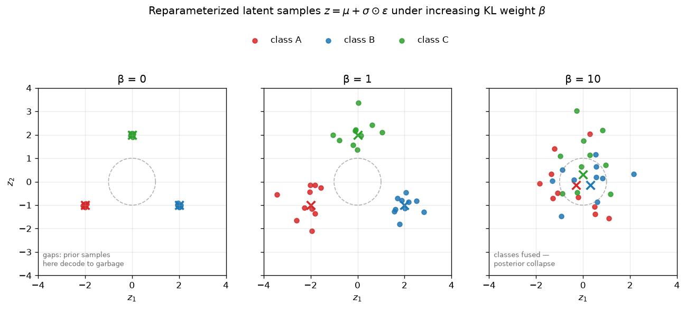

# Day 79 — VAE & Reparameterization Trick

*Yesterday's autoencoder had one flaw as a generative model: its latent space is whatever gradient descent happened to find, with no guarantee that the gaps between clusters decode to anything sensible. Today we fix that with one distributional change — and one clever trick to keep it differentiable.*

---

## 🧠 CONCEPT OF THE DAY

**Intuition first.** A plain autoencoder's encoder outputs one point $z$ per input — a single coordinate in latent space. Nothing forces nearby points to decode to similar things, and nothing forces the latent space to be "filled in": sample a random point between two clusters and the decoder has never seen anything like it during training, so it produces garbage. A **VAE** fixes this by making the encoder output a *distribution* instead of a point — a little cloud of uncertainty around each input, forced (via a penalty) to look roughly like a standard normal. Train with that pressure and two things fall out for free: nearby points in latent space decode to similar outputs (local smoothness, because the clouds around similar inputs overlap), and the *whole* latent space becomes meaningful (global coverage, because every region has to be "claimed" by some cloud or explained away by the prior). That's what turns a compressor into a sampler you can actually generate from.

**The math.** The encoder no longer outputs $z$ directly — it outputs the parameters of a distribution, typically diagonal Gaussian:

$$q_\phi(z \mid x) = \mathcal{N}\big(z;\ \mu_\phi(x),\ \sigma_\phi^2(x)\big)$$

Training maximizes a lower bound on the data likelihood (the **ELBO** — evidence lower bound), which decomposes into two terms in tension:

$$\mathcal{L}(\theta, \phi; x) = \underbrace{\mathbb{E}_{z \sim q_\phi(z|x)}\big[\log p_\theta(x \mid z)\big]}_{\text{reconstruction}} \; - \; \underbrace{D_{KL}\big(q_\phi(z \mid x)\ \|\ p(z)\big)}_{\text{regularization}}$$

The first term is exactly yesterday's reconstruction loss (in expectation over samples from the encoder's distribution). The second term is a **KL divergence** pulling the encoder's distribution $q_\phi(z\mid x)$ toward a fixed prior $p(z) = \mathcal{N}(0, I)$ — it's the "stay close to a standard normal" pressure. For the diagonal-Gaussian case it has a closed form, no sampling needed:

$$D_{KL}\big(\mathcal{N}(\mu,\sigma^2) \,\|\, \mathcal{N}(0,1)\big) = \tfrac{1}{2}\sum_j \big(\mu_j^2 + \sigma_j^2 - \log \sigma_j^2 - 1\big)$$

Here's the problem this creates: to train by backprop, you need to differentiate the reconstruction term through a *sampling* operation $z \sim \mathcal{N}(\mu_\phi(x), \sigma_\phi^2(x))$ — and sampling isn't a differentiable function of $\mu, \sigma$; it's a stochastic node that gradients can't pass through. The **reparameterization trick** sidesteps this by moving the randomness outside the computation graph:

$$z = \mu_\phi(x) + \sigma_\phi(x) \odot \epsilon, \qquad \epsilon \sim \mathcal{N}(0, I)$$

Now $z$ is a *deterministic, differentiable* function of $\mu_\phi(x)$ and $\sigma_\phi(x)$, with all the randomness pushed into $\epsilon$ — an input, not a parameter. $\partial z / \partial \mu$ and $\partial z / \partial \sigma$ are now ordinary partial derivatives, and backprop flows through the encoder exactly as it always did.

**Why it matters / where it leads.** The graph below makes the KL term's job concrete: it's what stops the encoder from just shrinking $\sigma \to 0$ and spreading means arbitrarily far apart (which would ace reconstruction but leave the latent space full of dead, undecodable gaps — literally yesterday's autoencoder again).



At $\beta=0$ (no KL pressure — the $\beta$-VAE generalization scales this term), the encoder cheats: variance collapses toward zero and means drift apart, so it's a deterministic autoencoder wearing a VAE's clothes — sampling the prior lands you in the gaps. At $\beta=1$ (the standard VAE), reconstruction and regularization are balanced: classes stay distinguishable but the clouds overlap enough that interpolating between them means something. Push $\beta$ too high (10) and the KL term wins outright — means get crushed toward 0, variances crushed toward 1, and the encoder has no room left to encode *which class this was*. This failure mode has a name, **posterior collapse**, and it's a real, frequently-hit failure in practice, not just a toy extreme. Tomorrow's decoder architecture (Day 80) builds on top of whichever regime you land in; Day 81's GANs and Day 83-84's diffusion models are different answers to the same underlying question this reconstruction-vs-regularization tension raises — how do you get a generator whose samples are both diverse (covers the prior) and sharp (doesn't blur under an averaging loss)?

> **Interview-style question:** You're told a colleague's VAE reconstructs training images beautifully (near-zero reconstruction loss) but samples drawn by feeding $z \sim \mathcal{N}(0,I)$ directly into the decoder look like noise. Diagnose the likely cause in terms of the ELBO's two terms, and name the KL-weight-side and architecture-side fix for each of the two directions this failure can go.
> *(Answer at the very bottom.)*

---

## 🐍 PYTHONIC EDGE

The reparameterization trick is three lines, and every one of those lines has a spot where people quietly introduce a bug.

```python
import torch
import torch.nn as nn

class VAEEncoder(nn.Module):                        # single inheritance from nn.Module (C++: class VAEEncoder : public Module)
    def __init__(self, in_dim, latent_dim):          # constructor; self is explicit (C++'s implicit `this`)
        super().__init__()                            # runs nn.Module's __init__ first (C++: base-class init-list)
        self.hidden = nn.Linear(in_dim, 64)
        self.to_mu = nn.Linear(64, latent_dim)         # separate heads for mu and log-variance
        self.to_logvar = nn.Linear(64, latent_dim)     # instance attrs assigned directly, no header/body split

    def forward(self, x):                              # what the module computes; NOT the call interface
        h = torch.relu(self.hidden(x))
        return self.to_mu(h), self.to_logvar(h)        # tuple return; unpacked by caller via a, b = fn()

def reparameterize(mu, logvar):
    # BAD: sampling directly from N(mu, sigma^2) severs the gradient path —
    # torch.normal treats mu/sigma as distribution params, not graph inputs,
    # so loss.backward() silently gives encoder.parameters() a .grad of None
    # bad_z = torch.normal(mu, torch.exp(0.5 * logvar))

    # CLEAN: reparameterization trick — randomness lives in epsilon (detached
    # from the graph by construction, since randn_like has no grad_fn),
    # so z = mu + sigma * epsilon IS differentiable w.r.t. mu and sigma
    std = torch.exp(0.5 * logvar)                       # ** is exponentiation in Python; here exp() undoes log-variance
    eps = torch.randn_like(mu)                           # eps ~ N(0, I), same shape/device/dtype as mu — no manual .to(device)
    z = mu + std * eps                                    # elementwise; NOT std @ eps (@ is matmul, wrong here — no matrix op intended)
    return z

encoder = VAEEncoder(in_dim=64, latent_dim=8)
x = torch.randn(16, 64)                                   # batch of 16 flattened patches
mu, logvar = encoder(x)                                    # calling encoder(x) invokes __call__ -> wraps forward(), runs hooks
z = reparameterize(mu, logvar)

kl = -0.5 * torch.sum(1 + logvar - mu.pow(2) - logvar.exp())   # closed-form KL vs N(0, I); .pow(2) same as mu**2
```

Two idioms worth flagging beyond the raw mechanics: predicting **log-variance** instead of variance directly (`self.to_logvar`, not `self.to_var`) is standard practice, not decoration — an unconstrained linear layer can output negative numbers, and variance can't be negative, whereas `exp(logvar)` is automatically positive for any real input, so you get numerical stability for free instead of clamping. And `torch.randn_like(mu)` — the idiomatic way to generate matching-shape noise — has no C++ equivalent shorthand; without it you'd need to manually track and pass `mu.shape`, `mu.dtype`, and `mu.device` separately.

---

## 📡 SIGNAL LAB

The reparameterization trick has a direct analogue in classical DSP: **dither**.

When you quantize a signal (round continuous amplitudes to a finite set of levels — think ADC conversion, or reducing bit depth on an image), the quantization error isn't random noise — it's a deterministic, *signal-correlated* function of the input. For smooth or periodic signals this shows up as ugly structured artifacts: banding in a gradient, or spurious tones in audio. **Dither** fixes this by deliberately adding a small amount of independent noise *before* quantizing. The quantization error, instead of being deterministically tied to the signal, becomes statistically decorrelated from it — you trade a small, controlled increase in variance for the removal of structured, correlated bias.

That's precisely the shape of the reparameterization trick's trade: $z = \mu + \sigma\epsilon$ adds independent noise $\epsilon$ to what would otherwise be a deterministic encoder output $\mu$. Just as dither prevents quantization error from correlating with — and revealing structure specific to — one exact input value, the injected Gaussian noise prevents the encoder from collapsing onto one exact point per input. In both cases, removing the noise doesn't remove error — it just makes the error *correlated with the specific input* in a way that produces visible artifacts (banding for dither; posterior collapse's undecodable gaps for a VAE with $\sigma \to 0$).

**So what:** this is the same principle showing up in two unrelated-looking fields — additive independent noise, injected deliberately at the moment you need to break a harmful correlation with a discrete or deterministic bottleneck. When you see forensic detection work on generated images (your research lane) looking for quantization artifacts or spectral irregularities from a generator's upsampling/decoding path, this is the mechanism to reason from: a decoder that never had noise injected in the right place leaves behind structured, correlated fingerprints — exactly the kind of signal a frequency-domain detector is built to catch.

---

## 🏋️ THE GAUNTLET

**Sample the Prior, Reconstruct the Signal**

You're given an array `signal` of `n` integers representing a 1D encoded latent trajectory sampled at each timestep, and an integer `k`. A "clean window" is a contiguous subarray of length exactly `k` whose values, when you compute `max(window) - min(window)`, do not exceed a given `budget` (representing an acceptable KL-divergence-induced spread before the decoder can no longer reconstruct reliably). Return the number of clean windows of length `k` in `signal`.

**Constraints:**
- `1 <= k <= n <= 10^5`
- `-10^9 <= signal[i] <= 10^9`
- `0 <= budget <= 2*10^9`

**Hints (escalating):**
1. Recomputing `max` and `min` from scratch for every window of length `k` is $O(nk)$ — too slow at $n = 10^5$. You need max and min of a sliding window maintained incrementally as it moves one step at a time.
2. Keep two **monotonic deques** — one decreasing (front holds the current window's max), one increasing (front holds the current window's min). When the window slides right, pop from the back any elements worse than the new element before pushing it, and pop from the front any index that's fallen out of the window.
3. Each index is pushed and popped from each deque at most once across the whole scan — that's what makes it linear despite the nested-looking loop structure. Check `deque_max.front() - deque_min.front() <= budget` once per window, after both deques are updated for that window's right edge.

**Pattern:** Sliding Window Maximum/Minimum via Monotonic Deque. **Target complexity:** $O(n)$ time, $O(k)$ space.

---

## 🏗️ BLUEPRINT

No blueprint today.

---

## 🗺️ MARCHING ORDERS

Sit with the $\beta$ sweep in today's graph until the failure mode at each extreme feels obvious, not memorized — that intuition is what lets you debug a real VAE from its samples alone, without ever opening the loss curves. Tomorrow we open up the decoder side of this same architecture and look at where its reconstructions systematically go wrong.

Tomorrow: Concept 80 — VAE decoder & upsampling artifacts

---
---

## 🔓 GAUNTLET SOLUTION

```cpp
#include <vector>
#include <deque>
using namespace std;

class Solution {
public:
    int countCleanWindows(vector<int>& signal, int k, long long budget) {
        int n = signal.size();
        deque<int> maxDq, minDq;   // store indices; maxDq decreasing, minDq increasing by value
        int count = 0;

        for (int i = 0; i < n; i++) {
            // maintain decreasing deque for max: pop worse (smaller) values off the back
            while (!maxDq.empty() && signal[maxDq.back()] <= signal[i]) maxDq.pop_back();
            maxDq.push_back(i);

            // maintain increasing deque for min: pop worse (larger) values off the back
            while (!minDq.empty() && signal[minDq.back()] >= signal[i]) minDq.pop_back();
            minDq.push_back(i);

            // evict indices that have fallen out of the current k-length window
            if (maxDq.front() <= i - k) maxDq.pop_front();
            if (minDq.front() <= i - k) minDq.pop_front();

            // once we've seen at least k elements, front of each deque is this window's max/min
            if (i >= k - 1) {
                long long spread = (long long)signal[maxDq.front()] - signal[minDq.front()];
                if (spread <= budget) count++;
            }
        }
        return count;
    }
};
```

Every index enters each deque exactly once (`push_back`) and can leave at most once (either via the "worse value" eviction or the "out of window" eviction), so total deque operations across the whole scan are $O(n)$ regardless of how the `while` loops look locally — the classic amortized-analysis argument, same shape as yesterday's monotonic stack.

---

## 💡 CONCEPT ANSWER

Near-zero reconstruction loss with garbage prior samples is the classic fingerprint of an **under-regularized latent space relative to what "sampling from the prior" requires** — the encoder has learned to reconstruct *training inputs* well by carving out small, tight, possibly far-apart regions of latent space for them (like the $\beta=0$ panel today), but $\mathcal{N}(0,I)$ puts most of its probability mass in regions between and around those tight clusters that the decoder has never been trained on. Two structurally different root causes produce this, distinguishable by which term of the ELBO is out of balance:

1. **KL term too weak relative to reconstruction** (effectively $\beta \to 0$, or the reconstruction loss's scale dwarfs the KL term in the actual numbers being summed). Fix: increase the KL weight $\beta$ directly, or use **KL annealing** (start $\beta$ near 0 early in training so the network first learns to reconstruct at all, then ramp it up) so the encoder is eventually forced to keep $\sigma$ non-trivial and $\mu$'s pulled toward the origin.
2. **Decoder too powerful, ignoring $z$ almost entirely** — a separate failure mode with the same symptom: if the decoder is expressive enough (e.g., autoregressive) to reconstruct $x$ from almost no latent information, gradient descent will happily let it do that, and the KL term collapses $q_\phi(z|x) \to p(z)$ for every input because there's no reconstruction cost to paying it (this is "true" posterior collapse in the literature, distinct from case 1). Fix is architectural, not weight-tuning: weaken the decoder's ability to bypass $z$, use **free bits** (only penalize KL above a per-dimension floor, so the model isn't punished for using *some* capacity), or word/feature dropout on the decoder's own-output conditioning path to force it to actually rely on $z$.

The diagnostic move a senior engineer expects: don't just say "increase KL weight" — check *which* of these two you're facing first, because fix #1 applied to failure #2 does nothing (the decoder will just get worse at using $z$ even as it's forced closer to the prior), and vice versa.
