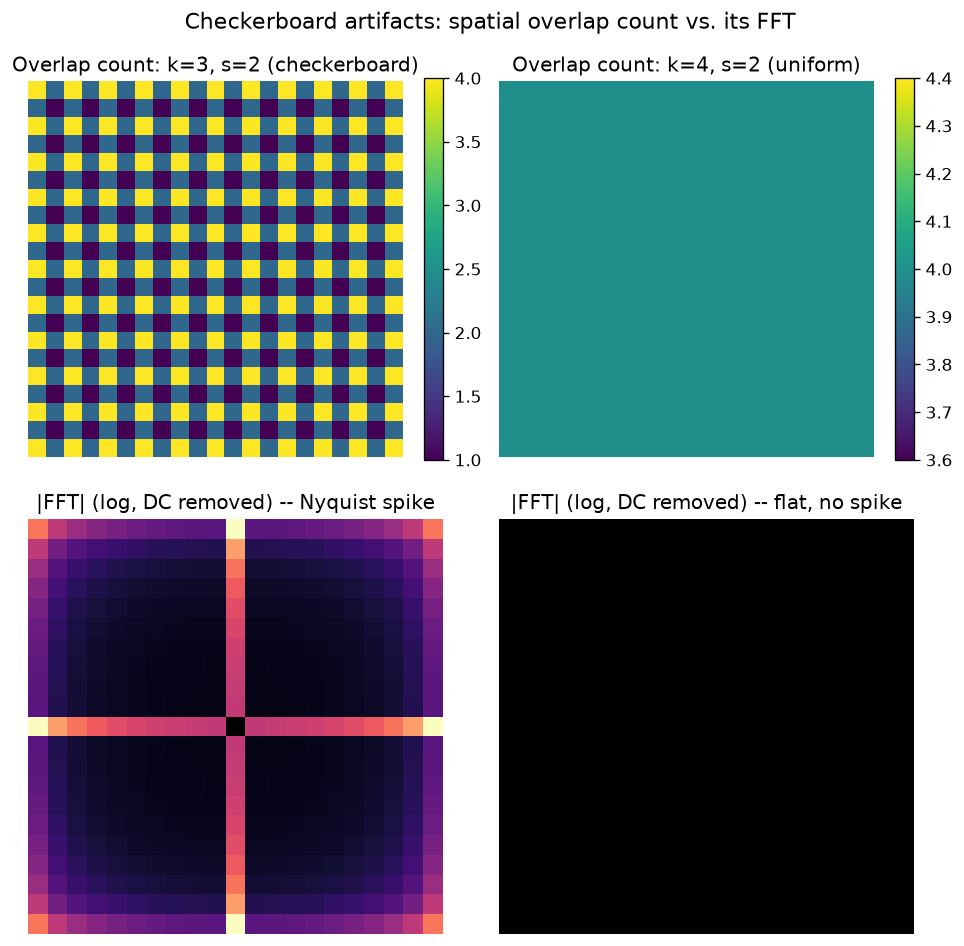

# Day 80 — VAE Decoder & Upsampling Artifacts

## 🧠 CONCEPT OF THE DAY

**Intuition.** The VAE encoder's whole job (Day 79) is to squash an image down to a small latent — spatially or dimensionally. The decoder has to do the opposite: start from something small and *grow* it back to image resolution. Growing a grid is not the same operation as shrinking one, and it's where most of the "why does my generated image look slightly gridded" bugs live.

Think of the decoder's first few layers as painting a mural by stamping the same small rubber stamp (the kernel) across a big wall, moving it `stride` pixels each time. If the stamp is bigger than the stride, stamps *overlap* — some wall pixels get hit by two stamps, some by one. If that overlap count isn't the same everywhere, the mural comes out with a faint, perfectly regular texture: brighter where stamps piled up, dimmer where they didn't. That's the checkerboard artifact, and it's not a training bug — it's baked into the geometry of the operation before a single gradient step happens.

**The math.** A transposed convolution ("deconv") with kernel size $k$ and stride $s$ maps an $H \times W$ input to an output of size

$$H_{out} = (H_{in}-1)\cdot s - 2p + k + p_{out}$$

(ignoring padding, $H_{out} = (H_{in}-1)s + k$). Every output position $u$ receives contributions from every input pixel $i$ whose stamp reaches it:

$$y[u] = \sum_{i \,:\, 0 \le u - is < k} x[i]\cdot K[u - is]$$

The *number* of terms in that sum — the overlap count $c(u)$ — depends only on $u \bmod s$, not on $u$ itself. That's the key fact: $c(u)$ is **constant across the whole grid if and only if $k \bmod s = 0$**. When it isn't, $c(u)$ cycles through a small set of values with period $s$, and because it multiplies straight into the output magnitude, that periodic pattern shows up as literal periodic structure in the image — a checkerboard when $s=2$.

**Why it matters.** This is the same overlap-add math as Day 43 (transposed conv), but now you're diagnosing its failure mode instead of just deriving it. It's also your first real bridge from "algorithm mechanics" to "artifact forensics": every GAN (Day 81) and diffusion decoder (Day 84–87) you'll study either avoids this failure mode (resize-then-conv) or leaves a fingerprint from it — which is exactly the kind of periodic spectral signature you'll formalize on Day 88.

**Interview question:** *You're debugging a GAN generator and notice faint grid-like artifacts in every output image, spaced exactly 2 pixels apart. The generator's last three layers are `ConvTranspose2d(kernel_size=3, stride=2)`. Diagnose the root cause and give two independent fixes.* (Answer at the very bottom.)

---

## 🐍 PYTHONIC EDGE

The fix for checkerboarding isn't a hyperparameter tweak — it's swapping the operation. "Resize-convolution" (Odena et al., 2016) replaces the learned upsampling stride with a fixed, artifact-free interpolation followed by an ordinary stride-1 conv.

```python
import torch
import torch.nn as nn

# --- Bad way: raw transposed conv with kernel_size % stride != 0 ---
class BadDecoderBlock(nn.Module):                    # single inheritance: `class X(Base)` == C++ `class X : public Base`
    def __init__(self, in_ch, out_ch):                # ctor; self is an explicit `this`, never implicit
        super().__init__()                             # parent ctor call — C++ does this in the initializer list instead
        self.up = nn.ConvTranspose2d(                  # instance attr via self.x = ...; C++ would declare this in the header
            in_ch, out_ch, kernel_size=3, stride=2, padding=1  # kernel_size=... are keyword args; C++ has no named-arg syntax
        )

    def forward(self, x):                              # never call this directly — see __call__ note below
        return self.up(x)


# --- Good way: fixed interpolation + learned conv at stride=1 ---
class GoodDecoderBlock(nn.Module):
    def __init__(self, in_ch, out_ch):
        super().__init__()
        self.up = nn.Upsample(scale_factor=2, mode="nearest")   # deterministic resize, zero learned params, zero overlap issue
        self.conv = nn.Conv2d(in_ch, out_ch, kernel_size=3, stride=1, padding=1)  # stride=1 -> overlap count is uniform by construction

    def forward(self, x):
        x = self.up(x)
        return self.conv(x)


block = GoodDecoderBlock(64, 32)
z = torch.randn(1, 64, 8, 8)          # 4D: (batch, channels, H, W) — no shape decl needed up front, unlike a C++ array
out = block(z)                         # calling the object invokes __call__, which wraps forward() with hooks (grad tracking, etc.)
print(out.shape)                       # torch.Size([1, 32, 16, 16]) — .shape is a property, not a method call
```

The one-line rule: **anywhere your effective stride > 1 in a decoder, prefer resize-then-conv unless you've deliberately chosen a kernel/stride pair where `k % s == 0`.**

---

## 📡 SIGNAL LAB

Let's make the checkerboard claim precise instead of taking it on faith. The cleanest way to isolate it: feed a transposed conv an all-ones input and an all-ones kernel. The output is then *exactly* the overlap-count map $c(u,v)$ — no data, no learned weights, pure geometry.

I ran this for two configurations, both stride $s=2$:
- **Bad:** kernel $k=3$ ($3 \bmod 2 \ne 0$)
- **Good:** kernel $k=4$ ($4 \bmod 2 = 0$)

then took the 2D FFT (DC term removed, since we only care about non-constant structure) of each overlap map.



The left overlap map is a literal checkerboard (counts alternate 1/2/2/4 in a period-2 tile), and its spectrum has a sharp cross-shaped spike sitting exactly at the Nyquist frequency along both axes — the highest frequency representable at that sample spacing, which is exactly what you'd expect from a signal alternating every single sample. The right overlap map is *perfectly* flat (constant 4 everywhere in the interior), so its zero-meaned FFT is identically zero: no non-DC energy at all, because there's no non-DC structure to have.

**So what:** this is precisely the artifact you'd hunt for with a radial-average power spectrum when doing GAN/diffusion-image forensics — synthetic images built on transposed-conv or naive-upsampling decoders leave energy concentrated at specific high frequencies (often near Nyquist or at harmonics tied to the upsampling factor) that real camera images don't have. "Does this image have anomalous energy at $f = 1/2$ cycles/pixel or its harmonics" is a legitimate, cheap first-pass detector — and now you know *mechanically*, not just empirically, why that frequency is the one to look at.

---

## 🏋️ THE GAUNTLET

**Window Coverage Count**

You're given `n` windows, each of fixed length `k`, placed on a 1D array. Window `i` (0-indexed) starts at position `i * s` and covers indices `[i*s, i*s + k)`. The total output length is `L = (n-1)*s + k`. Return an array `cover` of length `L` where `cover[x]` = the number of windows touching position `x`.

**Constraints:**
- `1 <= n <= 10^6`
- `1 <= s <= k <= 10^5`
- Output length `L` can be up to ~`10^6`. Your solution must run comfortably within an `O(n + L)` time budget — an `O(n*k)` brute force will TLE.

**Hints (escalating):**
1. The brute-force way marks every position in every window's range directly. What work are you redoing at positions that many windows share?
2. You need "add 1 to every index in `[a, b)`" repeated `n` times, then read off the final per-index totals. Is there a representation where each range update costs O(1), and you only pay for materializing the full array once, at the end?
3. Difference array: `diff[a] += 1`, `diff[b] -= 1` for each window's `[a, b)`, then `cover = prefix_sum(diff)`. Mind the array bound — `b` can legitimately equal `L`, so size your difference array `L + 1`, not `L`.

**Pattern:** Difference array / sweep line (range-update, point-query via prefix sums). **Target complexity:** `O(n + L)` time, `O(L)` space.

*(This is exactly the 1D version of the overlap-count map from the Signal Lab — the 2D checkerboard is what you get when you apply this same idea along both axes.)*

---

## 🏗️ BLUEPRINT

**Resize-convolution vs. transposed conv, at serving time.** The tradeoff isn't just "which one looks cleaner" — it's also a deployment question. A learned transposed conv packs upsampling and feature transformation into one fused, hardware-friendly op with its own optimized kernel on GPU, and it's marginally more expressive since the upsampling weights are learned rather than fixed. Resize-then-conv decouples the two steps: the interpolation is a deterministic, artifact-free, zero-parameter op, and *all* learning happens in an ordinary stride-1 conv. That decoupling matters most when you're exporting to inference backends (mobile NPUs, some ONNX runtimes) that ship a highly optimized fixed-function resize op but a poorly optimized or unsupported transposed-conv kernel — in that setting, resize-conv is often both more correct *and* faster in production, even though transposed conv wins on paper FLOPs.

---

## 🗺️ MARCHING ORDERS

You now know a real artifact from first principles well enough to both cause it on purpose and detect it in someone else's model — that's the difference between knowing a fact and owning a tool.

Tomorrow: Concept 81 — GANs (minimax game)

---

🔓 GAUNTLET SOLUTION

```cpp
#include <vector>
using namespace std;

vector<long long> windowCoverage(int n, int k, int s) {
    long long L = (long long)(n - 1) * s + k;
    vector<long long> diff(L + 1, 0);   // size L+1 so diff[b] is always in bounds, even when b == L

    for (int i = 0; i < n; i++) {
        long long a = (long long)i * s;
        long long b = a + k;            // exclusive end of this window
        diff[a] += 1;
        diff[b] -= 1;
    }

    vector<long long> cover(L);
    long long running = 0;
    for (long long x = 0; x < L; x++) {
        running += diff[x];
        cover[x] = running;
    }
    return cover;
}
```

Runs in `O(n + L)` time and `O(L)` space: `O(n)` to place all the range markers, `O(L)` to prefix-sum them into final counts.

💡 CONCEPT ANSWER

The three `ConvTranspose2d(kernel_size=3, stride=2)` layers each have `k % s = 3 % 2 = 1 ≠ 0`, so each one produces a spatially periodic overlap-count pattern with period equal to its stride — a period-2 checkerboard. Stacking three such layers compounds (and can partially alias against) the effect, which is why it's visible in the final output at a 2-pixel period.

Two independent fixes:
1. **Change the operation:** replace each `ConvTranspose2d` with `nn.Upsample(mode="nearest"/"bilinear") + Conv2d(stride=1)` (resize-convolution), which has no learned-stride overlap to begin with.
2. **Keep transposed conv but fix the kernel/stride ratio:** pick `kernel_size` divisible by `stride` (e.g. `kernel_size=4, stride=2`, or `kernel_size=2, stride=2`), which makes the overlap count uniform by construction — same operation family, no artifact.
