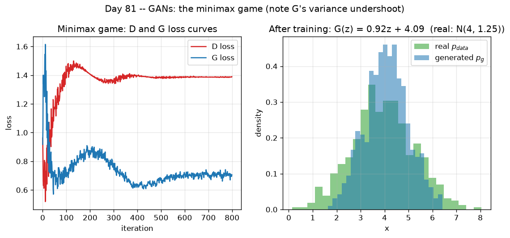

# Day 81 — GANs (minimax game)

## 🧠 CONCEPT OF THE DAY

**Intuition.** A counterfeiter (Generator, **G**) is trying to print fake bills. A detective (Discriminator, **D**) is trying to catch them. Every time D gets better at spotting fakes, the counterfeiter has to improve to keep fooling him — and every time the counterfeiter improves, the detective has to sharpen up in turn. Neither one is "trained to convergence" in isolation; they're trained *against each other*, one gradient step at a time. If this adversarial race is stable, the counterfeiter eventually produces bills the detective can't tell from real ones — 50/50 guessing.

That's the whole idea. G never sees real data directly. It only gets a training signal by trying to fool D, and D only gets sharper by seeing G's latest attempts. It's a two-player zero-sum game, and the "loss function" is literally a game-theoretic value function, not an ordinary loss you're just minimizing.

**The math.** G maps noise $z \sim p_z$ (usually $\mathcal{N}(0, I)$) to the data space; D maps a data point $x$ to a probability that $x$ is real. The minimax objective:

$$\min_G \max_D V(D,G) = \mathbb{E}_{x\sim p_{data}}[\log D(x)] + \mathbb{E}_{z\sim p_z}[\log(1-D(G(z)))]$$

where $p_{data}$ is the true data distribution, $p_g$ is the distribution implicitly induced by $G(z)$, and $D(x)\in[0,1]$ is D's estimate that $x$ came from $p_{data}$ rather than $p_g$.

D wants to push $D(x)\to 1$ on real data and $D(G(z))\to 0$ on fakes (maximize V). G wants $D(G(z))\to 1$ — to be classified as real (minimize V, since $\log(1-D(G(z)))$ shrinks as $D(G(z))\to 1$).

For a **fixed G**, the optimal discriminator has a closed form:

$$D^*(x) = \frac{p_{data}(x)}{p_{data}(x) + p_g(x)}$$

Plugging $D^*$ back into $V$ shows the whole minimax game is secretly minimizing the **Jensen–Shannon divergence** between $p_{data}$ and $p_g$ (up to a constant). At the global optimum, $p_g = p_{data}$ everywhere, so $D^*(x) = \tfrac12$ for all $x$ — the detective can literally do no better than a coin flip.

One critical practical wrinkle: early in training G is bad, so D confidently rejects its samples ($D(G(z)) \approx 0$), and $\log(1-D(G(z)))$ has **near-zero gradient** right where G needs it most. The fix, used almost everywhere in practice, is the **non-saturating loss**: train G to *maximize* $\log D(G(z))$ instead of minimizing $\log(1-D(G(z)))$. Same fixed point, far healthier gradients.

**Why it matters / where it leads.** The graph below shows a toy 1D GAN converging: the generator's mean locks onto the real data's mean nicely, but its *variance* consistently undershoots. That's not a bug in the toy — it's the real, well-documented tendency of the JS-divergence-based minimax game to be **mode-seeking** rather than mode-covering. Push that tendency further and you get full **mode collapse**, plus training instability whenever $p_{data}$ and $p_g$ have non-overlapping support (JS divergence is locally constant there → dead gradients). That instability is exactly tomorrow's topic: Wasserstein GAN, which replaces JS divergence with a distance that stays informative even when supports don't overlap.



**Interview-style question:** *At the Nash equilibrium of the GAN game, what is the discriminator's loss, and why is "the discriminator's loss went to 0" during training actually a bad sign rather than a good one?* (Answer at the very bottom.)

---

## 🐍 PYTHONIC EDGE

The single most common GAN bug in PyTorch: forgetting to cut the gradient flow between D's update and G's parameters when you train D on G's fake samples. If you don't detach, computing `d_loss.backward()` on the fake batch walks the autograd graph all the way back through G — wasting memory/compute at best, and if you're not careful with optimizer scoping, accidentally letting `d_optimizer.step()` nudge G's weights at worst.

```python
# --- the bad way: D's backward pass drags G's whole graph along ---
fake = G(z)                    # z: noise batch: torch.randn(...) is like sampling z ~ N(0,I)
d_real = D(x_real)             # D(x_real) calls D.__call__(x_real), NOT D.forward() directly --
                                # __call__ wraps forward() with PyTorch's hooks (autograd, etc.)
d_fake = D(fake)                # <-- graph here still traces back through every G layer
d_loss = -(d_real.log().mean() + (1 - d_fake).log().mean())  # ** is exponent in Python; here .log() is a method, no ** used
d_loss.backward()               # backprops needlessly through all of G's parameters too

# --- the clean way: detach the fake batch before D sees it ---
fake = G(z)
d_real = D(x_real)
d_fake = D(fake.detach())      # .detach() returns a new tensor sharing data, but severs
                                # the autograd graph -- G's params get zero gradient from this line
d_loss = -(d_real.log().mean() + (1 - d_fake).log().mean())
d_loss.backward()               # now backward() only touches D's parameters
d_optimizer.step()              # in-place update of D's weights (the _ suffix convention:
                                 # methods like .mul_() below mutate in place, unlike .mul())

# --- separately, G's own update step needs the *undetached* graph ---
fake = G(z)                     # fresh forward pass -- reuse the detached one and this breaks
g_loss = -D(fake).log().mean()  # non-saturating loss: maximize log D(G(z))
g_optimizer.zero_grad()         # clears .grad buffers; Python has no destructors to rely on here
g_loss.backward()               # now the graph *does* need to reach back into G -- no detach
g_optimizer.step()
```

Key mechanics flagged: `.detach()` vs recomputing the forward pass — reusing a detached tensor in G's loss silently gives G no gradient at all (a very common silent-failure bug); `D(x)` invoking `__call__` rather than `forward()` directly (skip that and you lose all of PyTorch's registered hooks); the trailing `_` naming convention for in-place ops (`.step()`/`.zero_grad()` mutate optimizer/module state, not the tensor's `_` convention itself, but the *pattern* is the same C++-has-no-equivalent-for: an ordinary method call that mutates rather than returns).

---

## 📡 SIGNAL LAB

Strip away the neural network and the GAN discriminator is doing something classical signal-processing and estimation theory has a name for: a **likelihood-ratio test**.

**Setup.** Suppose you must decide whether an observed scalar $x$ came from "real" class ($p_{data}$) or "fake" class ($p_g$), and both are known Gaussians: $p_{data} = \mathcal{N}(\mu_1, \sigma^2)$, $p_g = \mathcal{N}(\mu_0, \sigma^2)$ (equal variance, common in matched-filter detection of a known signal in white Gaussian noise). The Neyman–Pearson-optimal test compares the **likelihood ratio**:

$$\Lambda(x) = \frac{p_{data}(x)}{p_g(x)} \gtrless \tau$$

Take logs (monotonic, so the test is unchanged) — this is exactly a **matched filter**: correlate $x$ against the difference of the two known means, scaled by noise power:

$$\log \Lambda(x) = \frac{(\mu_1 - \mu_0)}{\sigma^2}\, x - \frac{\mu_1^2 - \mu_0^2}{2\sigma^2} \gtrless \log\tau$$

which is affine in $x$ — a single linear discriminant, structurally identical to $D(x)=\sigma(wx+b)$ once you pass it through a sigmoid to turn the ratio into a probability. Recall from the CONCEPT section that the GAN-optimal discriminator is $D^*(x) = p_{data}(x)/(p_{data}(x)+p_g(x))$; dividing numerator and denominator by $p_g(x)$ gives $D^*(x) = \Lambda(x)/(1+\Lambda(x))$ — literally a sigmoid of the log-likelihood ratio.

**So what.** The optimal GAN discriminator *is* a Neyman–Pearson detector between $p_{data}$ and $p_g$. This isn't a metaphor — it's the same math your matched filter in radar/comms uses to detect a known pulse buried in Gaussian noise, just applied to distinguishing real images from generated ones. In your frequency-domain forensics lane, this is precisely why spectral GAN-detectors work: if $p_{data}$ and $p_g$ differ characteristically in their power spectra (the classic checkerboard/high-frequency grid artifact from transposed-conv upsampling, Day 43/80), the optimal detector for "real vs. GAN-generated" is a filter matched to *that spectral difference* — you don't need a deep discriminator at all if the discriminative signal is a known, narrow frequency band.

---

## 🏋️ THE GAUNTLET

**Predict the Winner.** Given an integer array `nums` of length $n$, two players alternate turns. On each turn a player removes either the first or the last element of the remaining array and adds its value to their own score. Both players play **optimally** (each maximizes their own final score, knowing the other will too). Player 1 moves first. Return `true` if Player 1 can end with a score $\geq$ Player 2's score, else `false`.

- $1 \le n \le 20$
- $0 \le \text{nums}[i] \le 10^7$

This is quite literally the minimax game from today's lesson, just discrete and finite instead of continuous and adversarial-gradient-based: each player is the "max" or "min" player on alternating turns over the same value function.

**Hints (escalating):**
1. Define a function on a *subarray* `[i, j]`, not the whole array — think about what state fully captures "the game from here on."
2. At each turn the current player doesn't just want to maximize their own score — they want to maximize the *difference* between their score and the opponent's remaining best play. Try defining `dp[i][j]` = the best score differential the player-to-move can achieve on subarray `nums[i..j]`.
3. Write the recurrence for `dp[i][j]` in terms of `dp[i+1][j]` and `dp[i][j-1]`, and think about why this collapses cleanly to a 1D rolling array instead of a full 2D table.

**Pattern:** interval DP (game-theoretic minimax on subarrays). **Target complexity:** $O(n^2)$ time, $O(n)$ space.

---

## 🏗️ BLUEPRINT

**Why GAN training can't be sharded the way ordinary data-parallel training is.** In standard supervised data-parallel training, workers can run somewhat asynchronously — stale-gradient tolerance is fine because the loss landscape is fixed underneath them from step to step. GAN training doesn't have that luxury: D's loss landscape is defined *by G's current weights*, and G's loss landscape is defined *by D's current weights* — each step's objective is only valid against the other player's parameters at that exact instant. Let D and G drift out of sync by even a few stale steps (e.g. G workers pulling a slightly outdated D) and you're optimizing against a discriminator that no longer represents the real game state — the adversarial equilibrium these methods rely on requires both networks to be updated in tight lockstep, every step, on the same devices. This is a big part of why large-scale GAN training (e.g. BigGAN) leans on synchronous data-parallelism with large batches per step rather than the looser asynchronous/pipeline-parallel tricks that work fine for a single fixed-objective network.

---

## 🗺️ MARCHING ORDERS

You now have the actual math of the game everyone reaches for as a GAN one-liner — hold onto the JS-divergence connection, because tomorrow you'll watch it break.

Tomorrow: Concept 82 — GAN instability & Wasserstein GAN

---

🔓 GAUNTLET SOLUTION
```cpp
class Solution {
public:
    bool PredictTheWinner(vector<int>& nums) {
        int n = nums.size();
        // dp[j] will hold dp[i][j] as we sweep i from n-1 down to 0
        vector<int> dp(nums.begin(), nums.end());  // base case: dp[i][i] = nums[i]

        for (int i = n - 2; i >= 0; --i) {
            for (int j = i + 1; j < n; ++j) {
                // dp[i][j] = best score differential the player-to-move can force
                // on subarray [i, j]: take nums[i] and deny opponent dp[i+1][j],
                // or take nums[j] and deny opponent dp[i][j-1].
                dp[j] = max(nums[i] - dp[j], nums[j] - dp[j - 1]);
            }
        }
        // dp[n-1] now holds dp[0][n-1]: Player 1's best possible score minus
        // Player 2's best possible score under optimal play from both sides.
        return dp[n - 1] >= 0;
    }
};
```
Complexity: O(n²) time (two nested loops over the array), O(n) space (one rolling array instead of a full n×n table, since row i only ever depends on row i+1 and the partially-updated current row).

💡 CONCEPT ANSWER
At the true Nash equilibrium, D's loss is **not** 0 — it's $-\log 4 \approx 1.386$ (equivalently, $D(x)=\tfrac12$ everywhere, maximal uncertainty). "D's loss went to 0" means D can perfectly separate real from fake, i.e. G has *not* converged and the game is nowhere near equilibrium — usually a sign D is overpowering G (vanishing gradients for G, since $D(G(z))\approx 0$ everywhere) rather than a sign of successful training. Healthy adversarial training looks like D's loss *plateauing near $\log 4$*, not dropping to zero.
