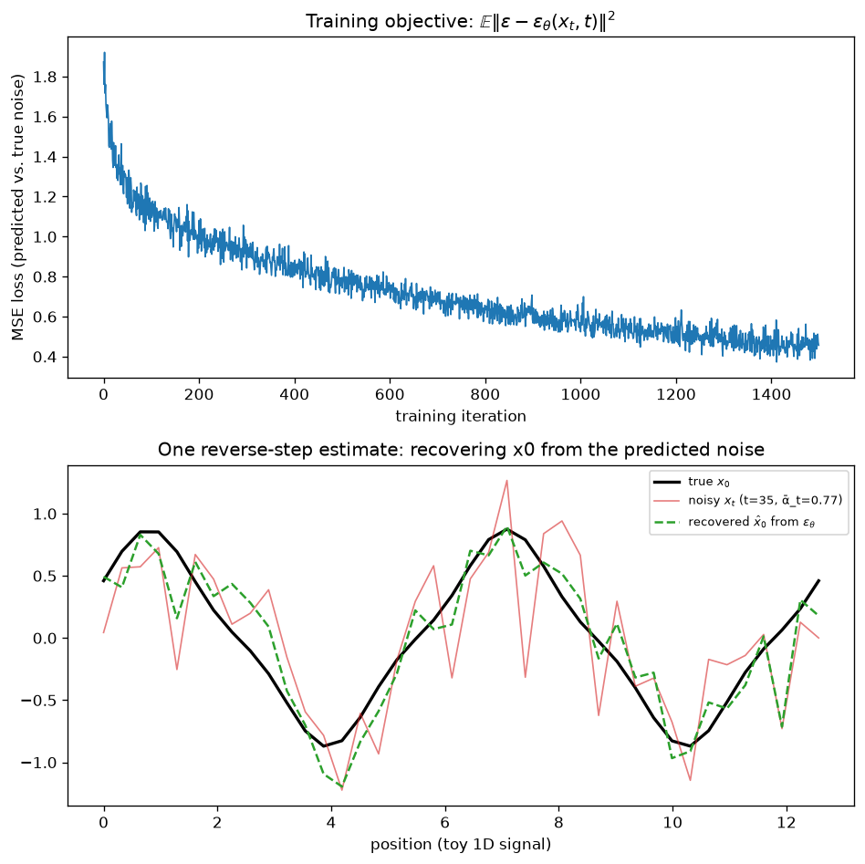

# Day 84 — Diffusion: Reverse Denoising & Objective

## 🧠 CONCEPT OF THE DAY

**Intuition.** Yesterday you dissolved a photo into static, one whisper of noise at a time. Today you train a network to run that film backward: hand it a noisy frame $x_t$ and "which step this is," and ask it to guess *what noise was just added*. Peel that guessed noise off, and you're one step closer to the clean photo. Do this $T$ times in a row, starting from pure static, and you've generated an image from nothing. The entire generative trick of diffusion models reduces to training a network to be a very good **noise guesser** — everything else (sampling, guidance, latent diffusion) is built on top of that one regression problem.

**The math.** The reverse process is defined as a learned Markov chain, Gaussian at each step:

$$p_\theta(x_{t-1} \mid x_t) = \mathcal{N}\!\big(x_{t-1};\ \mu_\theta(x_t, t),\ \sigma_t^2 I\big)$$

We don't have to guess this functional form — it falls out of Bayes' rule. Conditioned on knowing $x_0$ (true only at training time), the *true* reverse posterior $q(x_{t-1} \mid x_t, x_0)$ is itself an exactly tractable Gaussian, because it's built from the two Gaussians of the forward process (Day 83). Its mean is:

$$\tilde\mu_t(x_t, x_0) = \frac{1}{\sqrt{\alpha_t}}\left(x_t - \frac{\beta_t}{\sqrt{1-\bar\alpha_t}}\,\epsilon\right), \qquad x_t = \sqrt{\bar\alpha_t}\,x_0 + \sqrt{1-\bar\alpha_t}\,\epsilon$$

Notice: $x_0$ only enters through $\epsilon$, the specific noise draw that produced $x_t$ from it. That's the key move Ho et al. (DDPM, 2020) made — instead of training a network to predict $x_0$ or $\mu_t$ directly, **parameterize $\mu_\theta$ the same way**, swapping in a learned $\epsilon_\theta(x_t, t)$ for the true $\epsilon$:

$$\mu_\theta(x_t, t) = \frac{1}{\sqrt{\alpha_t}}\left(x_t - \frac{\beta_t}{\sqrt{1-\bar\alpha_t}}\,\epsilon_\theta(x_t, t)\right)$$

The full training objective is a variational lower bound (a sum of KL divergences between Gaussians, one per timestep) that in principle should be weighted by a $t$-dependent coefficient. Ho et al.'s empirical finding — the one that made diffusion models actually work well — is that **dropping that weighting** and training on the raw noise-prediction MSE works better in practice:

$$L_{\text{simple}}(\theta) = \mathbb{E}_{x_0,\ \epsilon \sim \mathcal{N}(0,I),\ t \sim \text{Unif}(1,T)}\Big[\ \|\epsilon - \epsilon_\theta(x_t, t)\|^2\ \Big]$$

That's it — pick a random clean example, a random timestep, a random noise draw, compute $x_t$ in one shot (yesterday's closed form), feed $(x_t, t)$ into a network, and regress its output against the $\epsilon$ you just sampled. No adversary, no discriminator, no mode collapse — just supervised regression against a target you constructed yourself.

**Why it matters / where it leads.** $\epsilon_\theta$ is doing something very specific: at every $(x_t, t)$, it's estimating the noise component of a known noisy-signal mixture — the exact job of an MMSE (minimum mean squared error) denoiser. That reframing is what connects diffusion to **score-based generative models** (Day 85): predicting $\epsilon$ turns out to be mathematically equivalent (via Tweedie's formula) to estimating the *score* $\nabla_{x_t} \log p(x_t)$, the gradient of the log-density. Once you see $\epsilon_\theta$ as a score estimator, sampling becomes "walk uphill on estimated log-probability," which opens the door to classifier-free guidance (Day 86) — literally steering that walk.

**Interview question:** *DDPM's true training objective is a weighted sum of per-timestep KL terms, but $L_{\text{simple}}$ drops the weights entirely and just averages the noise-MSE uniformly over $t$. What does that implicit reweighting do to which timesteps the network is effectively trained hardest on, and why might that be a good inductive bias for perceptual image quality?*

---

## 🐍 PYTHONIC EDGE

The core inference-time operation is the reverse sampling loop: start from pure noise, walk from $t=T$ down to $t=1$, denoising one step at a time. The bad way re-derives shapes and forgets to disable gradient tracking; the clean way uses Python's `reversed(range(...))`, a context manager, and in-place-free broadcasting.

```python
import torch

@torch.no_grad()  # decorator: disables autograd entirely for this function's body —
                   # no C++ equivalent; you'd manually skip building a computation graph
def sample(model, shape, T, betas, alphas, alpha_bars, device="cpu"):
    x = torch.randn(shape, device=device)  # start from x_T ~ N(0, I)

    # --- bad way: manual counter loop, easy to get the step direction backwards ---
    # t = T - 1
    # while t >= 0:
    #     ...
    #     t = t - 1

    # --- clean way: reversed(range(T)) reads as "walk t from T-1 down to 0" ---
    for t in reversed(range(T)):            # range() is a lazy object, not a materialized list — reversed() is O(1) to construct
        t_batch = torch.full((shape[0],), t, device=device, dtype=torch.long)  # broadcast scalar t to a batch of timesteps
        eps_pred = model(x, t_batch)         # calling model(...) invokes __call__, which wraps forward() — never call model.forward() directly

        alpha_t, alpha_bar_t, beta_t = alphas[t], alpha_bars[t], betas[t]
        mean = (x - (beta_t / (1 - alpha_bar_t).sqrt()) * eps_pred) / alpha_t.sqrt()

        noise = torch.randn_like(x) if t > 0 else torch.zeros_like(x)  # ternary-style conditional expression, C++: t > 0 ? a : b
        x = mean + beta_t.sqrt() * noise    # no .mul_() here on purpose — rebinding x keeps each step's tensor independent for debugging
    return x
```

A minimal noise-predictor wrapper, annotated for OOP mechanics:

```python
class EpsilonPredictor(torch.nn.Module):        # single inheritance: Python `(Base)` vs C++ `: public Base`
    def __init__(self, dim: int, hidden: int = 128):
        super().__init__()                        # parent ctor call; C++ uses an initializer list instead: EpsilonPredictor() : Module() {}
        self.time_embed = torch.nn.Linear(1, hidden)   # instance attribute — no header declaration, just assign in __init__
        self.net = torch.nn.Sequential(
            torch.nn.Linear(dim + hidden, hidden),
            torch.nn.SiLU(),
            torch.nn.Linear(hidden, dim),
        )

    def forward(self, x: torch.Tensor, t: torch.Tensor) -> torch.Tensor:
        t_feat = self.time_embed(t.float().unsqueeze(-1) / 1000)  # unsqueeze(-1): add trailing dim; negative index counts from the end
        return self.net(torch.cat([x, t_feat], dim=-1))  # dim=-1 concatenates along the last axis regardless of tensor rank

    # NOTE: this class defines forward(), not __call__ — nn.Module.__call__ (inherited)
    # invokes forward() *and* runs registered hooks. Calling model(x, t) is correct;
    # calling model.forward(x, t) silently skips those hooks.
```

---

## 📡 SIGNAL LAB

Yesterday you derived the frequency-resolved SNR of the forward process. Today's reverse network is, at each $(x_t, t)$, solving exactly the estimation problem classical signal processing already has an optimal closed-form answer for: **denoising a known signal-plus-white-noise mixture**.

**Setup.** If you knew the true signal PSD $S_{x_0}(f)$ and the noise is white with power $(1-\bar\alpha_t)$, the linear MMSE estimator of $x_0$ from $x_t$ in the frequency domain is the classical **Wiener filter**:

$$H_t(f) = \frac{\bar\alpha_t\, S_{x_0}(f)}{\bar\alpha_t\, S_{x_0}(f) + (1-\bar\alpha_t)}$$

applied as $\hat{X}_0(f) = H_t(f)\cdot X_t(f)/\sqrt{\bar\alpha_t}$. This is the *exact* optimal linear denoiser at every frequency, given the true signal statistics — no neural network required, if $S_{x_0}(f)$ were known and stationary.

**The connection.** $\epsilon_\theta(x_t, t)$ is learning a *nonlinear, data-adaptive* generalization of exactly this filter — it doesn't just know the average PSD of the data distribution, it conditions on the specific $x_t$ it's looking at. But the Wiener filter's frequency-domain behavior predicts something you can *see* directly in the graph below: $H_t(f) \to 1$ at frequencies where signal power dominates (mid/low $f$, where $\bar\alpha_t S_{x_0}(f) \gg 1-\bar\alpha_t$) and $H_t(f) \to 0$ where noise dominates (high $f$, where natural signal power is already low). In the reconstruction panel of today's graph, notice the recovered $\hat{x}_0$ tracks the true signal's broad shape (low-frequency structure) far more faithfully than its sharp local wiggles (high-frequency detail) — the network has implicitly learned to trust low frequencies and hedge on high frequencies, exactly as the Wiener filter's frequency response predicts it should.

**So what:** this is the mechanistic root of the spectral forensic signature flagged on Day 83 — the reverse network isn't failing to learn high frequencies out of laziness, it's doing the *statistically correct* thing (a Wiener-filter-like attenuation) at every step where the true SNR at high $f$ is low. Real camera images get their high-frequency content from optics and sensor noise directly, bypassing this attenuation entirely. Any detector that measures the radially-averaged PSD falloff is, in effect, measuring how "Wiener-filtered" an image's high end looks.



---

## 🏋️ THE GAUNTLET

**Problem: Optimal Skip-Step Sampling Schedule**

You're building a fast sampler. Full DDPM sampling walks every one of $T{+}1$ steps ($T, T{-}1, \dots, 0$), but you want to skip ahead to cut latency. You're given `quality[0..T]`, where `quality[i]` is the model's predicted reconstruction fidelity if the sampler lands exactly on step $i$. Starting at step $T$, you must reach step $0$. From step $i$ you may jump directly to any step $i-j$ for $1 \le j \le k$ (k is given — your max allowed skip). Your schedule's total score is the sum of `quality[i]` over every step you land on, including $T$ and $0$. **Maximize total score.**

**Constraints:** $1 \le T \le 2\times10^5$, $1 \le k \le T$, `quality[i]` can be any integer (positive or negative — some steps are actively *bad* to land on). Target: **O(T)** time.

**Hint 1:** Define `dp[i]` = the best score of any valid schedule that starts at $T$ and ends *exactly* at step $i$. Then `dp[i] = quality[i] + max(dp[i+1], dp[i+2], ..., dp[i+k])`, with `dp[T] = quality[T]`. Answer is `dp[0]`. Naively this is $O(T \cdot k)$ — where's the redundant work as $i$ decreases by 1?

**Hint 2:** The window `dp[i+1..i+k]` shifts by exactly one position each time $i$ decreases by one — one new element enters, one leaves. You need "max over the current window" maintained incrementally. What classic sliding-window structure gives O(1) amortized update *and* O(1) max query?

**Hint 3:** A monotonic decreasing deque of indices: before inserting `dp[i]`, pop from the back while the back's dp-value is $\le$ `dp[i]` (it can never be the max again). Before querying, pop from the front while the front index has fallen outside the current $k$-window. The front of the deque is always the window max.

**Pattern:** DP + sliding-window maximum via monotonic deque (the "Jump Game VI / Constrained Subsequence Sum" family). Target: **O(T)** time, O(k) space.

---

## 🏗️ BLUEPRINT

**Sampling-step count is a latency knob, not just a quality knob.** A production diffusion service (image gen, inpainting) exposes the same trained $\epsilon_\theta$ at inference time through wildly different step budgets: DDPM ancestral sampling wants $T \approx 1000$ full sequential forward passes through the denoiser per image — each step depends on the last, so it's inherently latency-bound, not throughput-bound, no matter how big your batch is. Deterministic samplers (DDIM) or distilled few-step models cut this to 20–50, or even 1–4 steps for consistency-distilled models, trading a (usually small, tunable) quality hit for a 20–1000x latency win. The system design consequence: your serving layer needs a *step-count/quality slider* exposed per request (fast preview vs. final-quality render), because the cost model here isn't "bigger batch = cheaper" the way it is for a single forward-pass model — it's "more sequential steps = strictly more wall-clock latency per image," full stop.

---

## 🗺️ MARCHING ORDERS

You've now got both halves of the diffusion machine — destroy on purpose, then reconstruct by regression. Tomorrow you'll see this exact reconstruction reframed as walking a probability gradient, which is where diffusion and an entirely different generative lineage turn out to be the same idea wearing different math.

Tomorrow: Concept 85 — Score-based generative models

---

🔓 GAUNTLET SOLUTION

```cpp
#include <vector>
#include <deque>
using namespace std;

long long maxScoreSchedule(vector<long long>& quality, int k) {
    int T = (int)quality.size() - 1;          // steps are indexed 0..T
    vector<long long> dp(T + 1, 0);
    dp[T] = quality[T];

    deque<int> dq;                             // monotonic decreasing deque of indices, by dp-value
    dq.push_back(T);

    for (int i = T - 1; i >= 0; --i) {
        // drop indices that fell outside the window [i+1, i+k]
        while (!dq.empty() && dq.front() > i + k) {
            dq.pop_front();
        }
        dp[i] = quality[i] + dp[dq.front()];

        // maintain monotonic decreasing order before inserting dp[i]
        while (!dq.empty() && dp[dq.back()] <= dp[i]) {
            dq.pop_back();
        }
        dq.push_back(i);
    }

    return dp[0];
}
```

**Why it works:** each index enters and leaves the deque at most once across the whole scan, so total work is O(T) despite the nested-looking `while` loops (classic amortized analysis). The deque's front is always the index of the maximum `dp` value within the current valid window, because anything smaller that entered earlier was already evicted when a larger value arrived after it — it could never win a future `max` query, so keeping it around would only waste space, not correctness.

---

💡 CONCEPT ANSWER

Dropping the KL weighting and averaging uniformly over $t$ implicitly **up-weights the timesteps the true weighted objective would have down-weighted** — and those turn out to be the small-to-moderate-$t$ steps (low noise), where $1-\bar\alpha_t$ is small and the analytically-correct VLB weight $\propto \beta_t^2 / (\sigma_t^2 \alpha_t (1-\bar\alpha_t))$ shrinks the loss contribution toward near-zero. Uniform-$t$ training instead gives every noise level equal say, which in practice pushes the network to spend more relative capacity getting *fine, near-clean detail* right (small-$t$ regime) rather than over-focusing on the easy, coarse-structure regime (large-$t$, where getting the rough shape right is nearly free). Since human perceptual quality is dominated by fine detail and texture fidelity — not by whether the rough low-frequency layout is right — this "wrong" objective is a better proxy for the thing you actually care about, which is why Ho et al.'s ablation found $L_{\text{simple}}$ produces visibly sharper samples than the theoretically-correct weighted VLB.
