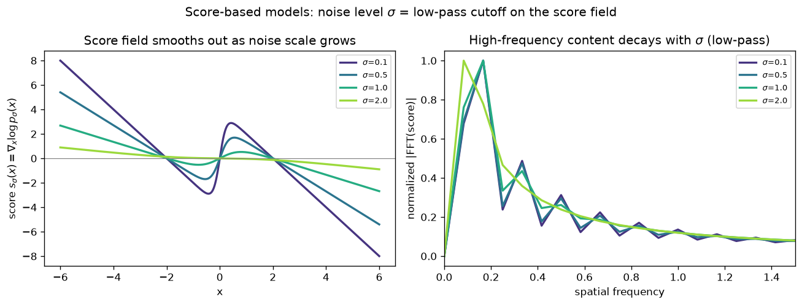

# Day 85 — Concept 85: Score-Based Generative Models

## 🧠 CONCEPT OF THE DAY

**Intuition.** Imagine every possible image as a point on a landscape, where elevation = probability density: real, plausible images sit on tall mountains, noise sits in the flat lowlands. A **score function** is just a compass at every point on that landscape, always pointing "uphill" — toward higher density, i.e. toward more realistic data. If you drop a random point (pure noise) onto the map and keep nudging it in the direction the compass points (plus a little random jitter so you don't get stuck in a local bump), you eventually climb up onto one of the real-data mountains. That's the entire sampling procedure.

**The math.** The score of a distribution $p(x)$ is:

$$s(x) = \nabla_x \log p(x)$$

Note this is a gradient *with respect to the data* $x$, not the parameters — a genuinely different object from the gradients you use for training. A network $s_\theta(x)$ is trained to approximate it. You can't regress directly against $\nabla_x \log p(x)$ (you don't have $p$), so you train on **noised** versions of the data instead (denoising score matching):

$$\mathcal{L}(\theta) = \mathbb{E}_{x,\, \sigma,\, \epsilon}\left[\, \left\lVert\, s_\theta(\tilde{x}, \sigma) - \left(-\frac{\epsilon}{\sigma}\right) \right\rVert^2 \,\right]$$

where $\tilde{x} = x + \sigma\epsilon$, $\epsilon \sim \mathcal{N}(0, I)$. The target $-\epsilon/\sigma$ is the exact score of a Gaussian centered at $x$ with std $\sigma$ — it's the one case where you *do* know the ground-truth score in closed form. Once trained, you sample with **annealed Langevin dynamics**: start from pure noise at a large $\sigma$, and repeatedly step

$$x_{t+1} = x_t + \frac{\eta}{2}\, s_\theta(x_t, \sigma_t) + \sqrt{\eta}\, z_t, \qquad z_t \sim \mathcal{N}(0, I)$$

while annealing $\sigma_t \to 0$.

**Why it matters / where it leads.** Look at that training target again: $-\epsilon/\sigma$. That's *the same signal* a diffusion model's $\epsilon_\theta$ is trained to predict, just rescaled ($s_\theta = -\epsilon_\theta / \sigma_t$). Score-based models (Song & Ermon's NCSN) and DDPM-style diffusion (yesterday's lesson) are two independent derivations of **the same object**, later unified as discretizations of a single continuous-time SDE (Song et al., 2021). That unification is why the field talks about "diffusion" and "score-based" almost interchangeably now — and it's the lens tomorrow's concept, classifier-free guidance, builds on directly: guidance is nothing more than steering the score itself.

**Interview question:** *Why do score-based models need training at many noise levels instead of just learning the score of the raw data distribution directly?*

---

## 🐍 PYTHONIC EDGE

Computing a *per-sample gradient* (exactly what a score model needs: $\nabla_x \log p_\theta(x)$ for each $x$ in a batch) is a classic place people reach for a Python loop out of C++ habit — and pay for it in interpreter overhead on every single sample.

```python
import torch
from torch.func import grad, vmap

class ScoreNet(torch.nn.Module):        # Python single inheritance: one base only, no C++ "class X : public A, public B" list
    def __init__(self, dim=1, hidden=32):
        super().__init__()               # parent ctor call; C++ instead uses an initializer list: ScoreNet() : Module() {}
        self.net = torch.nn.Sequential(  # instance attribute set via self.x = ...; C++ would declare this in the header
            torch.nn.Linear(dim, hidden), torch.nn.SiLU(), torch.nn.Linear(hidden, dim)
        )

    def forward(self, x):                # defines the computation, but is never called directly (see below)
        return self.net(x)

model = ScoreNet()
x = torch.randn(256, 1)                  # a batch of 256 1D points; shape (256, 1)

# ---- BAD: per-sample Python loop, one autograd.grad() call per row ----
scores_bad = []
for i in range(x.shape[0]):              # range() is a lazy object in Py3, not a materialized list like a C-style for
    xi = x[i].requires_grad_()           # trailing _ = in-place op, mutates xi's requires_grad flag itself
    logp = model(xi).sum()               # model(xi) invokes __call__, which wraps forward() with hooks -- never call .forward() directly
    (g,) = torch.autograd.grad(logp, xi) # tuple unpacking: grad() always returns a tuple, even for one input
    scores_bad.append(g)
scores_bad = torch.stack(scores_bad)     # rebuild one tensor from a Python list of tensors

# ---- CLEAN: vectorize the *gradient itself*, no Python-level loop at all ----
def log_prob(xi):                        # xi: a single (dim,) sample, NOT a batch -- vmap adds the batch dim back
    return model(xi).sum()

score_fn = vmap(grad(log_prob))          # grad() differentiates a scalar fn; vmap() batches it -- function composition, not a loop
scores_good = score_fn(x)                # one call, fully vectorized on-device, same result as scores_bad
```

`grad` and `vmap` are first-class functions here — `vmap(grad(log_prob))` passes a function as a value into another function, something C++ only gets close to via function pointers/`std::function`, and even then not this compositionally. This is the general pattern for *any* per-sample-gradient need (score models, per-example DP-SGD gradients, Jacobians) — reach for `torch.func`, not a loop.

---

## 📡 SIGNAL LAB

Here's the frequency-domain view of what training at multiple $\sigma$ actually buys you — and it connects straight to your research lane.

**Setup.** Take a toy bimodal density $p(x) = \tfrac{1}{2}\mathcal{N}(x; -2, v) + \tfrac{1}{2}\mathcal{N}(x; 2, v)$ with $v = 0.49$ — two "real data modes." Convolving with Gaussian noise of std $\sigma$ is itself a Gaussian mixture, so the perturbed density is exactly $p_\sigma(x) = \tfrac12\mathcal{N}(x; -2, v+\sigma^2) + \tfrac12\mathcal{N}(x; 2, v+\sigma^2)$ — no sampling needed, just add $\sigma^2$ to the variance. The score $s_\sigma(x) = \nabla_x \log p_\sigma(x)$ is what the graph below plots, alongside its FFT magnitude:



**Worked insight.** As $\sigma$ grows, convolution with a wider Gaussian kernel is literally a **low-pass filter** applied to the density — and by extension to the score. The sharp two-lobed wiggle in $s_{0.1}(x)$ (high spatial frequency — it's telling you "the nearest mode is *right there*, a few units away") gets smeared into the shallow, nearly-linear $s_{2.0}(x)$ (low frequency — it only knows "the mass is somewhere in the middle"). That's Tweedie's formula in disguise: $\mathbb{E}[x \mid \tilde x] = \tilde x + \sigma^2 s_\sigma(\tilde x)$, i.e. the score *is* (up to an affine transform) the optimal MMSE denoiser at scale $\sigma$ — the nonlinear analogue of a Wiener filter, one per noise level.

**So what.** This is precisely why diffusion/score-based generators leave *detectable spectral fingerprints*: the network was trained as a cascade of noise-conditional low-pass denoisers, so its outputs carry a predictable, non-natural high-frequency falloff (and periodic artifacts from the upsampling path) that real camera sensor images don't share in the same way. Spectral/PSD-based synthetic-image detectors are, at their core, exploiting exactly this training-time low-pass structure — worth remembering next time you're staring at a radially-averaged power spectrum trying to tell real from generated.

---

## 🏋️ THE GAUNTLET

**Sliding Window Median**

You're given an integer array `nums` of length `n` and a window size `k`. For every contiguous window of length `k`, report the median of that window (if `k` is even, the median is the average of the two middle elements). Return the array of `n - k + 1` medians, in order.

**Constraints:**
- `1 <= k <= n <= 10^5`
- `-10^9 <= nums[i] <= 10^9`
- Target: **O(n log k)** time. An `O(n·k log k)` "sort each window" solution will TLE.

**Hints (escalating):**
1. You need two things per window: fast insert/remove of arbitrary elements, *and* fast access to "the middle." A single sorted structure gives you both, but re-sorting per window is the thing you're trying to avoid — think about splitting the window's contents into two balanced halves instead.
2. Maintain a "lower half" and an "upper half" (each a balanced ordered container), kept the same size (or lower-half one larger, for odd `k`). The median is then always at a boundary — the max of the lower half, or the average of the two boundary elements — no scan required.
3. The hard part isn't insertion, it's **removal of an arbitrary element** as the window slides (not just "the smallest" or "the largest" — the element leaving is whatever was at the back of the window, could be anywhere in either half). You need a container that supports O(log k) erase-by-value, not just erase-the-top — that's the real reason a plain two-heap solution needs an extra lazy-deletion layer to work here, while a balanced-BST-backed multiset gets it for free.

**Pattern:** two balanced order-statistics containers (BBST-backed, e.g. `std::multiset` in C++) maintained as a "median split," with rebalancing on every insert/erase. **Target complexity:** $O(n \log k)$ time, $O(k)$ space.

---

## 🏗️ BLUEPRINT

No blueprint today.

---

## 🗺️ MARCHING ORDERS

You now have the same object under two names — score and noise-predictor — which means every diffusion trick you already know (annealing schedules, sampler step counts) has a "gradient field" reading too. Keep both lenses in your pocket; tomorrow you'll use the score lens to *steer* generation, not just sample it.

Tomorrow: Concept 86 — Classifier-free guidance

---

## 🔓 GAUNTLET SOLUTION

```cpp
#include <bits/stdc++.h>
using namespace std;

vector<double> medianSlidingWindow(vector<int>& nums, int k) {
    multiset<int> lo, hi; // lo = lower half (max lives at *lo.rbegin()), hi = upper half (min lives at *hi.begin())

    auto rebalance = [&]() {
        while (lo.size() > hi.size() + 1) {
            hi.insert(*lo.rbegin());
            lo.erase(prev(lo.end()));
        }
        while (hi.size() > lo.size()) {
            lo.insert(*hi.begin());
            hi.erase(hi.begin());
        }
    };

    auto insertVal = [&](int x) {
        if (lo.empty() || x <= *lo.rbegin()) lo.insert(x);
        else hi.insert(x);
        rebalance();
    };

    auto eraseVal = [&](int x) {
        auto it = lo.find(x);
        if (it != lo.end()) lo.erase(it);
        else hi.erase(hi.find(x));
        rebalance();
    };

    vector<double> ans;
    ans.reserve(nums.size() - k + 1);

    for (int i = 0; i < (int)nums.size(); i++) {
        insertVal(nums[i]);
        if (i >= k) eraseVal(nums[i - k]);
        if (i >= k - 1) {
            if (k % 2 == 1) ans.push_back((double)*lo.rbegin());
            else ans.push_back(((double)*lo.rbegin() + (double)*hi.begin()) / 2.0);
        }
    }
    return ans;
}
```

Every insert/erase touches at most two `multiset` operations, each $O(\log k)$, and each element is inserted once and erased once across the whole scan — giving the target $O(n \log k)$.

---

## 💡 CONCEPT ANSWER

Real data (images, audio, etc.) lives on a thin, low-dimensional manifold inside a huge ambient pixel space. Off that manifold, $p_{\text{data}}(x) \approx 0$, so $\log p(x) \to -\infty$ and the true score is either undefined or numerically explodes — the score-matching loss simply has no reliable training signal in the vast low-density regions that a random noise sample actually starts in. Worse, even where the score *is* defined, low-density regions are undersampled, so $s_\theta$ is poorly estimated there and Langevin dynamics initialized from noise has no reliable gradient to follow toward the manifold. Perturbing the data with noise at a large $\sigma$ spreads probability mass across the *entire* space (there's no more "off-manifold" — everywhere has support), giving a well-estimated, well-defined score everywhere. Annealing $\sigma$ from large to small then lets Langevin dynamics first find the right neighborhood (coarse, high-$\sigma$ score) and progressively refine onto the manifold (fine, low-$\sigma$ score) — exactly mirroring the coarse-to-fine denoising trajectory of a diffusion sampler.
