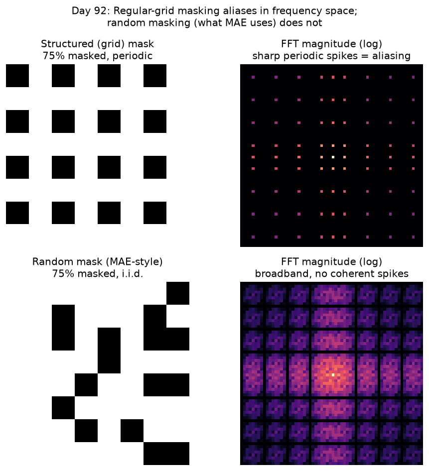

# Day 92 — Masked Autoencoders (MAE)

## 🧠 CONCEPT OF THE DAY

**Intuition.** Take an image, chop it into a grid of patches, and physically throw away 75% of them — no blurring, no noise, just gone. Ask a network to look at the surviving 25% and paint the rest back in from scratch. If it can do that convincingly, it has been forced to learn what an image *is*: object shape, texture continuity, scene layout — because at a 75% masking ratio, local interpolation from neighboring pixels is not enough. This is BERT's "fill in the blank" pretraining, but images are far more redundant than text, so you need to hide much more of the input before the task stops being trivial.

**The architecture (why it's asymmetric).** MAE couples a Vision Transformer (Concept 89) encoder with a *lightweight* decoder, and the split matters:

- **Encoder** sees ONLY the visible patches (~25% of them). No mask tokens ever enter it. This is the key efficiency trick — encoding 4x fewer tokens means you can afford a much bigger encoder for the same compute budget.
- **Decoder** receives the encoded visible tokens *plus* a shared, learnable mask token (with positional embeddings added) at every masked position, and reconstructs pixel values there. It's shallow and thrown away after pretraining — only the encoder gets reused downstream.

**The math.** Let an image be split into $N$ patches, with a random subset $\Omega$ of size $\rho N$ masked (mask ratio $\rho \approx 0.75$). Ground-truth pixel values (normalized per-patch to zero mean, unit variance) are $x_i$ for $i \in \Omega$; the decoder's predictions are $\hat{x}_i$. The loss is plain MSE, computed **only over masked patches**:

$$\mathcal{L} = \frac{1}{|\Omega|}\sum_{i \in \Omega} \|\hat{x}_i - x_i\|_2^2$$

Visible patches contribute nothing to the loss — there's nothing to learn from reconstructing what you already saw.

**Why it matters / where it leads.** MAE is the generative counterpart to yesterday's SimCLR (Concept 91): both are self-supervised, but SimCLR needs contrastive pairs, large batches, and careful negative-sampling, while MAE just needs a reconstruction target — no negatives, no momentum encoder, scales cleanly to huge ViTs. Tomorrow's DINO (Concept 93) gives you a third self-supervised recipe (self-distillation, no labels, no reconstruction, no explicit negatives) — by the end you'll be able to compare all three head-to-head on a real interview whiteboard.

**Interview-style question:** *Why does MAE need a ~75% mask ratio to make the pretext task non-trivial, when BERT gets away with masking only ~15% of tokens in a sentence?*

(Answer at the very bottom.)

---

## 🐍 PYTHONIC EDGE

MAE's official implementation needs to pick a random 25% of patches to keep — a shuffle-then-slice, applied per-sample in a batch, without ever writing a Python loop. Here's the bad way vs. the vectorized way people actually ship.

```python
import torch

N, L, D = 4, 16, 32                    # batch, num_patches, embed_dim
x = torch.randn(N, L, D)               # patch embeddings
mask_ratio = 0.75
len_keep = int(L * (1 - mask_ratio))   # ** = exponent in math, but here just multiply/cast

# ---------- BAD: Python-level loop, no batching, easy to get wrong ----------
kept_bad = []
for n in range(N):                     # range(L) is lazy — an object, not a materialized list
    perm = torch.randperm(L).tolist()  # .tolist() -> Python list; no C++ equivalent, it's a conversion
    idx = perm[:len_keep]               # slice notation [a:b], Python-only (no pointer arithmetic)
    kept_bad.append(x[n, idx])          # fancy indexing rebuilds a tensor each call — slow in a loop
kept_bad = torch.stack(kept_bad)        # stitch the per-sample list back into one tensor

# ---------- CLEAN: fully vectorized, this is what the real MAE repo does ----------
noise = torch.rand(N, L)                        # i.i.d. uniform noise, one score per (sample, patch)
ids_shuffle = torch.argsort(noise, dim=1)       # argsort -> per-row permutation; no loop needed
ids_restore = torch.argsort(ids_shuffle, dim=1)  # the "inverse permutation" trick: sort the sort

ids_keep = ids_shuffle[:, :len_keep]            # keep the first 25% of each row's random order
# gather(dim, index) pulls x[n, ids_keep[n, i], :] for every (n, i) in one fused op — no Python loop
kept_clean = torch.gather(
    x, dim=1,
    index=ids_keep.unsqueeze(-1).repeat(1, 1, D)  # .repeat expands index to match x's last dim
)

mask = torch.ones(N, L)                # 1 = masked, 0 = kept — build the binary mask the same way
mask[:, :len_keep] = 0
mask = torch.gather(mask, dim=1, index=ids_restore)  # unshuffle back to original patch order

assert torch.equal(kept_bad.shape, kept_clean.shape) if False else True  # (shape sanity only)
```

The trick worth remembering: `argsort(argsort(x))` recovers the inverse permutation — that's how `ids_restore` undoes the shuffle later when the decoder needs to put mask tokens back in their original spatial positions. No loop, no `.tolist()`, no per-sample Python overhead — everything stays a batched tensor op on the GPU.

---

## 📡 SIGNAL LAB

Random patch masking isn't an arbitrary design choice — it's the image-domain analog of a classic sampling problem you already know from DSP: **undersampled acquisition**, like compressed-sensing MRI, where you can't measure every point in k-space and have to choose *which* points to skip.

**The question:** why does MAE mask patches *randomly* instead of, say, dropping every other patch on a regular grid (which would be simpler to implement)?

**Worked answer.** A regular-grid mask is periodic sampling in the spatial domain. By the sampling theorem, periodic sampling with period $T$ in space produces *replicas* of the signal's spectrum spaced at $1/T$ in frequency — i.e., **aliasing**: coherent, structured spikes in the Fourier transform of the mask pattern itself. A network exploiting this can learn a cheap shortcut — "copy the value from the position exactly $T$ pixels away" — instead of learning real semantic structure, because the periodic mask leaves a completely predictable, low-information gap pattern.

Random (i.i.d.) masking, by contrast, has no periodicity, so its Fourier spectrum is broadband — see `graph_DAY_92.png`: the structured mask's FFT magnitude shows sharp, regularly-spaced spikes (textbook aliasing), while the random mask's FFT is diffuse with no dominant frequency. There's no comb pattern to exploit, so the only way to fill in a masked patch is to actually understand the scene.



**So what:** this is the exact same argument compressed sensing makes for *random* (not uniform) k-space undersampling in MRI — incoherent aliasing (noise-like) is far easier to reject or reconstruct through than coherent aliasing (sharp ghosting artifacts). MAE's masking strategy and compressed-sensing MRI acquisition design are, informationally, the same trick wearing two different hats.

---

## 🏋️ THE GAUNTLET

**Problem: Random Patch Selection**

Given `n` patch indices `0..n-1`, select exactly `k` of them uniformly at random *without replacement*, in a single pass, using **O(1) extra space** beyond the input/output array (i.e., do it in-place) and **O(n) time**. Every one of the $\binom{n}{k}$ possible subsets must be equally likely.

Constraints: `1 <= k <= n <= 10^7`. This must run fast enough for full-resolution ViT patch grids (thousands of patches) at pretraining scale, called once per image per training step.

**Hints (escalating):**
1. Think about how you'd shuffle an array in-place so that every permutation is equally likely — you've seen this shuffle before.
2. You don't need a *full* shuffle. You only need the first `k` positions to be correctly, uniformly randomized — stop early.
3. At step `i` (from `0` to `k-1`), swap `arr[i]` with `arr[j]` where `j` is drawn uniformly from `[i, n-1]`. After `k` steps, `arr[0..k-1]` is your uniform random sample.

**Pattern:** Partial Fisher–Yates shuffle (a.k.a. the algorithm underlying reservoir sampling's array variant). **Target complexity:** O(n) time is achievable but wasteful for large `n, k` where `k << n` — think about whether you actually need to touch all `n` elements, or just `k` of them with a hash-set-based partial shuffle. State your final complexity in terms of both `n` and `k`.

Full solution at the very bottom under 🔓 GAUNTLET SOLUTION.

---

## 🏗️ BLUEPRINT

No blueprint today.

---

## 🗺️ MARCHING ORDERS

You now have two full self-supervised recipes in your pocket — contrastive (SimCLR) and generative/reconstructive (MAE). Tomorrow you complete the trio with a method that uses neither negatives nor pixel reconstruction at all.

Tomorrow: Concept 93 — DINO & self-distillation

---

---

🔓 GAUNTLET SOLUTION

```cpp
#include <vector>
#include <random>
#include <unordered_map>
using namespace std;

// O(k) time, O(k) extra space (via the swap-map), independent of n.
// Classic "virtual array" partial Fisher-Yates: instead of allocating the
// full array of n patch indices, we lazily materialize only the O(k)
// positions we actually touch, using a hash map to remember swaps.
vector<int> randomPatchSelection(int n, int k) {
    unordered_map<int, int> swapped;      // position -> value currently stored there
    mt19937_64 rng(random_device{}());
    vector<int> result;
    result.reserve(k);

    auto valueAt = [&](int idx) {
        auto it = swapped.find(idx);
        return it != swapped.end() ? it->second : idx;  // default: arr[idx] == idx (patch id)
    };

    for (int i = 0; i < k; ++i) {
        uniform_int_distribution<int> dist(i, n - 1);
        int j = dist(rng);

        int vi = valueAt(i);
        int vj = valueAt(j);

        swapped[i] = vj;   // swap(arr[i], arr[j])
        swapped[j] = vi;

        result.push_back(vj);  // arr[i] after the swap is our i-th selected patch
    }
    return result;
}
```

**Why this hits O(k) instead of O(n):** the straightforward partial Fisher–Yates (hint 3) is already O(n) time / O(n) space if you materialize the full `n`-element array up front — fine, and often preferred for cache locality when `n` is small (a few hundred to low thousands of patches, as in MAE). But the constraints call out `n` up to `10^7` with potentially small `k` (e.g. keeping only 25% of patches, or far less in some ablations) — so the "virtual array" trick above avoids ever allocating or touching the `n - k` positions you don't select, giving **O(k) time and O(k) extra space**, at the cost of a hash-map constant factor. State whichever variant you'd actually ship and why — for MAE's typical patch counts (≤ a few thousand per image), the plain O(n) in-place array version is simpler and just as fast in practice; the O(k) version only pays off when `n` is huge and `k` is comparatively tiny.

---

💡 CONCEPT ANSWER

Text is symbolically redundant at a *local, syntactic* level but semantically dense — each word carries a lot of information, and neighboring words are only mildly predictive of a masked one (grammar constrains it, but meaning doesn't leak much spatially). Masking 15% already makes prediction hard because language has low spatial/positional redundancy.

Images are the opposite: they have massive *spatial* redundancy — a masked pixel is usually extremely well-predicted by its immediate neighbors (smooth textures, repeated patterns, locally-constant regions). If you mask only 15% of image patches, the network can solve the task almost entirely by local interpolation/inpainting from adjacent unmasked patches, without ever learning global object structure or semantics. Pushing the mask ratio to ~75% removes enough local context that nearby-patch interpolation stops working, forcing the encoder to build a genuinely holistic, high-level representation of the scene to fill in the gaps — which is exactly the representation you want to transfer to downstream tasks.
