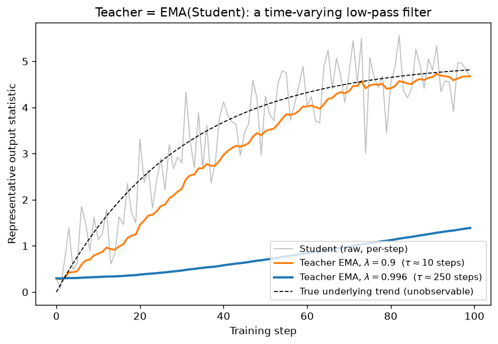

# Day 93 — Concept 93: DINO & Self-Distillation

## 🧠 CONCEPT OF THE DAY

**Intuition.** Take a novice musician (the *student*) and a mentor (the *teacher*) — except the mentor isn't a separate, more-experienced person. The mentor is literally *the same musician's own playing, smoothed over the last few months*. The student practices on a hard, cropped, distorted version of a piece; the mentor "performs" a cleaner, easier version of the same piece; the student is graded on how well their attempt matches the mentor's. There are no ground-truth labels anywhere — the mentor exists purely as a stabilized, higher-confidence echo of the student's own recent progress. That's DINO: **self-DIstillation with NO labels**.

Concretely: two networks with the *same architecture* — a student $g_{\theta_s}$ and a teacher $g_{\theta_t}$. Both see different augmented "views" of the same image (DINO's multi-crop: 2 large **global** crops + several small **local** crops). The teacher only ever sees global crops; the student sees everything. The student is trained to predict the teacher's output distribution for views it *didn't* see the global context of — forcing it to learn representations invariant to viewpoint/scale, purely from matching itself.

**The math.** The teacher is never trained by gradient descent — its weights are an exponential moving average (EMA) of the student's:

$$\theta_t \leftarrow \lambda\,\theta_t + (1-\lambda)\,\theta_s$$

where $\lambda \in [0.996, 1)$ is the teacher momentum (scheduled toward 1 over training). Both networks' outputs are converted to probability distributions over $K$ prototypes with temperature-scaled softmax:

$$P_t(x) = \text{softmax}\!\left(\frac{g_{\theta_t}(x) - c}{\tau_t}\right), \qquad P_s(x) = \text{softmax}\!\left(\frac{g_{\theta_s}(x)}{\tau_s}\right)$$

Here $c$ is a running **center** (EMA of teacher outputs across the batch) and $\tau_t < \tau_s$ makes the teacher's distribution *sharper* (more confident/peaked) than the student's. Training minimizes cross-entropy between teacher and student outputs on all *non-matching* view pairs, with **stop-gradient** on the teacher branch:

$$\mathcal{L} = \sum_{x \in \{v_1, v_2\}} \sum_{x' \in V,\, x' \neq x} H\big(P_t(x),\, P_s(x')\big), \qquad H(a, b) = -a \log b$$

Only the student is updated by backprop; the teacher only ever moves via the EMA rule above.

**Why it matters / where it leads.** No negative pairs, no contrastive loss, no labels — yet DINO's ViT student spontaneously learns attention maps that segment foreground objects, entirely unsupervised. This is the same "stabilized target for an otherwise noisy training signal" idea you'll see again: EMA teachers show up in target networks for RL (Concept 105–107), in diffusion model EMA-averaged weights for sampling (Concept 84), and in BYOL/SimSiam-style non-contrastive self-supervision. The real interview question underneath DINO is about **collapse**: with no negatives, what stops both networks from just learning to output the same constant vector for every input?

**Interview-style question:** *In DINO there are no negative pairs and no contrastive loss. What two mechanisms specifically prevent the trivial collapse where the network outputs an identical constant vector for every image, and why doesn't the EMA teacher alone solve this?*

(Answer at the very bottom.)

---

## 🐍 PYTHONIC EDGE

The EMA teacher update looks trivial but is a classic place to introduce silent bugs — breaking the teacher's parameter storage, or accidentally tracking gradients through it.

```python
# ---------- BAD ----------
def update_teacher_bad(student, teacher, m):
    for ps, pt in zip(student.parameters(), teacher.parameters()):  # zip() pairs two iterables elementwise — no direct C++ stdlib equivalent (you'd hand-write an index loop)
        pt.data = m * pt.data + (1 - m) * ps.data
        # BUG: '=' rebinds pt.data to a brand-new Tensor object.
        # Any optimizer/hook holding a reference to the OLD storage is now stale.
        # This also silently runs with autograd machinery half-engaged since
        # we never wrapped it in a no-grad context.
```

```python
# ---------- CLEAN ----------
class EMA:                                        # single-inheritance-by-default class; C++: class EMA { ... };  (no ': public Base' needed if no parent)
    def __init__(self, teacher: nn.Module, momentum: float):   # constructor; 'self' is C++'s 'this' but explicit in every method signature
        self.teacher = teacher                    # instance attribute via self.x = ...; C++ requires declaring the member in the header first
        self.m = momentum

    @torch.no_grad()                              # decorator; disables autograd tracking for the whole call — no C++ equivalent (closest: a scoped RAII guard, but declarative here)
    def __call__(self, student: nn.Module) -> None:   # __call__ makes EMA(...) instances directly callable, e.g. `update(student)`
        for pt, ps in zip(self.teacher.parameters(), student.parameters()):
            pt.lerp_(ps, 1 - self.m)              # in-place linear interpolation; trailing '_' = in-place op convention (mutates pt's existing storage, no C++ naming analogue)


update_teacher = EMA(teacher, momentum=0.996)
update_teacher(student)   # invokes __call__, NOT some method named forward()/update() by convention
```

Two things worth flagging explicitly since they trip people up coming from C++:
- `pt.lerp_(ps, 1 - self.m)` fuses `pt = pt*self.m + ps*(1-self.m)` into one in-place kernel — prefer it over writing out the arithmetic with `.mul_()`/`.add_()`, which allocates an intermediate.
- `EMA.__call__` is a plain dunder method you defined; it has *nothing* to do with `nn.Module.__call__`, which is the mechanism that makes `teacher(x)` correctly invoke `teacher.forward(x)` *plus* run all registered forward/backward hooks. Never call `.forward()` directly on an `nn.Module` for this reason — always call the module instance itself.

---

## 📡 SIGNAL LAB

Look again at the EMA update: $y[n] = \lambda\, y[n-1] + (1-\lambda)\, x[n]$. That is *exactly* a first-order IIR low-pass filter, with transfer function

$$H(z) = \frac{1-\lambda}{1-\lambda z^{-1}}$$

DC gain $H(1) = 1$, so the teacher tracks the student's long-run average exactly — the question is which frequencies of the student's trajectory it lets through. Solving $|H(e^{j\omega_c})|^2 = \tfrac{1}{2}$ for small $1-\lambda$ gives the standard approximation:

$$\omega_c \approx (1-\lambda) \ \text{rad/step}, \qquad \tau = \frac{1}{1-\lambda} \ \text{steps (time constant)}$$

Plug in DINO's typical teacher momentum $\lambda = 0.996$: $\tau = 1/(1-0.996) = 250$ steps. The teacher is a low-pass filter with a ~250-step time constant — it only "sees" drift in the student's representations that's slower than that, and it filters out anything jittering faster (per-step SGD noise, single-batch outliers). The plot below simulates a noisy student signal (slow true trend + high-frequency noise) filtered by $\lambda=0.9$ ($\tau\approx10$) versus $\lambda=0.996$ ($\tau\approx250$):



**So what:** this reframes DINO's momentum schedule (ramping $\lambda$ from 0.996 toward 1 over training) as literally *narrowing a filter's passband over time* — wide passband early, when the student is changing fast and you want the teacher to keep up; near-zero passband late, when the student has mostly converged and you want maximum smoothing for a stable target. Pick $\lambda$ too low and $\tau$ collapses toward 1 step — the teacher is nearly the student itself, so self-distillation degenerates into training against your own instantaneous noise (collapse risk goes up). Pick $\lambda$ too high and $\tau$ blows up — the teacher lags so far behind that its targets are stale relative to genuine representation improvement. It's the exact same bandwidth-tradeoff you already reason about choosing an STFT window length or a Wiener-filter smoothing constant: too narrow a passband loses real signal, too wide lets noise through as if it were signal.

---

## 🏋️ THE GAUNTLET

**Sliding Window Median**

Given an integer array `nums` and a window size `k`, return the median of each contiguous window of size `k` as it slides from the start of the array to the end (one median per window position, `n - k + 1` medians total). If `k` is even, the median is the average of the two middle elements.

**Constraints:** $1 \le k \le n \le 10^5$, $-2^{31} \le \texttt{nums[i]} \le 2^{31}-1$ (duplicates allowed). Target: don't re-sort the window at every step.

**Hints (escalating):**
1. Re-sorting or even re-inserting into a sorted array on every slide costs $O(k)$ per step in the best case and $O(n \cdot k \log k)$ overall for $n$ slides — too slow at $n=10^5$. You need a structure that supports insert, delete, and "get the $k/2$-th smallest" all in $O(\log k)$.
2. A single balanced BST that allows duplicates (`std::multiset`) gets you $O(\log k)$ insert/erase — but multisets don't support random access. The trick is to *also* maintain an iterator pointing at the current median position, and move it incrementally as elements enter/leave, rather than recomputing its position from scratch each time.
3. When you insert the new incoming element, compare it against the current median value first to decide whether the median iterator needs to shift left; when you're about to erase the outgoing element, check it against the median value *before* erasing to decide whether the iterator needs to shift right. Get the order of "compare, then shift, then erase" wrong and you'll dereference an invalidated iterator.

**Pattern:** sliding window + order-statistics maintenance via a balanced multiset with an incrementally-tracked median iterator. **Target complexity:** $O(n \log k)$ time, $O(k)$ space.

---

## 🏗️ BLUEPRINT

DINO's multi-crop augmentation (2 global @ 224px + 6–8 local @ 96px crops **per image**) means one image in your dataloader fans out into 8–10 forward passes before a single optimizer step. Your effective training-time compute scales with *crop count*, not with the batch size you configured — budget GPU memory and dataloader throughput off `batch_size × crops_per_image`, not `batch_size` alone, or you'll under-provision by close to an order of magnitude when you port a contrastive-style training config over to a multi-crop self-distillation setup.

---

## 🗺️ MARCHING ORDERS

Self-supervision without labels is the closest ML gets to "figure out the invariances yourself" — internalize the collapse-prevention mechanics today, they're the same knobs you'll be turning in your own frequency-domain generative work.

Tomorrow: Concept 94 — U-Net & skip connections

---

🔓 GAUNTLET SOLUTION

```cpp
#include <bits/stdc++.h>
using namespace std;

class Solution {
public:
    vector<double> medianSlidingWindow(vector<int>& nums, int k) {
        multiset<int> window(nums.begin(), nums.begin() + k);
        auto mid = next(window.begin(), k / 2);
        vector<double> medians;

        for (int i = k;; i++) {
            // k odd  -> k % 2 - 1 == 0  -> next(mid, 0)      == mid          -> median = *mid
            // k even -> k % 2 - 1 == -1 -> next(mid, -1)     == prev(mid)    -> median = avg of the two middle elements
            medians.push_back((double(*mid) + *next(mid, k % 2 - 1)) / 2.0);

            if (i == (int)nums.size()) return medians;

            // Insert the incoming element, then fix up the median iterator.
            window.insert(nums[i]);
            if (nums[i] < *mid) mid--;

            // Erase the outgoing element, fixing the iterator BEFORE erasing.
            if (nums[i - k] <= *mid) mid++;
            window.erase(window.lower_bound(nums[i - k]));
        }
    }
};
```

Trace check on `nums = [1,3,-1,-3,5,3,6,7], k=3` gives medians `[1, -1, -1, 3, 5, 6]`.

💡 CONCEPT ANSWER

Two mechanisms jointly prevent collapse, and they push in *opposite* directions: **centering** (subtracting a running mean $c$ of teacher outputs before the softmax) pulls the teacher's distribution toward *uniform*, stopping any single prototype dimension from dominating and the network from collapsing to one constant "winning" output. **Sharpening** (a low teacher temperature $\tau_t < \tau_s$) pulls the distribution *away* from uniform, forcing it to stay peaked/confident rather than collapsing to the trivial uniform-everywhere solution. Centering alone collapses to uniform; sharpening alone collapses to a constant one-hot — together they cancel out both failure modes.

The EMA teacher alone does not solve this because momentum only controls the *rate* at which the teacher chases the student — it puts no constraint on *where* they can jointly converge. Both networks can still slowly co-adapt toward the trivial constant-output solution over hundreds of steps; EMA just slows that drift down, it doesn't remove the incentive gradient descent has to find it.
