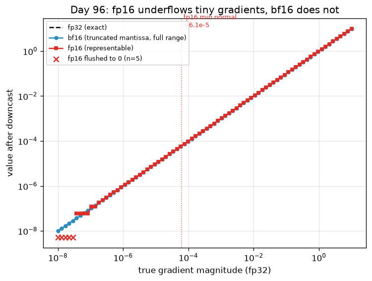

# Day 96 — Mixed Precision (fp16/bf16)

## 🧠 CONCEPT OF THE DAY

**Intuition.** Full fp32 training is like doing every measurement in a woodshop with a micrometer — technically more accurate, but you pay for that precision on *every single cut*, even the rough ones where it's wasted. Most of a network's arithmetic (the huge matmuls and convolutions inside forward/backward) doesn't need 23 mantissa bits to converge; it needs to be *fast*. Mixed precision training runs the bulk of the compute in a 16-bit format — where modern GPU tensor cores are 2–8× faster and memory traffic is halved — while quietly keeping the parts that are precision-sensitive (the master weights, loss accumulation, big reductions) in fp32. You get the speed of 16-bit and (almost) the numerical safety of 32-bit, because you never actually let precision-critical numbers live in 16-bit permanently.

There are two different 16-bit formats, and the choice between them is really a choice about *where* you want to be fragile:

| format | sign | exponent | mantissa | dynamic range | precision |
|---|---|---|---|---|---|
| fp32 | 1 | 8 | 23 | ~1e-38 to 3e38 | ~7 decimal digits |
| fp16 | 1 | 5 | 10 | ~6e-5 to 65504 | ~3–4 decimal digits |
| bf16 | 1 | 8 | 7 | ~1e-38 to 3e38 (same as fp32) | ~2–3 decimal digits |

fp16 spends its bits on **precision** (10 mantissa bits) but starves the **exponent** (5 bits) — its range is so narrow that gradients deep in a real network, which routinely sit in the 1e-6 to 1e-8 range, silently **underflow to exact zero**. bf16 makes the opposite trade: it keeps fp32's full 8-bit exponent (same range, so nothing underflows) and sacrifices mantissa bits instead — you lose precision, but you never lose a gradient's *existence*, only some of its accuracy.

That underflow problem is exactly what **loss scaling** exists to fix for fp16. Multiply the loss by a large scalar $S$ before backprop so gradients get shifted up into fp16's representable range, then divide back out before the optimizer step:

$$L_{\text{scaled}} = S \cdot L \quad\Longrightarrow\quad g_{\text{scaled}} = S \cdot \nabla_\theta L \quad\Longrightarrow\quad g = \frac{g_{\text{scaled}}}{S}$$

Dynamic loss scaling automates the choice of $S$: start large, and if any gradient overflows to `inf`/`nan` in a step, halve $S$ and **skip that optimizer step entirely** (don't apply corrupted gradients); if $N$ consecutive steps are clean, double $S$ and try for more headroom. bf16 needs none of this — its exponent range already matches fp32's, so there's nothing to scale.

The plot below simulates a realistic spread of gradient magnitudes (1e-8 to 10) and downcasts each one to fp16 and bf16. Watch what happens below fp16's minimum normal value (~6.1e-5): fp16 hard-flushes to zero, bf16 just gets noisier.



**Why it matters / where it leads.** This is the first lesson in Phase 10 — training and serving *efficiency* — because mixed precision is usually the single highest-ROI change you can make to a training run: near-free 1.5–3× speedup and ~40% memory savings, if you get the numerics right. It sets up tomorrow's concept (gradient accumulation & checkpointing) directly: once you're not memory-bound on activations because of fp16/bf16 storage, the next lever is trading recomputation for even more memory headroom. It's also one of the most common "have you actually trained something at scale" interview filters, because the failure modes are subtle and every practitioner who's shipped a real training run has a NaN-loss war story.

**Interview question:** *You port a model from fp32 to fp16 mixed-precision training (with loss scaling). Training runs fine for a few hundred steps, then the loss goes to NaN — but only in fp16, never in the fp32 baseline. Walk me through how you'd isolate whether the bug is in your loss-scaling logic, a genuinely unstable operation (e.g. an exp() or a norm), or gradient explosion that fp32 was silently tolerating.*

---

## 🐍 PYTHONIC EDGE

`torch.cuda.amp` (now generalized as `torch.autocast` + `torch.amp.GradScaler`) is the idiomatic way to do this — hand-rolling `.half()` everywhere is the "bad way" almost every mixed-precision bug report traces back to.

```python
import torch

# ---- the bad way: cast the whole model in place, no master fp32 copy, no loss scaling ----
model = MyModel().cuda().half()             # .half() returns self after mutating params in place, like .cuda() -- chainable
opt = torch.optim.Adam(model.parameters(), lr=1e-3)
for x, y in loader:                          # for ... in over a DataLoader -- it's an iterator, no index bookkeeping like C++'s ++it
    x, y = x.cuda().half(), y.cuda()         # tuple unpacking: two names bound in one line, no std::tie needed
    out = model(x)                           # calling model(x) invokes Module.__call__, NOT .forward() directly --
                                              # __call__ wraps forward() with registered hooks; calling .forward() skips them
    loss = loss_fn(out, y)
    loss.backward()                          # grads accumulate in fp16 tensors -- tiny grads underflow to 0.0 silently, no warning raised
    opt.step()
    opt.zero_grad()

# ---- the clean way: autocast casts activations on the fly; weights + optimizer state stay fp32 ----
model = MyModel().cuda()                     # no .half() here -- params stay fp32, autocast handles the downcast per-op
opt = torch.optim.Adam(model.parameters(), lr=1e-3)
scaler = torch.amp.GradScaler("cuda")        # a small state machine (current scale factor S, overflow streak) -- not a tensor, not a module

for x, y in loader:
    x, y = x.cuda(), y.cuda()
    with torch.autocast(device_type="cuda", dtype=torch.bfloat16):   # `with` = context manager: __enter__ runs before the block,
                                                                       # __exit__ always runs after (even on exception) -- no manual try/finally
        out = model(x)                       # matmuls/convs run in bf16 inside this block; softmax/reductions auto-promote to fp32
        loss = loss_fn(out, y)
    scaler.scale(loss).backward()            # multiplies loss by S before backward() -- shifts small grads out of the underflow zone
    scaler.step(opt)                         # unscales grads by S, then calls opt.step() -- but SKIPS it this iteration if an inf/nan is found
    scaler.update()                          # adjusts S for next iteration (grow on N clean steps, shrink on overflow) -- returns None, called only for its side effect
    opt.zero_grad()
```

Note `scaler` is only needed for **fp16** (narrow range → real underflow risk to guard against); for **bf16** the `autocast` block alone is usually enough since there's no exponent-range problem to compensate for — one more reason bf16 has become the default on hardware that supports it (A100+).

---

## 📡 SIGNAL LAB

Mantissa truncation *is* quantization noise — the same phenomenon as an ADC digitizing a continuous signal, just with a floating (not fixed) step size. The classic result from quantization theory: for a uniform $N$-bit quantizer, the signal-to-quantization-noise ratio is

$$\text{SQNR}_{\text{dB}} \approx 6.02N + 1.76$$

Apply it *locally, within one exponent octave* to a floating-point mantissa (the formula is exact there, since within one octave a float behaves like a fixed-point number): fp16's 10 mantissa bits give $6.02(10) + 1.76 \approx 61.9$ dB of local dynamic range per octave; bf16's 7 bits give $6.02(7) + 1.76 \approx 43.9$ dB — **18 dB worse**, roughly an 8× larger quantization noise floor relative to the signal, *within any single octave*.

**Worked example, tied to your lane:** suppose you're not training but doing *inference-time spectral analysis* — say, computing an FFT-based artifact detector over a generated image's magnitude spectrum, and someone suggests running it under bf16 autocast "for speed." For the coarse business of computing gradients, an 8× noise floor increase is invisible — SGD is already noisy, and 44 dB of headroom is still enormous relative to a single update step. But if you're trying to detect the *faint, characteristic high-frequency grid artifacts* that diffusion/GAN upsampling leaves in a power spectral density (the kind of forensic signature your research lane cares about, often tens of dB below the dominant spectral content) — an 18 dB noise floor hit from bf16 rounding can be the difference between a detectable spectral peak and one buried in quantization noise. **So what:** the "mixed precision is free speed" intuition holds for training gradients, which only need to point in roughly the right direction, but breaks down for downstream numerical analysis of small, precise quantities — always run precision-sensitive spectral/statistical diagnostics in fp32, even if the model that produced the tensor was trained or served in bf16.

---

## 🏋️ THE GAUNTLET

**Round bf16 (Round-to-Nearest-Even), no float ops allowed**

You're given `n` 32-bit unsigned integers, each the raw bit pattern of an IEEE-754 `binary32` (fp32) value. Implement:

```cpp
uint16_t float32_bits_to_bf16(uint32_t bits);
```

returning the raw 16-bit pattern of the **round-to-nearest-even** bfloat16 conversion (this is what every real ML framework does — naive truncation, like the graph script above uses for illustration, introduces systematic downward bias).

Constraints:
- `1 <= n <= 10^6` values to convert; your per-value routine must be `O(1)` time, `O(1)` extra space.
- **No** floating-point arithmetic or standard-library float-conversion calls — bit operations on the `uint32_t` only.
- A `NaN` input (exponent all 1s, mantissa ≠ 0) must **never** round to `Inf` in the output — this is the bug that naive "just add and truncate" solutions hit.
- Rounding must correctly propagate a carry into the exponent when the mantissa rounds up past its max value (e.g. `0x7FFFFF` region) — don't special-case this separately from the general rounding step.

**Hints (escalating):**
1. Round-to-nearest-even is decided by three things about the 16 bits you're about to drop: the top dropped bit (the "round" bit, bit 16), whether *any* lower bit is set (the "sticky" bit), and the LSB of the bits you're keeping (bit 16 of the *kept* mantissa) — this is the classic guard/round/sticky logic hardware rounders use.
2. There's a one-line trick that computes all of that for you: `bias = 0x7FFF + ((bits >> 16) & 1)`, then `rounded = bits + bias`, then keep the top 16 bits of `rounded`. Convince yourself this reproduces round-half-to-even without ever branching on the sticky bit explicitly. But you must detect and special-case NaN *before* this step — why can naive rounding turn a NaN into `Inf` otherwise?
3. Mantissa-overflow-into-exponent (when rounding pushes the mantissa past its max) is handled *for free* by the add-then-truncate trick, because integer addition naturally ripple-carries into the exponent bits above it. The only genuinely separate branch you need is the NaN guard.

**Pattern:** bit manipulation / IEEE-754 rounding. **Target complexity:** O(n) total, O(1) per element.

---

## 🏗️ BLUEPRINT

No blueprint today.

---

## 🗺️ MARCHING ORDERS

Go find one real training script you've written (or a public repo you trust) and check: is it actually using `autocast` + `GradScaler`/bf16, or just quietly eating the fp32 tax? Free speed is easy to leave on the table.

**Tomorrow: Concept 97 — Gradient accumulation & checkpointing**

---

## 🔓 GAUNTLET SOLUTION

```cpp
#include <cstdint>

uint16_t float32_bits_to_bf16(uint32_t bits) {
    uint32_t exponent = (bits >> 23) & 0xFF;
    uint32_t mantissa = bits & 0x7FFFFF;

    // NaN: exponent all 1s and mantissa != 0 -- must stay NaN, never let rounding carry it into Inf.
    if (exponent == 0xFF && mantissa != 0) {
        // Keep sign + exponent, force mantissa nonzero (set the quiet-NaN bit) so it can't collapse to Inf.
        return static_cast<uint16_t>((bits >> 16) | 0x0040);
    }

    // Round-to-nearest-even via the "add half, plus one if odd, then truncate" trick:
    // - 0x7FFF is exactly half of the 16 bits we're about to drop (the round bit set, sticky bits ambiguous halfway case)
    // - + ((bits >> 16) & 1) adds one more when the kept LSB is odd, which pushes exact ties up to make it *even* --
    //   this reproduces round-half-to-even without a separate branch.
    uint32_t rounding_bias = 0x7FFFu + ((bits >> 16) & 1u);
    uint32_t rounded = bits + rounding_bias;   // carries into the exponent automatically if the mantissa overflows past max

    return static_cast<uint16_t>(rounded >> 16);
}
```

Why the bias trick works: within the low 16 bits, values `0x0000`–`0x7FFF` are "round down" (adding the bias doesn't carry into bit 16), and `0x8001`–`0xFFFF` are "round up" (adding the bias does carry). The exact-tie case `0x8000` is where "to even" matters: it only carries when the kept LSB (bit 16) is already `1` — because then `+1` from the `& 1` term pushes `0x8000` to `0x10000`before the base `0x7FFF` is even considered — landing on the even neighbor either way. Trace through both LSB=0 and LSB=1 with `bits & 0xFFFF == 0x8000` by hand once; it's the fastest way to actually trust it.

---

## 💡 CONCEPT ANSWER

Isolate in this order, cheapest checks first:

1. **Check if the scaler is actually skipping steps.** `GradScaler` exposes `scaler.get_scale()` — log it every step. If the scale is repeatedly collapsing toward 1.0 (or you see `scaler._get_scale_async()` / a skipped-step counter climbing) right before the NaN, that's loss-scaling *working as designed* on genuinely huge gradients — meaning the real problem is upstream instability, not the scaler.
2. **Bisect by re-running the exact same batch that produced the NaN in fp32.** If fp32 also diverges (just later, or with a huge-but-finite loss instead of NaN), it's not a precision bug at all — it's real gradient explosion that fp32's wider range was just quietly absorbing without ever technically overflowing. Fix: gradient clipping, lower LR, or find the unstable op (question ties directly back to concept 21 — exploding gradients & clipping).
3. **If fp32 stays stable on that batch and only fp16 breaks, hunt for a specific op**, not a general precision issue: run the forward pass with `torch.autograd.detect_anomaly()` and/or wrap suspect ops (softmax over large logits, `exp()`, division by a norm that can be near-zero, `LayerNorm` variance) in `with torch.autocast(enabled=False):` blocks to force them back to fp32. These are the textbook fp16-unsafe ops — they either overflow fp16's ~65504 max or divide by something that underflowed to exact zero upstream. If moving one of these ops back to fp32 fixes it, you've found your culprit and you now also know *why* mixed-precision frameworks auto-promote reductions/softmax/norm layers to fp32 by default.
