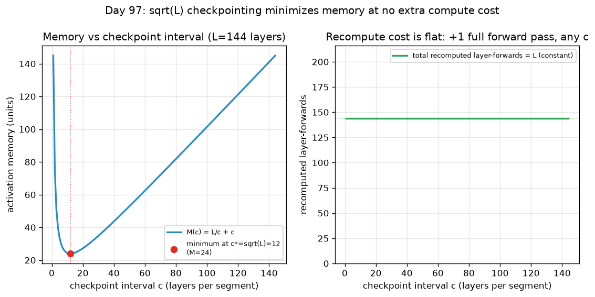

# Day 97 — Gradient Accumulation & Checkpointing

## 🧠 CONCEPT OF THE DAY

**Intuition.** These are two completely different tricks that get bundled together because they solve the same complaint — "my model doesn't fit" — from opposite ends.

*Gradient accumulation* is a **time** trick: your GPU can only hold `b` samples at once, but you want the statistical quality of a bigger batch `B`. So you run `k = B/b` forward-backward passes on small "micro-batches," summing (not applying) their gradients each time, and only call `optimizer.step()` once every `k` micro-batches. It's like paying off a purchase you can't afford in one paycheck — you set aside a fraction each cycle and only "spend" (update the weights) once you've accumulated the full amount. No information is lost; you're just spreading one big update over several passes in *time* instead of doing it in one pass over *space*.

*Gradient checkpointing* (activation checkpointing) is a **memory-for-compute** trick, and it's solving a different problem entirely: even a single forward pass through a deep network needs to keep every intermediate activation alive in memory, because backprop needs them later for the chain rule. Checkpointing throws most of them away on purpose and **recomputes** them from the nearest saved checkpoint when backward actually needs them — like not photographing every step of a hike, just a few landmarks, and re-walking a short stretch from the last landmark if someone asks "what did the trail look like at mile 4.3?"

**The math.** For accumulation, standard SGD on a batch of size $B$ takes one step:

$$\theta \leftarrow \theta - \eta \cdot \nabla_\theta \mathcal{L}(\text{batch}_B)$$

With $k$ micro-batches of size $b$ (so $B = kb$), because the batch loss is a mean, the true batch gradient is exactly the average of the micro-batch gradients:

$$\nabla_\theta \mathcal{L}(\text{batch}_B) = \frac{1}{k}\sum_{i=1}^{k} \nabla_\theta \mathcal{L}_i(\text{micro-batch}_i)$$

so you accumulate `loss_i / k` into `.grad` for `k` steps, then take exactly one optimizer step. Mathematically exact — *if* every op in the network only depends on individual samples. (Hold that caveat; it's the whole interview question below.)

For checkpointing, say a network has $L$ sequential layers. Naive backprop needs $O(L)$ memory (every activation, held until its layer's backward pass runs). If you checkpoint every $c$ layers and recompute the $c$ layers between checkpoints on demand during backward, total memory is checkpoints-stored plus one segment recomputed at a time:

$$M(c) = \frac{L}{c} + c$$

Minimizing over $c$ (take $dM/dc = -L/c^2 + 1 = 0$) gives the classic result:

$$c^\star = \sqrt{L} \quad\Longrightarrow\quad M(c^\star) = 2\sqrt{L}$$

— memory drops from linear to *square-root* in depth, for a fixed, checkpoint-count-independent compute cost: exactly one extra full forward pass total (each layer gets recomputed exactly once, no matter how you carve up $c$). That's the "~30% slower, ~90% less activation memory" number you've probably heard quoted for large transformer training.



**Why it matters / where it leads.** Yesterday's mixed precision cut memory per-activation; today's two tricks cut memory per-*batch* and per-*layer* respectively — together they're the standard toolkit for fitting a model that "shouldn't" fit on your hardware, and every one of them is a pure engineering lever with zero change to the math your model is learning (accumulation is exact; checkpointing recomputes exact values, not approximations). Tomorrow we go one level up the stack: once a single device is squeezed as far as it goes, the next lever is spreading the *model itself* across multiple devices — data, model, and pipeline parallelism.

**Interview question:** *You switch a fine-tuning run from a single big batch (B=512, fits in memory) to gradient accumulation (16 micro-batches of 32, same effective B=512) to fit a bigger model on the same GPU. Two weeks later the accumulated-gradient run's fine-tuned checkpoint measurably underperforms the original, even though you divided the loss by 16 correctly and the accumulated gradient is mathematically the mean of the micro-batch gradients. What's the most likely bug class, and how do you confirm it?*

---

## 🐍 PYTHONIC EDGE

`torch.utils.checkpoint.checkpoint` is the idiomatic way to trade recompute for memory — manually caching-and-clearing tensors yourself is the "bad way," and it's fragile because you have to get the exact recompute order right by hand.

```python
import torch
from torch.utils.checkpoint import checkpoint

# ---- the bad way: run every block eagerly, all activations stay alive until backward ----
class DeepStack(torch.nn.Module):
    def __init__(self, blocks):                 # constructor -- self is explicit, unlike C++'s implicit `this`
        super().__init__()                       # parent ctor call -- C++ uses an initialiser list instead
        self.blocks = torch.nn.ModuleList(blocks)  # ModuleList registers children for .parameters()/.to() to find

    def forward(self, x):
        for block in self.blocks:                # iterating a ModuleList -- it's iterable, no manual index/++it
            x = block(x)                         # calling block(x) invokes __call__, NOT block.forward(x) directly --
                                                  # __call__ runs forward() plus any registered hooks
        return x

model = DeepStack([torch.nn.Linear(512, 512) for _ in range(24)])  # list comprehension -- no C++ equivalent, builds
                                                                     # the whole list inline instead of a manual loop
out = model(x)                                   # every one of the 24 intermediate activations is kept alive here

# ---- the clean way: checkpoint each block; only inputs/outputs at segment boundaries are kept ----
class CheckpointedStack(torch.nn.Module):
    def __init__(self, blocks, segment=4):       # segment = c, the checkpoint interval from the math above
        super().__init__()
        self.blocks = torch.nn.ModuleList(blocks)
        self.segment = segment

    def forward(self, x):
        for i in range(0, len(self.blocks), self.segment):   # range() with a step -- an iterator object, not a materialized list
            segment_blocks = self.blocks[i:i + self.segment]  # slice notation [a:b] -- no direct C++ container equivalent

            def run_segment(x, blocks=segment_blocks):        # nested function = a closure; default arg captures
                for block in blocks:                          # `blocks` by value at definition time (avoids the classic
                    x = block(x)                               # late-binding-closure bug if you'd instead captured `segment_blocks`)
                return x

            x = checkpoint(run_segment, x, use_reentrant=False)  # *args after the fn: checkpoint(fn, *inputs) --
                                                                   # fn's forward runs normally, but its activations are
                                                                   # freed immediately; backward re-invokes fn to rebuild them
        return x

out = model(x)  # peak memory now scales with `segment`, not with total depth 24
```

`use_reentrant=False` is worth flagging by name in an interview: the older reentrant implementation abuses a second, nested autograd pass and has sharp edges (breaks with certain `.grad`-requiring inputs, RNG state); the newer non-reentrant path is what PyTorch now recommends by default.

---

## 📡 SIGNAL LAB

Gradient accumulation's exactness rests on one property: the operation being split is **linear** — a sum of independent contributions. That's precisely the assumption behind **block/partitioned convolution**, which every real-time audio and large-kernel image system relies on: you can't run a 4096-tap FIR filter as one giant buffer operation, so you chop the input into blocks and use **overlap-add (OLA)** — and if you do the bookkeeping right, the block-processed output is *bit-for-bit* the same as convolving the whole signal at once, for the same reason 16 accumulated micro-batch gradients equal one 512-batch gradient: convolution and the mean gradient are both linear operators, and linear operators commute with partitioning.

**Worked example.** Let $x = [1, 2, 3, 4, 5, 6, 7, 8]$ and filter $h = [1, 0, -1]$ (a simple discrete derivative). Direct convolution gives length $8+3-1=10$:

$$y = x * h = [1,\ 2,\ 2,\ 2,\ 2,\ 2,\ 2,\ 2,\ -7,\ -8]$$

Now split $x$ into two blocks of 4, $x_1=[1,2,3,4]$, $x_2=[5,6,7,8]$, convolve each with $h$ independently (each output has length $4+3-1=6$), then **overlap-add**: block 2's output starts at index 4 (where block 2 started in $x$), so you add the tails where they overlap:

$$x_1 * h = [1, 2, 2, 2, -3, -4], \qquad x_2 * h = [5, 6, 2, 2, -7, -8]$$

Summed with the correct 4-sample offset (positions 4–5 overlap: $-3{+}5{=}2$, $-4{+}6{=}2$), you get back exactly $[1,2,2,2,2,2,2,2,-7,-8]$ — identical to the direct convolution.

**So what:** the failure mode is the same shape in both domains. Overlap-add is only exact if you correctly add the overlapping tail; *truncate* it instead (process each block in isolation and discard the tail — "overlap-none") and you get block-edge artifacts at every boundary, visible as periodic discontinuities in the output signal. Gradient accumulation has the exact same trap, just dressed differently: it's mathematically exact **only for per-sample-independent statistics**. The moment a layer computes something across the batch dimension — BatchNorm's running mean/variance is the classic offender — each micro-batch of 32 sees different (noisier) batch statistics than one true batch of 512 would, and there's no "overlap-add" fix for it; the per-micro-batch BN stats are gone by the time you'd want to combine them. This is exactly the bug in this lesson's interview question.

---

## 🏋️ THE GAUNTLET

**Balanced Micro-Batches**

You're setting up gradient accumulation for variable-length sequence data. You have `n` samples, and sample `i` costs `cost[i]` compute/memory units (proportional to sequence length², since attention is quadratic). You must split the samples, **in order** (no reordering — training order matters for reproducibility), into exactly `k` contiguous micro-batches. Because micro-batches run sequentially and you wait for the slowest one before you can step the optimizer, your actual wall-clock cost per accumulation cycle is the **maximum** total cost over the `k` groups. Minimize that maximum.

Return the minimized maximum group sum.

Constraints:
- `1 <= k <= n <= 2 * 10^5`
- `1 <= cost[i] <= 10^7`

**Hints (escalating):**
1. The answer (minimized max-group-sum) lives somewhere between `max(cost)` (you can never beat the single most expensive sample) and `sum(cost)` (the `k=1` case). And it's monotonic: if a candidate max value `M` is achievable, every `M' > M` is achievable too. What technique does "monotonic answer over a range" scream?
2. For a fixed candidate `M`, checking feasibility doesn't require trying all groupings — greedily walk left to right, keep adding samples to the current group, and start a new group the instant adding one more would exceed `M`. Count groups used; feasible iff that count `<= k`.
3. That greedy check is `O(n)`. Binary search the candidate `M` over `[max(cost), sum(cost)]`, which is `O(log(sum(cost)))` iterations — total `O(n log(sum(cost)))`, no extra data structures needed.

**Pattern:** binary search on the answer + greedy feasibility check. **Target complexity:** `O(n log(sum(cost)))` time, `O(1)` extra space.

---

## 🏗️ BLUEPRINT

**Uniform checkpointing (every layer, or every `sqrt(L)` layers) is the textbook answer, but production systems (Megatron-LM, DeepSpeed) actually do *selective* activation checkpointing instead.** The insight: memory cost and recompute cost don't scale together across op types. A transformer block's attention matrix ($O(n^2)$ memory, cheap to recompute) is the actual activation memory hog; its LayerNorm and residual-add outputs are memory-cheap but you'd still "save" nothing meaningful by recomputing them, since the FLOPs saved are negligible relative to the bookkeeping overhead. So the production rule of thumb is: checkpoint (don't store) the few memory-heavy, cheap-to-recompute tensors — attention probabilities, large intermediate MLP activations — and always keep the memory-cheap ones cached. This gets you most of `sqrt(L)` uniform checkpointing's memory win with noticeably less than its ~30% compute tax, because you're only ever recomputing the ops where that trade is actually favorable.

---

## 🗺️ MARCHING ORDERS

Next time a run OOMs, resist the reflex to just buy a bigger GPU — check whether you're leaving a free `sqrt(L)`-memory win on the table first.

**Tomorrow: Concept 98 — Data/model/pipeline parallelism**

---

## 🔓 GAUNTLET SOLUTION

```cpp
#include <bits/stdc++.h>
using namespace std;

bool feasible(const vector<long long>& cost, long long maxAllowed, int k) {
    int groups = 1;
    long long cur = 0;
    for (long long c : cost) {
        if (cur + c > maxAllowed) {
            groups++;
            cur = c;
            if (groups > k) return false;   // early exit -- no need to keep grouping once we've blown the budget
        } else {
            cur += c;
        }
    }
    return true;
}

long long minimizeMaxMicroBatch(vector<long long>& cost, int k) {
    long long lo = *max_element(cost.begin(), cost.end());   // can't beat the single biggest sample
    long long hi = accumulate(cost.begin(), cost.end(), 0LL); // k=1 worst case
    while (lo < hi) {
        long long mid = lo + (hi - lo) / 2;   // avoid overflow vs (lo+hi)/2
        if (feasible(cost, mid, k)) {
            hi = mid;       // mid works -- try to do better
        } else {
            lo = mid + 1;   // mid too tight -- need more room
        }
    }
    return lo;   // lo == hi == smallest feasible max-group-sum
}
```

Correctness rests on the monotonicity argument from hint 1: `feasible(M)` is a step function that's `false` for small `M` and `true` for large `M`, with exactly one transition point — binary search finds that transition directly instead of enumerating groupings.

---

## 💡 CONCEPT ANSWER

The most likely bug class is a **BatchNorm (or any batch-dependent statistic) mismatch**, not a gradient-accumulation math error. Gradient accumulation makes the *backward-accumulated gradient* exactly equal to the true batch-512 gradient — but it does **not** make the *forward pass* see a batch of 512. Each of the 16 forward passes only ever sees 32 samples, so every BatchNorm layer computes its mean/variance from a batch of 32, sixteen separate (noisier) times, instead of once from the true batch of 512. The updated weights end up trained against systematically different normalization statistics than the original run — a forward-pass discrepancy that no amount of correct gradient bookkeeping fixes.

To confirm: (1) check whether the model uses BatchNorm anywhere (if it's all LayerNorm/RMSNorm, rule this out immediately — those normalize per-sample, not per-batch, so accumulation is fully transparent to them); (2) if BatchNorm is present, temporarily swap it for GroupNorm or LayerNorm and re-run — if the gap closes, you've confirmed it; (3) as a cheaper diagnostic without retraining, compare the running `running_mean`/`running_var` buffers logged during the accumulated-run vs. the original — if they diverge noticeably, that's the smoking gun. The fix is architectural (swap normalization layers) or accept the noise; there's no accumulation-side trick that recovers true batch-512 statistics from 32-sample forward passes after the fact.
