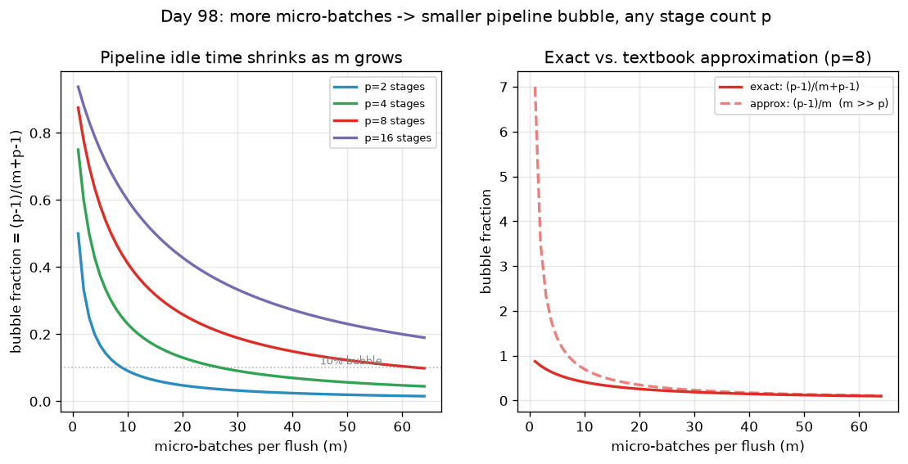

# Day 98 — Data / Model / Pipeline Parallelism

## 🧠 CONCEPT OF THE DAY

**Intuition.** The last two days squeezed everything out of *one* GPU (mixed precision shrank each number; accumulation and checkpointing shrank batch-memory and activation-memory). Today we stop pretending one GPU is enough and ask: given `p` GPUs, what are the fundamentally different ways to split the job? There are exactly three axes, and they answer three different questions:

- **Data parallelism (DP):** "the model fits, I just want more throughput." Copy the *whole model* onto every GPU, give each GPU a different slice of the batch, run forward+backward independently, then average gradients before the optimizer step. Like `p` identical factories each running the full assembly line on their own batch of orders, reconciling books once a day.
- **Tensor (model) parallelism (TP):** "a single layer doesn't fit." Split one big matrix multiply's *weights* across GPUs — e.g. a `[d, h]` weight column-split into `[d, h/2]` halves on GPU0 and GPU1. Both GPUs compute their half of the *same* op on the *same* input simultaneously. Like two people jointly carrying one couch too heavy for either alone — same task, same instant, split across the width.
- **Pipeline parallelism (PP):** "the whole stack doesn't fit, but each layer does." Split the model by *depth* — GPU0 gets layers 1–8, GPU1 gets layers 9–16, etc. — and stream micro-batches through like an assembly line, so while GPU1 processes micro-batch 1, GPU0 has already started micro-batch 2.

Note the family resemblance to yesterday: DP is gradient accumulation's twin, done in *space* (parallel GPUs) instead of *time* (sequential micro-batches) — both produce a mathematically exact average over the same total batch. PP is closer to yesterday's checkpointing in spirit: both trade an idle/recompute cost for fitting something that otherwise wouldn't.

**The math.** For DP with world size `p` and per-GPU micro-batch `b`, the effective global batch is `B = pb`, and because loss is a mean, the true gradient is exactly the average of the per-GPU gradients:

$$\nabla_\theta \mathcal{L}(\text{batch}_B) = \frac{1}{p}\sum_{r=1}^{p} \nabla_\theta \mathcal{L}_r(\text{shard}_r)$$

computed via one **all-reduce** of a tensor the size of the whole model, once per optimizer step — the *only* communication DP needs.

For PP with `p` stages and `m` micro-batches per flush, a naive schedule leaves GPU0 idle once it's fed all `m` micro-batches downstream, and idle again waiting for the last one to come back for its share of backward work. That idle time is the **bubble**. If each stage takes time $t$ per micro-batch, the exact bubble fraction is:

$$\text{bubble fraction} = \frac{p-1}{m+p-1} \;\xrightarrow[m \gg p]{}\; \frac{p-1}{m}$$

— the fill/drain cost of `p-1` empty pipeline slots, amortized over `m` micro-batches. More micro-batches (finer granularity) shrinks the bubble toward zero for any fixed `p`, exactly the same "chop it finer" lever as yesterday's gradient accumulation, just applied to pipeline scheduling instead of memory.



For TP, splitting a linear layer `Y = XA` column-wise into `A = [A_1 \mid A_2]` needs **no communication** to compute each half (`Y_1 = XA_1`, `Y_2 = XA_2` independently) — but the *next* layer usually needs the full `Y`, so you either concatenate (cheap) or, if the next layer is row-parallel, **all-reduce** the partial sums (expensive, per-layer). This per-layer, high-frequency communication is why TP needs NVLink-class bandwidth and is almost always kept *within* a single node, while DP's once-per-step all-reduce tolerates far slower, cross-node links.

**Why it matters / where it leads.** Real large-model training combines all three ("3D parallelism"): TP within a node (fast link, frequent sync), PP across node groups (moderate frequency), DP replicating the whole TP×PP group across the rest of the cluster (least frequent, most link-tolerant). Tomorrow's ZeRO is a fourth axis orthogonal to all three — instead of splitting *compute*, it splits *optimizer state and gradients* across the DP group, recovering most of TP/PP's memory savings without touching the model's parallel structure at all.

**Interview question:** *You have 8 GPUs on 2 nodes (4 GPUs/node, NVLink within a node, slower Ethernet between nodes) and a model that requires tensor-parallel degree 2 (one layer's weights don't fit on a single GPU) and pipeline-parallel degree 4 (the full depth doesn't fit on 2 GPUs). How do you lay out TP, PP, and DP across the 8 GPUs, and specifically — why must the TP group never be split across the two nodes?*

---

## 🐍 PYTHONIC EDGE

`torch.nn.DataParallel` (single process, GIL-bound, gathers everything through GPU 0) is the "bad way" everyone starts with; `DistributedDataParallel` (one process per GPU, gradient all-reduce overlapped with backward) is the idiomatic production path.

```python
import torch
import torch.nn as nn
import torch.distributed as dist
from torch.nn.parallel import DataParallel, DistributedDataParallel as DDP  # import ... as ... alias -- no C++ equivalent

# ---- the bad way: torch.nn.DataParallel ----
model = nn.Linear(1024, 1024).cuda()
model = DataParallel(model, device_ids=[0, 1, 2, 3])   # ONE Python process controls all 4 GPUs -- the GIL
                                                          # serializes the per-GPU kernel-launch loop
out = model(x)          # every call: scatter x to 4 GPUs, run forward, GATHER `out` back onto GPU 0 --
                         # GPU 0's memory and PCIe bandwidth become the bottleneck, every single forward

# ---- the clean way: torch.nn.parallel.DistributedDataParallel ----
dist.init_process_group(backend="nccl")                 # one OS process PER GPU, not one process total
local_rank = dist.get_rank() % torch.cuda.device_count()  # % is Python's modulo operator, same symbol as C++
torch.cuda.set_device(local_rank)
model = nn.Linear(1024, 1024).to(local_rank)             # .to() returns a NEW tensor/module -- no trailing
                                                          # underscore, so unlike .mul_() this is NOT in-place
model = DDP(model, device_ids=[local_rank])              # wraps the module; calling model(x) still goes through
                                                          # __call__, which now also arms DDP's backward-time hooks

for x, y in dataloader:                                  # `for ... in` uses Python's iterator protocol
                                                          # (__iter__/__next__), not a raw pointer-range like C++
    out = model(x.to(local_rank))                        # __call__ -> forward() -- never call .forward() yourself,
                                                          # you'd skip DDP's registered hooks entirely
    loss = nn.functional.mse_loss(out, y.to(local_rank))
    loss.backward()        # DDP overlaps the gradient all-reduce with backward, bucket by bucket, as each
                            # bucket's grads become ready -- no separate gather step, unlike DataParallel above
    optimizer.step()
```

The two are barely different to write, but they encode the exact DP-vs-TP communication-pattern distinction from today's concept: `DataParallel`'s per-forward gather is a miniature version of what TP pays on *every layer*, while `DDP`'s once-per-step all-reduce is DP's actual, cheap communication pattern — `DataParallel` is essentially "doing DP with TP's communication bill."

---

## 📡 SIGNAL LAB

Tensor parallelism's core move — split one big operation into independent pieces computed simultaneously, then pay a combine cost to stitch results back together — is *exactly* the Cooley-Tukey FFT's decimation-in-time recursion, just applied to matmuls instead of DFTs.

**Worked example.** Let $x = [1, 2, 3, 4]$, $N=4$. Direct DFT: $X_k = \sum_{n=0}^{3} x_n e^{-i2\pi kn/4}$, giving $X = [10,\ -2+2i,\ -2,\ -2-2i]$.

Now split into even/odd indices — $x_e = [1, 3]$, $x_o = [2, 4]$ — and run two *independent* 2-point DFTs (these could execute on separate cores in parallel, with zero communication between them, same as two GPUs computing $XA_1$ and $XA_2$ independently):

$$E = [E_0, E_1] = [4, -2], \qquad O = [O_0, O_1] = [6, -2]$$

Then **combine** with the twiddle factors $W_4^k = e^{-i2\pi k/4}$ — this is the one step that needs the two halves to talk to each other, the FFT's equivalent of TP's all-reduce/concatenate:

$$X_k = E_{k \bmod 2} + W_4^k \, O_{k \bmod 2}$$

$$X_0 = 4 + 1(6) = 10, \quad X_1 = -2 + (-i)(-2) = -2+2i, \quad X_2 = 4 + (-1)(6) = -2, \quad X_3 = -2 + (i)(-2) = -2-2i$$

Matches the direct DFT exactly.

**So what:** the FFT recurses this split $\log_2 N$ times, and a well-designed *parallel* FFT implementation is engineered to minimize how many of those $\log_2 N$ butterfly-combine stages actually require inter-processor communication (vs. staying local within one processor's cache). Megatron-LM's tensor-parallel transformer block does the identical optimization for a totally different reason: it alternates *column-parallel* then *row-parallel* linear layers specifically so the two matmuls of an attention or MLP block need only **one** all-reduce for the whole block, instead of one after each matmul — the same "minimize combine-stage count, not split count" instinct that makes an FFT implementation fast on a real multi-core machine.

---

## 🏋️ THE GAUNTLET

**Two-Stage Pipeline Scheduling**

You're scheduling `n` micro-batches through a 2-stage pipeline (think: GPU0 running stage-A layers, GPU1 running stage-B layers). Micro-batch `i` takes `a[i]` time on stage A and `b[i]` time on stage B. Every micro-batch must go through stage A before stage B, **in the same relative order at both stages** (it's a physical pipeline — you can't reorder mid-flight). Each stage processes one micro-batch at a time, non-preemptively; stage B can't start micro-batch `i` until stage B is free *and* micro-batch `i` has finished stage A.

Choose an order for the `n` micro-batches to minimize the makespan — the time the last micro-batch finishes stage B.

Constraints:
- `1 <= n <= 2 * 10^5`
- `1 <= a[i], b[i] <= 10^9`

**Hints (escalating):**
1. Use an exchange argument: for two *adjacent* micro-batches `i` then `j` in some schedule, work out the extra finishing-time contribution of that pair in terms of `a[i], b[i], a[j], b[j]`, and find the condition under which swapping their order never makes things worse.
2. That pairwise condition collapses to comparing `min(a[i], b[j])` against `min(a[j], b[i])` — this is a total order (transitive), so a single global sort by the right key realizes it for every adjacent pair at once.
3. Concretely: split micro-batches into those with `a[i] < b[i]` (schedule these first, sorted ascending by `a[i]`) and those with `a[i] >= b[i]` (schedule these last, sorted descending by `b[i]`). Then a single left-to-right simulation gives the makespan.

**Pattern:** greedy exchange-argument sort — this is **Johnson's rule** for 2-machine flow-shop scheduling. **Target complexity:** `O(n log n)` time, `O(n)` space.

---

## 🏗️ BLUEPRINT

No blueprint today.

---

## 🗺️ MARCHING ORDERS

Next time you reach for "just add more GPUs," name which of the three axes you actually need — throughput (DP), a layer that doesn't fit (TP), or a stack that doesn't fit (PP) — before you touch any config.

**Tomorrow: Concept 99 — ZeRO & sharded training**

---

## 🔓 GAUNTLET SOLUTION

```cpp
#include <bits/stdc++.h>
using namespace std;

long long twoStageMakespan(vector<long long>& a, vector<long long>& b) {
    int n = a.size();
    vector<int> group1, group2;              // group1: a[i] < b[i] -> schedule early
    for (int i = 0; i < n; i++) {            // group2: a[i] >= b[i] -> schedule late
        if (a[i] < b[i]) group1.push_back(i);
        else group2.push_back(i);
    }
    sort(group1.begin(), group1.end(), [&](int i, int j){ return a[i] < a[j]; });   // ascending by a[i]
    sort(group2.begin(), group2.end(), [&](int i, int j){ return b[i] > b[j]; });   // descending by b[i]

    vector<int> order = group1;
    order.insert(order.end(), group2.begin(), group2.end());

    long long timeA = 0, timeB = 0;
    for (int i : order) {
        timeA += a[i];                        // stage A runs strictly in sequence, no waiting on stage B
        timeB = max(timeB, timeA) + b[i];      // stage B starts at max(when it's free, when stage A handed off)
    }
    return timeB;
}
```

Correctness: for adjacent jobs `i` then `j`, the pairwise finishing-time contribution reduces to comparing `min(a_i, b_j)` vs. `min(a_j, b_i)` — put `i` before `j` when the former is smaller. Johnson's rule (the `a[i] < b[i]` partition + the two sorts above) produces exactly the ordering induced by that comparator for *every* adjacent pair simultaneously, which is what makes the greedy globally optimal rather than just locally non-decreasing.

## 💡 CONCEPT ANSWER

Layout: TP degree 2 across 2 GPUs **within the same node** (so each TP pair shares NVLink), giving 4 TP-pairs total across the 2 nodes. Group 4 of those TP-pairs (one per node-half, 2 nodes × 2 TP-pairs) into a 4-stage pipeline — PP degree 4, one TP-pair per pipeline stage. That consumes exactly 8 GPUs for one full model replica (TP=2 × PP=4 = 8). With only 8 GPUs available, DP degree is 1 here — but the reasoning generalizes: if you had 16 GPUs, you'd replicate this entire TP×PP group (DP degree 2) and all-reduce gradients *across* the two replicas.

The TP group must never cross nodes because TP requires an all-reduce (or all-gather) after **every** split matmul — many times per layer, per forward *and* backward pass, moving activation-sized tensors. That communication volume and frequency needs the lowest possible latency and highest bandwidth, which only intra-node NVLink provides; running it over inter-node Ethernet would make the communication cost dominate the actual compute, erasing any speedup. Pipeline parallelism, by contrast, only exchanges activations/gradients once per micro-batch at each stage boundary — far less frequent, so it tolerates the slower inter-node link. Data parallelism's gradient all-reduce happens only once per optimizer step — the least frequent of all three — making it the right (and often only) axis to stretch across racks or datacenters. The general rule: map the *most communication-hungry* parallelism axis to the *fastest* link, in decreasing order TP > PP > DP.
