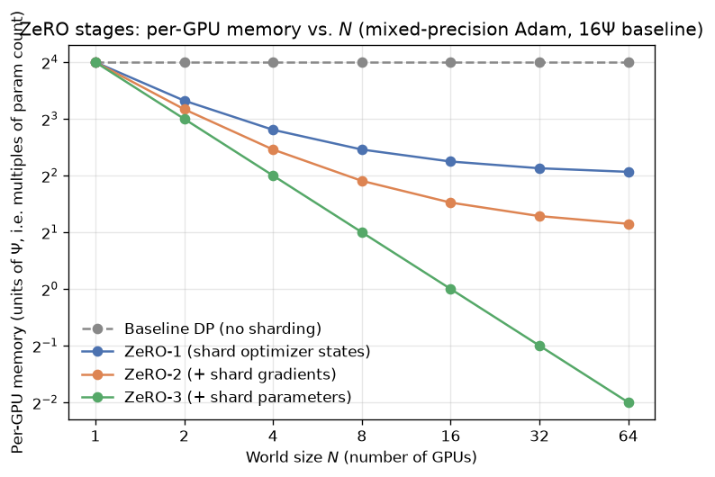

# Day 99 — ZeRO & Sharded Training

## 🧠 CONCEPT OF THE DAY

**Intuition.** Yesterday you split *compute*: DP replicates the model and splits the batch, TP splits a layer's weights, PP splits depth. Today's split is orthogonal — you don't touch how the forward/backward pass is computed at all, you only change **who is allowed to hold a permanent copy of what**, inside a plain DP group. Picture `N` roommates who each insist on keeping a full personal copy of a shared cookbook, a shared shopping list, and a shared receipts folder — even though at any given moment each roommate only needs *their own* cooking step's page. ZeRO's move: keep exactly one copy of each page, split across the `N` roommates, and have whoever needs a page for the next step fetch it just-in-time. Nothing about *what* gets cooked changes — only how much shelf space each roommate burns holding redundant copies.

**The math.** In mixed-precision Adam training, every one of the `Ψ` (psi) parameters carries four separate buffers: fp16 params, fp16 gradients, and (because Adam needs fp32 precision to not underflow) fp32 master-weight copy, fp32 momentum, fp32 variance. Counting bytes:

$$\text{fp16 params} = 2\Psi,\quad \text{fp16 grads} = 2\Psi,\quad \text{fp32 optimizer state} = 4\Psi + 4\Psi + 4\Psi = 12\Psi$$

giving the now-famous baseline — plain DP, every one of the `N` GPUs redundantly holding all of it:

$$\text{memory}_{\text{DP}} = 2\Psi + 2\Psi + 12\Psi = 16\Psi \text{ bytes per GPU, on every GPU}$$

ZeRO peels this apart in three stages, each sharding one more buffer across the `N` GPUs of the DP group instead of replicating it:

$$\text{ZeRO-1: } 2\Psi + 2\Psi + \frac{12\Psi}{N} \qquad \text{ZeRO-2: } 2\Psi + \frac{2\Psi + 12\Psi}{N} \qquad \text{ZeRO-3: } \frac{16\Psi}{N}$$

Stage 1 shards optimizer states (each GPU updates only its `1/N` slice of params, then all-gathers the updated slice). Stage 2 additionally shards gradients — a GPU only needs to *keep* the gradient shard it's responsible for, so instead of an all-reduce it does a reduce-scatter. Stage 3 goes all the way and shards the parameters themselves: each GPU stores only `1/N` of the weights permanently, and all-gathers the *full* weight tensor just before each layer needs it, then immediately discards it again. That's why ZeRO-3 memory collapses to exactly `16Ψ/N` — asymptotically, memory per GPU is independent of model size as `N` grows, which is the entire point.



The chart makes the shape of the tradeoff obvious: ZeRO-1's curve flattens fast (its floor is `4Ψ`, the two unsharded fp16 buffers) while ZeRO-3 keeps dropping in a straight line on the log-log plot — real `1/N` scaling, no floor. That floor is also the communication story: ZeRO-1/2 pay DP's usual once-per-step communication volume (no free lunch on states/grads beyond a reduce-scatter instead of all-reduce), but ZeRO-3 now needs an all-gather of the *full* weight tensor at *every* layer's forward and backward — trading yesterday's "DP communicates once per step" property for "DP communicates once per layer," which is exactly the communication pattern tensor-parallelism has. ZeRO-3 is, in a real sense, buying TP-level memory savings by accepting TP-level communication frequency, without touching the compute graph.

**Why it matters / where it leads.** This is why in practice you see ZeRO-3 + TP + PP composed together at extreme scale (DeepSpeed and FSDP both implement this), and why FSDP (PyTorch's native rewrite of ZeRO-3) is now the default "just shard everything" answer for fine-tuning anything that doesn't fit on one GPU — including tomorrow's KV cache discussion, where the *inference*-time analog of "don't keep a redundant full copy of a growing buffer on every device" shows up again, just for activations instead of optimizer state.

**Interview question:** *You're fine-tuning a 7B-parameter model with Adam on 8×A100-80GB GPUs. Plain DP doesn't fit. Walk through, with actual numbers, why ZeRO-2 might already be enough — and give a concrete reason you'd reach for ZeRO-3 (or FSDP) instead of stopping at ZeRO-2.*

---

## 🐍 PYTHONIC EDGE

PyTorch's native ZeRO-3 is `FullyShardedDataParallel` (FSDP). The "bad way" here is treating it like `DDP` — wrapping the *whole* model in one shot and hoping it works — versus the clean way: wrapping submodules individually so FSDP can free each one's all-gathered weights right after it's used, which is where the actual memory savings come from.

```python
import torch
import torch.nn as nn
from torch.distributed.fsdp import FullyShardedDataParallel as FSDP
from functools import partial                              # partial(fn, **kwargs) -- pre-binds args, no
                                                              # C++ equivalent short of a lambda capture

class Block(nn.Module):                                     # class X(Base): single inheritance, C++: class X : public Base
    def __init__(self, dim):                                # self is explicit -- C++'s implicit `this`
        super().__init__()                                  # parent ctor call; C++ uses an initializer list instead
        self.ffn = nn.Sequential(nn.Linear(dim, 4 * dim), nn.GELU(), nn.Linear(4 * dim, dim))
        self.norm = nn.LayerNorm(dim)                        # self.x = ... sets an instance attribute --
                                                              # C++ declares this in the header, inits in the body

    def forward(self, x):                                    # called via __call__, NEVER call .forward() directly --
        return x + self.ffn(self.norm(x))                    # __call__ also fires FSDP's pre/post-forward hooks

class TinyTransformer(nn.Module):
    def __init__(self, dim, n_layers):
        super().__init__()
        self.blocks = nn.ModuleList([Block(dim) for _ in range(n_layers)])  # list comprehension --
                                                              # no C++ equivalent, builds the list inline

    def forward(self, x):
        for block in self.blocks:                            # `for ... in` -- Python's iterator protocol
            x = block(x)                                      # (__iter__/__next__), not a raw index loop
        return x

model = TinyTransformer(dim=1024, n_layers=48)

# ---- the bad way: wrap once, coarse-grained ----
model_bad = FSDP(model)                                       # entire model all-gathers as ONE unit --
                                                                # you pay peak memory for ALL 48 blocks' full
                                                                # weights simultaneously, right when they're needed

# ---- the clean way: auto-wrap each Block, fine-grained ----
from torch.distributed.fsdp.wrap import transformer_auto_wrap_policy
wrap_policy = partial(transformer_auto_wrap_policy, transformer_layer_cls={Block})  # **kwargs-style call,
                                                                # transformer_layer_cls is a keyword-only arg
model_good = FSDP(model, auto_wrap_policy=wrap_policy)         # each Block gets its OWN FSDP unit: all-gather
                                                                # its weights, run forward, free them, move to
                                                                # the next block -- peak memory ~ ONE block's
                                                                # full weights, not all 48 at once
```

The granularity of *where* you draw FSDP unit boundaries is the whole game — it's the direct code-level knob for the "all-gather right before use, discard right after" behavior in today's math, and getting it wrong (one giant unit) silently reproduces plain DP's memory profile while paying ZeRO-3's communication bill.

---

## 📡 SIGNAL LAB

ZeRO-3's "hold a shard permanently, materialize the full tensor only transiently, right when needed" pattern has a clean DSP analog in **overlap-add / overlap-save block convolution**: instead of holding an entire long signal's full convolution result in memory, you process it in small blocks, materializing only the currently-needed overlap region, then discard it once the next block's contribution has been added in.

**Worked mini-example.** Signal $x = [1, 2, 3, 2, 1]$ (length 5), filter $h = [1, -1]$ (length 2). Direct linear convolution length is $5+2-1=6$: $y = x * h = [1, 1, 1, -1, -1, -1]$ (check: $y_0 = x_0 h_0 = 1$; $y_1 = x_0h_1+x_1h_0 = -1+2=1$; $y_2=x_1h_1+x_2h_0=-2+3=1$; $y_3=x_2h_1+x_3h_0=-3+2=-1$; $y_4=x_3h_1+x_4h_0=-2+1=-1$; $y_5=x_4h_1=-1$).

Now do it block-wise (overlap-add, block size $L=3$, so blocks are $x^{(0)}=[1,2,3]$, $x^{(1)}=[2,1]$): convolve each block with $h$ independently — $y^{(0)} = x^{(0)}*h = [1,1,1,-3]$, $y^{(1)} = x^{(1)}*h=[2,-1,-1]$ — then **overlap-add**: shift $y^{(1)}$ by $L=3$ samples and add into the running output where it overlaps $y^{(0)}$'s tail:

$$y = [1,\,1,\,1,\,-3] \;+\; [\underbrace{0,0,0}_{\text{shift }3},\,2,\,-1,\,-1] = [1,1,1,-1,-1,-1]$$

Matches the direct convolution exactly, and at no point did you need $h$'s effect on the *entire* signal materialized at once — only one block's worth, added in, then forgotten.

**So what:** this is precisely ZeRO-3's discipline applied to signals instead of weights — never hold the full-resolution result, only ever materialize the currently-relevant local window, combine it into a running accumulator, and free it. For your frequency-domain generative-forensics work specifically, this is also *why* streaming spectrogram computation (STFT on overlapping windows, discarding each frame's raw samples after the FFT) scales to arbitrarily long audio/video without the memory footprint scaling with total sequence length — the exact shape of the ZeRO-3 win, just for a spectral transform instead of an optimizer.

---

## 🏋️ THE GAUNTLET

**Shard Assignment for Balanced Reduce-Scatter**

You have `n` parameter tensors with sizes `size[i]` (in elements) that need to be partitioned into exactly `k` shards (one shard per GPU, `k <= n`), matching how ZeRO-1 assigns whole parameter tensors to optimizer-state shards. Each tensor must be assigned *whole* to exactly one shard (no splitting a single tensor across GPUs). You want to minimize the **maximum total size assigned to any one shard** (this bounds your slowest GPU's reduce-scatter time, since all shards must finish before the next step starts).

Given `n` and the array `size`, and `k`, return the minimum possible value of the maximum shard total.

Constraints:
- `1 <= k <= n <= 10^5`
- `1 <= size[i] <= 10^9`

**Hints (escalating):**
1. This is a classic "can we achieve max-shard-total `<= X`?" feasibility question — if you can answer that in `O(n)` for a fixed `X`, you can search over `X`.
2. The feasibility check is greedy: walk the tensors in a fixed order, keep adding to the current shard until adding the next one would exceed `X`, then start a new shard — count how many shards you needed and compare to `k`.
3. The achievable values of `X` are monotonic (if `X` works, every larger `X` also works), so binary search `X` between `max(size)` and `sum(size)`, using the greedy check from hint 2 as your predicate.

**Pattern:** binary search on the answer + greedy feasibility check. **Target complexity:** `O(n log(sum(size)))` time, `O(1)` extra space beyond input.

---

## 🏗️ BLUEPRINT

**ZeRO-3/FSDP's "all-gather right before use, free right after" only pays off if the all-gather is *hidden* behind compute, not sitting in front of it.** Production sharded-training stacks (DeepSpeed, FSDP) prefetch: while GPU `k` is still running block `i`'s forward, it kicks off the all-gather for block `i+1`'s weights on a separate CUDA stream, so by the time compute reaches block `i+1` the weights are already resident. Get the prefetch depth wrong — prefetch too far ahead and you're back to holding several blocks' full weights simultaneously (ZeRO-3's memory win evaporates toward ZeRO-1/2's); prefetch not at all (all-gather issued only when the block is reached) and every single block stalls compute waiting on network. The tuning knob that matters in practice isn't "ZeRO-3 vs not," it's "how many blocks ahead does the prefetcher run," and that number is a direct memory-vs-bubble trade, structurally identical to yesterday's pipeline-parallel `m` (micro-batch count) trading bubble size against memory.

---

## 🗺️ MARCHING ORDERS

Next time "just wrap it in FSDP" doesn't fit, ask which specific buffer — params, grads, or optimizer state — is actually the one still being replicated, before reaching for a bigger cluster.

**Tomorrow: Concept 100 — KV cache**

---

## 🔓 GAUNTLET SOLUTION

```cpp
#include <bits/stdc++.h>
using namespace std;

bool feasible(vector<long long>& size, int k, long long X) {
    int shards = 1;
    long long cur = 0;
    for (long long s : size) {
        if (s > X) return false;              // a single tensor already exceeds X -- impossible
        if (cur + s > X) {                    // starting a new shard
            shards++;
            cur = s;
            if (shards > k) return false;
        } else {
            cur += s;
        }
    }
    return true;
}

long long minMaxShard(vector<long long>& size, int k) {
    long long lo = *max_element(size.begin(), size.end());
    long long hi = accumulate(size.begin(), size.end(), 0LL);
    while (lo < hi) {
        long long mid = lo + (hi - lo) / 2;
        if (feasible(size, k, mid)) hi = mid;  // X = mid works -- try to do better
        else lo = mid + 1;                     // X = mid too tight -- need more room
    }
    return lo;
}
```

Correctness: `feasible` is a straightforward greedy left-to-right bin-packing check — it never backtracks because packing tensors into the *current* shard as long as possible, in a fixed order, uses the minimum number of shards achievable for that order and threshold `X` (delaying a new shard can only help or be neutral, never hurt, since all we care about is the count of shards used). The feasibility predicate is monotonic in `X` (any packing valid at `X` stays valid at `X' > X`), which is exactly what licenses the binary search over `X` in `[max(size), sum(size)]`.

## 💡 CONCEPT ANSWER

With `Ψ ≈ 7×10^9` and mixed-precision Adam, plain DP needs `16Ψ ≈ 112 GB` *per GPU* just for params+grads+optimizer state — already over a single A100-80GB's capacity before a single activation is stored, so plain DP is out immediately. ZeRO-2 across the 8 GPUs gives `2Ψ + (2Ψ+12Ψ)/8 = 2Ψ + 1.75Ψ = 3.75Ψ ≈ 26.25 GB` per GPU for params+grads+optimizer state — comfortably inside 80GB with plenty of headroom left for activations and a reasonable batch size, so for an 8-GPU, 7B-parameter fine-tune, ZeRO-2 is very likely already enough on paper.

The concrete reason to reach for ZeRO-3/FSDP anyway: ZeRO-2 still keeps the **full fp16 parameter tensor** (`2Ψ ≈ 14 GB`) replicated on every GPU, unsharded — and that's a *fixed floor* that doesn't shrink as you add more GPUs (look at the blue ZeRO-1 curve in today's graph flattening, not the green ZeRO-3 curve dropping). If you need to push sequence length or batch size up and activation memory now competes for that same 80GB, or if you scale out to more GPUs expecting per-GPU memory to keep dropping, ZeRO-2's fixed `2Ψ` params-replication floor won't budge — only ZeRO-3's full `16Ψ/N` scaling gives you that. In other words: ZeRO-2 is the right call for "just barely fit it," ZeRO-3/FSDP is the right call for "I want memory-per-GPU to keep shrinking as I add GPUs, or I'm activation-memory-bound, not optimizer-state-bound."
