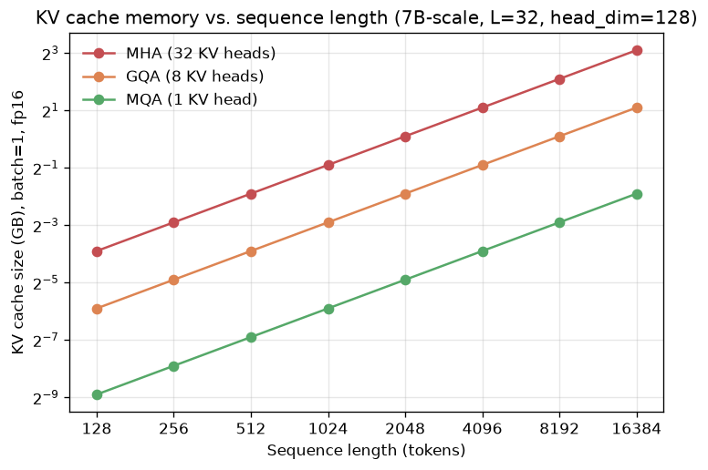

# Day 100 — KV Cache

## 🧠 CONCEPT OF THE DAY

**Intuition.** A decoder-only transformer generates one token at a time, and each new token needs attention over *every* token that came before it. The naive way to do that is to feed the whole sequence-so-far back through the model at every step — like re-reading an entire book from page one every time you want to write the next sentence, just to remember what you already wrote. The obvious fix: keep notes. Specifically, keep the **Key** and **Value** vectors you already computed for every past token, so a new token only ever has to compute its *own* Q/K/V once and then attend over the notes you already took. That's the KV cache — it doesn't change what attention computes, it only stops you from recomputing things that provably haven't changed.

**The math.** At layer $\ell$, generating token at position $t$ needs $K_{1:t}, V_{1:t}$ to compute:

$$\text{Attn}(Q_t, K_{1:t}, V_{1:t}) = \text{softmax}\!\left(\frac{Q_t K_{1:t}^\top}{\sqrt{d_k}}\right) V_{1:t}$$

Without a cache, producing token $t$ means re-running the full forward pass on tokens $1{:}t$, recomputing every layer's $Q, K, V$ projections and FFN for all $t$ positions — projection/FFN cost is $O(t \cdot d^2)$ per step (linear layers over model width $d$), so total cost across $n$ generated tokens is

$$\sum_{t=1}^{n} O(t \cdot d^2) = O(n^2 d^2)$$

With a cache, each step only computes $Q_t, K_t, V_t$ for the *new* token ($O(d^2)$) and appends $K_t, V_t$ to the cache — the $O(n^2 d^2)$ redundant projection/FFN work collapses to $O(n \cdot d^2)$. What caching does **not** remove is the attention score computation itself: $Q_t$ still has to dot against all $t$ cached keys, which is inherently $O(t \cdot d)$ per step and $O(n^2 d)$ total — quadratic in sequence length regardless of caching (this is exactly the cost FlashAttention from Day 64 makes *fast*, not *sub-quadratic*). Since $d$ is in the thousands, $O(n^2 d^2) \to O(nd^2 + n^2 d)$ is the dominant real-world win; the residual $O(n^2)$ term is why long-context serving is still hard.

The cache itself costs memory, and this is the number that actually limits how many requests you can serve at once. Per sequence:

$$\text{KV cache bytes} = 2 \cdot L \cdot H_{kv} \cdot d_h \cdot S \cdot B \cdot p$$

where $L$ = layers, $H_{kv}$ = number of KV heads, $d_h$ = head dimension, $S$ = sequence length so far, $B$ = batch size, $p$ = bytes per element, and the leading $2$ is for storing both $K$ and $V$.



The graph makes the one design lever that actually matters obvious: $H_{kv}$. Standard multi-head attention gives every query head its own K/V head ($H_{kv} = H_q$); at a 7B-scale config (32 layers, head_dim 128, fp16) that's already ~2 GB *per sequence* at a 4096-token context — before you've served a second concurrent request. Grouped-Query Attention (GQA) has groups of query heads share one KV head, and Multi-Query Attention (MQA) takes it to the extreme — one shared KV head for the entire layer. Both shrink $H_{kv}$ directly, with only a small, usually-recoverable quality cost, which is precisely why nearly every serving-oriented LLM today (Llama 2/3, Mistral, etc.) ships with GQA instead of full MHA — it's a cache-memory decision, not an accuracy decision.

**Why it matters / where it leads.** The cache is now the thing that actually decides how many users you can serve concurrently on a fixed GPU, which is exactly tomorrow's topic (throughput vs. latency, batching): the KV cache footprint per request directly caps your max batch size, and max batch size is your throughput lever.

**Interview question:** *Without a KV cache, what's the asymptotic compute cost of autoregressively generating $n$ tokens with a decoder-only transformer of width $d$? What specifically does caching eliminate, and what quadratic cost does it leave untouched — and why?*

---

## 🐍 PYTHONIC EDGE

The naive way to grow a KV cache is `torch.cat` every step — that reallocates and copies the *entire* growing tensor on every single token, turning an $O(n)$ per-step cache update into $O(n^2)$ total copying over a generation. The clean way: preallocate the cache to `max_len` once and write new entries in place.

```python
import torch

class KVCache:                                                    # plain class -- Python 3 classes implicitly inherit `object`, no `: public Base` needed
    def __init__(self, max_len, n_layers, n_kv_heads, head_dim, dtype=torch.float16):
        self.k = torch.zeros(n_layers, n_kv_heads, max_len, head_dim, dtype=dtype)  # self.x = ... sets an instance attr -- C++: declare in header, init in ctor body
        self.v = torch.zeros_like(self.k)                          # shape-matching alloc; no resize/copy needed later
        self.pos = 0                                                # plain int attribute, the running write cursor

    def update(self, layer_idx, k_new, v_new):
        n = k_new.shape[-2]                                         # [-2] -- negative indexing counts from the end, no C++ equivalent
        self.k[layer_idx, :, self.pos:self.pos + n].copy_(k_new)    # a[i:j] slice + .copy_() in-place write -- trailing `_` means "mutates, no new tensor"
        self.v[layer_idx, :, self.pos:self.pos + n].copy_(v_new)
        return self.k[layer_idx, :, :self.pos + n], self.v[layer_idx, :, :self.pos + n]  # returns a tuple -- caller unpacks with `k_full, v_full = ...`

    def advance(self, n):
        self.pos += n

    def __len__(self):                                               # dunder method -- lets `len(cache)` work like a built-in container
        return self.pos

# ---- the bad way: re-concatenate the WHOLE cache every step ----
def bad_step(k_cache, k_new):
    return torch.cat([k_cache, k_new], dim=-2)                       # reallocates + copies everything seen so far -- O(current_len) per call, O(n^2) over a sequence

# ---- the clean way: preallocate once, write new slices in place ----
cache = KVCache(max_len=4096, n_layers=32, n_kv_heads=8, head_dim=128)
for layer_idx, (k_new, v_new) in enumerate(layer_kv_outputs):        # enumerate() yields (index, item) pairs; tuple unpacking in the loop header
    k_full, v_full = cache.update(layer_idx, k_new, v_new)            # O(new tokens) work, independent of how long the cache already is
cache.advance(k_new.shape[-2])
assert len(cache) <= 4096, "cache overflow"                          # assert -- debug-time invariant check, stripped under `python -O`
```

The `.copy_()` write into a pre-sized buffer is the whole trick: it's the exact same discipline as ZeRO-3's "allocate the shard once, write into it, never reallocate" from yesterday, just applied to activations sitting in a cache instead of sharded optimizer state.

---

## 📡 SIGNAL LAB

KV caching's "keep compact running state, update it in $O(1)$ per new sample instead of recomputing from scratch" pattern has an exact DSP analog: the **sliding DFT** (Goertzel-style recursive single-bin update), used to track one frequency bin over a streaming signal without re-running a full $N$-point FFT on every new sample.

**Setup.** You want the DFT bin $k$ of the most recent $N$ samples, updated every time a new sample arrives. The brute-force way recomputes $X_k[n] = \sum_{m=0}^{N-1} x[n-m]\, e^{-j2\pi km/N}$ from scratch — $O(N)$ work per new sample, $O(nN)$ over a stream of length $n$ (this is the streaming-DSP equivalent of "no KV cache": redo the whole window's work every step). The sliding-DFT recurrence instead updates the bin incrementally:

$$X_k[n] = e^{j2\pi k/N}\Big(X_k[n-1] - x[n-N] + x[n]\Big)$$

**Worked mini-example.** $N=4$, bin $k=1$ (so the twiddle factor is $e^{j2\pi/4} = j$), signal $x = [1, 0, -1, 0, 1, 0, -1, 0, \dots]$ (a clean period-4 tone). Compute $X_1[3]$ directly: $\sum_{m=0}^{3} x[3-m] j^{-m} = x_3 + x_2(-j)^{1}\cdot(\text{wait, use direct sum instead})$ — more simply, direct DFT over samples $x_0..x_3 = [1,0,-1,0]$: $X_1[3] = 1\cdot e^{0} + 0\cdot e^{-j\pi/2} + (-1)\cdot e^{-j\pi} + 0\cdot e^{-j3\pi/2} = 1 - (-1) = 2$.

Now slide in $x_4 = 1$, evicting $x_0 = 1$: recurrence gives $X_1[4] = j\big(X_1[3] - x_0 + x_4\big) = j(2 - 1 + 1) = 2j$. Direct check over the new window $x_1..x_4 = [0,-1,0,1]$: $X_1[4] = 0 + (-1)e^{-j\pi/2} + 0 + 1\cdot e^{-j3\pi/2} = -(-j) + j = j + j = 2j$. Matches — and it cost one multiply-add, not a 4-sample resum.

**So what:** the sliding DFT keeps exactly one complex number of *state* per tracked bin and updates it in $O(1)$ per new sample instead of re-deriving it from a full window — structurally identical to a KV cache keeping $K_{1:t}, V_{1:t}$ as state and updating with $O(1)$ new entries instead of rerunning every prior token's projections. For your frequency-domain forensics work specifically, this is the mechanism behind real-time spectral trackers (phase vocoders, pitch trackers) that must run online on streaming audio/video without ever re-windowing the entire history — the same "cache the state, append, never recompute the past" discipline shows up whether the state is a KV pair or a DFT bin.

---

## 🏋️ THE GAUNTLET

**KV Cache Eviction — Windowed Max**

You're serving a model with **sliding-window attention**: the KV cache only ever holds the most recent $W$ tokens (once full, the oldest token is evicted to make room for each new one). A real eviction/monitoring heuristic tracks, after every token arrives, the maximum "salience score" (e.g., key-vector norm) among tokens *currently sitting in the cache*.

Given $n$ tokens arriving one at a time with scores `score[0..n-1]`, and window capacity $W$, return an array `ans` of length $n$ where `ans[i]` is the maximum score among the tokens currently in the cache after token $i$ arrives — i.e., the max of `score[max(0, i-W+1) .. i]`.

Constraints:
- `1 <= n <= 10^6`
- `1 <= W <= n`
- `0 <= score[i] <= 10^9`
- Target: each token processed in **amortized O(1)**.

**Hints (escalating):**
1. Recomputing the max by scanning the current window at every step is $O(nW)$ — too slow for $n, W$ up to $10^6$. You need to avoid re-scanning the window from scratch.
2. You don't need to remember every score still inside the window — only the ones that could *still* become the max later. Any score you're holding that's smaller than a score sitting in front of it (i.e., that arrived more recently) can never win, ever, and is safe to throw away immediately.
3. Maintain a deque of indices with strictly decreasing scores. Before pushing index `i`, pop from the back while the back's score `<= score[i]`. Before reading the max, pop from the front any index that has aged out of the window (index `< i - W + 1`). The front of the deque is always the current max.

**Pattern:** monotonic deque (sliding window maximum). **Target complexity:** $O(n)$ time (amortized $O(1)$ per token), $O(W)$ space.

---

## 🏗️ BLUEPRINT

Production KV caches aren't one contiguous tensor per sequence — vLLM's **PagedAttention** borrows the OS virtual-memory trick wholesale: allocate cache storage in small fixed-size pages (e.g. 16 tokens each) from one shared pool, and give each sequence a page table mapping logical position → physical page. Tradeoff: naive contiguous per-sequence allocation has to over-provision for a worst-case max sequence length up front, wasting ~20–40% of GPU memory to internal fragmentation; paging eliminates that waste and lets identical prefixes (parallel sampling, beam search, shared system prompts) share pages copy-on-write — at the cost of one extra indirection (a page-table lookup) per attention step. This single mechanism is the biggest lever behind vLLM's throughput numbers, and it's exactly what Day 103 (Serving) unpacks in full.

---

## 🗺️ MARCHING ORDERS

Next time a context-length increase blows your GPU budget, don't reach for more HBM before checking whether GQA/MQA or a paged allocator would buy back more room than the extra hardware ever will.

**Tomorrow: Concept 101 — Throughput vs latency, batching**

---

## 🔓 GAUNTLET SOLUTION

```cpp
#include <bits/stdc++.h>
using namespace std;

vector<long long> windowedMax(vector<long long>& score, int W) {
    int n = score.size();
    vector<long long> ans(n);
    deque<int> dq;                      // holds indices, scores strictly decreasing front-to-back

    for (int i = 0; i < n; i++) {
        while (!dq.empty() && score[dq.back()] <= score[i]) {
            dq.pop_back();               // anything <= score[i] can never be the max again -- discard
        }
        dq.push_back(i);

        int windowStart = i - W + 1;
        while (dq.front() < windowStart) {
            dq.pop_front();               // evict indices that fell out of the sliding window
        }

        ans[i] = score[dq.front()];       // front of deque is always the current window's max
    }
    return ans;
}
```

Correctness: the deque is maintained strictly decreasing by score, so its front is always the maximum score among indices still in the deque. Any index popped from the back (because a smaller-or-equal score arrived later) could never be the answer for any future window that also contains the newer index, since the newer, larger-or-equal score is both fresher (survives longer in the window) and at least as large — so discarding it loses no correctness. Each index is pushed once and popped at most once (either from the back while inserting, or from the front once it ages out), giving amortized $O(1)$ per token and $O(n)$ total.

## 💡 CONCEPT ANSWER

Without a KV cache, generating token $t$ means re-running the whole forward pass over positions $1{:}t$ — every layer's $Q,K,V$ projections and FFN get recomputed for all $t$ prior positions, at $O(t \cdot d^2)$ per step ($d$ = model width, from the linear layers). Summed over $n$ generated tokens: $\sum_{t=1}^n O(t d^2) = O(n^2 d^2)$.

What caching eliminates: the *redundant* re-projection and re-FFN work on tokens whose hidden states can't change once computed. With a cache, each step only computes $Q_t, K_t, V_t$ for the one new token, $O(d^2)$ work, and appends $K_t, V_t$ — total $O(n d^2)$, not $O(n^2 d^2)$.

What it leaves untouched: the attention score computation itself. $Q_t$ still has to dot-product against every cached key, an inherently $O(t \cdot d)$ operation at step $t$ (no amount of caching shrinks the number of keys a new query must attend over), giving $O(n^2 d)$ total regardless of caching. Since $d$ is typically in the thousands, the $O(n^2 d^2) \to O(nd^2 + n^2d)$ improvement from caching is the dominant real-world speedup — but the surviving $O(n^2 d)$ term is exactly why long-context inference is still expensive, and exactly the cost that FlashAttention (fast, same complexity) and sparse/windowed attention (actually sub-quadratic) attack from two different angles.
