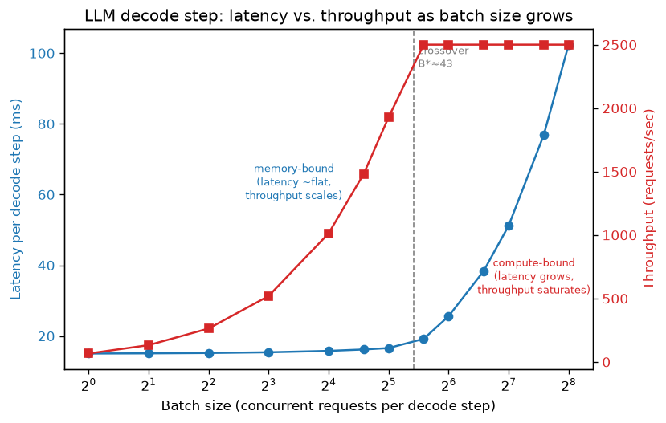

# Day 101 — Concept 101: Throughput vs. Latency, Batching ⚖️

Yesterday you learned *why* the KV cache exists and *what it costs* in memory. Today's concept is what that memory cost is actually *for*: deciding how many requests you can run at once, and what that decision does to the two numbers every serving engineer gets paged about.

---

## 🧠 CONCEPT OF THE DAY

**Intuition.** A city bus and a taxi solve the same problem — get people from A to B — with opposite priorities. A taxi picks you up now and drives straight there: minimal *latency* for you, but the driver's time is mostly wasted carrying one passenger. A bus waits a few minutes to fill up, then makes the same trip carrying forty people: your personal wait is longer, but the *throughput* of the road (passengers moved per driver-hour) goes way up. Serving a neural network is the same trade. Run one request through the model the instant it arrives, and it pays almost the same GPU cost as a whole batch would — the GPU spends most of its time waiting on memory bandwidth, not doing math, so you're "driving an empty bus." Batch requests together first, and you amortize that fixed cost over many passengers — at the price of the first requester waiting for the bus to fill.

**The math.** A single forward/decode step's wall time is bounded by whichever resource runs out first — this is the *roofline model*:

$$t_{\text{step}}(B) = \max\big(t_{\text{mem}}(B),\ t_{\text{compute}}(B)\big)$$

where $B$ is batch size. Loading the model's weights from HBM into the GPU's compute units costs the same whether you use those weights for 1 sequence or 100 — it's a **fixed** memory read per step, plus a small per-sequence term for reading each one's KV cache:

$$t_{\text{mem}}(B) = t_{\text{weights}} + B \cdot t_{\text{kv-read}}$$

Compute, on the other hand, genuinely scales with how many sequences pass through the matmuls:

$$t_{\text{compute}}(B) = B \cdot t_{\text{flop-per-seq}}$$

At small $B$, $t_{\text{mem}}(B) \gg t_{\text{compute}}(B)$ — you're **memory-bound**: the GPU is idle-waiting on HBM bandwidth regardless of $B$, so $t_{\text{step}}$ barely changes as you add more sequences. That means throughput,

$$\text{throughput}(B) = \frac{B}{t_{\text{step}}(B)}$$

scales almost linearly with $B$ for free — you're filling the bus without slowing down the trip. Past a crossover point $B^\*$ where $t_{\text{compute}}(B) = t_{\text{mem}}(B)$, you become **compute-bound**: $t_{\text{step}}$ starts growing linearly with $B$, and throughput saturates. This crossover — arithmetic intensity flipping the bottleneck from bandwidth to FLOPs — is exactly why decode-phase serving obsesses over batch size, and why the KV cache's memory cost from yesterday directly determines how far right on this curve you're allowed to sit.



**Why it matters / where it leads.** Latency and throughput aren't two separate metrics to independently optimize — they're the same curve viewed from two ends, and every serving decision (batch size, timeout-to-fill, admission control) is a choice of *where on this curve you sit*. A chat UI wants low per-token latency (small batches, close to the taxi end); a batch-embedding pipeline wants maximum throughput (large batches, bus end). This sets up Concept 102 (export formats like ONNX/TorchScript, which exist partly to make this batching behavior portable and fast across runtimes) and Concept 103 (vLLM's continuous batching, which is precisely the trick of *not* forcing every request in a batch to start and finish together — letting you sit near the throughput-optimal batch size on this curve without paying the latency cost of static batching, by refilling finished slots mid-flight instead of waiting for the whole batch to complete).

**Interview question:** *"Your team doubles GPU count to handle more traffic but P99 latency doesn't improve — only throughput does. A teammate suggests 'just lower the max batch size to fix latency,' but users are now complaining that overall requests/sec dropped instead. Explain what's actually happening using the memory-bound/compute-bound framework, and name one technique that improves both simultaneously rather than trading one for the other."*

*(Answer at the very bottom.)*

---

## 🐍 PYTHONIC EDGE

The single most common way people accidentally lie to themselves about latency: timing a GPU op with `time.time()` without synchronizing first. CUDA calls are **asynchronous** — `time.time()` returns the instant Python *launched* the kernel, not the instant the GPU *finished* it, so your "latency" measurement is nonsense (often absurdly low, since you measured queueing time, not execution time).

```python
import time
import torch

model = torch.nn.Linear(4096, 4096).cuda().eval()
x = torch.randn(32, 4096, device="cuda")   # torch.randn returns a tensor object, not a raw buffer

# BAD: times kernel *launch*, not kernel *completion*
def latency_bad(model, x):
    start = time.time()                    # time.time() is wall-clock, CPU-side only
    with torch.no_grad():                  # context manager: disables autograd bookkeeping (no C++ RAII needed —
        y = model(x)                       # `with` calls __enter__/__exit__ for you)
    elapsed = time.time() - start          # CUDA queued the kernel and returned immediately -> elapsed is ~microseconds
    return elapsed                         # wrong: GPU may still be computing when this line runs

# GOOD: CUDA events measure actual GPU-side start/finish, or force a sync
def latency_good(model, x, n_warmup=5, n_iters=20):
    for _ in range(n_warmup):              # underscore: idiomatic "I don't need this loop variable"
        with torch.no_grad():
            model(x)
    torch.cuda.synchronize()               # block CPU until all queued GPU work is actually done

    start_evt = torch.cuda.Event(enable_timing=True)   # class instantiated like any Python object — no `new`
    end_evt = torch.cuda.Event(enable_timing=True)

    start_evt.record()                     # record() marks a point in the GPU's own instruction stream
    with torch.no_grad():
        for _ in range(n_iters):
            y = model(x)                   # loop body reassigns y each iter — fine, Python has no block scoping
    end_evt.record()
    torch.cuda.synchronize()               # wait for end_evt's kernel to actually finish before reading it

    ms_per_call = start_evt.elapsed_time(end_evt) / n_iters   # .elapsed_time() reads GPU clock deltas, in ms
    return ms_per_call                     # / does true division in Python 3 (C++: int/int truncates unless cast)
```

`enable_timing=True` is a keyword argument (`kwarg`) — Python lets you name arguments at the call site regardless of position, which C++ has no direct equivalent for (you'd overload or default-argument your way there). The warmup loop matters for a separate reason too: the first few calls pay CUDA-graph-capture / cuDNN autotuning / kernel-JIT costs that never recur, and including them in your average would make your batching benchmarks look artificially bad.

---

## 📡 SIGNAL LAB

This exact latency/throughput knob shows up in streaming DSP as **block size** in block-based FFT filtering (overlap-add/overlap-save), and it's worth seeing that it's the *identical* tradeoff, not just an analogy.

**Setup:** you're filtering a live audio stream with an FIR filter via FFT (fast convolution). Processing one sample at a time gives you the lowest possible latency (output the instant input arrives) but terrible throughput — an FFT has fixed overhead ($O(N\log N)$ for a length-$N$ transform) that you're paying over and over for almost no useful work per call. Buffer $N$ samples into a block first, and you amortize that fixed FFT overhead over $N$ samples of output — but nothing can be emitted until the whole block has arrived, so latency grows with block size.

```python
import numpy as np
import time

np.random.seed(42)
h = np.array([0.2, 0.5, 0.2, 0.1])          # length-4 FIR filter
signal = np.random.randn(4096)               # a stand-in "stream" of samples

def block_process(signal, h, block_size):
    """Return (per-block latency estimate in samples, throughput in samples/sec-equivalent calls)."""
    n_fft_calls = 0
    for start in range(0, len(signal), block_size):
        block = signal[start:start + block_size]
        n = len(block) + len(h) - 1
        _ = np.fft.ifft(np.fft.fft(block, n) * np.fft.fft(h, n)).real   # one FFT pair per block, not per sample
        n_fft_calls += 1
    latency_samples = block_size            # you must wait for `block_size` samples before any output emerges
    fixed_overhead_amortized_over = block_size  # same n_fft_calls worth of overhead spread over more samples
    return latency_samples, n_fft_calls

for bs in [1, 16, 64, 256, 1024]:
    latency, calls = block_process(signal, h, bs)
    print(f"block_size={bs:5d}  latency≈{latency:5d} samples  fft_calls={calls:4d}  (fewer calls = more amortized overhead)")
```

**So what:** `block_size` here is doing exactly what `batch_size` does for the LLM decoder — it's the knob that trades "wait to accumulate work" against "pay fixed overhead once per unit of accumulated work." A frequency-domain generative-forensics pipeline processing spectrograms in chunks faces the same design question a serving engineer does: real-time detection (small blocks, low latency, GPU/FFT underutilized) vs. offline batch analysis (large blocks, high throughput, latency irrelevant). Same curve, same crossover point, different units on the axes.

---

## 🏋️ THE GAUNTLET

**Problem — Car Pooling (LeetCode 1094).**
You drive a car with a fixed passenger `capacity`. You're given `trips`, where `trips[i] = [numPassengers_i, from_i, to_i]` means `numPassengers_i` passengers must be picked up at location `from_i` and dropped off at location `to_i` (all locations are non-negative integers along a straight road, and `from_i < to_i`). Passengers only travel between `from_i` and `to_i`. Return `true` if it's possible to pick up and drop off all passengers for every trip **without ever exceeding capacity** at any point, else `false`.

**Constraints:** `1 <= trips.length <= 1000`, `trips[i].length == 3`, `1 <= numPassengers_i <= 100`, `0 <= from_i < to_i <= 1000`, `1 <= capacity <= 10^5`.

**Hint 1:** You don't care about any individual trip in isolation — you care about *how many passengers are in the car simultaneously* at every point along the road. That's a batching-capacity question in disguise: "will the currently in-flight requests ever exceed my batch/GPU capacity?"

**Hint 2:** Rather than simulating the road one unit at a time, record only the *net change* in passenger count at each relevant location: `+numPassengers` at `from_i` (someone boards), `-numPassengers` at `to_i` (someone leaves). This is a difference array over location.

**Hint 3:** Sweep locations in increasing order, maintaining a running sum of these deltas. If the running sum ever exceeds `capacity`, return `false` immediately — you never need to look further ahead than the current sweep position.

**Pattern:** Difference Array / Line Sweep. **Target complexity:** O(n log n) (sorting events) or O(n + maxLocation) with a fixed-size array, O(n) space.

*(Full solution at the very bottom, under 🔓 GAUNTLET SOLUTION.)*

---

## 🏗️ BLUEPRINT

**Static batching vs. continuous (in-flight) batching is the production version of today's whole lesson.** A static batcher groups `B` requests, runs every decode step for all `B` together, and only returns results once *the entire batch* finishes — so a batch containing one 20-token reply and one 2000-token reply forces the short request to sit fully computed but unreturned for the other 1980 steps, and the GPU can't backfill that freed slot with a new request until the whole batch drains. Continuous batching (vLLM, TGI, TensorRT-LLM) schedules at the *iteration* level instead: the instant one sequence finishes, a new one gets injected into the next decode step, keeping the batch composition fluid and GPU occupancy near-constant regardless of how variable output lengths are. The cost isn't free — it requires the KV cache to be manageable as independently-sized, non-contiguous chunks (this is exactly the problem PagedAttention solves, coming in Concept 103), rather than one fixed contiguous per-sequence allocation. The tradeoff in one line: static batching trades throughput for scheduling simplicity; continuous batching trades scheduling/memory-management complexity for throughput that doesn't degrade under variable-length, bursty traffic — which is why virtually every serious LLM-serving stack made that trade.

---

## 🗺️ MARCHING ORDERS

Next time you see a latency or throughput number in isolation, ask "at what batch size, and which side of the roofline crossover?" — that question alone puts you ahead of most engineers debugging a serving regression.

Tomorrow: Concept 102 — ONNX/TorchScript export

---
---

## 🔓 GAUNTLET SOLUTION

```cpp
class Solution {
public:
    bool carPooling(vector<vector<int>>& trips, int capacity) {
        // diff[i] = net change in passenger count at location i
        vector<int> diff(1001, 0);   // locations are bounded 0..1000 per constraints

        for (const auto& trip : trips) {
            int numPassengers = trip[0];
            int from = trip[1];
            int to = trip[2];
            diff[from] += numPassengers;   // passengers board here
            diff[to]   -= numPassengers;   // passengers leave here (car has room again from this point on)
        }

        int current = 0;
        for (int i = 0; i <= 1000; i++) {
            current += diff[i];
            if (current > capacity) return false;   // exceeded capacity at this point along the road
        }
        return true;
    }
};
```

The difference array turns "did capacity ever get exceeded across up to 1000 overlapping trips" into a single linear sweep: O(n) to build the diff array from `trips`, O(maxLocation) = O(1000) = O(1) to sweep it, so overall O(n) time, O(1) extra space (fixed-size 1001 array). No need to sort trips or track individual passenger identities — exactly like the KV-cache/batching story, you only need the *net occupancy at each point*, never the full history of who got on when.

---

## 💡 CONCEPT ANSWER

**What's happening:** Doubling GPU count added more *parallel* capacity (more independent GPUs each running their own batches), which raises aggregate throughput — but it does nothing to change the roofline shape of a *single* request's decode step. If a single request is served on one GPU at a small batch size, it's memory-bound: $t_{\text{step}} \approx t_{\text{weights}}$ regardless of how many *other* GPUs exist. P99 latency is dominated by that single-request critical path (plus queueing delay under load), not by aggregate cluster capacity — so more GPUs relieves queueing (helping average-case throughput) without touching the per-request compute-bound/memory-bound floor that sets tail latency.

**Why "just lower max batch size" backfires:** shrinking batch size does reduce compute-bound latency contribution *for the sequences that do get batched* — but it also directly cuts throughput, since fewer requests are served per weight-load. You've moved along the same curve from this lesson's graph, from a throughput-favorable region toward a latency-favorable one, and the team is now unhappy about the throughput side of exactly the trade they asked for.

**A technique that improves both:** continuous/in-flight batching (this lesson's Blueprint). Because it keeps the GPU's batch composition full at essentially every step instead of only at batch boundaries, it raises achieved throughput *without* forcing every request to wait for a large batch to fill or fully drain — short requests exit as soon as they're done rather than being held hostage by the batch's longest member. It doesn't cheat the underlying memory-bound/compute-bound roofline, but it gets you much closer to the Pareto-optimal frontier of that curve instead of leaving throughput on the table for no latency benefit, which is what static over-batching or under-batching both do.
