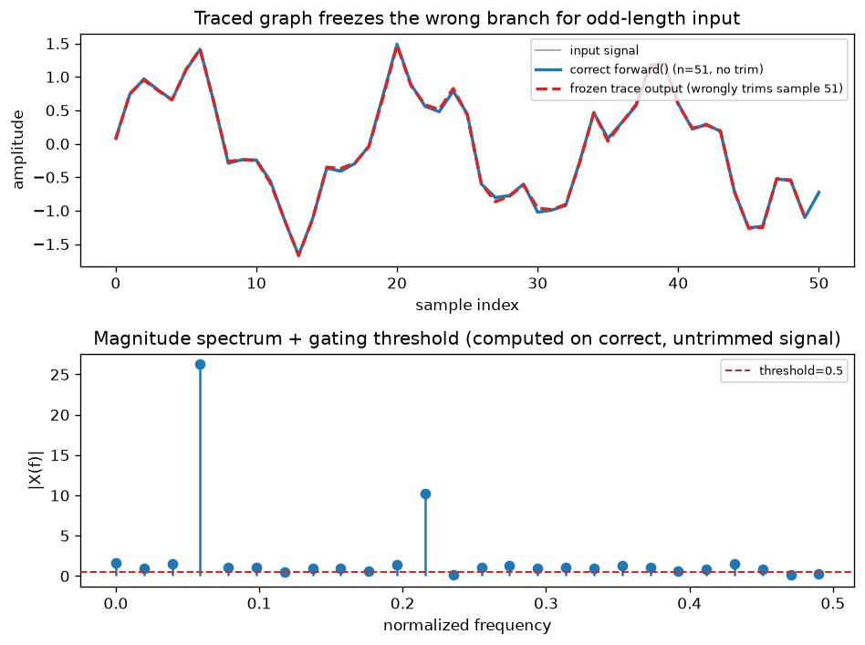

# Day 102 — Concept 102: ONNX/TorchScript Export 📦

Yesterday's roofline lens (memory-bound vs. compute-bound, batch size as the dial) only matters in production if the model can actually *run* outside the Python process you trained it in. Today's concept is what makes that possible: freezing a trained `nn.Module` into a portable, Python-independent graph.

---

## 🧠 CONCEPT OF THE DAY

**Intuition.** Training a PyTorch model happens inside a live Python interpreter: every `forward()` call re-executes Python bytecode, re-dispatches through the autograd engine, and re-evaluates whatever `if`/`for` logic you wrote. That's flexible but it's also slow to start up, hard to run from C++/mobile/embedded targets, and impossible to hand to a specialized inference engine (TensorRT, ONNX Runtime, a mobile NPU compiler) that wants a *static, self-describing graph* it can optimize offline — fuse ops, pick kernels, allocate memory once. Exporting is the act of asking PyTorch: "stop being a live interpreter for a second, and just tell me the graph of operations this model actually performs" — so some *other* runtime, one that never has to import Python, can execute that graph directly.

**The math / mechanics.** There are two different ways PyTorch captures that graph, and the distinction is the whole concept:

- **Tracing** (`torch.jit.trace`, and ONNX export historically defaults to tracing) runs your module once on example input $x_0$ and records every tensor op that actually executed, producing a graph $G = \text{trace}(f, x_0)$ that is *not* $f$ itself — it's a recording of $f$'s behavior on that one input's control-flow path.
- **Scripting** (`torch.jit.script`) instead parses the *source code* of `forward()` (a statically-typed subset of Python — TorchScript) directly into a graph, preserving real `if`/`for`/`while` as graph-level control-flow nodes rather than flattening them.

The failure mode this creates: if $f$'s Python code branches on a **data-dependent condition** — `if x.shape[-1] % 2 == 0`, `if mask.any()`, `if x.mean() > 0` — tracing bakes in *whichever branch fired for $x_0$* as an unconditional sequence of ops. Formally, tracing computes

$$G_{\text{traced}} = \big[\, \text{op}_1, \text{op}_2, \dots, \text{op}_k \,\big]_{\text{path taken by } f(x_0)}$$

— a linear list with no memory of the branch condition itself — while scripting computes something closer to $G_{\text{scripted}} = \texttt{if}(c(x))\{G_a\}\texttt{else}\{G_b\}$, preserving both branches and the runtime test. Trace on the wrong example input, and every future inference silently takes the frozen path regardless of what the real input would have chosen.



**Why it matters / where it leads.** This isn't a niche footgun — it's *the* production incident that separates people who've shipped a model from people who've only trained one: a model that's 100% correct in the notebook, exported with `torch.jit.trace`, and subtly wrong in serving for any input whose control-flow path differs from the export-time example. It directly extends yesterday's batching discussion (a static, optimized graph is what lets ONNX Runtime / TensorRT fuse and schedule ops efficiently at whatever batch size you feed it) and sets up tomorrow's Concept 103 (vLLM's continuous batching sits on top of *exactly* this kind of compiled, graph-level execution to hit the throughput numbers from yesterday's roofline curve).

**Interview question:** *"Your team traces a transformer with `torch.jit.trace` for deployment. It works perfectly in staging (fixed-length padded inputs) but production reports occasional wrong outputs once you enable dynamic sequence lengths. Walk through why tracing alone can't be trusted here, and describe two different fixes — one that keeps tracing, one that doesn't."*

*(Answer at the very bottom.)*

---

## 🐍 PYTHONIC EDGE

The bad-but-common pattern: exporting with `torch.jit.trace` and never checking whether the module has any shape- or value-dependent branching. The clean pattern: script the parts that branch, trace the parts that don't, and combine them — you don't have to pick only one.

```python
import torch

class SpectralGate(torch.nn.Module):                  # class X(Base): single inheritance,
    def __init__(self, threshold: float = 0.1):         # C++: class X : public Base
        super().__init__()                              # parent ctor call; C++ uses an initializer list instead
        self.threshold = threshold                       # instance attribute set in __init__ (C++: declared in
                                                           # the header, assigned in the constructor body)

    def forward(self, x: torch.Tensor) -> torch.Tensor:  # type hints are optional annotations, not enforced by Python
        n = x.shape[-1]                                  # negative indexing: -1 means "last dim", no C++ equivalent
        if n % 2 == 0:                                    # DATA-DEPENDENT branch: the bug lives here
            x = x[..., :-1]                               # slice notation [a:b]; `...` = Ellipsis, "all leading dims"
        spec = torch.fft.rfft(x)                          # real-input FFT, keeps only the non-redundant half-spectrum
        mag = spec.abs()
        mask = (mag > self.threshold).float()             # bool tensor -> {0., 1.} float tensor, no explicit cast needed
        return torch.fft.irfft(spec * mask, n=x.shape[-1])

model = SpectralGate(threshold=0.3).eval()                # calling the object invokes __call__, which wraps forward()
                                                           # with hooks -- never call model.forward(x) directly

# BAD: trace on one fixed-length example -> the "if n % 2 == 0" branch gets
# permanently baked as whatever it evaluated to for THIS input, forever.
example = torch.randn(1, 64)                              # torch.randn returns a new tensor object, not a raw buffer
traced = torch.jit.trace(model, example)                  # trace(model, args): runs model(*args) once and records ops
# traced(torch.randn(1, 65)) now silently uses the WRONG branch for odd length

# GOOD: script instead -- TorchScript parses forward()'s actual Python AST,
# so the `if` becomes a real graph-level conditional, re-evaluated per call.
scripted = torch.jit.script(model)                        # no example input needed at all -- it reads the source
assert torch.allclose(                                    # assert: raises AssertionError if condition is False
    scripted(torch.randn(1, 65)), model(torch.randn(1, 65))
)
scripted.save("spectral_gate.pt")                          # in-place-style suffix convention doesn't apply here --
                                                           # .save() is a plain method, not a `_`-suffixed mutator
```

If a module mixes free-form Python (things TorchScript's restricted subset can't parse — arbitrary third-party calls, `**kwargs`-heavy dispatch) with a small data-dependent branch, you don't have to script the whole thing: wrap just the branchy sub-module with `@torch.jit.script_method`-style scripting or `torch.jit.script` on that submodule, and trace the rest. TorchScript composes.

---

## 📡 SIGNAL LAB

The `SpectralGate` module above isn't a contrived example — it's the exact shape of bug that bites frequency-domain pipelines specifically, because so much DSP code branches on parity/length (even/odd FFT length, Nyquist-bin handling, power-of-two padding decisions).

**The bug, concretely:** trace `SpectralGate` on a length-64 (even) example. The traced graph freezes `x = x[..., :-1]` as an *unconditional* op. Deploy it, then feed a length-51 (odd) clip in production — the real Python `forward()` would correctly skip the trim (51 is odd), but the frozen graph trims it anyway, silently discarding a real sample and shifting every downstream frequency bin's phase reference by one index.

```python
import numpy as np

def spectral_gate(x, threshold, force_trim):
    n = len(x)
    if force_trim:                                  # simulates the frozen (traced) behavior
        x = x[:-1]
    spec = np.fft.rfft(x)
    mag = np.abs(spec)
    mask = (mag > threshold).astype(float)
    return np.fft.irfft(spec * mask, n=len(x))

np.random.seed(42)
n = 51                                              # ODD -- correct forward() must NOT trim
t = np.arange(n)
x = np.sin(2*np.pi*3*t/n) + 0.4*np.sin(2*np.pi*11*t/n) + 0.15*np.random.randn(n)

correct = spectral_gate(x, threshold=0.5, force_trim=False)   # what forward() actually computes
frozen  = spectral_gate(x, threshold=0.5, force_trim=True)    # what a trace-on-even-input graph would do
```

**So what:** the graph above shows exactly this divergence — the frozen trace (red dashed) is one sample shorter and phase-shifted relative to the correct output (blue), purely because the export process never re-evaluated the parity check. For a frequency-domain forensics pipeline, this is worse than a crash: it's a *silent*, plausible-looking waveform that's subtly wrong, which is precisely the kind of artifact that could masquerade as (or mask) the very generative-model fingerprints you'd be trying to detect. The fix is never "just be careful with your example input" — it's knowing which ops in your pipeline are shape/data-dependent and scripting (or manually asserting supported shapes for) exactly those.

---

## 🏋️ THE GAUNTLET

**Problem — Course Schedule II (LeetCode 210).**
There are `numCourses` courses labeled `0` to `numCourses - 1`. You're given `prerequisites` where `prerequisites[i] = [a_i, b_i]` means you must take course `b_i` before course `a_i`. Return **any** valid order in which to take all courses to finish them all. If it's impossible (a cycle), return an empty array.

**Constraints:** `1 <= numCourses <= 2000`, `0 <= prerequisites.length <= 5000`, `prerequisites[i].length == 2`, `0 <= a_i, b_i < numCourses`, `a_i != b_i`, all prerequisite pairs are distinct.

**Hint 1:** This is not a coincidence for today's lesson — an exported computation graph (ONNX/TorchScript) is a DAG of ops with data dependencies, and an export tool must produce a valid execution order for it exactly the same way you must produce a valid course order here.

**Hint 2:** Build an adjacency list (course → courses that depend on it) and track each course's **in-degree** (how many unmet prerequisites it has). A course with in-degree 0 has nothing blocking it — it can be "executed" (taken) right now.

**Hint 3:** Run Kahn's algorithm: push all in-degree-0 courses into a queue, repeatedly pop one, append it to the order, and decrement the in-degree of everything it unblocks — pushing any that newly hit 0. If your final order has fewer than `numCourses` entries, a cycle exists and no valid order is possible (exactly like an accidental cyclic dependency that would make a computation graph un-exportable).

**Pattern:** Topological Sort (Kahn's BFS) / cycle detection via in-degree. **Target complexity:** O(V + E) time, O(V + E) space.

*(Full solution at the very bottom, under 🔓 GAUNTLET SOLUTION.)*

---

## 🏗️ BLUEPRINT

No blueprint today.

---

## 🗺️ MARCHING ORDERS

Before you ever export a model again, grep your `forward()` for `if`/`while` conditions on tensor shapes or values — every one of them is a place tracing can silently lie to you.

Tomorrow: Concept 103 — Serving (vLLM, continuous batching)

---
---

## 🔓 GAUNTLET SOLUTION

```cpp
class Solution {
public:
    vector<int> findOrder(int numCourses, vector<vector<int>>& prerequisites) {
        vector<vector<int>> adj(numCourses);   // adj[b] = list of courses that require b as prerequisite
        vector<int> inDegree(numCourses, 0);

        for (const auto& p : prerequisites) {
            int a = p[0], b = p[1];            // b must be taken before a
            adj[b].push_back(a);
            inDegree[a]++;
        }

        queue<int> q;
        for (int i = 0; i < numCourses; i++) {
            if (inDegree[i] == 0) q.push(i);   // no unmet prerequisites -> ready now
        }

        vector<int> order;
        while (!q.empty()) {
            int course = q.front();
            q.pop();
            order.push_back(course);
            for (int next : adj[course]) {
                if (--inDegree[next] == 0) {   // this course no longer has unmet prerequisites
                    q.push(next);
                }
            }
        }

        if ((int)order.size() != numCourses) return {};  // cycle -> impossible
        return order;
    }
};
```

Building the adjacency list and in-degree array is O(V + E); the BFS visits every node and every edge exactly once, also O(V + E). Total: O(V + E) time, O(V + E) space for the graph plus O(V) for the queue and in-degree array — no sorting or repeated re-scanning needed, because in-degree tracking gives you the "ready" set incrementally, one decrement at a time.

---

## 💡 CONCEPT ANSWER

**Why tracing alone can't be trusted here:** `torch.jit.trace` records the sequence of ops executed for one concrete example input — it has no representation of *why* those ops ran, only *that* they ran. Any Python-level control flow keyed off a tensor's shape or value (padding logic, an `if seq_len > max_len` branch, an early-exit on an all-zero mask) gets collapsed into whichever single path fired during tracing. Staging passing is actually the misleading signal: if staging always used one fixed padded length, tracing never had a chance to expose that a second code path even exists. Production's dynamic lengths are exactly the condition tracing can't generalize over.

**Fix 1 (keep tracing):** trace with `torch.jit.trace(..., check_trace=True)` and, critically, pass *multiple* representative example inputs that exercise every branch (short, long, edge-case lengths) via `check_inputs`, or restructure the branchy logic to be *not* data-dependent — e.g., always pad to a fixed bucket of sizes and pick the bucket in Python *before* calling the traced module, so the traced graph itself never has to branch.

**Fix 2 (don't keep tracing):** switch to `torch.jit.script` for the branchy submodule (or the whole model, if it's TorchScript-compatible) so the `if`/`while` becomes a real graph-level control-flow node, re-evaluated on every call rather than frozen at export time — at the cost of needing your code to fit within TorchScript's restricted, statically-typed subset of Python.
