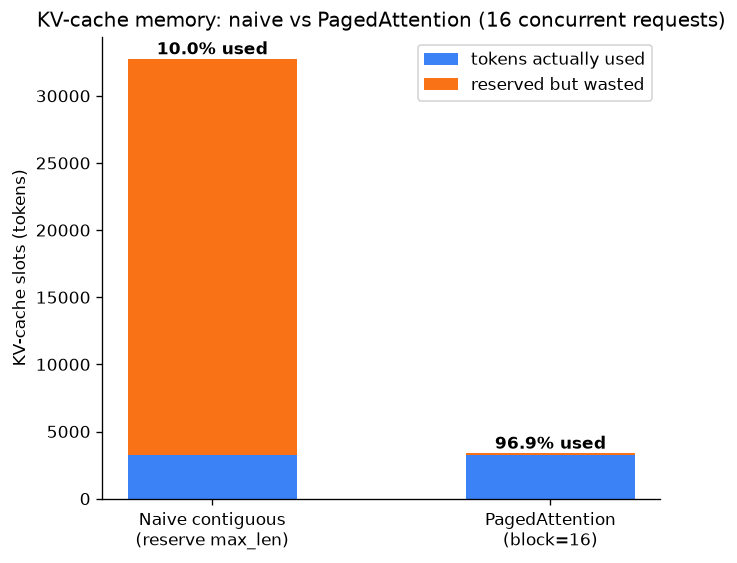

# Day 103 — Serving (vLLM, continuous batching)

## 🧠 CONCEPT OF THE DAY

**Intuition.** Yesterday's throughput/latency lesson (Concept 101) established *why* you want continuous batching: keep the GPU fed with a fluid mix of requests instead of waiting for a whole static batch to drain. But continuous batching has a dirty secret — it only works if you can cheaply grow and shrink each request's KV cache on the fly. Pre-vLLM serving systems couldn't: they pre-allocated one **contiguous** slab of GPU memory per request sized for the *worst case* (the model's max context length), because attention needs its K/V tensors laid out contiguously to do fast matmuls. A request that only ever generates 80 tokens still reserves space for 4096. Multiply that across dozens of concurrent requests and you're paying for memory you'll almost never touch — vLLM's benchmarks found 60–80% of KV-cache memory wasted this way in prior systems.

**PagedAttention** is the fix, and it's a direct steal from operating-systems virtual memory: stop reserving one contiguous slab per request. Instead, carve the KV cache into small fixed-size **blocks** (pages), hand a request only as many blocks as it currently needs, and keep a **block table** — a per-request lookup mapping "logical position in the sequence" → "physical block index in GPU memory." Attention math doesn't need K/V to be contiguous; it just needs to know *where* to gather them from, and the block table supplies exactly that indirection, page-table style.

**The math.** For a query at position $t$, standard attention needs $K_{1:t}, V_{1:t}$. With paging, block size $B$, and block table $\text{table}[i]$ mapping logical block $i$ to a physical block address:

$$K_{1:t} = \text{concat}\big(K^{\text{phys}}[\text{table}[0]],\, K^{\text{phys}}[\text{table}[1]],\, \ldots,\, K^{\text{phys}}[\text{table}[\lceil t/B\rceil - 1]]\big)$$

The physical blocks for one sequence need not be adjacent in memory — the gather at attention time stitches them together logically, exactly like a CPU's MMU translating virtual pages to scattered physical frames.

Waste is now bounded per request, not proportional to max context:

$$\text{waste}_{\text{paged}} \le B - 1 \quad \text{tokens, vs.} \quad \text{waste}_{\text{naive}} = \text{max\_len} - \text{actual\_len}$$

Smaller $B$ → less waste but more block-table bookkeeping and more (smaller) memory-access indirections per attention call; larger $B$ → less overhead but more wasted tail space per sequence. The graph below makes the gap concrete with $B=16$ across 16 synthetic concurrent requests.



That memory reclaimed is not cosmetic — it's throughput. Continuous batching's ceiling is "how many sequences' KV caches fit in GPU memory at once," so cutting per-sequence reservation by 10× roughly means 10× more concurrent sequences, which is the actual mechanism behind vLLM's headline throughput numbers over naive HuggingFace-style serving. This is also why vLLM supports **cheap prefix sharing**: two requests with an identical system prompt can literally point their block tables at the *same* physical blocks (copy-on-write, just like OS fork()) instead of duplicating that prefix's K/V in memory.

**Why it matters / where it leads.** PagedAttention closes the "serving systems" thread that started with mixed precision (96) and ran through parallelism (98), ZeRO (99), and batching (101) — it's the concrete example of an OS idea (virtual memory) solving an ML systems problem, and it sets up tomorrow's RL block (104) by finishing the "how do you actually run a trained model at scale" arc before we pivot to "how do you train one to make decisions."

**Interview-style question:** *A batch of requests sharing an identical 2,000-token system prompt arrives at your vLLM-style server. Walk through, at the block-table level, how PagedAttention avoids recomputing or duplicating that shared prefix — and what has to happen to a shared block's table entries the instant one of those requests starts generating a token that diverges from the others.*

---

## 🐍 PYTHONIC EDGE

Serving is exactly where "collect everything, then return" quietly kills latency. Compare returning a full completion vs. streaming tokens as they're produced — this is the actual mechanism behind every "typing" effect you've seen in an LLM UI.

```python
from typing import Iterator  # type hint only — Python doesn't enforce this at runtime like C++ would

# ---- BAD: batch collect-then-return ----
def generate_bad(model, prompt: str, max_tokens: int) -> str:
    tokens = []
    for _ in range(max_tokens):          # range() here is a lazy object, not a materialized list — cheap even for huge max_tokens
        tok = model.step(prompt, tokens)
        tokens.append(tok)
        if tok == "<eos>":               # `==` compares by value, same as C++ for primitives/strings
            break
    return "".join(tokens)               # caller gets NOTHING until every token exists — first-byte latency == full latency

# usage: caller blocks here for the entire generation
text = generate_bad(model, "Explain PagedAttention", 200)


# ---- CLEAN: generator streams tokens as they're produced ----
def generate_stream(model, prompt: str, max_tokens: int) -> Iterator[str]:
    tokens = []
    for _ in range(max_tokens):
        tok = model.step(prompt, tokens)
        tokens.append(tok)
        yield tok                        # `yield` — no C++ equivalent; turns this function into a generator,
                                          # pausing execution and handing control back to the caller each call
        if tok == "<eos>":
            break

# usage: caller gets each token the instant it's ready — this IS the mechanism behind streaming APIs
for piece in generate_stream(model, "Explain PagedAttention", 200):  # `in` here drives the generator's __next__ under the hood
    print(piece, end="", flush=True)     # keyword-only-by-convention args (end=, flush=) — no positional equivalent in C++ iostream
```

The generator version isn't "the same logic with a different keyword" — swapping `return "".join(tokens)` for a per-iteration `yield tok` changes the function's latency profile from *O(total generation time) to first byte* down to *O(one decode step) to first byte*, with zero extra memory since nothing is buffered. This is precisely the client-visible effect of continuous batching done right server-side.

---

## 📡 SIGNAL LAB

PagedAttention's block-size trade-off has an exact analogue in your world: **STFT framing**.

**Setup.** You frame a signal of length $N$ into fixed windows of size $F$ for an STFT. If $N$ isn't a multiple of $F$, the last frame gets zero-padded — wasted samples that contribute no new information, structurally identical to a PagedAttention sequence's last, partially-filled block.

**Worked numbers.** Take $N = 1000$ samples.

- Frame size $F = 128$: number of frames $= \lceil 1000/128 \rceil = 8$, padded length $= 8 \times 128 = 1024$, waste $= 24$ samples ($2.4\%$).
- Frame size $F = 32$: frames $= \lceil 1000/32 \rceil = 32$, padded length $= 1024$, waste $= 24$ samples too — but now you've paid for **32 FFT calls instead of 8**, each with a coarser frequency resolution ($\Delta f = f_s/F$ shrinks as $F$ shrinks... wait, grows as $F$ shrinks — smaller windows mean *worse* frequency resolution by the uncertainty-principle trade with time resolution).

Compare directly to PagedAttention: block size $B=16$ vs $B=128$ over a 1000-token sequence gives waste of at most 15 vs at most 127 tokens — bigger blocks waste more per-sequence tail space but need $\lceil 1000/128\rceil = 8$ block-table entries instead of $\lceil 1000/16 \rceil = 63$.

**The so-what:** both systems face the *identical* knob — smaller chunks (blocks or frames) minimize tail waste but multiply per-chunk bookkeeping/compute overhead (block-table lookups vs FFT calls), while the FFT case adds a second, harsher cost: shrinking the frame doesn't just add overhead, it structurally destroys frequency resolution via the time–frequency uncertainty trade-off. PagedAttention's "small blocks are just more indirection" is a comparatively gentle trade-off — precisely because unlike a frame size, a KV-cache block size doesn't encode any physical resolution trade-off, just a bookkeeping one. Recognizing which knobs are "free-ish overhead trades" vs "fundamental resolution trades" is the same judgment call whether you're tuning a spectrogram or a serving engine.

---

## 🏋️ THE GAUNTLET

**GPU Slot Scheduler**

You're building the admission-control layer in front of a continuous-batching server. You're given `n` requests, each as `[arrival, departure)` — the half-open time interval (in scheduler ticks) during which that request occupies one KV-cache "slot." A request occupies exactly one slot for its whole `[arrival, departure)` window.

Return the **minimum number of concurrent slots** the server must provision so that no two overlapping requests are ever denied a slot at the same time.

**Constraints:** `1 <= n <= 2 * 10^5`, `0 <= arrival < departure <= 10^9`.

**Example:** `[[0,10],[5,15],[12,20]]` → requests 1 and 2 overlap during `[5,10)`, and 2 and 3 overlap during `[12,15)`, but 1 and 3 never overlap → answer is `2`.

**Hint 1:** You don't need to simulate every tick from 0 to 10^9 — only the moments where the count of active requests can *change* matter at all.

**Hint 2:** Separate arrivals and departures into two sorted lists and sweep through time comparing "next arrival" against "next departure" — think merge-step of merge sort, not a per-tick loop.

**Hint 3:** At a tick where an arrival and a departure are equal, the departure must be processed first — a slot freed at time `t` (interval is half-open, `[arrival, departure)`) is available for a request arriving exactly at `t`.

**Pattern:** sweep line over separately-sorted event times (equivalently: a min-heap of active departures). **Target complexity:** O(n log n) time, O(n) space.

---

## 🏗️ BLUEPRINT

No blueprint today — today's concept section *is* the systems deep-dive.

---

## 🗺️ MARCHING ORDERS

You've now closed the full "train it, then actually serve it" loop — mixed precision through parallelism, ZeRO, batching, and today's memory-paging trick are the difference between a model that works in a notebook and one that survives production traffic. That's a real, hireable skill stack on its own.

Tomorrow: Concept 104 — RL basics (MDP, reward, policy)

---

🔓 GAUNTLET SOLUTION

```cpp
#include <vector>
#include <algorithm>
using namespace std;

int minSlots(vector<vector<int>>& requests) {
    int n = requests.size();
    vector<int> arrivals(n), departures(n);
    for (int i = 0; i < n; ++i) {
        arrivals[i]   = requests[i][0];
        departures[i] = requests[i][1];
    }
    sort(arrivals.begin(), arrivals.end());
    sort(departures.begin(), departures.end());

    int active = 0, maxActive = 0;
    int i = 0, j = 0;
    while (i < n) {
        if (arrivals[i] < departures[j]) {
            // a new request starts before the earliest active one ends
            ++active;
            maxActive = max(maxActive, active);
            ++i;
        } else {
            // departures[j] <= arrivals[i]: free the slot first (half-open interval)
            --active;
            ++j;
        }
    }
    return maxActive;
}
```

Sorting is O(n log n); the sweep itself is a single O(n) merge-style pass, so overall O(n log n) time, O(n) extra space for the two sorted arrays.

💡 CONCEPT ANSWER

When requests share an identical prefix, their block tables' entries for those prefix positions point at the *same* physical blocks — no extra K/V is computed or stored, it's pure pointer/reference sharing, exactly like copy-on-write pages after a `fork()`. The moment any one of those requests generates a token that makes it diverge (its own next token differs, or it needs to *write* into a block another request is still reading), the server must **copy-on-write**: allocate a fresh physical block, copy the shared block's contents into it, redirect that one request's block-table entry to the new physical block, and leave every other request's table entry pointing at the original — mirroring exactly how OS copy-on-write forks a page only when a write actually occurs, not preemptively.
