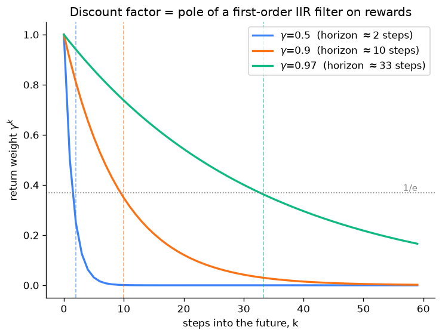

# Day 104 — RL basics (MDP, reward, policy)

## 🧠 CONCEPT OF THE DAY

**Intuition.** Every supervised-learning concept you've covered so far assumes someone hands you the right answer (a label) and you minimize distance to it. Reinforcement learning drops that crutch: an **agent** sits in some **state**, takes an **action**, the world spits back a **reward** and a **new state**, and nobody ever tells the agent what the "correct" action was — only whether things went well or badly, often with the payoff delayed by dozens of steps. Think of it like learning to ride a bike purely from occasionally falling over: no instructor labels each pedal stroke as right or wrong, you just feel the crash a few seconds after the mistake that caused it, and have to work backward to figure out *which* action gets the credit (or blame). That backward-credit problem is the entire field in one sentence.

**The math.** Formalize the world as a **Markov Decision Process** (MDP): a tuple $(\mathcal{S}, \mathcal{A}, P, R, \gamma)$ where $\mathcal{S}$ is the set of states, $\mathcal{A}$ the set of actions, $P(s'\mid s,a)$ the transition probability of landing in state $s'$ after taking action $a$ in state $s$, $R(s,a,s')$ the reward for that transition, and $\gamma \in [0,1)$ the discount factor. "Markov" means $P$ and $R$ depend only on the *current* state and action — the entire history is compressed into $s$, so the agent never needs a memory of how it got there.

A **policy** $\pi(a \mid s)$ is the agent's strategy: a distribution over actions given a state (or, deterministically, a function $s \mapsto a$). Given a trajectory generated by following $\pi$, define the **return**:

$$G_t = \sum_{k=0}^{\infty} \gamma^k r_{t+k+1}$$

and the **value function** — the expected return from state $s$ under policy $\pi$:

$$V^{\pi}(s) = \mathbb{E}_{\pi}\big[G_t \mid s_t = s\big]$$

The **action-value function** $Q^\pi(s,a)$ is the same idea but conditioned on taking a specific first action $a$ before following $\pi$ thereafter. Both satisfy a recursive identity — the **Bellman equation** — which is the single most important equation in RL because it turns an infinite sum into a one-step lookahead:

$$V^{\pi}(s) = \sum_{a} \pi(a\mid s) \sum_{s'} P(s' \mid s, a)\Big[R(s,a,s') + \gamma\, V^{\pi}(s')\Big]$$

The **optimal** value function $V^*(s) = \max_\pi V^\pi(s)$ satisfies the Bellman *optimality* equation — same shape, but with the sum over actions replaced by a $\max$:

$$V^{*}(s) = \max_{a} \sum_{s'} P(s' \mid s, a)\Big[R(s,a,s') + \gamma\, V^{*}(s')\Big]$$

Any policy that greedily picks $\arg\max_a$ against $Q^*$ is an optimal policy. That single fact — optimal *value* implies optimal *policy* — is the entire justification for every value-based method you'll meet this week.

**Why it matters / where it leads.** This is the vocabulary the next four days build directly on top of: tomorrow's Q-learning/DQN *is* an algorithm for approximating $Q^*$ from sampled transitions instead of a known $P$; policy gradients (106) skip value estimation and climb $\nabla_\theta \mathbb{E}[G_t]$ directly; actor-critic/PPO (107) is the hybrid of both. It also retroactively explains RLHF (Concept 72, back in Phase 7): the reward model you trained there is exactly $R$, the policy being optimized is exactly $\pi_\theta$, and PPO is doing precisely the constrained policy-improvement step described above on a language model's token-generation MDP.

**Interview-style question:** *Why do we discount future rewards with $\gamma < 1$ instead of just summing raw rewards forever? Give one mathematical reason and one practical/behavioral reason.*

---

## 🐍 PYTHONIC EDGE

Computing $G_t$ for every timestep in a trajectory is the single most common "day one" RL bug: people write an $O(n^2)$ nested loop (for each $t$, resum the whole future) when it's actually a linear backward recurrence. This is also literally the discrete IIR filter you're about to meet in SIGNAL LAB.

```python
import numpy as np

rewards = np.array([1.0, 0.0, 2.0, 0.0, 3.0])  # a toy reward trajectory
gamma = 0.9

# ---- BAD: O(n^2) — recompute the whole future sum at every t ----
def discounted_returns_slow(rewards, gamma):
    n = len(rewards)
    G = np.zeros(n)  # preallocate; np.zeros returns an array, not a Python list
    for t in range(n):  # range(n) is a lazy object in Python 3, not a materialized list like C++'s std::vector would be
        total = 0.0
        for k in range(n - t):  # nested loop: this is the O(n^2) smell
            total += (gamma ** k) * rewards[t + k]  # ** is exponentiation (C++: std::pow or gamma*gamma*...)
        G[t] = total
    return G

# ---- CLEAN: O(n) — backward recurrence G[t] = r[t] + gamma * G[t+1] ----
def discounted_returns_fast(rewards, gamma):
    G = np.zeros_like(rewards)  # same shape/dtype as `rewards`; no manual shape bookkeeping
    running = 0.0
    for t in range(len(rewards) - 1, -1, -1):  # negative step walks backward; -1 as stop means "down to and including 0"
        running = rewards[t] + gamma * running  # @ would be matmul here if these were matrices, not scalars
        G[t] = running
    return G[::-1][::-1]  # slice notation a:b:step — shown for illustration; the loop above already fills G in order

fast = discounted_returns_fast(rewards, gamma)
slow = discounted_returns_slow(rewards, gamma)
assert np.allclose(fast, slow)  # assert: raises AssertionError if False (C++: assert() from <cassert>, stripped in NDEBUG builds)
print(fast)
```

The clean version is one pass, no recomputation — and it's exactly `scipy.signal.lfilter` applied to the *reversed* reward array with filter coefficients `([1], [1, -gamma])`, which is worth knowing if you ever need to vectorize this across a whole batch of trajectories instead of looping in Python.

---

## 📡 SIGNAL LAB

Look again at the recurrence from the Pythonic Edge: $G_t = r_t + \gamma\, G_{t+1}$. Read backward-in-time as forward-in-time over a reversed signal, this is a canonical **first-order IIR (infinite impulse response) filter**:

$$H(z) = \frac{1}{1 - \gamma z^{-1}}, \qquad \text{single pole at } z = \gamma$$

Since $0 \le \gamma < 1$, the pole sits inside the unit circle on the positive real axis — the filter is stable (BIBO-stable, in fact, since $|\gamma|<1$), and its impulse response is $h[k] = \gamma^k$: a decaying exponential, i.e. a **low-pass filter** on the reward stream. $\gamma$ directly sets the filter's time constant — the number of future steps the agent's value estimate meaningfully "listens to" before the weight decays past $1/e$:

$$\text{effective horizon} \approx \frac{1}{1-\gamma}$$

The graph below makes this concrete for three common choices of $\gamma$:



**Worked example.** $\gamma = 0.99$ (a common choice for long-horizon tasks) gives an effective horizon of $1/(1-0.99) = 100$ steps — the agent is effectively deaf to rewards more than ~100 steps out, no matter how large they are, because their weight has decayed to $\approx 0.99^{100} \approx 0.37$ of the immediate reward's weight and keeps shrinking geometrically past that.

**So what.** This is the same lens you already use for choosing an EMA smoothing constant or a leaky integrator's pole location in a tracking filter — "how much does the discount factor matter" is not a hyperparameter-tuning mystery, it's "what's my required look-ahead window," converted through $\gamma = 1 - 1/N$ for a desired horizon $N$. If your task has sparse rewards 500 steps out and you pick $\gamma=0.9$ (horizon $\approx 10$), the math guarantees the agent structurally cannot credit that reward back to the actions that caused it — no amount of extra training fixes a pole placed in the wrong spot.

---

## 🏋️ THE GAUNTLET

**The Reward Path.** You're an agent walking down a row of $n$ houses, indexed $0$ to $n-1$. House $i$ holds reward `nums[i]` ($0 \le \texttt{nums[i]} \le 10^4$). Your policy has exactly two actions at each house: **take** its reward, or **skip** it — but the adjacency alarm means you can never take two *adjacent* houses in the same run. Starting before house 0, choose a sequence of take/skip actions maximizing total reward collected.

Constraints: $1 \le n \le 10^5$. Return the maximum total reward (a single integer).

**Hint 1:** Model it as a tiny MDP: the state at house $i$ is really "did I just take house $i-1$ or not," and the action space is `{take, skip}`. Write $f(i)$ = the best total reward achievable using only houses $0..i$.

**Hint 2:** From house $i$, either you skip it ($f(i) = f(i-1)$) or you take it, in which case house $i-1$ must have been skipped ($f(i) = \texttt{nums[i]} + f(i-2)$). You only ever need the last two $f$ values, not the whole array.

**Hint 3:** This recurrence *is* a one-step Bellman backup on a deterministic 2-action MDP — $f(i) = \max_a \big[R(a) + f(\text{next state under } a)\big]$ — which is exactly why an exchange argument (swapping any suboptimal local choice strictly improves the total, contradiction) proves $f$ as defined is optimal, not just a heuristic.

**Pattern:** linear DP / Bellman recurrence on a chain-shaped state space. **Target complexity:** $O(n)$ time, $O(1)$ space.

---

## 🏗️ BLUEPRINT

No blueprint today — today's concept section carries the full theoretical load.

---

## 🗺️ MARCHING ORDERS

You now have the vocabulary — states, actions, policies, returns, Bellman equations — that every RL paper you'll ever read assumes you already know; everything from here through Concept 112 is "how do we actually compute or approximate this without knowing $P$ in advance."

Tomorrow: Concept 105 — Q-learning & DQN

---

🔓 GAUNTLET SOLUTION

```cpp
#include <vector>
#include <algorithm>
using namespace std;

int rob(vector<int>& nums) {
    int n = nums.size();
    if (n == 0) return 0;
    if (n == 1) return nums[0];

    int prev2 = 0;          // f(i-2)
    int prev1 = nums[0];    // f(i-1), base case f(0) = nums[0]

    for (int i = 1; i < n; ++i) {
        int take = nums[i] + prev2;   // take house i, must have skipped i-1
        int skip = prev1;             // skip house i, carry forward best so far
        int curr = max(take, skip);
        prev2 = prev1;
        prev1 = curr;
    }
    return prev1;
}
```

One linear pass, two rolling variables instead of a full DP array — $O(n)$ time, $O(1)$ space.

💡 CONCEPT ANSWER

**Mathematical reason:** without discounting, $G_t = \sum_{k=0}^\infty r_{t+k+1}$ can diverge to infinity for any policy that earns nonzero reward forever, making it impossible to compare two policies' values (both are $+\infty$) or even guarantee the Bellman equation has a fixed point — $\gamma < 1$ turns the geometric series into something that provably converges whenever rewards are bounded, which is what makes $V^\pi$ and the Bellman operator (a $\gamma$-contraction) well-defined in the first place. **Practical/behavioral reason:** discounting encodes a real preference for reward *sooner* rather than later (matching real-world uncertainty about whether the episode/world will even continue, and matching how humans and financial systems actually value time), and it bounds how far back the credit-assignment problem has to reach — without it, an agent would have to weigh a reward 10,000 steps away exactly as heavily as one next step, which both matches nothing about most real tasks and makes learning drastically noisier and slower to converge.
