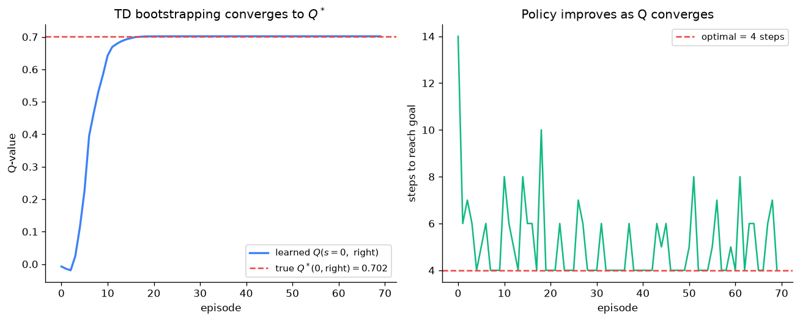

# Day 105 — Q-learning & DQN

## 🧠 CONCEPT OF THE DAY

**Intuition.** Yesterday's Bellman equations assumed you already know the world's rulebook — the transition function $P$. In reality you almost never do: you can only *act* and *observe* what happens. Q-learning's trick is to keep revising your best guess of $Q^*(s,a)$ using nothing but your *own current guess* of what comes next, the same way you continuously re-estimate your ETA on a road trip using your current best guess of the remaining drive time at each mile marker, rather than waiting until you actually arrive to find out whether your original estimate was right. You never need the map (P); you only need to keep correcting your guess against a slightly-better guess one step later. That self-referential correction is called **bootstrapping**, and it's the single idea that makes model-free RL possible.

**The math.** The **Q-learning update** applied after every observed transition $(s_t, a_t, r_t, s_{t+1})$:

$$Q(s_t,a_t) \leftarrow Q(s_t,a_t) + \alpha\Big[\underbrace{r_t + \gamma \max_{a'} Q(s_{t+1},a') - Q(s_t,a_t)}_{\delta_t,\ \text{the TD error}}\Big]$$

where $\alpha$ is the learning rate and $\delta_t$ is the **temporal-difference (TD) error** — the gap between "what I currently believe" ($Q(s_t,a_t)$) and "what one real observed step plus my own future guess suggests" ($r_t + \gamma\max_{a'}Q(s_{t+1},a')$). Two things make this deceptively powerful: it's **off-policy** (the $\max_{a'}$ targets the *greedy* policy regardless of which action you actually explored with, e.g. $\varepsilon$-greedy), and under mild conditions (every state-action pair visited infinitely often, a Robbins–Monro-style decaying $\alpha$) tabular Q-learning is *guaranteed* to converge to $Q^*$.

That guarantee evaporates the moment $Q$ is a table too large to store — a chess board, a game screen, a continuous robot state. **DQN (Deep Q-Network)** swaps the table for a neural net $Q_\theta(s,a)$ and minimizes:

$$L(\theta) = \mathbb{E}_{(s,a,r,s') \sim \mathcal{D}}\Big[\big(\underbrace{r + \gamma \max_{a'} Q_{\theta^-}(s',a')}_{\text{target, treated as constant}} - Q_\theta(s,a)\big)^2\Big]$$

Two engineering fixes make this actually stable, both addressing the same root cause: naively combining function approximation + bootstrapping + off-policy learning (RL's "deadly triad") tends to diverge, because you're using a *moving* network to define the target for training itself.
- **Experience replay** ($\mathcal{D}$): store transitions in a buffer, train on random minibatches instead of the live, highly-correlated stream — this both breaks correlation (closer to the i.i.d. assumption SGD wants) and reuses data for sample efficiency.
- **Target network** ($\theta^-$): a delayed/frozen copy of $\theta$, updated only every $C$ steps (or via Polyak averaging), used *only* to compute the target. Without it, every gradient step changes the target you're chasing, which is trying to hit a target that flinches every time you shoot at it.

**Why it matters / where it leads.** This is the last value-based idea before the field splits: tomorrow's policy gradients (106) throw away $Q$ entirely and climb $\nabla_\theta \mathbb{E}[G_t]$ directly over policy parameters, and actor-critic/PPO (107) — which you've already met conceptually via RLHF (Concept 72) — is the hybrid that keeps a Q-like critic *and* a policy. Understanding exactly why DQN needs its two stabilizers is also one of the most common RL interview screens, because it tests whether you understand *why* naive deep RL breaks, not just that DQN exists.

**Interview-style question:** *DQN combines function approximation, bootstrapping, and off-policy learning — the "deadly triad" that's known to risk divergence. Name the two mechanisms DQN adds and state precisely which part of the triad's failure mode each one addresses.*

---

## 🐍 PYTHONIC EDGE

The most common DQN implementation bug is looping in Python to pull out $Q(s,a)$ for the specific action each transition actually took, instead of using a single vectorized gather over the batch.

```python
import torch
import torch.nn as nn

class QNetwork(nn.Module):  # single inheritance from nn.Module (C++: class QNetwork : public nn::Module)
    def __init__(self, state_dim, n_actions):  # constructor; self is explicit (C++'s `this` is implicit)
        super().__init__()  # runs nn.Module's constructor first (C++: QNetwork() : nn::Module() { ... })
        self.net = nn.Sequential(  # instance attribute; C++ would declare this in the header, init in the body
            nn.Linear(state_dim, 64), nn.ReLU(), nn.Linear(64, n_actions)
        )

    def forward(self, state):  # defines the computation; never call this directly
        return self.net(state)

q_net = QNetwork(state_dim=4, n_actions=2)
states = torch.randn(32, 4)          # a batch of 32 states
actions = torch.randint(0, 2, (32,)) # the action actually taken in each transition, shape (32,)

q_values = q_net(states)  # calls __call__, which wraps forward() with hooks -- q_net.forward(states) would skip them
# q_values has shape (32, 2): one Q-value per action, for every row in the batch

# ---- BAD: Python loop to pick out Q(s, a) per row ----
q_sa_slow = torch.stack([q_values[i, actions[i]] for i in range(32)])  # list comprehension; O(batch) Python-level work

# ---- CLEAN: vectorized gather, no Python loop at all ----
q_sa_fast = q_values.gather(1, actions.unsqueeze(1)).squeeze(1)
# .gather(dim, index): pick one element per row along dim=1 using `actions` as the index
# .unsqueeze(1): actions is (32,) -> (32, 1) so its shape matches what gather expects
# .squeeze(1): undo that, back to (32,) -- the trailing underscore-free ops here return NEW tensors (not in-place)

assert torch.equal(q_sa_slow, q_sa_fast)  # assert raises AssertionError if False (C++: assert() from <cassert>)

# ---- computing the TD target: must NOT track gradients through the target network ----
target_net = QNetwork(4, 2)
next_states = torch.randn(32, 4)
rewards = torch.randn(32)
gamma = 0.99

with torch.no_grad():  # context manager: disables autograd tracking inside this block (no C++ equivalent construct)
    next_q_max = target_net(next_states).max(dim=1).values  # .max() returns a (values, indices) named tuple
    td_target = rewards + gamma * next_q_max  # no .detach() needed -- nothing here was ever tracked

loss = nn.functional.mse_loss(q_sa_fast, td_target)
```

`gather` is the general pattern any time you need "one value per row, indexed differently per row" — the alternative is always a slow, un-vectorized Python loop like `q_sa_slow` above.

---

## 📡 SIGNAL LAB

Look closely at the scalar Q-learning update again: $Q(s,a) \leftarrow Q(s,a) + \alpha\,\delta$. If you one-hot encode the state-action pair as a unit vector $e_{s,a}$ in a $|\mathcal{S}||\mathcal{A}|$-dimensional table and treat $Q$ as a weight vector $w$, this is *exactly* the **LMS (least-mean-squares / Widrow–Hoff) adaptive filter update**:

$$w \leftarrow w + \alpha\, e[n]\, x[n], \qquad e[n] = d[n] - w^\top x[n]$$

with $x[n] = e_{s,a}$ (the "input signal"), $d[n] = r + \gamma\max_{a'}Q(s',a')$ (the "desired signal," i.e. the bootstrapped target), and $e[n] = \delta_t$ the innovation/error — the same adaptive-filter update used in echo cancellation and adaptive noise cancellation, where a filter continuously corrects itself against a noisy, only-locally-observed target.

**Worked example.** LMS theory gives a well-known stability/tracking tradeoff governed entirely by the step size $\alpha$: too large, and the filter has high **misadjustment** — it never settles, oscillating around the true weight because each noisy sample perturbs it too much; too small, and it tracks a **non-stationary** target too slowly to keep up before the target itself moves again. Q-learning's target $r + \gamma\max_{a'}Q(s',a')$ is *itself* built from $Q$, so as $Q$ improves the target keeps shifting — a genuinely non-stationary regression problem, structurally identical to an LMS filter tracking a slowly time-varying system.

**So what.** This is exactly the lens for choosing $\alpha$ in Q-learning: it isn't a black-box hyperparameter, it's the same misadjustment-vs-tracking-speed dial you already reason about when picking a step size for an adaptive filter. Picking $\alpha$ too high in tabular Q-learning produces the same symptom as an LMS filter with too large a step: the learned $Q$ oscillates noisily around $Q^*$ instead of converging — which is precisely why Robbins–Monro convergence proofs require $\alpha$ to *decay* over time (shrinking step size = shrinking misadjustment, at the cost of slower tracking of the still-nonstationary early bootstrap targets).



---

## 🏋️ THE GAUNTLET

**Fewest Jumps to the End.** You're given an array `nums` of length $n$, where `nums[i]` is the farthest you're allowed to jump forward from index $i$ in one move ($0 \le \texttt{nums[i]} \le 10^4$). Starting at index 0, return the minimum number of jumps needed to reach index $n-1$. It's guaranteed you can always reach the end.

Constraints: $1 \le n \le 10^5$.

**Hint 1:** Model this as an unweighted graph where index $i$ has an edge to every index in $[i{+}1,\ i{+}\texttt{nums[i]}]$. The minimum number of jumps is the BFS shortest-path distance from node 0 to node $n{-}1$ — but building that graph explicitly is $O(n^2)$ edges in the worst case, so you need the BFS *without ever materializing the graph*.

**Hint 2:** BFS explores level by level. Track `currentEnd` = the farthest index reachable using the jumps counted so far (the boundary of the *current* BFS level), and `farthest` = the farthest index reachable from *any* node visited while scanning up to `currentEnd` (that defines the *next* level's boundary). One pass over the array, updating `farthest` as you go.

**Hint 3:** When your scan index $i$ reaches `currentEnd`, you've exhausted the current BFS level — increment the jump count and set `currentEnd = farthest`. Every index is visited exactly once across the whole scan, so this is BFS with an implicit queue: the "queue" is just the range `[currentEnd_old+1, currentEnd_new]`.

**Pattern:** greedy interval expansion = BFS by levels without an explicit queue. **Target complexity:** $O(n)$ time, $O(1)$ extra space.

---

## 🏗️ BLUEPRINT

**Replay buffer capacity is a memory-vs-freshness tradeoff, not a "bigger is always better" knob.** A small buffer (e.g. $10^4$ transitions) keeps the training distribution close to the *current* policy — useful since the environment's effective difficulty changes as the agent improves — but reintroduces the correlated, non-i.i.d. sampling problem replay was invented to kill. A large buffer (Atari DQN used $10^6$) gives much closer-to-i.i.d. minibatches and smoother gradients, but wastes memory holding transitions collected under a policy far worse than the current one, and dilutes how much any single fresh, informative transition influences an update. **Prioritized Experience Replay** (sampling proportional to $|\delta_t|$) fixes the sample-efficiency side of that tradeoff, but introduces sampling bias that must be corrected with importance-sampling weights — skip that correction and your $Q$ converges to the wrong fixed point, just more "efficiently."

---

## 🗺️ MARCHING ORDERS

You now have both halves of value-based RL — the tabular guarantee and the two tricks (replay, target network) that let it survive contact with a neural net; every "why did my DQN diverge" debugging session traces back to one of those two mechanisms being broken or misconfigured.

Tomorrow: Concept 106 — Policy gradients / REINFORCE

---

🔓 GAUNTLET SOLUTION

```cpp
#include <vector>
#include <algorithm>
using namespace std;

int jump(vector<int>& nums) {
    int n = nums.size();
    int jumps = 0, currentEnd = 0, farthest = 0;

    for (int i = 0; i < n - 1; ++i) {
        farthest = max(farthest, i + nums[i]);  // best reach seen so far in this BFS level
        if (i == currentEnd) {                  // exhausted the current level
            ++jumps;
            currentEnd = farthest;              // advance to the next level's boundary
            if (currentEnd >= n - 1) break;      // early exit once the end is already reachable
        }
    }
    return jumps;
}
```

One linear pass, two rolling bounds instead of an explicit BFS queue — $O(n)$ time, $O(1)$ extra space.

💡 CONCEPT ANSWER

**Experience replay** breaks the correlation between consecutive samples that vanilla online Q-learning with a neural net would train on — SGD's convergence assumptions lean on roughly i.i.d. minibatches, and a live trajectory is anything but (consecutive states are nearly identical, so gradients are highly correlated and can push the network to overfit to whatever region of state space it's currently passing through). **The target network** stops the bootstrap target from moving on every single gradient step: without it, $\theta$ appears on both sides of the loss (defining both the prediction $Q_\theta(s,a)$ and, through $\theta^- = \theta$, the target), so every update to make the prediction closer to the target also shifts the target itself — a feedback loop that can oscillate or diverge outright. Freezing $\theta^-$ for $C$ steps (or Polyak-averaging it) turns the target into something that only drifts slowly and predictably, which is enough to keep the regression well-posed despite the deadly triad still technically being present.
