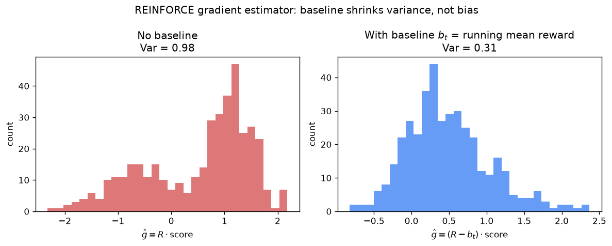

# Day 106 — Policy Gradients / REINFORCE

## 🧠 CONCEPT OF THE DAY

**Intuition.** DQN (yesterday) learns *values* — "how good is each action here?" — and then acts by taking the argmax. That's fine when actions are a small discrete menu, but it breaks down the moment actions are continuous (steering angle, joint torque) or when you'd rather have a *stochastic* policy (rock-paper-scissors has no deterministic optimum). Policy gradients skip the value-estimation middleman entirely: parameterize the policy $\pi_\theta(a \mid s)$ directly — a neural net that outputs a probability distribution over actions — and nudge $\theta$ so that actions which historically led to *high return* become more probable, and actions that led to low return become less probable. No argmax, no value table. Just "do more of what worked."

**The math.** We want to maximize expected return over trajectories sampled from our own policy:

$$J(\theta) = \mathbb{E}_{\tau \sim \pi_\theta}\left[ R(\tau) \right]$$

where $\tau = (s_0, a_0, r_0, s_1, a_1, r_1, \dots)$ is a trajectory and $R(\tau) = \sum_t \gamma^t r_t$ is its discounted return. The **policy gradient theorem** gives a beautifully tractable form for $\nabla_\theta J$ that never requires differentiating through the environment (which is usually a non-differentiable black box):

$$\nabla_\theta J(\theta) = \mathbb{E}_{\tau \sim \pi_\theta}\left[ \sum_t \nabla_\theta \log \pi_\theta(a_t \mid s_t) \, G_t \right]$$

- $\pi_\theta(a_t \mid s_t)$ — probability the policy assigns to the action actually taken at step $t$.
- $\nabla_\theta \log \pi_\theta(a_t \mid s_t)$ — the "score function": which direction in parameter space increases that action's log-probability.
- $G_t = \sum_{k \ge t} \gamma^{k-t} r_k$ — the return-to-go from step $t$ onward — the credit assigned to that action.

**REINFORCE** (Williams, 1992) is just Monte Carlo estimation of this expectation: run an episode, compute $G_t$ for every timestep, and take a gradient step:

$$\theta \leftarrow \theta + \alpha \sum_t \nabla_\theta \log \pi_\theta(a_t \mid s_t) \, G_t$$

Read this update as: *"increase the log-probability of $a_t$, scaled by how good the rest of the episode turned out."* An action followed by a great episode gets reinforced; an action followed by a bad one gets suppressed — even if that particular action wasn't the culprit. That's the core weakness: **credit is assigned to every action in the trajectory using the same scalar $G_t$, and $G_t$ itself is a single noisy Monte Carlo sample of a highly stochastic quantity.** The gradient estimate is unbiased but has brutal variance — see the graph below.



The standard fix — used everywhere in practice — is a **baseline** $b(s_t)$ subtracted from $G_t$:

$$\nabla_\theta J(\theta) = \mathbb{E}\left[ \sum_t \nabla_\theta \log \pi_\theta(a_t \mid s_t) \, \big(G_t - b(s_t)\big) \right]$$

This is unbiased for *any* baseline that doesn't depend on $a_t$ (the score function has zero expectation, so a constant shift contributes nothing to the mean — only to the variance). A common choice is $b(s_t) \approx V^{\pi}(s_t)$, the state-value function — which is exactly the seed for tomorrow's actor-critic methods: learn a small critic network to produce $b(s_t)$ on the fly instead of using a crude running average.

**Why it matters / where it leads.** This is the fork in the road of modern RL: DQN and friends are the *value-based* branch, REINFORCE is the root of the *policy-based* branch, and tomorrow's actor-critic / PPO is what happens when you combine both — use a learned critic as the baseline to kill variance while keeping the policy-gradient machinery that scales to continuous action spaces. This exact "sample-then-reduce-variance" pattern also underlies RLHF (Concept 72): the reward model's job is partly to serve as a low-variance training signal for a policy-gradient-style update on the language model's token distribution.

**Interview question:** *REINFORCE is an unbiased estimator of the true policy gradient, yet it's rarely used as-is in production RL systems. Why, and what's the simplest one-line fix — and why doesn't that fix introduce bias?*

---

## 🐍 PYTHONIC EDGE

`torch.distributions` exists specifically so you never hand-roll `log(prob[action])` bookkeeping — it also makes sampling, entropy, and gradient flow behave correctly without you thinking about it.

```python
import torch
import torch.nn as nn
from torch.distributions import Categorical  # gives sampling + log_prob + entropy in one object

class PolicyNet(nn.Module):                  # class X(Base): Python's single-inheritance syntax;
                                              # C++ equivalent: class PolicyNet : public nn::Module
    def __init__(self, obs_dim, n_actions):  # constructor; `self` is C++'s implicit `this`,
                                              # but Python makes it an explicit first parameter
        super().__init__()                   # call parent ctor; C++ instead uses an
                                              # initializer list: PolicyNet() : nn::Module() {}
        self.fc = nn.Linear(obs_dim, n_actions)
        # instance attribute set directly in the body; C++ would declare `fc` in the
        # header and initialize it in the constructor body or init-list

    def forward(self, x):                    # NEVER call this directly -- see below
        return self.fc(x)                    # raw logits; softmax happens inside Categorical

policy = PolicyNet(obs_dim=4, n_actions=2)

# --- THE BAD WAY: manual softmax + indexing, easy to get wrong (log(0), wrong dim, etc.) ---
logits = policy(state)                       # calling policy(...) invokes __call__, which
                                              # wraps forward() with hooks -- never call
                                              # policy.forward(state) directly
probs = torch.softmax(logits, dim=-1)        # dim=-1: negative indexing -- "last axis",
                                              # same idea as Python list[-1] but for tensor axes
action = torch.multinomial(probs, 1).item()  # .item() pulls a Python scalar out of a 0-d/1-elem tensor
log_prob = torch.log(probs[action])          # manual indexing -- silently wrong if probs
                                              # isn't detached/aligned correctly upstream

# --- THE CLEAN WAY: let the distribution object own sampling + log_prob together ---
dist = Categorical(logits=policy(state))     # Categorical is itself a class instance,
                                              # constructed here and used immediately
action = dist.sample()                       # sample() returns a tensor, not a Python int
log_prob = dist.log_prob(action)             # numerically stable; no manual softmax/log/indexing

# REINFORCE loss for a batch of (log_prob, return) pairs collected over an episode
returns = torch.tensor(returns_to_go)                       # G_t for every timestep
baseline = returns.mean()                                   # crude running-mean baseline
loss = -(log_probs * (returns - baseline)).sum()             # ** would be exponent (unused here);
                                                              # unary `-` because optimizers
                                                              # do gradient DESCENT but we want
                                                              # to ASCEND the policy objective
loss.backward()                                              # .backward() has a trailing
                                                              # underscore-less name but note
                                                              # .mul_(), .add_() etc. ARE in-place
                                                              # (mutate the tensor, return None-ish self)
```

One-line idiom worth internalizing: `for log_prob, r in zip(log_probs, rewards): ...` — `zip` pairs two parallel Python lists elementwise with no C++ equivalent (you'd hand-write an indexed loop or `std::views::zip` in C++23); combined with a list comprehension, `returns = [sum(rewards[t:]) for t in range(len(rewards))]` computes every $G_t$ in one line — no mutable accumulator loop needed.

---

## 📡 SIGNAL LAB

**Problem.** You estimate the power spectral density (PSD) of a stationary random process two ways: (1) a single **periodogram** — the squared magnitude of one FFT of your whole $N$-sample record — or (2) **Welch's method** — split the record into $K$ non-overlapping segments, take the periodogram of each, and average the $K$ results. Both are asymptotically unbiased estimators of the true PSD. Which has lower variance, and by what factor?

**Worked solution.** The periodogram of a single segment has a variance that does *not* shrink as segment length grows — more samples give you finer frequency resolution, not a less noisy estimate at each frequency bin (a classic gotcha). Each per-bin periodogram value behaves like a scaled $\chi^2_2$ random variable, with variance $\approx$ the *square* of the true PSD at that frequency, independent of $N$. Welch's method averages $K$ i.i.d.-ish periodogram estimates (one per segment), so by the standard variance-of-the-mean argument:

$$\text{Var}[\hat{S}_{\text{Welch}}(f)] \approx \frac{1}{K}\,\text{Var}[\hat{S}_{\text{periodogram}}(f)]$$

a $K\times$ variance reduction — at the direct cost of frequency resolution, since each segment is $N/K$ samples long ($\Delta f \propto K/N$). Sound familiar?

**The "so what."** This is *exactly* the same trade as REINFORCE's baseline, dressed in DSP clothing. A single periodogram is like a single-episode REINFORCE gradient estimate: unbiased, wildly noisy, unusable to make a confident decision from one draw. Welch's method is like averaging $K$ independent Monte Carlo return samples (or, better, using a learned baseline that absorbs the state-dependent part of the variance for free) — you spend a resource (segment length / episode count) to buy variance reduction, and both fields hit the identical wall: you cannot get bias-free noise reduction without either more samples or a smarter, correlated subtraction (windowing/tapering ≈ baseline subtraction — both remove a structured component of the estimator without touching its mean). For your own frequency-domain generative-forensics work: whenever you're eyeballing a single-shot spectral estimate of a synthesized image's radial PSD, ask whether you're looking at a "periodogram" (one noisy draw) or a "Welch estimate" (several azimuthal/radial bins averaged) before trusting a claimed spectral artifact.

---

## 🏋️ THE GAUNTLET

**Problem — Sliding Window Maximum.** Given an integer array `nums` and a window size `k`, return an array of the maximum value in each contiguous window of size `k` as it slides from the left end of the array to the right.

**Constraints:** $1 \le k \le \text{nums.length} \le 10^5$, $-10^4 \le \text{nums}[i] \le 10^4$. Your solution must run faster than the naive $O(nk)$ — target $O(n)$ overall.

**Hints (escalating):**
1. A max-heap gives you the running max in $O(\log n)$ per insert, but *removing* the element that just slid out of the window is the annoying part — think about how you'd know a heap-top is stale without a full deletion.
2. What if, instead of storing every element, you only kept candidates that could *possibly* still become the window max later? Any element smaller than one to its right, still inside the window, can never win — it's permanently dominated.
3. Maintain a **deque of indices** (not values) with the invariant that the values at those indices are strictly decreasing front-to-back. Push new elements after popping all smaller ones from the back; pop from the front when the front index falls outside the window.

**Pattern:** Monotonic deque. **Target complexity:** $O(n)$ time, $O(k)$ space — each index is pushed and popped from the deque at most once.

---

## 🏗️ BLUEPRINT

No blueprint today — yesterday's replay-buffer tradeoff already covered this week's systems slot.

---

## 🗺️ MARCHING ORDERS

You now have both halves of the value-vs-policy dichotomy in RL — tomorrow you fuse them, and the fusion is the algorithm that actually trains most of the RL systems you'll touch in industry.

Tomorrow: Concept 107 — Actor-critic & PPO

---

## 🔓 GAUNTLET SOLUTION

```cpp
#include <vector>
#include <deque>
using namespace std;

vector<int> maxSlidingWindow(vector<int>& nums, int k) {
    deque<int> dq;              // stores INDICES, values strictly decreasing front-to-back
    vector<int> result;
    result.reserve(nums.size() - k + 1);

    for (int i = 0; i < (int)nums.size(); ++i) {
        // drop indices that fell out of the window on the left
        while (!dq.empty() && dq.front() <= i - k) {
            dq.pop_front();
        }
        // maintain decreasing invariant: anything smaller than nums[i] can never
        // be the max again while nums[i] is still in the window
        while (!dq.empty() && nums[dq.back()] < nums[i]) {
            dq.pop_back();
        }
        dq.push_back(i);

        if (i >= k - 1) {
            result.push_back(nums[dq.front()]);  // front is always the current window's max
        }
    }
    return result;
}
```

Each index enters and leaves the deque exactly once, so the total work across the whole loop is $O(n)$ despite the nested `while` loops.

---

## 💡 CONCEPT ANSWER

REINFORCE's $G_t$ is a single Monte Carlo sample of a return that depends on the *entire* stochastic future of the episode (policy randomness + environment randomness), so the gradient estimate has very high variance — episodes with the same "quality" of action choices can produce wildly different $G_t$ just from noise downstream. The simplest fix is subtracting a **baseline** $b(s_t)$ (often $V^\pi(s_t)$ or even just the running mean return) from $G_t$ before scaling the score function. This doesn't introduce bias because the score function $\nabla_\theta \log \pi_\theta(a_t \mid s_t)$ has zero expectation under the policy's own action distribution — $\mathbb{E}_{a \sim \pi_\theta}[\nabla_\theta \log \pi_\theta(a \mid s)] = 0$ — so subtracting anything that doesn't depend on $a_t$ shifts the *variance* of the estimator without touching its *mean*.
