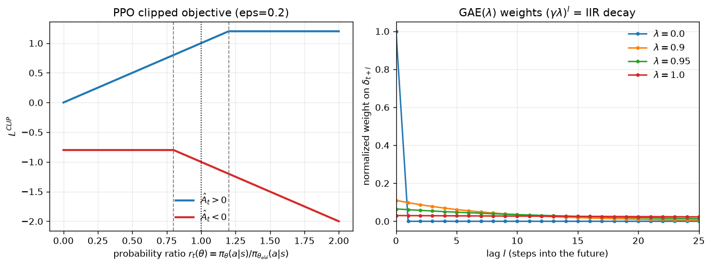

# Day 107 — Actor-Critic & PPO

## 🧠 CONCEPT OF THE DAY

**Intuition first.** REINFORCE (Day 106) has a problem: it judges an action by the *entire* return that followed it, so a lucky rollout makes every action along the way look good, and an unlucky one makes them all look bad — even actions that had nothing to do with the outcome. That's enormous variance, and it makes learning painfully slow.

**Actor-critic** fixes this by adding a second network — the **critic** — whose only job is to estimate "how good is this state, on average?" ($V(s)$). Now instead of asking "was the *total* return good?", the actor asks the sharper question: "was this action *better than the critic expected*?" That difference is the **advantage**, and it's a much lower-variance, much more localized training signal.

**PPO** then answers a second, orthogonal question: once you have a good gradient direction, how big a step do you dare take? Vanilla policy gradient has no speed limit — one overconfident update can wreck the policy (and because the *next* batch of data is collected *by* that wrecked policy, there's no going back within the episode). PPO's fix is almost comically simple: compute how much the new policy would want to change an action's probability relative to the old one, and if that change asks for *too much*, clip it. You get most of the benefit of a hard trust-region constraint (TRPO) with none of the second-order-optimization machinery.

**The math.**

Advantage function — how much better action $a$ is than the state's average:

$$A(s_t, a_t) = Q(s_t, a_t) - V(s_t)$$

In practice we don't have $Q$ directly, so we bootstrap from the critic using the TD residual:

$$\delta_t = r_t + \gamma V(s_{t+1}) - V(s_t)$$

and Generalized Advantage Estimation (GAE) blends these residuals across a horizon with decay $\gamma\lambda$:

$$\hat{A}_t^{GAE(\lambda)} = \sum_{l=0}^{\infty} (\gamma\lambda)^l \, \delta_{t+l}$$

The actor's objective (policy gradient with the advantage as the learning signal, instead of raw return):

$$\nabla_\theta J(\theta) \approx \mathbb{E}_t\left[\nabla_\theta \log \pi_\theta(a_t \mid s_t)\, \hat{A}_t\right]$$

The critic is trained separately by regression toward observed returns $G_t$:

$$L^{critic}(\phi) = \mathbb{E}_t\left[(V_\phi(s_t) - G_t)^2\right]$$

PPO's clipped surrogate objective — with $r_t(\theta) = \dfrac{\pi_\theta(a_t\mid s_t)}{\pi_{\theta_{old}}(a_t\mid s_t)}$:

$$L^{CLIP}(\theta) = \mathbb{E}_t\left[\min\!\big(r_t(\theta)\,\hat{A}_t,\ \text{clip}(r_t(\theta),\, 1-\epsilon,\, 1+\epsilon)\,\hat{A}_t\big)\right]$$

Read the clip term as: *if $\hat{A}_t > 0$ (the action was good), don't let $r_t$ run past $1+\epsilon$ — stop rewarding the policy for over-committing to something that merely looked good in one batch. If $\hat{A}_t < 0$, don't let $r_t$ run below $1-\epsilon$ — stop over-punishing.* The `min` makes the clip one-directional: it only ever caps the objective, never inflates it, which is what keeps the update conservative.



Left panel: notice the clipped curve (the one actually optimized, since we take the `min`) goes flat past the $\epsilon$ boundary — the gradient literally vanishes there, so PPO stops pushing once a step is "big enough." Right panel — hold that thought, Signal Lab below.

**Why it matters / where it leads.** This is the single most-deployed policy-gradient method in production RL — and it's the backbone of RLHF (Day 72): the "policy" being fine-tuned is your language model, the "advantage" comes from a learned reward model, and the clip is precisely what stops one batch of human-preference data from catastrophically overfitting the model's behavior. Every "why does RLHF need PPO and not just supervised fine-tuning on preferred outputs" interview question traces back to today.

**Interview-style question:** *Why does PPO use a clipped surrogate objective instead of directly penalizing KL-divergence between old and new policies (as in TRPO's Lagrangian formulation), and in what situation can the clipped objective still fail to constrain the update?*

---

## 🐍 PYTHONIC EDGE

Sampling actions and computing their log-probabilities is where people quietly break PPO's math without an error ever being raised. `torch.distributions` is the correct tool — it keeps sampling and gradient computation cleanly separated, which manual softmax code doesn't.

```python
import torch
import torch.nn.functional as F
from torch.distributions import Categorical  # class used as a first-class value — no C++ equivalent import-as-object pattern

logits = torch.randn(4, 6)  # (batch, num_actions); random init like torch.rand but Gaussian, no C++ analog for this RNG API

# --- BAD WAY: manual softmax + gather, easy to silently break autograd ---
probs = F.softmax(logits, dim=-1)          # dim=-1 means "last axis" — negative indexing, valid on dims too, not just sequences
action = torch.multinomial(probs, 1)        # returns a LongTensor; C++ has no built-in categorical sampler
log_prob = torch.log(probs.gather(-1, action) + 1e-8)  # +1e-8 epsilon hack to dodge log(0) — a manual numerical-stability patch
# ^ problem: if `probs` was detached anywhere upstream, this silently produces a log_prob with a
#   broken gradient graph and PPO trains on garbage — no exception, no warning.

# --- CLEAN WAY: let the Distribution object own sampling + log_prob together ---
dist = Categorical(logits=logits)   # Categorical(logits=...) not probs=... -> internally uses log-softmax, more numerically stable
action = dist.sample()              # .sample() is a method call, not an operator — mirrors dist.rsample() for continuous reparam tricks
log_prob = dist.log_prob(action)    # single source of truth: same distribution object guarantees a consistent, correctly-graphed log_prob
entropy = dist.entropy()            # entropy bonus is nearly free once you have the Distribution object — encourages exploration

# critic target must NOT backprop through the advantage computation:
advantage = (returns - values).detach()   # .detach() severs the graph in place — this Tensor now behaves like a constant downstream
# .detach() vs .mul_(): note the trailing underscore convention — Xxx_() mutates the tensor in place (like std::vector::push_back
# mutating rather than returning a copy); .detach() instead RETURNS A NEW VIEW sharing storage but stops gradient tracking on it —
# it is not itself an in-place op even though it "feels" similar to one.

ratio = torch.exp(log_prob - old_log_prob.detach())  # exp(log(a) - log(b)) = a/b — avoids computing a raw probability ratio directly
clipped = torch.clamp(ratio, 1 - 0.2, 1 + 0.2)         # clamp == the elementwise clip from the PPO formula, min/max in one call
loss = -torch.min(ratio * advantage, clipped * advantage).mean()  # leading "-" because optimizers minimize; we want to MAXIMIZE L^CLIP
```

The one-line lesson: `dist.log_prob(action)` and `dist.sample()` coming from the *same* `Categorical`/`Normal` object is what keeps PPO's ratio mathematically honest. Reconstructing probabilities by hand invites silent detach bugs that cost you a day of "why isn't my policy improving."

`nn.Module.__call__` reminder, since actor/critic are usually `nn.Module` subclasses: always invoke `actor(state)`, never `actor.forward(state)` — `__call__` is what registers hooks (used for things like gradient clipping callbacks and activation logging), and calling `forward()` directly silently skips them.

---

## 📡 SIGNAL LAB

Look again at the right panel of today's figure. The GAE weight on the TD-residual $\delta_{t+l}$ is $(\gamma\lambda)^l$ — a pure geometric decay in the *lag* index $l$. That is exactly the impulse response of a first-order IIR (infinite impulse response) low-pass filter:

$$h[l] = \alpha^l, \qquad \alpha = \gamma\lambda$$

which is the discrete-time system $y[t] = \alpha\, y[t-1] + x[t]$ — a one-pole recursive filter, computed in $O(1)$ per step exactly the way GAE is computed in practice: as a single **backward pass** through the trajectory,

$$\hat{A}_t = \delta_t + (\gamma\lambda)\,\hat{A}_{t+1}$$

**So what?** The pole location $\alpha = \gamma\lambda$ sets the filter's effective time constant $\tau \approx -1/\ln\alpha$, i.e. how many future steps of reward signal get "smoothed into" today's credit assignment — exactly analogous to how a filter's pole radius sets its -3dB cutoff frequency. $\lambda \to 0$ collapses to a single-tap filter (just $\delta_t$ itself: low averaging, high variance in the frequency-response sense — a flat, wide passband that lets high-frequency reward noise straight through). $\lambda \to 1$ approaches the boxcar-like unbounded-memory average of full Monte-Carlo returns (heavy smoothing, low variance, but high bias if $V$ is wrong and long lag = more phase delay in credit assignment). Tuning $\lambda$ is *literally* choosing a cutoff frequency for how much of the reward signal's high-frequency (noisy, short-horizon) content survives into the gradient versus how much gets smoothed away — the same bias-variance-via-bandwidth tradeoff you already know from choosing a spectral window length in PSD estimation.

---

## 🏋️ THE GAUNTLET

**Problem — Sliding Window Maximum.**
Given an integer array `nums` of length $n$ and a window size $k$, return an array of length $n - k + 1$ where the $i$-th element is $\max(\text{nums}[i..i+k-1])$.

**Constraints:** $1 \le k \le n \le 10^5$, $-10^4 \le \text{nums}[i] \le 10^4$. Target complexity: $O(n)$ time, $O(k)$ space.

**Hint 1:** A naive re-scan of each window is $O(nk)$. What data structure lets you discard information that can *never* be the answer again, the moment you see something bigger arrive after it?

**Hint 2:** You want a structure where the front is always the current window's maximum and you can evict from both ends cheaply — think "monotonic" (values only ever move one direction as you traverse it).

**Hint 3:** Maintain indices, not values, in a deque, keeping it decreasing front-to-back. Before pushing index $i$, pop from the back while `nums[back] <= nums[i]`. Before reading the front as your answer, pop it if it's fallen out of the window (`front <= i - k`).

**Pattern:** Monotonic deque. **Target:** $O(n)$ time, $O(k)$ space.

---

## 🏗️ BLUEPRINT

**On-policy freshness vs. throughput is the core systems tension in PPO-scale training.** PPO's math assumes $\pi_{\theta_{old}}$ (the policy that generated the rollout) and $\pi_\theta$ (the policy being updated) are close — that's the entire premise the clip is protecting. But to hit useful throughput, real systems (IMPALA, distributed PPO, RLHF training clusters) run many parallel actor workers collecting rollouts *while* the learner is already several gradient steps ahead of the weights those workers are using. That gap is **policy staleness**, and it's a direct trade: more parallel workers and longer queues before rollouts get consumed → higher throughput, but a larger effective $r_t(\theta)$ drift that the clip has to absorb — push staleness too far and the clipped objective stops being a valid trust-region surrogate at all, no matter what $\epsilon$ you pick. This is exactly why RLHF pipelines periodically broadcast fresh weights to rollout workers rather than letting them run indefinitely on stale checkpoints.

---

## 🗺️ MARCHING ORDERS

You now understand the algorithm underneath every "we fine-tuned with RL" claim you'll read in a paper abstract — that's worth sitting with for a second.

**Tomorrow: Concept 108 — RAG**

---
---

🔓 GAUNTLET SOLUTION

```cpp
#include <vector>
#include <deque>
using namespace std;

vector<int> maxSlidingWindow(vector<int>& nums, int k) {
    deque<int> dq;  // stores indices, values strictly decreasing front-to-back
    vector<int> result;
    int n = nums.size();
    result.reserve(n - k + 1);

    for (int i = 0; i < n; ++i) {
        // evict from the back: anything smaller than nums[i] can never win again
        while (!dq.empty() && nums[dq.back()] <= nums[i]) {
            dq.pop_back();
        }
        dq.push_back(i);

        // evict from the front: index fell out of the current window
        if (dq.front() <= i - k) {
            dq.pop_front();
        }

        // once the first full window is formed, record the max
        if (i >= k - 1) {
            result.push_back(nums[dq.front()]);
        }
    }
    return result;
}
```

Each index enters and leaves the deque at most once, so total work across the whole scan is $O(n)$ despite the nested-looking `while` — the same amortized-analysis argument you'd use for a two-pointer sweep.

---

💡 CONCEPT ANSWER

TRPO's KL penalty/constraint requires computing (or approximating via conjugate gradient) the Fisher information matrix — expensive second-order machinery — to guarantee the new policy stays within a trust region in *distribution* space. PPO's clip is a cheap first-order proxy for the same idea, but it only constrains the objective *at the specific $(s_t, a_t)$ samples in the current batch* — it has no direct handle on the actual KL divergence between $\pi_\theta$ and $\pi_{\theta_{old}}$ over the full state-action distribution. This means PPO can still fail: if a single gradient step pushes $r_t(\theta)$ far outside $[1-\epsilon, 1+\epsilon]$ in one jump (rather than approaching the boundary gradually), the clip's gradient goes flat *after* the damage is already done for that step — clipping caps the objective's influence on subsequent updates, but doesn't retroactively undo an update that already overshot. In practice this is why PPO implementations also track an empirical KL estimate as a safety diagnostic and sometimes early-stop an epoch of minibatch updates if KL spikes.
