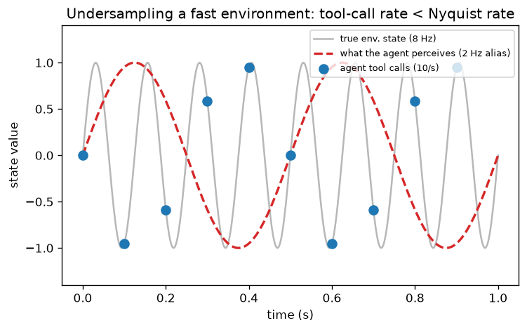

# Day 109 — Concept 109: Agents & Tool Use

## 🧠 CONCEPT OF THE DAY

**Intuition.**
Everything through RAG (Day 108) was still "one giant forward pass, maybe with an extra lookup bolted on the front." An *agent* is a different shape entirely: the LLM stops being a text-completer and becomes a **decision-maker sitting inside a loop**. At each step it looks at what's happened so far and picks one of two things — call a tool (search, run code, hit a calculator, query a database, control a robot arm) or emit a final answer. The tool's output gets appended to its context, and it decides again. Mental model: the LLM is the *brain*, tools are *hands*, and the loop is the *executive function* that keeps deciding what to do next until the job is done or the budget runs out.

This is the same shift you saw from Day 68 (GPT, pure autoregression) → Day 70 (in-context learning) → Day 108 (RAG bolts on one fixed tool: retrieval). Agents generalize RAG's pattern — "let the model pull in outside information" — to *any* action with side effects, chosen dynamically, chained arbitrarily many times.

**The math.**
Formally this is the ReAct loop (Reasoning + Acting). Define the agent's state at step $t$ as the running transcript:

$$s_t = (q, a_1, o_1, a_2, o_2, \dots, a_{t-1}, o_{t-1})$$

where $q$ is the user's query, $a_i$ is the action taken at step $i$, and $o_i$ is the observation (tool output) it produced. The LLM is a stochastic policy over the next action:

$$a_t \sim \pi_\theta(a \mid s_t), \qquad a_t \in \{\text{tool\_call}(\text{name}, \text{args})\} \cup \{\text{final\_answer}(y)\}$$

If $a_t$ is a tool call, the environment executes it deterministically (or near-deterministically): $o_t = \text{Tool}_{\text{name}}(\text{args})$, and $s_{t+1} = s_t \Vert (a_t, o_t)$. The loop terminates when $a_t = \text{final\_answer}$ or a step/token budget is exhausted.

Two things make this different from ordinary decoding:

1. **Structured actions.** "Tool call" isn't free text — it's decoded to match a JSON schema (constrained decoding, or trained via SFT to imitate valid calls), then validated and executed by code outside the model. The cross-entropy objective from Day 5 is still what trains the model to *emit* the right call shape; nothing new there. What's new is that $o_t$ is **not differentiable** — it comes from running real code, so you can't backprop through the tool call itself.
2. **The loop is a non-stationary control problem**, not a single forward pass. This is why tool-use policies are typically trained with SFT on curated trajectories first, then refined with RL (Day 106's REINFORCE / Day 107's PPO) using task success as reward — you're optimizing a *sequence of decisions*, not a single next-token prediction.

**Why it matters / where it leads.**
RAG (Day 108) is the special case where there's exactly one tool (retrieval) called at most once. Real agent systems chain search + calculator + code execution + memory writes, and have to decide *when to stop* — which is exactly where things break in production: infinite tool-call loops, hallucinated tool names, or an agent that's "helpfully" still searching when it should have answered three steps ago. This connects forward to Day 110 (multimodal models — tools now include vision/generation, not just text) and Day 111 (long-context — every tool round trip grows the transcript $s_t$, and that growth is exactly what today's graph is about).

**Interview question:** *You're running a production agent with a web-search tool and a calculator tool. Under load it occasionally loops — repeatedly searching without ever emitting a final answer. Walk me through how you'd detect this class of failure and design against it, without just hard-capping the number of steps.*

---

## 🐍 PYTHONIC EDGE

The recurring bug in hand-rolled tool-use code: you write a Python function, then **hand-write a JSON schema describing it** for the LLM — and the two drift the moment someone changes a default or adds a parameter. Fix: derive the schema from the function's own signature.

```python
# BAD: schema is duplicated by hand and will silently drift from the real function
def get_weather(city: str, units: str = "metric") -> dict:
    ...

WEATHER_SCHEMA = {
    "name": "get_weather",
    "parameters": {
        "type": "object",
        "properties": {
            "city": {"type": "string"},
            "units": {"type": "string"},
        },
        "required": ["city"],   # easy to forget "units" has a default and shouldn't be required
    },
}
```

```python
# GOOD: introspect the function itself — schema can never disagree with the code
import inspect
from typing import get_type_hints

def tool_schema(fn):                                # passing a function as a plain value — first-class callables have no C++ equivalent (function pointers can't carry __name__/__doc__ like this)
    sig = inspect.signature(fn)                      # runtime reflection over params; no direct C++ analogue (no built-in introspection of a function's parameter list)
    hints = get_type_hints(fn)                       # {param_name: type} dict built from the annotations — Python type hints are optional and erased at runtime, unlike C++ static types
    properties, required = {}, []
    for name, param in sig.parameters.items():        # dict.items() yields (key, value) tuples — Python dict iteration, not a C++ std::map iterator pair
        py_type = hints.get(name, str)
        properties[name] = {"type": "string" if py_type is str else "number"}
        if param.default is inspect.Parameter.empty:  # a sentinel object marks "no default" — Python has no null pointer, only None/sentinel objects like this one
            required.append(name)
    return {
        "name": fn.__name__,                          # dunder attribute — every function object carries metadata (__name__, __doc__, ...) that C++ function pointers don't
        "parameters": {"type": "object", "properties": properties, "required": required},
    }

def get_weather(city: str, units: str = "metric") -> dict:
    ...

WEATHER_SCHEMA = tool_schema(get_weather)   # regenerated from the signature — cannot drift

# Dispatch: route a model-emitted {"name": ..., "args": {...}} call to the real function
TOOLS = {"get_weather": get_weather}                 # dict mapping name -> callable; functions-as-values again, no C++ equivalent without std::function

def dispatch(call: dict):
    fn = TOOLS[call["name"]]        # raises KeyError on an unknown/hallucinated tool name — fails loud, not a silent nullptr-style deref
    return fn(**call["args"])       # **kwargs unpacks a dict straight into keyword arguments — no C++ equivalent (closest is manually unpacking a struct field by field)
```

---

## 📡 SIGNAL LAB

**Problem.** An agent controls a trading strategy. It gets one tool call ("read current price") per decision step, budgeted at $f_s = 10$ calls/sec. The market's true short-term oscillation is at $f = 8$ Hz (a stylized but real intraday microstructure effect). What frequency will the agent's observations actually *look like* they're oscillating at, and why should that worry you?

**Solution.** This is Nyquist (you've seen it before, just never applied to a decision loop instead of a signal processor): to represent an $f$ Hz signal without ambiguity you need $f_s \geq 2f$. Here $2f = 16\text{ Hz} > 10\text{ Hz} = f_s$ — undersampled. The apparent (aliased) frequency the agent actually sees is

$$f_{\text{alias}} = \left| f - \text{round}\!\left(\frac{f}{f_s}\right) f_s \right| = |8 - 1 \cdot 10| = 2\text{ Hz}$$

The agent's tool calls land on the blue dots below; connect them and you get a *slow, clean-looking* 2 Hz oscillation (red dashed) that has nothing to do with the true 8 Hz signal (gray) generating them:



**So what.** This is dangerous precisely because it's silent — nothing in the transcript, the tool output, or the model's reasoning trace looks wrong. Each individual observation is correct; only the *sequence*, reconstructed at the wrong rate, is lying. An agent budgeted or rate-limited below the environment's true dynamics won't fail loudly — it'll confidently act on a fabricated slow trend that's actually an artifact of its own polling rate. The fix is the same one DSP has always had: either sample faster than Nyquist demands (raise the tool-call budget), or put an anti-aliasing filter in front of the policy — smooth/debounce fast-changing tool outputs before letting the LLM react to them, rather than reacting to raw per-call noise.

---

## 🏋️ THE GAUNTLET

**Tool-Call Scheduler**
An agent has a queue of `n` tool calls to make, given as a string where each character is a tool id (`'A'`–`'Z'`). To respect each tool's rate limit, the *same* tool id cannot be invoked again until `cooldown` other steps have passed (the agent may sit idle in a step if no eligible tool call is ready). Return the minimum number of steps to execute the entire queue.

**Example:** `tasks = "AAABBB"`, `cooldown = 2` → answer `8` (e.g. `A B _ A B _ A B`).

**Constraints:** `1 <= tasks.length <= 10^4`, `0 <= cooldown <= 100`, tasks are uppercase `'A'`–`'Z'` (≤ 26 distinct tool ids).

**Hints (escalating):**
1. The bottleneck is whichever tool id appears *most* often — everything else can be slotted around it. Start by counting frequencies.
2. Picture the most-frequent tool laid out with its mandatory cooldown gaps between occurrences: that skeleton alone has a fixed length. What is it, in terms of the max frequency and `cooldown`?
3. Some of those gaps may already be filled by *other* tool calls instead of idle steps. The true answer is the larger of two numbers: the total task count, and that skeleton length. Watch for ties at the max frequency — more than one tool hitting the max frequency changes the skeleton's trailing slots.

**Pattern:** greedy / counting-based scheduling — no simulation needed. Target: $O(N + 26)$ time, $O(26)$ space.

Full solution at the bottom, under 🔓 GAUNTLET SOLUTION — derive the formula yourself first.

---

## 🏗️ BLUEPRINT

No blueprint today — today's concept section carries the systems load (the loop, the non-differentiable tool boundary, and the SFT-then-RL training story).

---

## 🗺️ MARCHING ORDERS

Today's tool-schema trick isn't a toy — it's the actual difference between an agent codebase that stays correct as it grows and one that silently breaks every third deploy. Build the habit now.

Tomorrow: Concept 110 — Multimodal models

---
---

🔓 GAUNTLET SOLUTION

```cpp
#include <vector>
#include <algorithm>
using namespace std;

class Solution {
public:
    int leastInterval(vector<char>& tasks, int cooldown) {
        // Count frequency of each of the 26 possible tool ids.
        vector<int> freq(26, 0);
        for (char t : tasks) freq[t - 'A']++;

        int maxFreq = *max_element(freq.begin(), freq.end());

        // How many distinct tool ids tie for the max frequency?
        int numMax = 0;
        for (int f : freq) if (f == maxFreq) numMax++;

        // Skeleton: (maxFreq - 1) full cooldown blocks of size (cooldown + 1),
        // plus numMax trailing slots for the last round of max-frequency tools.
        int skeletonLength = (maxFreq - 1) * (cooldown + 1) + numMax;

        // If there are enough other tasks to fill every gap, no idle steps are
        // needed at all — the answer is just the total task count.
        return max((int)tasks.size(), skeletonLength);
    }
};
```

*Why this works:* lay out the most frequent tool with mandatory `cooldown` gaps between repeats — that's `(maxFreq - 1)` gaps of length `(cooldown + 1)` each, plus one more slot per tool id that also hits `maxFreq` (they all have to occupy the final round together, since none of them can double up within the same block). Every other, less-frequent tool call can always be slotted into some gap in this skeleton — the frequency argument that makes greedy scheduling optimal here is the same "the most-constrained resource sets the lower bound" idea as critical-path scheduling. If there are more total tasks than the skeleton has room for, they simply extend the schedule with no idle steps at all — hence the `max`.

💡 CONCEPT ANSWER

Don't fight loops with a single hard step cap — that just turns "infinite loop" into "confidently wrong answer after N steps." Layer defenses instead:

- **Progress detection, not just step counting.** Track whether the *state* is actually advancing — e.g. hash each `(action, observation)` pair and flag repetition (the same search query fired twice in a row is a near-certain loop signal), rather than only counting raw steps.
- **A budget the agent can see.** Feed remaining steps/tokens back into the prompt ("3 tool calls remaining") so the policy itself is incentivized to converge — this is a direct product of the RL fine-tuning story from today's concept: if success reward is shaped to penalize excess steps, the trained policy learns to wrap up rather than stall.
- **A dedicated "stuck" classifier or heuristic** that watches for the ReAct trace oscillating without new information (e.g. observation embeddings not changing much between steps) and forces an escape action — either ask the user for clarification or return a best-effort partial answer, instead of silently truncating.
- **Fail loud, not silent.** When the step cap *is* hit, that should be a distinguishable outcome in your logs/metrics (a "budget exhausted" flag), not indistinguishable from a normal completion — otherwise you can't tell confident-but-wrong apart from actually-succeeded in production dashboards. A senior interviewer is listening for whether you treat this as an *observability and reward-shaping* problem, not just "add a `while` loop limit."
