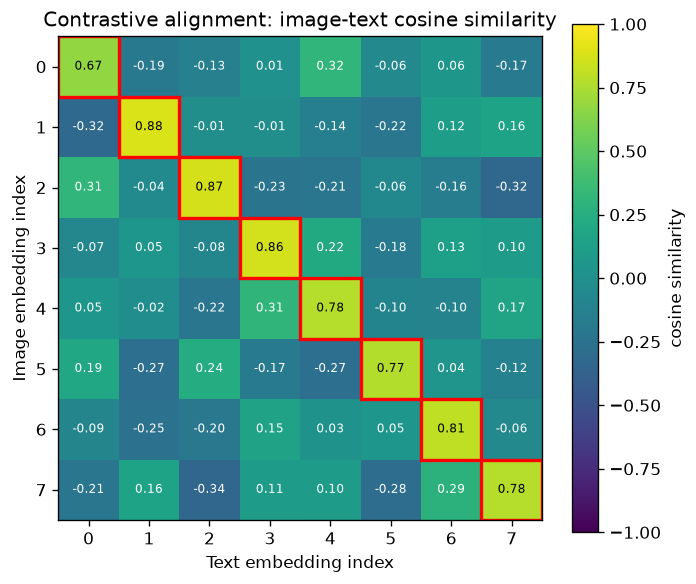

# Day 110 — Concept 110: Multimodal Models

## 🧠 CONCEPT OF THE DAY

**Intuition.** Every modality-specific encoder you've met so far — a CNN/ViT for images (concept 89), a causal-LM transformer for text (concept 68), a spectrogram encoder for audio — speaks its own private language of activations. A multimodal model doesn't teach one tower to "understand" another modality directly; it builds a **shared room** (a joint embedding space) where vectors from *any* modality that mean the same thing land close together. CLIP (concept 90) was your first taste of this: an image encoder and a text encoder, trained so that a photo of a dog and the string "a photo of a dog" end up as near-parallel vectors. Everything called "multimodal" today is a variation on that idea, differing mainly in **how early or late the modalities get to talk to each other**.

Three fusion strategies, in order of increasing "conversation":

- **Late fusion (dual encoder, à la CLIP):** each modality is encoded completely independently; they only interact through a similarity score at the very end. Cheap, scales beautifully to retrieval over millions of items, but the two towers never inform each other mid-computation.
- **Cross-attention fusion (à la Flamingo, BLIP-2):** a frozen or lightly-tuned vision encoder produces a set of image tokens; a separate cross-attention layer lets the *language* model's queries attend into those image tokens as keys/values. The LLM's own self-attention stays untouched — the image is injected as extra context.
- **Early fusion / unified tokens (à la LLaVA, GPT-4V-style, and most current VLMs):** image patches are linearly projected into the *same* embedding dimension as text tokens and simply concatenated into one sequence, which a single transformer then self-attends over uniformly. No architectural distinction between "image attention" and "text attention" — the model just sees a longer sequence of mixed-origin tokens.

**The math.** The alignment objective that makes the shared space useful is the same symmetric InfoNCE loss from concept 90, generalized to any pair of modality encoders $f$ (e.g. vision) and $g$ (e.g. text):

For a batch of $N$ matched pairs $(x_i, y_i)$, with $u_i = f(x_i)/\lVert f(x_i)\rVert$ and $v_i = g(y_i)/\lVert g(y_i)\rVert$:

$$\mathcal{L} = -\frac{1}{2N}\sum_{i=1}^{N}\left[\log\frac{\exp(u_i^\top v_i/\tau)}{\sum_{j=1}^{N}\exp(u_i^\top v_j/\tau)} + \log\frac{\exp(v_i^\top u_i/\tau)}{\sum_{j=1}^{N}\exp(v_i^\top u_j/\tau)}\right]$$

where $\tau$ is a learned temperature. Every off-diagonal pair in the batch acts as a free negative — exactly what today's graph visualizes below.

For early/cross-attention fusion, the mechanism doing the "talking" is ordinary scaled dot-product attention (concept 55), just with $Q$ drawn from one modality's tokens and $K, V$ from another's (cross-attention) or from the concatenated pool (early fusion):

$$\text{Attention}(Q,K,V) = \text{softmax}\!\left(\frac{QK^\top}{\sqrt{d_k}}\right)V$$



The graph is a synthetic 8-pair batch: image embeddings are text embeddings plus noise, run through the same InfoNCE-style cosine similarity you just computed above. Notice the diagonal (true pairs) doesn't need to be *perfect* — it only needs to be the **row-max**, since softmax-over-a-row is what the loss actually optimizes. Pair 0 (0.67) is the "hardest" match here — still highest in its row, but by a much thinner margin than pair 1 (0.88).

**Why it matters / where it leads.** Multimodal alignment is the reason concept 90 (CLIP) rather than concept 68 (GPT) sits at the heart of nearly every diffusion model's text conditioning (concept 87) and every retrieval system that mixes images and text. But it also creates a very practical scaling problem for the *next* concept: a single 1024×1024 image tokenized into patches can produce hundreds to thousands of tokens — more than an entire paragraph of text — so "just concatenate everything into one sequence" collides hard with the quadratic attention cost (concept 63) you already know about. That collision is exactly what tomorrow's concept addresses.

**Interview-style question:** LLaVA-style models freeze both the pretrained vision encoder (e.g. CLIP's ViT) and the pretrained LLM, training *only* a small linear (or MLP) projection layer between them. Why does this work at all, and what capability does it explicitly sacrifice compared to fine-tuning the whole stack end-to-end?

*(Answer at the very bottom.)*

---

## 🐍 PYTHONIC EDGE

The contrastive similarity matrix above is a one-liner if you normalize correctly — but it's a classic place people write an accidental O(N²) Python loop instead of trusting broadcasting.

```python
import torch
import torch.nn.functional as F

img_emb = torch.randn(8, 512)   # 8 images, 512-d raw encoder output
txt_emb = torch.randn(8, 512)   # 8 matching captions, 512-d raw encoder output

# --- BAD: manual loop, re-deriving what F.normalize already does ---
sims_bad = torch.zeros(8, 8)                 # pre-allocate; C++: std::vector<std::vector<float>> would need nested loops too
for i in range(8):                           # range(8) is a lazy iterator object in Python, not a materialized list/array like in C++
    for j in range(8):
        vi = img_emb[i] / img_emb[i].norm()  # negative-indexing-free here, but norm() recomputed N^2 times — wasteful
        vj = txt_emb[j] / txt_emb[j].norm()
        sims_bad[i, j] = (vi * vj).sum()     # elementwise mul then reduce == a manual dot product

# --- CLEAN: vectorized, matches the InfoNCE formula directly ---
v = F.normalize(img_emb, dim=-1)   # F.normalize: divides each row by its own L2 norm; dim=-1 means "along the last axis" (Python negative indexing)
t = F.normalize(txt_emb, dim=-1)
sims = v @ t.T                     # @ is Python's matmul operator (no C++ equivalent); .T transposes via a view, no copy

assert torch.allclose(sims, sims_bad, atol=1e-5)  # assert raises AssertionError if False; stripped entirely when Python runs with -O
```

Two mechanics worth flagging beyond the inline comments: `F.normalize(..., dim=-1)` is itself a **keyword-only-by-convention** call — you could pass `dim` positionally, but idiomatic PyTorch code always names it, since these functions accept many optional keyword arguments (`p=`, `eps=`) with defaults you're implicitly relying on. And `v @ t.T` produces the *entire* $N \times N$ similarity matrix in one fused GPU kernel launch — the loop version launches (or, on CPU, executes) $N^2$ tiny operations, which is the real cost, not just "more Python bytecode."

---

## 📡 SIGNAL LAB

**Setup.** A video-plus-audio multimodal model needs both streams on the *same* time grid before fusion — but video typically arrives at 30 fps (a "sample" every 33.3 ms) while raw audio arrives at 16,000 Hz. Say your fusion layer wants exactly one audio feature vector per video frame, so you need to downsample the audio stream by a factor of

$$M = \frac{f_s}{f_v} = \frac{16000}{30} \approx 533.3$$

Since $M$ isn't even an integer, a real pipeline resamples via rational resampling ($L/M$ with $L=3, M=1600$ gives $16000 \cdot 3/1600 = 30$ exactly) — but the DSP hazard is the same one you've seen since concept 88 (spectral signatures): **naively picking every 533rd audio sample without filtering first is decimation without anti-aliasing.**

**Worked solution.** The audio stream has energy well above the new Nyquist frequency: after downsampling to an effective 30 Hz "frame rate" for audio features, the new Nyquist is only 15 Hz, but raw 16 kHz audio has content out to 8000 Hz. Any energy between 15 Hz and 8000 Hz that isn't removed first will **alias** — fold back down into the 0–15 Hz band — and corrupt exactly the low-frequency envelope features (e.g. amplitude/energy contour) that cross-modal fusion relies on to align with visual motion. The fix is the standard decimation recipe:

1. Apply a low-pass filter with cutoff at the *new* Nyquist frequency (15 Hz here) to the 16 kHz signal.
2. *Then* subsample by picking every $M$-th sample (or every $L/M$-th via polyphase resampling).

**So what.** This is the audio/video analogue of a mistake that's easy to make silently in any multimodal pipeline: whenever you reduce a modality's temporal or spatial resolution to match another modality's token rate (video frame downsampling, audio feature-rate reduction, even average-pooling a ViT's patch grid before cross-attention), you are decimating, and skipping the anti-alias filter doesn't crash anything — it just quietly injects high-frequency noise as spurious low-frequency correlation, which a cross-attention layer will happily "learn" to attend to as if it were signal. For your own forensics lane: this is precisely the kind of resampling artifact worth checking for when auditing whether a claimed cross-modal correlation in a paper's ablation is real or a downsampling artifact.

---

## 🏋️ THE GAUNTLET

**Problem — Interval List Intersections.**
You're given two lists of closed intervals, `firstList` and `secondList`, each already sorted by start time and each internally non-overlapping (think: the "active spans" of two different modality streams — e.g. when a speaker's face is visible vs. when their voice is detected). Return the list of intervals representing the intersection of the two sets — the spans where *both* streams are simultaneously active, in sorted order.

**Constraints:** `0 <= firstList.length, secondList.length <= 1000`, `firstList.length + secondList.length >= 1`, `0 <= start_i < end_i <= 10^9`. Aim for a single pass over both lists.

**Hint 1:** You never need to look at more than the *current* interval from each list at any time — what invariant lets you always discard exactly one of the two current intervals after processing it?

**Hint 2:** The intersection of interval $[a_1,a_2]$ and $[b_1,b_2]$, if it exists, is $[\max(a_1,b_1), \min(a_2,b_2)]$. When is that *not* a valid interval?

**Hint 3:** After computing (or ruling out) the intersection for the current pair, advance whichever of the two pointers has the **smaller end time** — think about why the interval you're advancing past can never intersect anything later in the *other* list.

**Pattern:** two-pointer merge, target complexity $O(n+m)$ time, $O(1)$ extra space (excluding output).

*(Full C++ solution at the very bottom, under 🔓 GAUNTLET SOLUTION.)*

---

## 🏗️ BLUEPRINT

**Vision-token resolution vs. serving cost.** A multimodal LLM's image encoder resolution is a direct dial on inference cost, not just a quality knob: doubling image side-length roughly quadruples the number of vision patch tokens fed into the LLM (concept 89's patchify step), which — because self-attention is $O(n^2)$ (concept 63) — multiplies prefill compute by roughly 4× and permanently inflates the KV cache (concept 100) for the rest of that request's context. Production systems (e.g. tiling high-res images into multiple lower-res crops, or LLaVA's "AnyRes") trade a small amount of global coherence for keeping the per-image token budget roughly linear instead of quadratic in resolution. The key tradeoff: **fine-grained visual detail costs quadratically in serving latency/memory, so resolution should be treated as a per-request budget decision, not a fixed architecture constant.**

---

## 🗺️ MARCHING ORDERS

You now have the alignment tool (contrastive loss) *and* the fusion tool (attention) that every modern vision-language model is built from — the rest is engineering choices about where fusion happens and how many tokens you can afford to pay for it.

Tomorrow: Concept 111 — Long-context techniques.

---

## 🔓 GAUNTLET SOLUTION

```cpp
#include <vector>
using namespace std;

vector<vector<int>> intervalIntersection(vector<vector<int>>& firstList,
                                          vector<vector<int>>& secondList) {
    vector<vector<int>> result;
    int i = 0, j = 0;
    int n = firstList.size(), m = secondList.size();

    while (i < n && j < m) {
        int lo = max(firstList[i][0], secondList[j][0]);
        int hi = min(firstList[i][1], secondList[j][1]);

        if (lo <= hi) {
            result.push_back({lo, hi});
        }

        // Advance whichever interval ends first: it cannot intersect
        // anything later in the other list, since that list is sorted
        // and non-overlapping.
        if (firstList[i][1] < secondList[j][1]) {
            i++;
        } else {
            j++;
        }
    }

    return result;
}
```

Complexity: $O(n+m)$ time (each pointer advances at most once per element), $O(1)$ extra space beyond the output.

---

## 💡 CONCEPT ANSWER

Freezing both encoders and training only the projection layer works because CLIP's vision encoder and the LLM's text encoder were *each already trained to be useful on their own* — the vision encoder already produces embeddings that separate concepts meaningfully, and the LLM already knows how to reason over token embeddings in its own space. The projection layer's only job is to learn a (relatively simple, often near-linear) mapping from "CLIP embedding space" into "LLM token embedding space" so the frozen LLM can treat image features as if they were just more input tokens. This is cheap (a few million trainable parameters vs. billions) and preserves both pretrained models' original capabilities intact.

What it sacrifices: the vision encoder never adapts its *low-level* features to what the specific downstream task needs, and the LLM never adapts its internal representations to reason more natively about visual concepts — so tasks requiring fine-grained visual grounding (precise spatial reasoning, reading small text in images, subtle visual details) tend to lag behind models that fine-tune the vision tower (or the whole stack) jointly, at the cost of much higher training compute and risk of catastrophically forgetting the LLM's original language capabilities.
