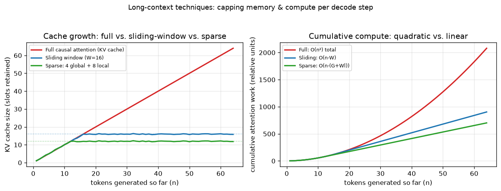

# Day 111 — Concept 111: Long-Context Techniques

## 🧠 CONCEPT OF THE DAY

**Intuition.** Imagine reading a 500-page novel but being forced to re-read the *entire book from page 1* every single time you want to understand the next sentence. That's vanilla causal self-attention at long sequence lengths: every new token's query has to look back at every previous token's key/value pair (concept 62's causal mask just decides which pairs are *allowed*, not how many there are). "Long-context techniques" is the umbrella term for every trick that lets a transformer handle sequences of 100K+ tokens without paying the full $O(n^2)$ toll from concept 63 on every one of them — by being selective about *which* pages it re-reads, compressing old pages into a summary, or restructuring how attention is computed so the same math costs less memory.

Three complementary families, and you've already met the seeds of most of them:

- **Sparsify what's attended to.** Sliding-window attention (each token only attends to the last $W$ tokens), dilated/strided attention (attend to every $k$-th token further back, echoing concept 44's dilated convolutions), and global+local hybrids (a few "anchor" tokens everyone can see, like concept 61's `[CLS]`, plus a local window) — all cap the number of keys/values a query needs, turning $O(n^2)$ into $O(n \cdot w)$ for window size $w \ll n$.
- **Make the exact computation cheaper, not approximate.** FlashAttention (concept 64) already showed that you don't need to *reduce* what's attended to — tiling and fusing the attention kernel so it never materializes the full $n \times n$ score matrix in slow memory cuts wall-clock cost and memory dramatically while computing the mathematically identical result.
- **Extend positional encoding past what was trained.** RoPE (concept 59) encodes relative position via rotation angles; techniques like position interpolation or NTK-aware scaling rescale those angles so a model trained on 4K-token positions can extrapolate to 32K+ without the attention pattern degenerating, because raw extrapolation makes untrained rotation angles behave unpredictably.

**The math.** For sliding-window attention with window size $w$, token $i$ only attends over keys in $[\max(0, i-w+1), i]$:

$$\text{Attention}(q_i, K, V) = \text{softmax}\!\left(\frac{q_i K_{[i-w+1:i]}^\top}{\sqrt{d_k}}\right) V_{[i-w+1:i]}$$

instead of the full $K_{[0:i]}, V_{[0:i]}$. This caps both the compute *and* the KV cache (concept 100) at $O(w)$ per step regardless of how large $n$ grows — exactly what today's graph plots.

For RoPE position scaling, recall RoPE rotates each query/key pair by an angle proportional to position $m$: $\theta_m = m \cdot \Theta$ for base frequency $\Theta$. Position interpolation rescales position indices by a factor $\alpha = L_{\text{train}} / L_{\text{target}}$ before rotating:

$$\theta_m' = \frac{m}{\alpha} \cdot \Theta = \frac{m \cdot L_{\text{train}}}{L_{\text{target}}} \cdot \Theta$$

so that even at target length $L_{\text{target}} \gg L_{\text{train}}$, the largest angle the model ever sees stays within the range it was trained on — trading resolution (finer position distinctions get compressed) for staying in-distribution.



The left panel shows KV cache size per decode step: full attention's cache (red) grows without bound, while sliding-window (blue, capped at $W=16$) and global+local sparse (green, capped at $4+8=12$) plateau. The right panel shows the *cumulative* compute cost each strategy has paid by step $n$ — full attention's curve visibly bends upward (quadratic), while the capped strategies stay straight (linear).

**Why it matters / where it leads.** Every one of these techniques is a direct answer to concept 63's cost problem and concept 100's memory problem, and they're precisely what makes 100K–1M-token context windows in production LLMs (RAG over full codebases, concept 108; whole-document analysis) financially viable rather than just theoretically possible. But context length alone doesn't guarantee the model actually *uses* everything you stuff into it — a model can have a 128K window and still ignore information buried in the middle, which is exactly the "lost in the middle" evaluation failure mode that tomorrow's concept on evaluation and benchmarking will formalize.

**Interview-style question:** Sliding-window attention caps the KV cache and per-step compute to $O(w)$, but a pure sliding window (no global tokens) means information from token 1 can never directly influence token 100,000's output in a single attention layer. Why is this less catastrophic in a *deep, multi-layer* transformer than it sounds, and what's the effective "reach" of information after $L$ stacked sliding-window layers with window $w$?

*(Answer at the very bottom.)*

---

## 🐍 PYTHONIC EDGE

Simulating a sliding-window KV cache is a good excuse to practice Python's slicing and in-place tensor ops — and to avoid the classic bug of silently growing a list forever when you meant to cap it.

```python
import torch

W = 16                                  # window size (max keys/values retained)
d = 8                                   # per-token key/value dim

# --- BAD: cache grows forever, "cap" is an afterthought bolted on ---
cache_bad = []                          # a plain Python list standing in for a KV cache
def append_bad(k_new):
    cache_bad.append(k_new)             # .append() mutates the list in place, no return value
    if len(cache_bad) > W:              # len() as free function, not a C++ .size() method call
        cache_bad.pop(0)                # O(W) shift every call — pop(0) is the wrong end for a list
    return torch.stack(cache_bad)       # torch.stack: list[Tensor] -> one stacked Tensor (new dim)

# --- CLEAN: fixed-size ring buffer tensor, O(1) amortized update ---
class SlidingKVCache:                          # class X: no explicit base -> inherits from object implicitly
    def __init__(self, window, dim):           # __init__ is the constructor; self is explicit (never implicit like `this`)
        super().__init__()                     # no-op here since object.__init__ does nothing, but idiomatic when subclassing
        self.window = window                   # self.x = ... creates/sets an instance attribute
        self.buf = torch.zeros(window, dim)    # preallocated buffer, unlike the ever-growing list above
        self.ptr = 0                           # write pointer
        self.filled = 0                        # how many valid slots so far

    def push(self, k_new):
        self.buf[self.ptr % self.window] = k_new   # % wraps the index -> ring buffer, no shifting
        self.ptr += 1                               # += is fine here; note no separate ++ operator in Python
        self.filled = min(self.filled + 1, self.window)

    def get(self):
        if self.filled < self.window:
            return self.buf[:self.filled]           # slice [a:b]-style; here just [:self.filled]
        # oldest-to-newest order: rotate the buffer around the write pointer
        start = self.ptr % self.window
        return torch.cat([self.buf[start:], self.buf[:start]], dim=0)  # dim= is keyword-only-by-convention

cache = SlidingKVCache(window=W, dim=d)
for t in range(20):                      # range(20) is a lazy iterator object, not a materialized list
    cache.push(torch.randn(d))           # each token's key vector

k_window = cache.get()
assert k_window.shape == (W, d)          # assert is stripped when run with `python -O`, unlike a real check
```

The `%` (modulo) ring-buffer index is the whole trick: instead of `pop(0)` (which is $O(W)$ because every remaining element must shift left), writing to `self.ptr % self.window` is $O(1)$ — the buffer never resizes or shifts, it just gets overwritten in a circle. This is the same underlying idea production sliding-window KV caches use, just without the C++-level pointer arithmetic.

---

## 📡 SIGNAL LAB

**Setup.** Position interpolation rescales RoPE angles by $\alpha = L_\text{train}/L_\text{target}$ so a model trained at $L_\text{train}=4096$ can run at $L_\text{target}=16384$. From a signal-processing lens, RoPE's rotation frequencies $\Theta_i = \text{base}^{-2i/d}$ (one frequency per pair of dimensions) are literally a bank of sinusoids at geometrically spaced frequencies — the same structure as concept 58's sinusoidal positional encoding, just applied multiplicatively via rotation instead of additively. Scaling positions by $\alpha < 1$ before rotating is mathematically identical to *lowering every frequency in that bank by the same factor* $\alpha$.

**Worked solution.** Think of each RoPE dimension-pair as a tiny oscillator sampled once per token position — token position is literally your "time" axis, and $\Theta_i$ is that oscillator's angular frequency. The highest-frequency oscillator (smallest $i$) completes the most cycles per token, meaning it's the one whose phase is most likely to have been sampled *densely* during training (many distinct angles seen across $L_\text{train}$ positions) — this is the RoPE analogue of a signal needing to be sampled well above its Nyquist rate to be reconstructed faithfully. Scaling all positions by $\alpha = L_\text{train}/L_\text{target} < 1$ compresses every oscillator's angular range by the same factor — equivalent to lowering every frequency in the bank, or "resampling" the position axis to a coarser effective time grid, exactly like the audio decimation problem from Day 110. The catch: this "downsamples" high-frequency (fine-grained, nearby-token) position information the *most*, in relative terms — you're spending your limited angle budget uniformly across a $4\times$-longer axis, so fine relative-position distinctions near any given token get blurrier, even though the *coarse* long-range structure the model needs for 16K-token context is preserved.

**So what.** This is why naive position interpolation, while cheap and effective for moderate extension factors, degrades local/fine-grained attention patterns (e.g., precise adjacent-token relationships that matter for syntax) more than long-range ones — and why NTK-aware variants instead scale *high* frequencies less and *low* frequencies more, preserving local resolution while still compressing the long-range angles into the trained range. It's the same "which frequencies can you afford to alias/compress" tradeoff you've now seen in audio decimation (Day 110), image downsampling, and now positional-frequency rescaling — one underlying DSP principle wearing three different costumes.

---

## 🏋️ THE GAUNTLET

**Problem — Sliding Window Maximum.**
Given an integer array `nums` and an integer `k`, there is a sliding window of size `k` which moves from the very left of the array to the very right. You can only see the `k` numbers in the window at each step. Return an array of the maximum value in each window position as it slides — directly analogous to computing "what's the strongest attended value in the current attention window" at every decode step.

**Constraints:** `1 <= nums.length <= 10^5`, `-10^4 <= nums[i] <= 10^4`, `1 <= k <= nums.length`. Aim for $O(n)$ total time — a naive per-window scan is $O(n \cdot k)$ and will not pass.

**Hint 1:** You need, at every step, the maximum of the *current* window — but recomputing it from scratch each slide is what makes the naive approach $O(n \cdot k)$. What data structure lets you maintain a running "candidates for max" set cheaply as elements enter and leave the window?

**Hint 2:** Keep a deque (double-ended queue) of *indices* into `nums`, maintained so that the values at those indices are always in decreasing order front-to-back. When a new element arrives, why is it safe to permanently discard every smaller element currently at the back of the deque?

**Hint 3:** Before recording the max for the current window, pop from the *front* of the deque if that index has fallen outside the window (i.e., is `<= current_index - k`). The front of the deque is then always the max for the current window — push the current index to the back (after Hint 2's cleanup) and read `nums[deque.front()]`.

**Pattern:** monotonic deque, target complexity $O(n)$ time, $O(k)$ space.

*(Full C++ solution at the very bottom, under 🔓 GAUNTLET SOLUTION.)*

---

## 🏗️ BLUEPRINT

**Context-length budget vs. serving cost, revisited.** Advertising "128K context" is a capability claim, not a cost-free one: even with sliding-window/sparse attention capping *compute* to roughly linear in $n$, the KV cache for the tokens still inside the window (or the global-token set) must live in GPU memory (concept 100) for the *entire* request, and batching many long-context requests together (concept 101) multiplies that memory pressure directly. The practical tradeoff production serving stacks make: expose a large *advertised* context window (good for marketing and worst-case correctness) but apply sliding-window/sparse attention *underneath* so the actual per-request memory footprint stays closer to what a short-context request would cost — accepting a small, controlled loss of exact long-range recall in exchange for keeping throughput (tokens/sec across many concurrent users) from collapsing.

---

## 🗺️ MARCHING ORDERS

You now understand not just *that* long context is expensive, but the three concrete levers (sparsify, compute smarter, rescale positions) real systems pull to make it affordable — the same $O(n^2)$ villain from concept 63, fought on three different fronts.

Tomorrow: Concept 112 — Evaluation, benchmarks & pitfalls.

---

## 🔓 GAUNTLET SOLUTION

```cpp
#include <vector>
#include <deque>
using namespace std;

vector<int> maxSlidingWindow(vector<int>& nums, int k) {
    deque<int> dq;              // stores indices, values at those indices are decreasing front-to-back
    vector<int> result;
    result.reserve(nums.size() - k + 1);

    for (int i = 0; i < (int)nums.size(); i++) {
        // Drop indices that have fallen out of the window [i-k+1, i]
        while (!dq.empty() && dq.front() <= i - k) {
            dq.pop_front();
        }

        // Maintain decreasing order: discard smaller trailing elements,
        // since they can never be the max while nums[i] is still in the window.
        while (!dq.empty() && nums[dq.back()] < nums[i]) {
            dq.pop_back();
        }

        dq.push_back(i);

        // Once the first full window is formed, front of deque is the max.
        if (i >= k - 1) {
            result.push_back(nums[dq.front()]);
        }
    }

    return result;
}
```

Complexity: $O(n)$ time — each index is pushed and popped from the deque at most once — and $O(k)$ space for the deque in the worst case.

---

## 💡 CONCEPT ANSWER

It's less catastrophic because information doesn't need to travel in a *single* attention hop — it propagates through the *residual stream* across layers, and each layer's window shifts the effective reach further. Concretely, after $L$ stacked sliding-window layers each with window $w$, a token's representation can be influenced by information from up to roughly $L \times (w-1)$ positions away, because layer 1 lets token $i$ see $[i-w+1, i]$, layer 2 lets *those* tokens' (already window-1-influenced) representations mix further back, and so on — the receptive field grows linearly with depth, exactly analogous to how stacking convolutional layers grows receptive field (concept 36) despite each individual kernel being small. So token 1's influence on token 100,000 isn't impossible, just indirect and attenuated — it has to relay through $\lceil 100000 / (w-1) \rceil$ layers' worth of local hops, which is why pure sliding-window models still typically add a handful of global/anchor tokens (visible to every position at every layer) to guarantee at least one direct long-range path, rather than relying solely on this multi-layer relay.
