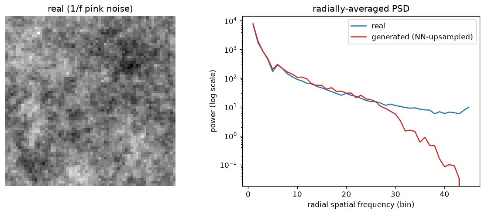

# Day 112 — Concept 112: Evaluation, Benchmarks & Pitfalls

## 🧠 CONCEPT OF THE DAY

**Intuition.** A benchmark is a proxy for the thing you actually care about, and every proxy leaks. Think of it like grading students on last year's exam questions that somehow got photocopied and handed out in a study guide — a high score tells you the student either understands the material *or* memorized the leaked questions, and from the score alone you cannot tell which. That's the entire evaluation problem in one sentence: a single scalar (accuracy, BLEU, FID, win-rate) collapses "does this generalize" and "did this overfit the measurement" into the same number, and it's on you to pull them apart.

**The three failure modes, formalized.**

1. **Contamination** — benchmark examples (or close paraphrases) leaked into training data. Detect it by checking $n$-gram overlap or embedding similarity between a benchmark's test split and the training corpus; a suspiciously bimodal per-example loss distribution (most examples at "normal" loss, a cluster near-zero) is a tell.

2. **Benchmark overfitting via Goodhart's law** — once a metric becomes a target, it stops measuring the thing it was built to measure. If a lab iterates hundreds of checkpoints against the same public leaderboard, they're doing implicit hyperparameter search *on the test set*, even without ever training on it directly.

3. **Construct validity gap** — the benchmark measures something correlated with, but not identical to, the deployment objective. A model can top a static QA benchmark and still fail in production because production queries are out-of-distribution relative to the benchmark's collection process (different length, register, ambiguity).

**The math you need: is a score difference real or noise?** Given two models scored on the same $n$-example benchmark with per-example correctness $x_i, y_i \in \{0,1\}$, don't just compare means — bootstrap a confidence interval:

$$\hat\theta = \frac{1}{n}\sum_{i=1}^n (x_i - y_i), \qquad \text{CI}_{95\%} = \text{percentile}_{[2.5,\,97.5]}\left(\{\hat\theta^{(b)}\}_{b=1}^{B}\right)$$

where each $\hat\theta^{(b)}$ is the same statistic recomputed on a resample of $n$ example-pairs drawn with replacement. If the CI straddles zero, the "improvement" your new checkpoint shows over the old one is statistically indistinguishable from noise — a fact that gets lost the moment someone reports "+1.3% on MMLU" as a single number in a slide deck.

For generative-code evaluation specifically, the standard estimator is unbiased **pass@k**: generate $n$ samples per problem, let $c$ be the number that pass unit tests, then

$$\text{pass@}k = \mathbb{E}_{\text{problems}}\left[1 - \frac{\binom{n-c}{k}}{\binom{n}{k}}\right]$$

— note this is *not* "generate $k$ samples and check if one passes" (that estimator is a biased, high-variance version of the same quantity); the combinatorial form uses all $n$ samples to get a lower-variance estimate of the same target.

**Why it matters / where it leads.** Every concept you've learned since Day 1 eventually gets reduced to a number on a benchmark before anyone decides to ship it — loss curves (Day 23), scaling laws (Day 77), RLHF (Day 72) are all validated against held-out evaluation, and if the evaluation itself is broken, everything upstream of it is unfalsifiable. This is also the concept that closes Phase 11 — tomorrow is a consolidation day pulling together RL, agents, multimodality, long-context, and evaluation into one connected picture.

**Interview-style question:** *A model scores 92% on a well-known public benchmark but underperforms noticeably once it's in production. Give three distinct root causes you'd check for, in the order you'd check them, and one concrete diagnostic per cause.*

---

## 🐍 PYTHONIC EDGE

Bootstrapping a confidence interval the naive way — a Python `for` loop resampling one pair at a time — is exactly what NumPy exists to make you never write again.

```python
import numpy as np

rng = np.random.default_rng(42)  # rng is an instance of a class (Generator);
                                  # .default_rng() is a factory function, not a constructor call —
                                  # no `new`, Python just returns an object

# --- the bad way: explicit loop, one resample at a time ---
def bootstrap_ci_slow(x, y, B=10_000):
    n = len(x)                            # len(x) calls x.__len__() under the hood (dunder method)
    diffs = []                            # Python list; dynamically typed, no std::vector<double> declaration needed
    for _ in range(B):                    # range() returns a lazy range object, not a materialized list — unlike a raw C++ index loop
        idx = rng.integers(0, n, size=n)  # sample WITH replacement (bootstrap resample)
        diffs.append((x[idx] - y[idx]).mean())  # x[idx]: NumPy fancy indexing, not a C++ operator[] single-element access
    return np.percentile(diffs, [2.5, 97.5])    # returns array of 2 values — no unpacking needed here

# --- the clean way: vectorize the resampling itself ---
def bootstrap_ci_fast(x, y, B=10_000):
    n = len(x)
    idx = rng.integers(0, n, size=(B, n))       # one call builds ALL B resamples as a (B, n) matrix
    diffs = (x[idx] - y[idx]).mean(axis=1)      # axis=1: reduce along columns per row — no C++ equivalent without a loop
    return np.percentile(diffs, [2.5, 97.5])    # same result, ~50-100x faster: one vectorized op instead of B Python-level iterations
```

The idiom worth internalizing: whenever you catch yourself writing `for _ in range(B): ...append(...)` around a NumPy expression, ask whether the loop dimension can become an extra array axis instead (`size=(B, n)` above). The C++ instinct is "loop is explicit and cheap"; in Python, the loop is the expensive part — each iteration pays Python's interpreter overhead, while a single vectorized call drops into compiled C.

---

## 📡 SIGNAL LAB

You're a frequency-domain researcher, so here's the evaluation pitfall that's most relevant to your actual research lane: **pixel-space metrics like FID and Inception Score are computed from features of a pretrained classifier, and that classifier was never trained to notice high-frequency artifacts** — so a generative model can score well on FID while producing images with an obviously wrong spectral signature.

**The physics.** Natural images have a well-known $1/f^\alpha$ radially-averaged power spectral density (PSD) — power falls off roughly as a power law in spatial frequency, a consequence of the self-similar statistics of natural scenes. Any generator whose architecture introduces periodic structure (transposed-conv checkerboard patterns, nearest-neighbor upsampling, aliased downsampling) perturbs this falloff in a way that's invisible to the human eye at normal viewing distance but glaring in the frequency domain.

**Worked demo (see `graph_DAY_112.py` / `graph_DAY_112.png`):** I built a synthetic "real" image directly in the frequency domain with a true $1/f$ spectrum (random phase, power $\propto 1/r$), then made a "generated" counterpart by downsampling it 2× and nearest-neighbor-upsampling it back — a minimal stand-in for what a weak decoder does. Radially-averaging the PSD of each:



The two curves track almost exactly through low and mid frequencies — this is precisely the regime FID's Inception features are sensitive to, and precisely why FID alone wouldn't catch this — but the "generated" curve breaks away and collapses roughly an order of magnitude below the real curve at high radial frequency. That gap is the interpolation smoothing killing exactly the high-frequency content a real image would have.

**So what:** this is why spectral discriminability tests (radially-averaged PSD comparison, or a simple classifier trained on the log-PSD alone) remain a standard forensic tool for detecting generated/manipulated images even years into diffusion models getting visually indistinguishable from real photos — the artifact moves around (checkerboard → different upsampling schemes → different but still-detectable spectral signatures) but a purely pixel/feature-space metric like FID has no mechanism to penalize it directly, because Inception features were trained for classification, not for being sensitive to high-frequency power-law structure.

---

## 🏋️ THE GAUNTLET

**Sliding Window Median**

You're given an integer array `nums` of length `n` and an integer `k`. There's a sliding window of size `k` that moves from the very left to the very right of the array; you can only see the `k` numbers inside the window. Return an array of the median of each window position, in order.

- `1 <= k <= nums.length <= 10^5`
- `-2^31 <= nums[i] <= 2^31 - 1`
- If `k` is even, the median is the average of the two middle values.

**Hint 1:** Recomputing the median from scratch for every window position by sorting is $O(nk\log k)$ and will time out at $n=10^5$. You need a structure that stays sorted as elements enter and leave the window incrementally.

**Hint 2:** Split the window into two balanced halves — a "low" half holding the smaller values and a "high" half holding the larger values — such that the median is always derivable from the boundary between them. What data structure gives you $O(\log k)$ insert, $O(\log k)$ arbitrary-element removal, *and* fast access to the max of one half / min of the other?

**Hint 3:** A single self-balancing ordered container per half (e.g. a multiset/ordered map keyed on value, in languages that support one) gets you all three operations at $O(\log k)$, including removing the specific value that's sliding out of the window (not the same as removing "an arbitrary heap element," which is the trap that makes a naive two-heap solution messy — a plain two-heap approach needs lazy deletion bookkeeping to handle that correctly).

**Pattern:** Two balanced multisets (order-statistics structure), target complexity **O(n log k)**.

---

## 🏗️ BLUEPRINT

No blueprint today — yesterday and the day before both carried a systems deep-dive (context-window serving cost, vision-token cost), so today stays concept + signal + gauntlet only.

---

## 🗺️ MARCHING ORDERS

You've now spent 112 days building a rigorous, connected model of how modern ML systems are built, trained, and shipped — today's concept is the one that keeps you honest about whether any of that actually worked. Carry the healthy paranoia forward: the next number you see on a leaderboard, ask what it can't see.

Tomorrow: **Consolidation Day** — Phase 11 recap (RL foundations → RAG → agents → multimodality → long-context → evaluation), tying the last ~9 days into 3 key connections before Phase 12 territory.

---

🔓 GAUNTLET SOLUTION

```cpp
#include <vector>
#include <set>
using namespace std;

class Solution {
public:
    vector<double> medianSlidingWindow(vector<int>& nums, int k) {
        multiset<int> lo, hi;  // lo: smaller half (max at lo.rbegin()), hi: larger half (min at hi.begin())
        vector<double> result;

        auto balance = [&]() {
            // keep sizes within 1 of each other, lo allowed to be equal or one larger
            if (lo.size() > hi.size() + 1) {
                hi.insert(*lo.rbegin());
                lo.erase(prev(lo.end()));
            } else if (lo.size() < hi.size()) {
                lo.insert(*hi.begin());
                hi.erase(hi.begin());
            }
        };

        auto insert = [&](int val) {
            if (lo.empty() || val <= *lo.rbegin()) lo.insert(val);
            else hi.insert(val);
            balance();
        };

        auto erase = [&](int val) {
            // erase exactly ONE matching element (multiset::erase(value) would erase all duplicates)
            auto it = lo.find(val);
            if (it != lo.end()) lo.erase(it);
            else hi.erase(hi.find(val));
            balance();
        };

        for (int i = 0; i < nums.size(); ++i) {
            insert(nums[i]);
            if (i >= k) erase(nums[i - k]);

            if (i >= k - 1) {
                if (k % 2 == 1) {
                    result.push_back(*lo.rbegin());
                } else {
                    result.push_back(((double)*lo.rbegin() + *hi.begin()) / 2.0);
                }
            }
        }
        return result;
    }
};
```

Complexity: `O(n log k)` — each of the `n` insert/erase operations touches an ordered container of size `O(k)`.

💡 CONCEPT ANSWER

Check, in order:

1. **Contamination** — has this exact public benchmark (or a near-duplicate) leaked into the model's pretraining/fine-tuning corpus? Diagnostic: n-gram / embedding overlap search between the benchmark test split and the training corpus, or check for a suspicious near-zero-loss cluster on benchmark examples specifically.
2. **Distribution shift** — does the benchmark's example distribution (length, domain, phrasing, difficulty) actually resemble production traffic? Diagnostic: sample real production queries and manually score the model on those directly, compare the drop to what benchmark performance would predict.
3. **Metric–objective mismatch (construct validity)** — is the benchmark's scoring function measuring the thing production actually needs (e.g. exact-match accuracy vs. real user satisfaction, which might tolerate paraphrase or penalize verbosity the benchmark doesn't)? Diagnostic: run a small human-eval or A/B test on production-representative examples and check whether it correlates with the benchmark's automated score at all.
