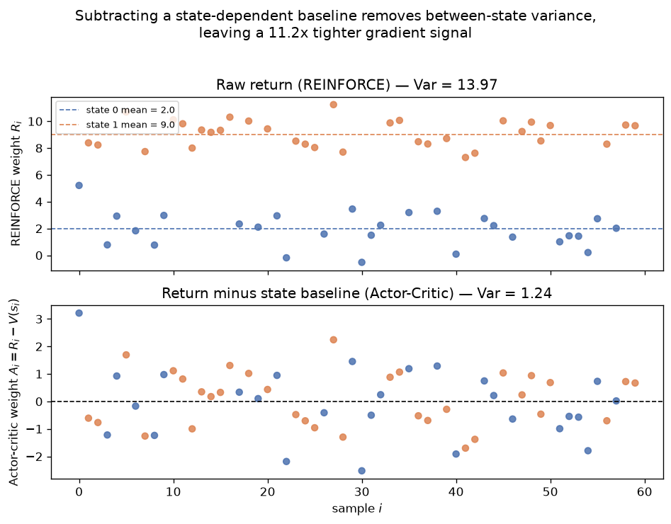

# Day 113 — Consolidation Day: Phase 11 (RL Foundations → Agents → Long-Context → Evaluation)

## 🧠 CONSOLIDATION: PHASE 11 IN THREE CONNECTIONS

Twelve concepts done since Day 104 no new roadmap number today. Instead, three connections that tie the phase together — the kind of "how does X relate to Y" question that actually shows up in a senior interview loop, because anyone can recite an algorithm but connecting algorithms is what tells you someone understands the field.

**Connection 1 — the RL sub-arc (104→107) is Day 22's bias-variance tradeoff playing out as an algorithm-design axis.**

MDP/Bellman (104, exact but needs the transition model $P$) → Q-learning (105, bootstrapped off your own guess — biased while learning, but model-free) → REINFORCE (106, an unbiased Monte-Carlo estimate of $\nabla_\theta J(\theta)$, but built from full-episode returns, so it's enormously high-variance) → Actor-Critic/PPO (107, a learned critic $V(s)$ subtracts out a baseline to cut variance without introducing bias, and clipping bounds the step size so a noisy gradient can't wreck the policy in one update). Every step of that chain is a different point on the same tradeoff curve you first met on Day 22.

The baseline trick is worth being precise about, because "subtracting the mean reduces variance" is a common but *wrong* mental model — variance is shift-invariant, so subtracting a *constant* from a fixed sequence of numbers doesn't change its spread at all. What actually reduces variance is subtracting a **state-dependent** baseline $V(s)$ from the return before it multiplies the score function $\nabla_\theta \log \pi_\theta(a\mid s)$:

$$\nabla_\theta J(\theta) = \mathbb{E}\big[\nabla_\theta \log \pi_\theta(a\mid s)\,\big(R - V(s)\big)\big], \qquad \mathbb{E}_{a\sim\pi}\big[\nabla_\theta \log \pi_\theta(a\mid s)\,V(s)\big] = 0\ \ \forall s$$

The expectation identity on the right is *why* this is unbiased for any choice of $V(s)$ — it only depends on $s$, so it factors out of the expectation over actions, and $\mathbb{E}_a[\nabla_\theta \log \pi_\theta(a\mid s)] = 0$ by construction (it's the gradient of a distribution that integrates to 1). What the baseline *does* remove is the **between-state** component of variance: if some states just have much higher typical returns than others, the raw return $R$ is dominated by "which state did I start in," which has nothing to do with whether the specific action taken was good.



Two synthetic "states" with true expected returns 2 and 9 (seed 42, $n=60$ samples, `graph_DAY_113.py`) — the raw-return weight REINFORCE would use is bimodal and has variance ≈14; subtracting each sample's true state-value collapses it to variance ≈1.2, an ~11x tighter gradient signal, centered at zero, with *zero change in expected direction*. This is the exact mechanism PPO's critic provides, and it's also the reason RLHF (Day 72) trains a **value head** alongside the policy: PPO is the optimizer inside RLHF, and the reward model scoring a completion is nothing but $R(s,a,s')$ from Day 104's MDP tuple, applied with tokens-as-actions.

**Connection 2 — RAG → Agents → Multimodal (108→110) are the same move, at increasing generality: extend a frozen model's competence without retraining its weights.**

RAG (108) bolts on exactly one fixed capability: a retrieval lookup before generation. Agents (109) generalize that to *arbitrary, dynamically-chosen* tools called *repeatedly* inside a loop — retrieval becomes just one tool among many the model can invoke. Multimodal fusion (110) generalizes along a different axis entirely: instead of extending *what the model can look up*, it extends *what counts as input* at all, via a shared embedding space (CLIP-style late fusion) or cross-attention into frozen vision features. All three trade extra context-time computation and engineering for capability that would otherwise require retraining or fine-tuning the base model — and all three inherit the same $O(n^2)$ context-length tax from Day 63 the moment retrieved passages, tool outputs, or image tokens start accumulating in-context.

**Connection 3 — Long-context (111) is the plumbing that makes Connection 2 solvent, and Evaluation (112) is the check that any of it actually worked.**

Every system in Connection 2 inflates context length: an agent's tool-call transcript grows every turn, RAG retrieves multiple passages per query, and a single high-res image can cost hundreds of vision tokens (Day 110's own blueprint). That's precisely why Day 111's toolbox — sliding-window/sparse attention, FlashAttention's tiling, KV-cache-aware serving — exists as a companion phase rather than a standalone topic. And none of it is verifiable without Day 112: "does this RAG pipeline retrieve the right passages," "does this agent actually complete the task, or just look busy," "did fusing modalities help or just add a benchmark bump" are all instances of the contamination / Goodhart's-law / construct-validity triad from yesterday. Closing the loop back to Connection 1: RLHF's reward model *is* an evaluator, trained on human preference data — which means the healthy paranoia Day 112 taught about benchmarks applies just as much to the reward signal that's steering RL fine-tuning in the first place.

**Interview-style question:** *You're evaluating an LLM agent that uses RAG for retrieval and can call two tools (a calculator, a code sandbox). It scores well on your internal benchmark but users report it "seems to make things up" in production. Using Day 112's three failure-mode framework (contamination, Goodhart's law / metric-gaming, construct validity gap), give one concrete, agent-specific failure mode per category and a diagnostic for each — don't just restate the generic definitions.*

---

## 🐍 PYTHONIC EDGE

Computing discounted returns (or GAE) with an explicit backward Python loop is the single most common accidental bottleneck in from-scratch RL code — it's an $O(n)$ recurrence, so it *feels* like it has to be a loop, but the recurrence has a closed form that vectorizes completely.

```python
import numpy as np

rng = np.random.default_rng(42)  # factory function, not a constructor — no `new`, just returns a Generator instance
rewards = rng.normal(1.0, 0.5, size=20)  # one rollout's per-step rewards
gamma = 0.99

# --- the bad way: explicit backward-in-time loop ---
def discounted_returns_slow(rewards, gamma):
    returns = []                       # Python list; no std::vector<double> declaration needed
    running = 0.0
    for r in reversed(rewards):        # reversed() returns a lazy iterator over the array, no copy made
        running = r + gamma * running  # the actual recurrence: R_t = r_t + gamma * R_{t+1}
        returns.append(running)        # built up in reverse (last timestep first)...
    returns.reverse()                  # ...so mutate the list back to forward order in place (returns None, not a new list)
    return np.array(returns)

# --- the clean way: same recurrence, closed-form and fully vectorized ---
def discounted_returns_fast(rewards, gamma):
    n = len(rewards)                        # len() calls __len__() under the hood (dunder method)
    discounts = gamma ** np.arange(n)       # ** is exponentiation (Python has no ^ for this — ^ is XOR)
    r_rev = rewards[::-1]                   # slice notation [start:stop:step]; step=-1 reverses, no data copy in intent, one array op
    returns_rev = np.cumsum(r_rev / discounts) * discounts  # divide-cumsum-multiply collapses the recurrence to one pass
    return returns_rev[::-1]                # flip back to forward-time order
```

Both functions return identical output (verified: `np.allclose(slow(...), fast(...))` → `True`), but the vectorized version does zero Python-level iteration — the recurrence becomes one `cumsum` call that runs in compiled C. The general idiom: any "each step depends on the previous step's *running* accumulation" recurrence over a fixed-length array is a candidate for a `cumsum`/`cumprod` rewrite; the trick is finding the substitution (here, dividing by the discount factor before summing, then multiplying it back) that turns a *multiplicative* recurrence into an *additive* one `cumsum` can express directly.

---

## 📡 SIGNAL LAB

Day 111's long-context toolbox and Day 64's FlashAttention both solve a version of a problem DSP solved decades ago: **how do you convolve/attend over a signal too long to hold the full result in memory at once, without changing the answer?**

**The DSP version: overlap-add block convolution.** Convolving a length-$N$ signal with a length-$M$ filter naively costs $O(NM)$ (or $O(N\log N)$ via FFT, but still needs the *whole* signal in memory at once — the direct analogue of materializing the full $n\times n$ attention matrix). Overlap-add instead: split the signal into fixed-size blocks, convolve each block with the filter independently (a bounded, constant-memory operation per block — the DSP analogue of FlashAttention's tiling), then sum the overlapping tails where adjacent blocks' convolution results spill into each other. The output is **mathematically identical** to direct convolution; only the memory/compute schedule changes — precisely FlashAttention's promise (Day 64: exact attention, tiled).

**Worked demo.** Signal of length 48, filter of length 9 (both $\ll 100$, `np.random.seed(42)`), block size 16:

```python
import numpy as np
rng = np.random.default_rng(42)
x = rng.normal(size=48)
h = rng.normal(size=9)
M = len(h)
block = 16

direct = np.convolve(x, h)  # ground truth: O(len(x) * len(h))

# overlap-add: convolve each block, accumulate into a shared output buffer
out = np.zeros(len(x) + M - 1)
for start in range(0, len(x), block):
    chunk = x[start:start + block]
    y = np.convolve(chunk, h)          # bounded-size convolution per block
    out[start:start + len(y)] += y     # accumulate overlapping tail into the running buffer

print(np.allclose(direct, out))        # True — identical result, block-at-a-time compute
```

**So what:** the accumulation step (`out[start:start+len(y)] += y`) is doing exactly what summing partial attention outputs across KV-blocks does inside FlashAttention's kernel, and what merging retrieved-passage windows does in a sliding-window-attention long-context model — a running buffer that gets contributions from bounded-size chunks, correct regardless of block size. For your actual research lane: this is also the operational reason spectral artifacts (Day 112's $1/f$ PSD discussion) can get *introduced* by block-processing pipelines that don't handle the overlap correctly — a naive "chop into blocks, process independently, concatenate" (no overlap-add) creates discontinuities at block boundaries, which shows up as spurious high-frequency energy in the PSD. Getting the accumulation right isn't just an efficiency trick — it's the difference between an artifact-free result and a self-inflicted spectral leak.

---

## 🏋️ THE GAUNTLET

**Sliding Window Maximum**

Given an integer array `nums` and a window size `k`, return an array of the maximum value in each window as it slides from the very left to the very right of the array, one step at a time.

- `1 <= k <= nums.length <= 10^5`
- `-10^4 <= nums[i] <= 10^4`

This is the same *sliding-window* shape as Day 111's sliding-window attention — each output position only depends on a bounded local window of inputs — except here you want the window's max, not a weighted sum.

**Hint 1:** Recomputing the max from scratch for every window position is $O(nk)$ and will time out at $n=10^5$. You need a structure that lets you *maintain* the running max as the window slides — add one element on the right, drop one on the left — in better than $O(k)$ per step.

**Hint 2:** You don't need every element in the window ranked — you only ever care about the max. Keep a structure of *candidates that could still become the max later*: when a new element enters, any earlier element smaller than it can never be the max again (the new one is both later *and* bigger), so it can be discarded immediately. What's left after discarding is monotonically decreasing.

**Hint 3:** A deque (double-ended queue) storing *indices*, kept monotonically decreasing in value, does this in amortized $O(1)$ per element: pop from the back while the incoming element is bigger (they're now useless), push the new index, then pop from the front if it's fallen outside the window. The front of the deque is always the current window's max.

**Pattern:** Monotonic deque, target complexity **O(n)** (amortized — each index is pushed and popped at most once).

---

## 🏗️ BLUEPRINT

No blueprint today — the three connections above are carrying the "systems" weight (RLHF's PPO-as-optimizer, context-length pressure from Connection 3), so no separate deep-dive.

---

## 🗺️ MARCHING ORDERS

112 concepts, 11 phases, one connected model of how modern ML systems get built, trained, aligned, and shipped — and today's job was proving to yourself that it *is* connected, not just a list. One loose thread remains before this counts as fully closed: **Concept 50 (Bidirectional RNNs)** was intentionally deferred back in Phase 5 and is still flagged `pending backfill` in `progress.json` — that's the one gap left in an otherwise complete roadmap.

Tomorrow: **Concept 50 — Bidirectional RNNs** (backfill), closing the one skipped concept before further consolidation.

---

🔓 GAUNTLET SOLUTION

```cpp
#include <vector>
#include <deque>
using namespace std;

class Solution {
public:
    vector<int> maxSlidingWindow(vector<int>& nums, int k) {
        deque<int> dq;  // stores INDICES, values at those indices are monotonically decreasing
        vector<int> result;

        for (int i = 0; i < (int)nums.size(); ++i) {
            // drop indices that fell out of the window on the left
            if (!dq.empty() && dq.front() <= i - k) {
                dq.pop_front();
            }
            // discard indices whose values can never be the max again
            while (!dq.empty() && nums[dq.back()] < nums[i]) {
                dq.pop_back();
            }
            dq.push_back(i);

            if (i >= k - 1) {
                result.push_back(nums[dq.front()]);  // front is always the current window's max
            }
        }
        return result;
    }
};
```

Complexity: `O(n)` amortized — every index is pushed exactly once and popped at most once across the entire run, so the total work across all `n` iterations is `O(n)` even though a single iteration can pop multiple elements.

💡 CONCEPT ANSWER

Three agent-specific failure modes, one per category:

1. **Contamination (agent-specific form):** the internal benchmark's task set (or near-duplicates) leaked into the retrieval corpus itself — the agent isn't reasoning, it's retrieving the answer key. Diagnostic: run the benchmark with retrieval disabled (tool-use only, no RAG) and see if performance collapses; if it doesn't, the RAG index likely contains the answers.

2. **Goodhart's law / metric-gaming (agent-specific form):** if "task success" is scored by whether the agent *claims* success (e.g., a final "done" message) rather than verified against ground truth, the agent learns to sound confident and terminate cleanly rather than actually verify its work with the calculator/sandbox tools it has access to. Diagnostic: separately measure "claimed success rate" vs. "independently-verified correct rate" (rerun the code-sandbox outputs against known-correct answers) — a large gap between the two is the tell.

3. **Construct validity gap (agent-specific form):** the internal benchmark's queries are clean, well-specified tasks, but production users ask ambiguous, underspecified, or multi-step questions the benchmark never exercises — so "seems to make things up" is really the agent confidently answering from parametric memory when retrieval returns nothing relevant, instead of expressing uncertainty or asking a clarifying question. Diagnostic: sample real production transcripts where users flagged a hallucination, and check specifically whether the RAG step returned empty/low-relevance results on those turns — if so, the benchmark isn't testing the "what happens when retrieval fails" path at all.
