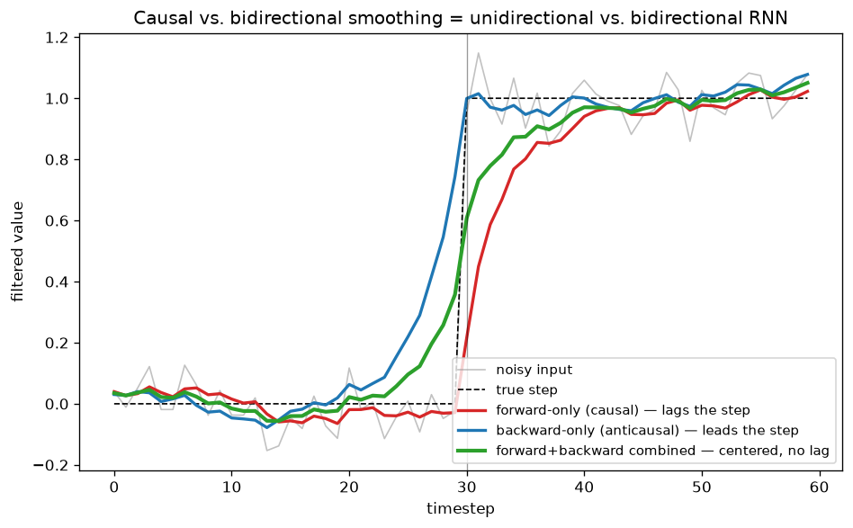

# Day 114 — Concept 50: Bidirectional RNNs (backfill)

*(This concept was intentionally deferred in Phase 5 back on Day 50, so that Days 51-52 could run as an attention lead-in in the same session. Day 113's consolidation flagged it `pending backfill` as the one gap in an otherwise complete 112-concept roadmap — today closes it.)*

## 🧠 CONCEPT OF THE DAY

**Intuition first.** Every RNN you've built so far — vanilla (Day 46), LSTM (Day 48), GRU (Day 49) — reads left to right and only ever knows the past: $h_t$ is a function of $x_1, \dots, x_t$ and nothing after. That's the *correct* constraint for a decoder that has to generate tokens one at a time without knowing the future. But plenty of tasks hand you the **entire sequence up front** — tagging every word in a finished sentence, encoding a full utterance for translation, labeling every frame of a completed audio clip — and for those, refusing to look ahead is just leaving information on the table. A bidirectional RNN (BiRNN) fixes this the direct way: run *two* independent RNNs over the same sequence, one left-to-right and one right-to-left, and glue their hidden states together at every timestep. Now position $t$'s representation has seen the whole sequence, not just the half before it.

**Then the math.** Two RNN cells (any flavor — vanilla, LSTM, GRU — the trick is orthogonal to cell type), each with its **own, separate** set of weights:

$$\overrightarrow{h_t} = \text{RNN}_f(x_t, \overrightarrow{h_{t-1}}), \quad t = 1, \dots, T \qquad \overleftarrow{h_t} = \text{RNN}_b(x_t, \overleftarrow{h_{t+1}}), \quad t = T, \dots, 1$$

where $\overrightarrow{h_0}$ and $\overleftarrow{h_{T+1}}$ are the usual zero-initialized boundary states. The output at each position concatenates both:

$$h_t = [\overrightarrow{h_t} \, ; \, \overleftarrow{h_t}]$$

giving a vector of size $2 \times \text{hidden\_size}$ at every $t$. Critically, $\text{RNN}_f$ and $\text{RNN}_b$ do **not** share $W_{xh}, W_{hh}$ — they're two fully independent networks that happen to be trained jointly and read the same input in opposite orders.

**Why it matters / where it leads.** The catch is right there in the recurrence: computing $\overleftarrow{h_t}$ requires $x_{t+1}, x_{t+2}, \dots, x_T$ to already exist. That's fine for an **encoder** (Day 51's seq2seq encoder is a perfect drop-in candidate — production systems almost always make it bidirectional, since the whole source sentence is available before decoding starts) but structurally impossible for a **decoder**: at generation time, token $t{+}1$ doesn't exist yet, so there is nothing for a backward pass to consume. This is exactly why every autoregressive model — RNN decoders and, later, causally-masked Transformer decoders (Concept 62) — is strictly unidirectional, while every model that consumes a complete, already-given sequence is free to look both ways. That "look both ways at a complete sequence" idea doesn't disappear once RNNs do — it resurfaces almost unchanged as BERT's masked language modeling (Concept 67), except self-attention gets you the bidirectional context in $O(1)$ sequential steps instead of paying for two full $O(T)$ recurrent passes.

**Interview question:** *You're building a named-entity-recognition tagger and a next-word predictor (causal language model) using the exact same LSTM cell. One of these can safely be made bidirectional and one categorically can't. Which is which, and precisely where does the bidirectional version break if you force it onto the wrong task?*

*(Answer at the very bottom.)*

## 🐍 PYTHONIC EDGE

The bug that actually bites people: hand-rolling "bidirectional" by running two separate `nn.LSTM`s and forgetting to reverse the input for the backward one — it silently trains, it just isn't bidirectional at all.

```python
import torch
import torch.nn as nn

batch, seq_len, input_size, hidden_size, num_layers = 4, 10, 16, 32, 1

# --- the bad way: two LSTMs, but the "backward" one never sees a reversed sequence ---
class BadBiLSTM(nn.Module):  # class X(Base): single inheritance, like C++ "class X : public Base"
    def __init__(self):
        super().__init__()  # runs nn.Module's constructor; C++ would do this via an initialiser list, not a call in the body
        self.fwd = nn.LSTM(input_size, hidden_size, batch_first=True)  # self.x = ...: instance attrs are declared+set here, not in a header
        self.bwd = nn.LSTM(input_size, hidden_size, batch_first=True)

    def forward(self, x):  # never call bad_model.forward(x) directly -- see __call__ note below
        out_f, _ = self.fwd(x)          # tuple unpacking: (output, (h_n, c_n)) -- `_` discards the state tuple
        out_b, _ = self.bwd(x)          # BUG: identical `x` as the forward pass -- this LSTM never actually runs right-to-left
        return torch.cat([out_f, out_b], dim=-1)  # dim=-1: negative axis indexing, no C++ equivalent -- "last dimension"

bad_model = BadBiLSTM()

# --- the clean way: let nn.LSTM own the flip/un-flip, via one keyword arg ---
good_model = nn.LSTM(
    input_size, hidden_size, num_layers,
    batch_first=True, bidirectional=True,  # bidirectional=True: internally reverses, runs, then un-reverses for you
)

x = torch.randn(batch, seq_len, input_size)
out, (h_n, c_n) = good_model(x)  # calling good_model(x) invokes __call__, which wraps forward() with PyTorch's hooks
print(f"per-timestep width: {out.shape[-1]}")  # f-string; out.shape[-1] == 2 * hidden_size (both directions concatenated)

# h_n packs EVERY layer's EVERY direction into one leading axis: (num_layers * 2, batch, hidden_size).
# Guessing an index into that axis is the classic off-by-one here -- reshape explicitly instead.
h_n = h_n.view(num_layers, 2, batch, hidden_size)  # .view(): reinterprets the same memory, no copy (only valid on contiguous tensors)
h_forward_last, h_backward_last = h_n[:, 0], h_n[:, 1]  # tuple unpacking again; [:, 0] is 2D slice notation -- "every row, column 0"
```

That `dim=-1` in the bad version and the reversed-input bug are independent issues — you can concatenate correctly and *still* have trained two forward-only LSTMs that happened to see the same data twice.

## 📡 SIGNAL LAB

Today's graph makes the causal-vs-bidirectional distinction literal in DSP terms, not just RNN terms. A **causal filter** (like the forward-only IIR smoother $y[t] = \alpha x[t] + (1-\alpha) y[t-1]$) can only react to a step *after* it happens — its response necessarily lags, because $y[t]$ has no access to $x[t+1], x[t+2], \dots$. Run the identical filter on the *reversed* signal and flip the result back, and you get an **anticausal** response that leads the step, because it already "knows" what's coming. This is exactly `scipy.signal.filtfilt`'s trick in real DSP pipelines (implemented here from scratch with plain NumPy to avoid a non-stdlib dependency): filter forward, filter the reverse, combine — and the combination is *zero-phase*, meaning it introduces no time delay at all, at the direct cost of no longer being usable in a real-time / streaming system, since you need the whole signal before you can run the backward pass.



Forward-only (red) visibly lags the true transition at $t=30$; backward-only (blue) visibly leads it; the combined trace (green) sits centered on the true step with no delay. That's the exact same tradeoff a BiRNN makes with hidden states instead of filter outputs: $\overrightarrow{h_t}$ alone is systematically "behind" (it hasn't seen the future), $\overleftarrow{h_t}$ alone is systematically "ahead" (it's already seen it), and concatenating both gives every position an unbiased, full-context representation — purchased with the same non-causal, batch-only constraint filtfilt pays.

**So what:** if you ever catch yourself explaining "why does my streaming/online model underperform an offline one on the identical architecture," this is very often the real answer hiding underneath — the offline model got to be filtfilt, the streaming one was stuck being causal-only, and no amount of extra capacity closes that gap because it isn't a capacity problem.

## 🏋️ THE GAUNTLET

**Problem — Trapping Rain Water (LeetCode 42).**
Given `n` non-negative integers `height[0..n-1]` representing an elevation map where each bar has width 1, compute how much water it can trap after raining. Constraints: $1 \le n \le 2 \times 10^4$, $0 \le \texttt{height}[i] \le 10^5$.

**Hint 1:** The water sitting above bar $i$ is capped by the *shorter* of the two tallest walls on either side of it — the tallest bar anywhere to its left, and the tallest bar anywhere to its right. Could you compute "tallest bar so far" with one left-to-right sweep, and "tallest bar so far" with one right-to-left sweep — the exact two directional passes from today's lesson?

**Hint 2:** That two-array approach is correct at $O(n)$ time but costs $O(n)$ extra space for both arrays. At any index $i$, do you actually need the *exact* value of both `leftMax[i]` and `rightMax[i]`, or just to know which one is smaller?

**Hint 3:** Try two pointers starting at both ends, each tracking a running max as it moves inward. At each step, can you always safely resolve the water level for the pointer on the side with the *smaller* running max — without ever having computed the other side's true max yet?

**Pattern:** two-pass boundary aggregation, collapsible into a single two-pointer sweep. Target: $O(n)$ time, $O(1)$ extra space.

## 🏗️ BLUEPRINT

No blueprint today.

## 🗺️ MARCHING ORDERS

The roadmap is genuinely closed now — all 112 concepts covered, including the one that got left behind in Phase 5. That's worth noticing: shipping something *complete* beats shipping something merely forward-moving, and today was the discipline of actually going back for the one thing you skipped instead of quietly letting it stay skipped forever.

Tomorrow: **Consolidation Day** — Concepts 1-112 are now fully closed with no gaps remaining.

---

🔓 GAUNTLET SOLUTION

```cpp
class Solution {
public:
    int trap(vector<int>& height) {
        int n = height.size();
        if (n == 0) return 0;

        int left = 0, right = n - 1;
        int leftMax = 0, rightMax = 0;
        int water = 0;

        while (left < right) {
            if (height[left] < height[right]) {
                // height[right] is >= height[left], so whatever the true
                // rightMax turns out to be, it's already >= height[left] --
                // leftMax is therefore the binding constraint at `left`.
                leftMax = max(leftMax, height[left]);
                water += leftMax - height[left];
                left++;
            } else {
                rightMax = max(rightMax, height[right]);
                water += rightMax - height[right];
                right--;
            }
        }
        return water;
    }
};
```

Complexity: `O(n)` time — each pointer moves inward at most `n` times total — `O(1)` extra space.

💡 CONCEPT ANSWER

**The NER tagger can be bidirectional; the causal language model categorically cannot — and the break is a leakage problem, not just a "worse fit" problem.**

NER tagging has the entire sentence available before any tag is produced — there's no generation step, no token being predicted from ones that come after it in the *loss*. Every tag for every position is emitted jointly, conditioned on the full, already-complete sentence. That's precisely the regime bidirectionality is built for: $\overleftarrow{h_t}$ consuming $x_{t+1}, \dots, x_T$ is legitimate extra context, not a shortcut.

Try to force the same trick onto a causal LM and two separate things break:

1. **Training-time leakage.** The LM's loss at position $t$ is "predict $x_{t+1}$ from $h_t$." If $h_t$ includes $\overleftarrow{h_t}$, and $\overleftarrow{h_t}$ was built by scanning backward starting from $x_T$ down through $x_{t+1}$, then $x_{t+1}$ — the literal label being predicted — is already baked into the very features used to predict it. The model doesn't learn to predict anything; it learns to copy a value it was just handed, and loss collapses toward zero while learning nothing transferable.
2. **Inference-time impossibility, independent of the leakage.** Even ignoring point 1, at the moment you're generating token $t+1$, tokens $t+2, t+3, \dots$ don't exist yet — there is no sequence for a backward pass to run over. $\overleftarrow{h_t}$ isn't just cheating during training, it's *undefined* during generation.

That's the general rule, not an RNN-specific quirk: bidirectionality is safe exactly when the full sequence is fixed and given before any prediction is scored against it, and unsafe the moment the model has to produce the next piece of the sequence it would otherwise be allowed to look at.
