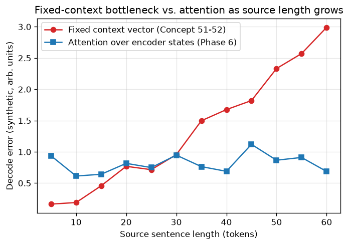

# Day 115 — Consolidation Day: Phase 5 (RNN Sequence Modeling, Concepts 45–52, Now Complete)

*(The roadmap closed for real on Day 114 with the Concept 50 backfill. Phase 5 was the phase carrying the gap, so it's the one that never got its own consolidation pass — that's today. Going forward, with no new concepts left to advance to, consolidation days rotate back through the phases in order, starting from Phase 1 next, on the logic that the earliest material is the most at risk of quietly fading.)*

## 🧠 CONSOLIDATION: PHASE 5 IN THREE CONNECTIONS

**Connection 1 — BPTT's exponential forgetting (46→47) is solved the same way vanishing gradients are solved everywhere else: replace a multiplicative path with an additive one.**

Backprop through time (46) unrolls the recurrence and chains gradients across every timestep:

$$\frac{\partial L}{\partial h_0} = \frac{\partial L}{\partial h_T} \prod_{t=1}^{T} \frac{\partial h_t}{\partial h_{t-1}}$$

Each factor $\frac{\partial h_t}{\partial h_{t-1}}$ involves $W_{hh}$ and an activation derivative, so the product is exactly the kind of repeated-multiplication chain that caused vanishing gradients back on Day 20 — except here the "depth" is sequence length, not layer count, so a 200-token sequence is a 200-layer network with *tied* weights. That's precisely "why RNNs forget" (47): influence from early timesteps decays geometrically, the same $\rho^T \to 0$ behavior as a stable filter pole. LSTM's fix (48) doesn't fight the multiplication — it adds a second, parallel path that mostly skips it:

$$c_t = f_t \odot c_{t-1} + i_t \odot \tilde{c}_t$$

When the forget gate $f_t \approx 1$, the cell-state path is (near-)additive across time — $\partial c_t / \partial c_{t-1} \approx 1$ instead of $\approx W_{hh}$ — so gradients can survive hundreds of steps without decaying. GRU (49) gets the same additive highway with one fewer gate by fusing the cell state into the hidden state directly. It's the identical mechanism as ResNet's skip connections (Day 41, still four phases away when you first met it here) — an additive shortcut around a multiplicative bottleneck — which is worth sitting with, because it means you'd already derived half of ResNet's motivation before you'd seen a single convolution.

**Connection 2 — Bidirectionality (50) and the seq2seq encoder–decoder split (51) are the same causal/non-causal boundary Day 114 just drew, now load-bearing at the architecture level.**

Concept 50's rule — bidirectional is safe exactly when the full sequence is fixed and given before any prediction is scored against it — isn't a footnote, it's *why* the seq2seq split (51) has the shape it does. The encoder gets the entire source sentence up front with nothing left to predict from it, so it's free to be (and in production almost always is) bidirectional. The decoder is generating the one thing it's not allowed to have seen, so it's structurally stuck unidirectional, gated only by the encoder's final state. Every later "encoder-side vs. decoder-side" architectural split you'll hit — BERT (67) vs. GPT (68), encoder-only vs. decoder-only vs. encoder-decoder (61), causal masking (62) — is this exact same boundary redrawn with attention instead of recurrence.

**Connection 3 — the fixed-context bottleneck (52) isn't a flaw to patch, it's the exact gap Phase 6's attention exists to close.**

Vanilla seq2seq (51) forces the *entire* source sentence through one fixed-size vector $h_T$ handed to the decoder once. Making the encoder bidirectional (50) or gated (48/49) improves the *quality* of what goes into that vector, but does nothing about its fixed *capacity* — and the information content of "the whole sentence" grows with sentence length while the vector's dimensionality doesn't. So performance degrades on long sentences no matter how good the encoder is, because the bottleneck was never an encoder problem.



The synthetic curves make the shape of the failure literal (seed 42, 12 lengths from 5 to 60 tokens, `graph_DAY_115.py`): the fixed-context error grows superlinearly with length, while a decoder that can re-read every encoder state at every step (the attention preview) stays flat. That flat line is Concept 53 — the entire motivation for attention is captured in the gap between those two curves, not in anything more exotic.

**Interview question:** *A production seq2seq translation model degrades sharply on sentences past ~40 tokens, even though its encoder is a full bidirectional LSTM with no vanishing-gradient issues. Your teammate suggests doubling the hidden-state size to fix it. Why will that only push the failure point further out rather than solve it, and what's the actual architectural fix?*

*(Answer at the very bottom.)*

## 🐍 PYTHONIC EDGE

The bug that quietly wrecks batched RNN training: padding variable-length sequences to a common length and feeding the padded tensor straight into `nn.LSTM` — the model "learns" on garbage padding timesteps and its final hidden state is contaminated by however many zero-tokens got appended.

```python
import torch
import torch.nn as nn
from torch.nn.utils.rnn import pad_sequence, pack_padded_sequence, pad_packed_sequence

seqs = [torch.randn(7, 8), torch.randn(3, 8), torch.randn(5, 8)]  # 3 sequences, same feature dim, different lengths
lengths = [s.size(0) for s in seqs]  # list comprehension-adjacent: len() per tensor via .size(0)

# --- the bad way: pad, then feed the raw padded tensor straight in ---
padded = pad_sequence(seqs, batch_first=True)  # (batch=3, T=7, 8) -- shorter seqs zero-filled at the tail
lstm = nn.LSTM(8, 16, batch_first=True)
bad_out, (bad_h, bad_c) = lstm(padded)  # LSTM has no idea seq 2 and 3 "ended" early
# bad_h[:, 1] and bad_h[:, 2] are hidden states AFTER running over pure zero-padding --
# not the hidden state at the true last real token. Silently wrong, never errors.

# --- the clean way: tell the LSTM the real lengths so it skips the padding ---
packed = pack_padded_sequence(
    padded, lengths, batch_first=True, enforce_sorted=False,
    # enforce_sorted=False: kwarg, PyTorch internally sorts/unsorts for you --
    # older code required seqs pre-sorted by length descending, this kwarg removes that constraint
)
packed_out, (h_n, c_n) = lstm(packed)  # tuple unpacking: (output, (h_n, c_n)) same as any nn.LSTM call
out, out_lens = pad_packed_sequence(packed_out, batch_first=True)  # back to a padded tensor, +true lengths, for downstream use

print(f"h_n now reflects the TRUE last timestep for every sequence: {h_n.shape}")  # f-string; shape unaffected, values are correct
```

The general idiom: `pack_padded_sequence` doesn't change what shape comes out — it changes what the recurrence actually *computes*, by making PyTorch's C++ backend skip padding timesteps entirely rather than run the recurrence over them and hope it doesn't matter. It never does.

## 📡 SIGNAL LAB

Concept 48's forget gate has an exact DSP analogue you've already used without the RNN framing: a **one-pole leaky integrator / first-order IIR low-pass filter**,

$$y[t] = a \cdot y[t-1] + (1-a) \cdot x[t], \qquad 0 < a < 1$$

which is structurally identical to the additive cell-state update from Connection 1 with $f_t = a$ held constant instead of learned. The pole is at $z = a$, and its impulse response decays as $a^n$ — an exponential memory with time constant

$$\tau = \frac{-1}{\ln a} \quad \text{(in samples)}$$

```python
import numpy as np

for a in [0.5, 0.9, 0.99]:                     # forget-gate values, low to high
    tau = -1 / np.log(a)                        # np.log is natural log, matches the math above
    print(f"a={a}: effective memory ~ {tau:.1f} samples")
# a=0.5:  ~1.4 samples   -- forgets almost immediately
# a=0.9:  ~9.5 samples   -- short working memory
# a=0.99: ~99.5 samples  -- long memory, but z=a is now very close to the unit circle
```

**So what:** this is *exactly* why LSTM forget gates are initialized biased toward 1 (a well-known trick, not an accident) — you want $a$ near the unit circle by default so the model starts with long memory available and has to actively learn to *forget*, rather than starting near $a=0.5$ and having to fight vanishing gradients just to discover that long memory helps at all. It's also the same stability caveat DSP already teaches: a pole pushed too close to $|z|=1$ buys longer memory at the cost of being nearly marginally stable — for the RNN, that's the mirror image of the vanishing-gradient problem, now on the exploding side (Day 21's gradient clipping exists for exactly this regime).

## 🏋️ THE GAUNTLET

**Problem — Longest Increasing Subsequence (LeetCode 300).**
Given an integer array `nums`, return the length of the longest strictly increasing subsequence (not necessarily contiguous). Constraints: $1 \le \texttt{nums.length} \le 2500$, $-10^4 \le \texttt{nums}[i] \le 10^4$.

**Hint 1:** The textbook DP is `dp[i]` = length of the LIS *ending exactly at index i* = `1 + max(dp[j] for j < i where nums[j] < nums[i])`, giving $O(n^2)$. At $n=2500$ that's ~6M ops — fine here, but the pattern generalizes badly. Do you really need to check every `j < i`, or just whether *some* increasing subsequence of each possible length could be extended by `nums[i]`?

**Hint 2:** Maintain an array `tails` where `tails[k]` = the *smallest* possible tail value among all increasing subsequences of length `k+1` found so far. `tails` is provably sorted at all times. When a new value `x` arrives, where in `tails` does it belong — and does inserting it there ever require looking at more than one existing entry?

**Hint 3:** Binary-search `tails` for the first entry `>= x` (`lower_bound` in C++) and overwrite it with `x`; if `x` is bigger than every entry, append it. The final length of `tails` is the answer — but note `tails` itself is generally *not* a valid subsequence of the array, only its length is meaningful.

**Pattern:** DP collapsed via patience sorting + binary search. Target: $O(n \log n)$ time, $O(n)$ space.

## 🏗️ BLUEPRINT

**Full-utterance bidirectional encoding is a latency decision, not just an accuracy one.** Connection 2's "encoder can be bidirectional, decoder can't" is clean in theory, but production streaming systems (live speech-to-text, simultaneous translation) can't actually wait for the entire utterance before the encoder's backward pass even starts — that would mean zero output until the speaker stops talking. The real-world compromise is a **limited look-ahead window**: the encoder runs bidirectionally only over a small chunk (e.g. a few hundred ms of audio) rather than the full sequence, trading a bounded, tunable latency hit for most of the accuracy benefit of true bidirectionality. It's the same knob as the DSP block size in Day 113's overlap-add and Day 64's FlashAttention tiling — smaller windows mean lower latency and less context per decision, and every streaming architecture is picking a point on that same curve.

## 🗺️ MARCHING ORDERS

Today wasn't new material — it was proving Phase 5 actually holds together as one arc (forgetting → gating → directionality → bottleneck) rather than eight isolated facts, and that arc turns out to *end* exactly where Phase 6 begins. That's the real test of whether you've learned something or just memorized it: can you point at the seam where it hands off to the next thing.

Tomorrow: **Consolidation Day — Phase 1 (Concepts 1–12: neuron, activations, loss, backprop, gradient descent)** — the oldest material, and the most likely to have quietly eroded.

---

🔓 GAUNTLET SOLUTION

```cpp
#include <vector>
#include <algorithm>
using namespace std;

class Solution {
public:
    int lengthOfLIS(vector<int>& nums) {
        vector<int> tails;  // tails[k] = smallest tail value of an increasing subsequence of length k+1

        for (int x : nums) {
            auto it = lower_bound(tails.begin(), tails.end(), x);  // first element >= x
            if (it == tails.end()) {
                tails.push_back(x);   // x extends the longest subsequence found so far
            } else {
                *it = x;              // x gives a strictly better (smaller) tail for that length
            }
        }
        return tails.size();
    }
};
```

Complexity: `O(n log n)` — one binary search per element — `O(n)` space for `tails`.

💡 CONCEPT ANSWER

**Doubling the hidden size only postpones the failure because the bottleneck is capacity-vs-length, not encoder quality — and encoder quality is the only thing a bidirectional LSTM improves.**

The fixed context vector $h_T$ has to represent the *entire* source sentence, and the amount of information needed to do that grows with sentence length. A bigger $h_T$ raises the ceiling on how much it can hold, so it takes longer sentences to overflow it — but any fixed dimensionality is eventually overwhelmed by a sentence long enough, just at a later length than before. It's a capacity argument, completely orthogonal to whether the encoder producing $h_T$ is bidirectional, gated, or stacked ten layers deep — none of that changes the fact that everything still has to funnel through one vector, computed once, handed to the decoder a single time.

The actual fix is architectural, not a size increase: stop compressing the whole sentence into one vector at all. Let the decoder attend back over *every* encoder hidden state at *every* decoding step (Concept 53), so the "context" used to generate word $t$ is a fresh, dynamically-weighted combination of the full source sequence rather than a single fixed snapshot taken once at the end of encoding. Capacity then scales naturally with source length (more encoder states to attend over), instead of being capped by a hyperparameter chosen in advance.
