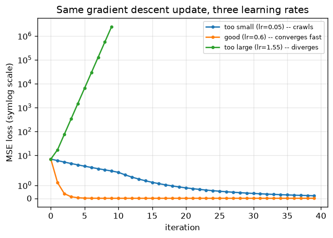

# Day 116 — Consolidation Day: Phase 1 (Concepts 1–12, the oldest material)

*(Day 115 flagged this as next: after Day 114 closed the one gap in the 112-concept roadmap, consolidation now rotates back through the phases in order, starting from Phase 1 — the earliest material, and the most likely to have quietly eroded under everything built on top of it since.)*

## 🧠 CONSOLIDATION: PHASE 1 IN THREE CONNECTIONS

**Connection 1 — nonlinearity (2, 3) is not decoration on top of the neuron (1); it's the only reason depth (and the loss functions in 4, 5) can do anything a single linear layer can't.**

The artificial neuron (1) computes $a = f(w^\top x + b)$ — a linear map followed by an activation. Stack two of these layers with $f$ removed (i.e. $f(z) = z$) and watch what happens:

$$a = W_2(W_1 x + b_1) + b_2 = (W_2 W_1)\,x + (W_2 b_1 + b_2) = W' x + b'$$

Two matrix multiplies collapse into one. Depth bought you *nothing* — a 50-layer linear network is exactly as expressive as a 1-layer linear network, just slower to train and more expensive to store. This is why sigmoid/tanh (2) and the ReLU family (3) aren't a stylistic choice between "smooth" and "cheap" — they're the only thing standing between "neural network" and "linear regression with extra steps." It's also why MSE (4) and softmax+cross-entropy (5) *need* that nonlinearity to be worth optimizing at all: a loss landscape over a collapsed linear model is a single convex bowl no matter how many parameters you throw at it, and gradient descent (10) on a convex bowl was never the interesting part of deep learning — fitting the nonlinear decision boundaries only depth-plus-nonlinearity can express is.

**Connection 2 — the computational graph and chain rule (6, 7) aren't preamble to backprop (8, 9); backprop *is* the chain rule applied systematically, and the graph is just what makes "systematically" tractable.**

Concept 7's chain rule for a scalar loss $L$ depending on a parameter $w$ through an intermediate $z$:

$$\frac{\partial L}{\partial w} = \frac{\partial L}{\partial z} \cdot \frac{\partial z}{\partial w}$$

is trivial for one hop. The entire content of concept 6 (representing the forward computation as a DAG of ops) is that a real network is a *long chain* of these hops, and the chain rule composes across all of them by simple multiplication:

$$\frac{\partial L}{\partial w^{(1)}} = \frac{\partial L}{\partial a^{(L)}} \cdot \frac{\partial a^{(L)}}{\partial a^{(L-1)}} \cdots \frac{\partial a^{(1)}}{\partial w^{(1)}}$$

Concept 8's "credit assignment" intuition — how much did this early weight contribute to the final error — is just this product made concrete. Concept 9's contribution is realizing you don't recompute this product from scratch for every weight: you cache each layer's local Jacobian once during the forward pass, then walk the graph **backward**, reusing $\partial L/\partial a^{(l)}$ to compute $\partial L/\partial a^{(l-1)}$ in $O(1)$ extra work per layer instead of re-deriving the whole chain. That reuse is the entire reason backprop is $O(\text{graph size})$ instead of exponential — and it's also exactly why the DAG has to be acyclic and why every autograd engine (PyTorch's `autograd`, included) topologically sorts the graph before running backward: you can't reuse a downstream gradient you haven't computed yet.

**Connection 3 — gradient descent (10) is the engine, but the learning rate (11) decides whether the engine runs at all, and epochs/batches/iterations (12) is just bookkeeping for *how often* it fires.**

Concept 10 gives you the update rule $w \leftarrow w - \eta \nabla_w L$. Concept 11's whole point is that $\eta$ isn't a free hyperparameter you can set generously "to be safe" — for a quadratic loss, convergence requires $\eta < 2/\lambda_{\max}$ where $\lambda_{\max}$ is the largest eigenvalue of the loss's Hessian (its local curvature). Undershoot that bound and you crawl toward the minimum; overshoot it and each update overcorrects *past* the minimum by more than the previous step, and the loss grows without bound instead of shrinking.



Same synthetic linear-regression fit (seed 42, `y = 3x + 2 + noise`, `graph_DAY_116.py`), same update rule, three values of $\eta$: at 0.05 the loss is still 0.2 after 40 steps; at 0.6 it's converged to 0.019 within about 10; at 1.55 it's $10^{25}$ and climbing. Concept 12's epoch/batch/iteration vocabulary is what turns this single-parameter story into a real training loop — mini-batch SGD trades exact gradients for noisy, cheaper ones computed more often per epoch — but the noise a smaller batch introduces interacts with $\eta$ the same way: a learning rate that's stable for full-batch gradient descent can become *unstable* once you're taking noisier per-batch steps. That interaction is precisely why Phase 2 exists: momentum (13), Adam (16), and LR schedules (17) are all, at bottom, techniques for keeping the effective step size inside that same stability bound while the loss surface's curvature — and the gradient noise — changes as training progresses.

**Interview question:** *A junior engineer asks: "Why not just add more layers and more neurons per layer instead of using ReLU — won't a wide-enough linear network approximate any function too?" Give the precise reason this fails, referencing what happens to the composition of the layers.*

*(Answer at the very bottom.)*

## 🐍 PYTHONIC EDGE

The bug that quietly produces a "linear network in disguise": building an MLP in PyTorch by stacking `nn.Linear` layers and forgetting the activation between them — it trains, the loss even drops, and it's still mathematically a single linear map (Connection 1, made literal in code).

```python
import torch
import torch.nn as nn

# --- the bad way: three Linear layers, no activation between any of them ---
class SecretlyLinear(nn.Module):  # class X(Base): single inheritance -- C++'s "class X : public Base"
    def __init__(self, in_dim, hidden, out_dim):
        super().__init__()  # runs nn.Module's constructor; C++ does this via an initialiser list, not a call in the body
        self.net = nn.Sequential(          # self.x = ...: instance attribute, set in the body (C++: declare in header, init in body)
            nn.Linear(in_dim, hidden),
            nn.Linear(hidden, hidden),      # BUG: no activation -- these three Linears algebraically collapse to one
            nn.Linear(hidden, out_dim),
        )

    def forward(self, x):  # never call model.forward(x) directly -- see __call__ note below
        return self.net(x)

# --- the clean way: nonlinearity between every pair of Linear layers ---
class ActuallyDeep(nn.Module):
    def __init__(self, in_dim, hidden, out_dim):
        super().__init__()
        self.net = nn.Sequential(
            nn.Linear(in_dim, hidden),
            nn.ReLU(),                      # this is the only thing that stops the stack from collapsing (Connection 1)
            nn.Linear(hidden, hidden),
            nn.ReLU(),
            nn.Linear(hidden, out_dim),
        )

    def forward(self, x):
        return self.net(x)

model = SecretlyLinear(4, 16, 1)
x = torch.randn(8, 4)
out = model(x)  # calling model(x) invokes __call__, which wraps forward() with PyTorch's hooks -- never call .forward() directly

# proof: collapse the bad model's three weight matrices by hand and compare to its actual output
W1, W2, W3 = (m.weight for m in model.net if isinstance(m, nn.Linear))  # generator expression; no C++ equivalent
b1, b2, b3 = (m.bias for m in model.net if isinstance(m, nn.Linear))
W_collapsed = W3 @ W2 @ W1                              # @ is matrix multiplication (not * , which would broadcast elementwise)
b_collapsed = W3 @ (W2 @ b1 + b2) + b3
manual_out = x @ W_collapsed.T + b_collapsed             # .T transposes; matches nn.Linear's y = xW^T + b convention
print(torch.allclose(out, manual_out, atol=1e-5))  # True -- SecretlyLinear really is one matrix, three Linears deep
```

The general idiom: `isinstance(m, nn.Linear)` inside a generator expression is a clean way to pull specific submodules out of an `nn.Sequential` by type rather than by hardcoded index — index-based access (`model.net[0].weight`) breaks the moment someone inserts a layer earlier in the stack.

## 📡 SIGNAL LAB

Concept 10's gradient descent and concept 4's MSE loss aren't just analogous to a classic DSP algorithm — for a linear model they're *identical* to it. The **Least Mean Squares (LMS) adaptive filter** update, used everywhere from echo cancellation to channel equalization, is:

$$w[n+1] = w[n] + \mu\, e[n]\, x[n], \qquad e[n] = d[n] - w[n]^\top x[n]$$

That's stochastic gradient descent on the MSE between a filter's output and a desired signal $d[n]$, with the DSP literature's step size $\mu$ being exactly concept 11's learning rate $\eta$ (up to a factor of 2 depending on convention). The stability bound is the same bound too — DSP textbooks derive $0 < \mu < 2/\lambda_{\max}(R_{xx})$ where $R_{xx}$ is the input autocorrelation matrix, which is *the same eigenvalue-of-the-Hessian bound* Connection 3 used, because for a linear model under MSE, the loss Hessian **is** $R_{xx}$.

```python
import numpy as np

rng = np.random.default_rng(42)
n = 60
x = rng.normal(size=n)                      # input signal
h_true = 0.6                                # the "system" LMS is trying to identify, one tap for clarity
d = h_true * x + rng.normal(0, 0.05, size=n)  # desired signal = true filter output + noise

def lms(x, d, mu, w0=0.0):
    w = w0
    history = []
    for xn, dn in zip(x, d):    # zip pairs the two signals sample-by-sample; no C++ equivalent without writing an index loop
        e = dn - w * xn         # instantaneous error -- this IS the MSE gradient's error term
        w += mu * e * xn        # the LMS update -- identical in form to SGD: w -= lr * grad, grad = -2*e*x
        history.append(w)
    return np.array(history)

for mu in [0.01, 0.3, 1.1]:                 # step sizes, low to high -- same three regimes as graph_DAY_116.py
    w_hist = lms(x, d, mu)
    print(f"mu={mu}: final w={w_hist[-1]:.3f} (target {h_true}), diverged={not np.isfinite(w_hist[-1])}")
```

**So what:** this is the concrete reason a frequency-domain researcher should never treat "gradient descent" and "adaptive filtering" as two separate toolkits — an LMS-adapted equalizer converging or diverging under a bad step size *is* Day 116's Connection 3, just with $x[n]$ playing the role of a training batch arriving one sample at a time online instead of all-at-once from a fixed dataset. The generalization in the other direction matters too: RMSprop/Adam (Phase 2, Day 16) are literally normalized-LMS variants that DSP arrived at independently decades earlier for the exact same reason — a single global step size is wasteful when different taps (or parameters) see wildly different signal energy.

## 🏋️ THE GAUNTLET

**Problem — Course Schedule II (LeetCode 210).**
There are `numCourses` courses labeled `0` to `numCourses - 1`. You're given `prerequisites[i] = [a, b]` meaning you must take course `b` before course `a`. Return **any** valid order to take all courses, or an empty array if it's impossible.
Constraints: $1 \le \texttt{numCourses} \le 2000$, $0 \le \texttt{prerequisites.length} \le \texttt{numCourses} \times (\texttt{numCourses}-1)$.

This is exactly Connection 2's punchline made into a standalone problem: before an autograd engine can run backward, it has to produce a valid execution order of the computational graph's nodes — an order where every node's inputs are computed before the node itself runs. That's precisely what this problem asks for.

**Hint 1:** Model courses as nodes and each `[a, b]` as a directed edge `b → a` ("b must come before a"). A valid course order exists **iff** this directed graph has no cycle — if it does, some course depends (transitively) on itself, which is unsatisfiable. What's the name for a valid linear ordering of a DAG's nodes respecting all edge directions?

**Hint 2:** You don't need DFS finish-time tricks to get a topological order — Kahn's algorithm does it with a queue. Compute each node's **in-degree** (number of prerequisites still owed). Any node with in-degree 0 can be taken right now with nothing left to block it.

**Hint 3:** Push all in-degree-0 nodes into a queue. Pop one, append it to the answer, then decrement the in-degree of everything it points to — if any of those drop to 0, push them too. If you finish with fewer nodes in your answer than `numCourses`, a cycle ate the rest; return empty.

**Pattern:** Kahn's algorithm / BFS topological sort. Target: $O(V + E)$ time, $O(V + E)$ space.

## 🏗️ BLUEPRINT

No blueprint today — Connection 2's autograd-graph point (topological sort as a prerequisite for backward, not an implementation detail) is carrying the systems weight this consolidation.

## 🗺️ MARCHING ORDERS

Twelve concepts, one arc: a neuron is only interesting because of its nonlinearity, the chain rule only becomes backprop once you stop recomputing it from scratch, and gradient descent only works inside a step-size window that everything in Phase 2 exists to widen and stabilize. That's the test for whether Phase 1 actually stuck — not "can you recite each concept," but "can you see concept 12 as a direct setup for concept 13, not just the next number on the list."

Tomorrow: **Consolidation Day — Phase 2 (Concepts 13–23: optimizers, initialization, and the vanishing/exploding-gradient pair)** — the phase that exists entirely to make today's Connection 3 hold up outside toy quadratics.

---

🔓 GAUNTLET SOLUTION

```cpp
#include <vector>
#include <queue>
using namespace std;

class Solution {
public:
    vector<int> findOrder(int numCourses, vector<vector<int>>& prerequisites) {
        vector<vector<int>> adj(numCourses);   // adj[b] = list of courses that require b first
        vector<int> indegree(numCourses, 0);

        for (auto& p : prerequisites) {
            int a = p[0], b = p[1];            // b must be taken before a
            adj[b].push_back(a);
            indegree[a]++;
        }

        queue<int> q;
        for (int i = 0; i < numCourses; ++i) {
            if (indegree[i] == 0) q.push(i);   // no prerequisites owed -- can start immediately
        }

        vector<int> order;
        while (!q.empty()) {
            int cur = q.front(); q.pop();
            order.push_back(cur);
            for (int next : adj[cur]) {
                if (--indegree[next] == 0) {   // this was the last prerequisite `next` was waiting on
                    q.push(next);
                }
            }
        }

        if ((int)order.size() != numCourses) return {};  // fewer nodes processed than exist -> a cycle blocked the rest
        return order;
    }
};
```

Complexity: `O(V + E)` — every node is enqueued/dequeued once, every edge relaxed once.

💡 CONCEPT ANSWER

**A wide-enough purely linear network still computes only a linear function of its input, no matter how many neurons or layers you add — width and depth both fail to buy nonlinearity, because matrix composition is closed under linearity.**

Every layer without an activation is $a^{(l)} = W^{(l)} a^{(l-1)} + b^{(l)}$. Chaining $L$ such layers gives $a^{(L)} = W^{(L)}\big(\cdots W^{(1)} x + b^{(1)} \cdots\big) + b^{(L)}$, and multiplying out the matrices collapses this to a single $a^{(L)} = W' x + b'$ for some fixed $W' = W^{(L)} W^{(L-1)} \cdots W^{(1)}$ — exactly Connection 1's derivation, and it holds regardless of how wide each $W^{(l)}$ is. Adding neurons per layer only changes the *intermediate* dimensionality that gets collapsed away; it never changes the fact that the end-to-end map is one matrix multiply plus one bias, which can only ever represent linear (hyperplane) decision boundaries.

Inserting a nonlinearity $f$ between layers — $a^{(l)} = f\big(W^{(l)} a^{(l-1)} + b^{(l)}\big)$ — breaks the collapse: $f$ doesn't commute with matrix multiplication, so there's no single matrix that reproduces $W^{(2)} f(W^{(1)} x + b^{(1)}) + b^{(2)}$. That's the mechanical reason depth-plus-nonlinearity can approximate arbitrary decision boundaries (the universal approximation theorem) while depth-without-nonlinearity is provably stuck at linear ones, however many parameters you throw at it.
