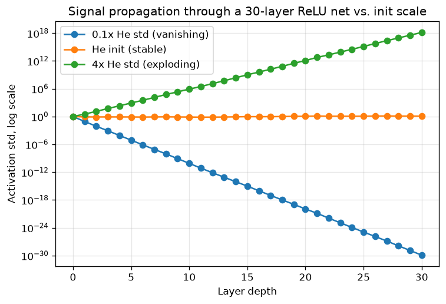

# Day 117 — Consolidation Day: Phase 2 (Concepts 13–23, optimizers and stability)

*(Day 116 flagged this as next: consolidation continues rotating forward through the phases, from Phase 1's foundations to Phase 2's machinery for actually training something deep.)*

## 🧠 CONSOLIDATION: PHASE 2 IN THREE CONNECTIONS

**Connection 1 — momentum (13) → Nesterov (14) → AdaGrad/RMSprop (15) → Adam/AdamW (16) → LR schedules (17) is one continuous story: each step fixes a specific failure of the step before it, and the failure they're all fixing is Day 116's stability bound ($\eta < 2/\lambda_{\max}$) breaking down the moment the loss surface stops being an isotropic bowl.**

Vanilla SGD's update is $w \leftarrow w - \eta \nabla_w L$. In a ravine — curvature very different along different directions — a single $\eta$ that's stable along the steep direction is far too small along the shallow one, so SGD oscillates across the ravine while crawling along it. Momentum (13) fixes this by accumulating a velocity:

$$v_t = \beta v_{t-1} + \nabla_w L(w_{t-1}), \qquad w_t = w_{t-1} - \eta v_t$$

Oscillating components (gradient sign flips every step) cancel in the running sum; the consistent component (same sign every step, the ravine's long axis) accumulates. Nesterov (14) asks one sharper question: since you're about to move by $\beta v_{t-1}$ anyway, why evaluate the gradient at $w_{t-1}$ instead of at $w_{t-1} - \eta\beta v_{t-1}$ — where you'll actually be? That lookahead gradient gives a correction term that damps overshoot momentum alone can't see coming.

AdaGrad and RMSprop (15) attack a different axis of the same problem: momentum still uses one global $\eta$ for every parameter, but different parameters can need wildly different step sizes (a rarely-updated embedding row vs. a dense layer's weights). AdaGrad divides each parameter's step by the accumulated sum of its squared past gradients; RMSprop replaces the unbounded sum with an exponential moving average so the step doesn't decay to zero over a long run:

$$s_t = \gamma s_{t-1} + (1-\gamma)(\nabla_w L)^2, \qquad w_t = w_{t-1} - \frac{\eta}{\sqrt{s_t}+\epsilon}\nabla_w L$$

Adam (16) is not a fourth idea — it's momentum's first moment $m_t$ (exactly concept 13's $v_t$, just renamed) combined with RMSprop's second moment $s_t$, plus a bias correction for both because they're initialized at zero and start biased toward it during warmup. AdamW's one change — decaying weights directly instead of folding $\lambda w$ into the gradient before the adaptive scaling — exists because scaling weight decay by $1/\sqrt{s_t}$ (Adam's naive behavior) decouples the decay strength from a quantity it was never supposed to depend on. LR schedules (17) sit on top of all of this: even with per-parameter adaptation, the *global* multiplier $\eta$ still needs to shrink as training approaches convergence (cosine decay, step decay) or ramp up first to avoid a bad early step ruining Adam's moment estimates before they've seen enough gradients to be reliable (warmup) — this is the exact same lesson as Day 116's stability bound, just now applied to a moment estimate instead of the raw gradient.

**Connection 2 — weight init (18, 19) and vanishing/exploding gradients (20, 21) are the same variance-propagation problem viewed forward vs. backward, and it's mechanically identical to Day 116 Connection 2's "backprop is a product of Jacobians."**

Zero init fails for a reason worth stating precisely: every neuron in a layer receives the identical gradient (by symmetry, since they compute the identical function of identical weights), so they update identically forever — the network never breaks symmetry into distinct features. Random init breaks that, but *how large* the random values are is the whole game. Xavier/Glorot init (18) chooses the initialization variance so that a linear (or tanh-like) layer preserves activation variance from input to output: $\mathrm{Var}(W) = 1/n_{in}$ (or $2/(n_{in}+n_{out})$). He init (19) adjusts this for ReLU: since ReLU zeros roughly half its inputs, it roughly halves the variance passing through, so He init doubles the target: $\mathrm{Var}(W) = 2/n_{in}$.

Why this matters is exactly Day 116 Connection 2's product-of-Jacobians argument, run twice — once forward, once backward:

$$\frac{\partial L}{\partial w^{(1)}} = \frac{\partial L}{\partial a^{(L)}} \cdot \prod_{l=2}^{L} \frac{\partial a^{(l)}}{\partial a^{(l-1)}}$$

Each factor in that product is, to first order, governed by the same weight variance as the forward pass. If each layer's weights shrink the signal slightly (variance $< 1$ per layer, the "too small" regime below), the product of thirty such factors underflows toward zero — vanishing gradients (20): early layers get a gradient signal indistinguishable from noise and effectively stop learning. If each layer's weights amplify the signal slightly (variance $> 1$ per layer), the product overflows — exploding gradients (21): weight updates become enormous, the loss spikes to `NaN`, and training is destroyed in a single step. This is one mechanism, not two:



Same 30-layer ReLU network (seed 42, `graph_DAY_117.py`), three weight-std scales relative to He's variance-preserving value. At 0.1× He, the signal collapses to $10^{-30}$ by layer 30; at exactly He's scale it stays flat at $\approx 1$ for the entire depth; at 4× He it explodes past $10^{18}$. Gradient clipping (21) is the *emergency brake* for when this happens anyway despite good init — most commonly in recurrent nets (Phase 5's BPTT, concept 46, where the "depth" is timesteps, not layers, and you can't just re-initialize your way out of a long sequence) — by rescaling the gradient vector to a fixed max norm before the update, trading a biased step for a stable one.

**Connection 3 — bias–variance (22) and reading loss curves (23) are the diagnostic layer that tells you *which* of Connections 1 and 2 is actually misfiring, and they're the reason Phase 3 (regularization) exists at all.**

A training loss that plateaus high and flat, with validation tracking it closely, is high bias: the model isn't fitting the training data well, which points backward at Connection 2 (vanishing gradients silently capping capacity) or Connection 1 (a learning rate too small, or a schedule that decayed before convergence) rather than at needing more regularization. A training loss that keeps dropping while validation loss turns and rises is high variance: the optimizer (Connection 1) is working fine, capacity is being used, but it's being used to memorize training-set idiosyncrasies — this is the gap Phase 3's weight decay, dropout, and early stopping exist to close, and it's meaningless to reach for them before ruling out the bias failure modes first. A loss curve that oscillates wildly or spikes to `NaN` mid-training is neither — it's Connection 1's stability bound violated (too-high $\eta$) or Connection 2's exploding-gradient regime, and no amount of regularization fixes a diverging optimizer.

**Interview question:** *A candidate says: "Adam converges faster than SGD+momentum in every experiment I've run, so I always use it." A senior engineer pushes back with one well-known empirical finding about final generalization. What is it, and what's the one-sentence mechanistic reason for it?*

*(Answer at the very bottom.)*

## 🐍 PYTHONIC EDGE

The bug: implementing gradient clipping by clipping each parameter tensor's norm independently instead of clipping the *global* norm across all parameters together. Per-tensor clipping silently distorts the gradient's direction — some layers get scaled down hard, others not at all — while global clipping (what `torch.nn.utils.clip_grad_norm_` actually does) rescales everything by one factor, preserving direction.

```python
import torch
import torch.nn as nn

model = nn.Sequential(nn.Linear(64, 64), nn.ReLU(), nn.Linear(64, 1))  # class X(Base): nn.Sequential IS-A nn.Module (single inheritance)
x = torch.randn(32, 64)
loss = model(x).pow(2).mean()  # ** in "pow(2)" / **2 -- exponentiation, not C++'s pow(x, 2) call syntax
loss.backward()

# --- the bad way: clip each parameter's gradient norm independently ---
for p in model.parameters():          # iterating a module's parameters -- no C++ equivalent without an explicit accessor
    torch.nn.utils.clip_grad_norm_([p], max_norm=1.0)  # _-suffix: in-place method (mutates p.grad directly)
    # BUG: each tensor now has norm <= 1.0 on its own, but the *combined* gradient's
    # direction across layers has been warped -- layers with big raw gradients got
    # clipped hard, layers with small ones were untouched. Direction != preserved.

# --- the clean way: one global norm across every parameter at once ---
model.zero_grad()
loss = model(x).pow(2).mean()
loss.backward()
total_norm = torch.nn.utils.clip_grad_norm_(model.parameters(), max_norm=1.0)
# model.parameters() returns a generator over every tensor -- passed as one list, clipped as one vector
print(f"pre-clip global norm was {total_norm:.3f}")  # f"..." f-string: {expr} interpolated inline, no printf-style format string
```

The rule of thumb: always clip on `model.parameters()` (or an optimizer's full param group) in one call, never per-tensor in a loop — the whole point of a *global* norm is that it treats every gradient component as one vector, exactly like Connection 2's variance-propagation argument treats the network as one signal path rather than independent layers.

## 📡 SIGNAL LAB

Connection 1's exponential moving averages — momentum's $v_t = \beta v_{t-1} + \nabla L$ and RMSprop/Adam's $s_t = \gamma s_{t-1} + (1-\gamma)(\nabla L)^2$ — are, literally, single-pole IIR low-pass filters applied to the gradient sequence over training steps, not just "analogous" to one. Write the moving average in transfer-function form with pole at $z=\beta$:

$$H(z) = \frac{1-\beta}{1-\beta z^{-1}}$$

This is a standard single-pole lowpass; $\beta$ closer to 1 pushes the pole closer to the unit circle, narrowing the passband and pushing the -3dB cutoff frequency lower — the filter averages over a longer effective window and rejects more high-frequency content. The gradient sequence across mini-batches is exactly the kind of signal this is built for: it has a low-frequency component (the true full-batch gradient direction, which changes slowly) buried under high-frequency noise (mini-batch sampling variance, which flips sign batch to batch). Momentum's $\beta = 0.9$ is a specific, checkable choice of cutoff frequency for that noise.

```python
import numpy as np

rng = np.random.default_rng(42)
n = 200
true_grad = 0.5 + 0.3 * np.sin(np.linspace(0, 3, n))     # slowly drifting "true" gradient trend
noisy_grad = true_grad + rng.normal(0, 0.4, size=n)      # + high-frequency mini-batch noise

def ema_filter(x, beta):
    y = np.zeros_like(x)
    for t in range(1, len(x)):                # sequential recurrence -- an IIR filter must be run causally, sample by sample
        y[t] = beta * y[t - 1] + (1 - beta) * x[t]
    return y

for beta in [0.0, 0.9, 0.99]:                  # beta=0 is unfiltered SGD; 0.9 is typical momentum; 0.99 is heavy smoothing
    filtered = ema_filter(noisy_grad, beta)
    residual_noise = np.std(filtered - true_grad)
    print(f"beta={beta}: residual noise std={residual_noise:.3f}")
```

**So what:** this reframes momentum's $\beta$ and Adam's $\beta_1, \beta_2$ as filter design parameters, not arbitrary ML hyperparameters — too low a $\beta$ passes noise straight through into the weight update (visible as a jittery loss curve, Connection 3), too high a $\beta$ over-smooths and lags behind genuine trend changes in the loss landscape (like a lowpass filter with too narrow a passband smearing a genuine transient). It also explains Adam's bias-correction term $\hat{m}_t = m_t/(1-\beta_1^t)$ in filter language: it's compensating for the filter's step response — an EMA initialized at zero has a startup transient before it reaches steady-state gain, and bias correction is exactly the standard fix of dividing out that transient's known closed-form envelope.

## 🏋️ THE GAUNTLET

**Problem — Sliding Window Maximum (LeetCode 239).**
Given an integer array `nums` and a window size `k`, return an array of the maximum value in each contiguous window of size `k` as it slides from left to right across `nums`.
Constraints: $1 \le k \le \texttt{nums.length} \le 10^5$, $-10^4 \le \texttt{nums[i]} \le 10^4$.

This is Connection 1's "adaptive accumulation" made concrete in its simplest form: AdaGrad/RMSprop maintain a running statistic over a window of past gradients so that a single new value doesn't need to trigger a full rescan — the naive approach (recompute the max of every window from scratch) is exactly the $O(nk)$ trap this problem is designed to punish.

**Hint 1:** A max-heap seems natural but has a removal problem: when the window slides past an old element, you need to remove *that specific* element from the heap, which a standard heap can't do in less than $O(k)$. You need a structure that can drop stale elements from one end cheaply.

**Hint 2:** Keep a deque of *indices*, not values, maintained so that the values they point to are always in decreasing order front-to-back. Before pushing a new index, pop from the back every index whose value is $\le$ the new value — those values can never be the max of any future window (the new value is later *and* at least as large, so it dominates them).

**Hint 3:** The front of the deque is always the current window's max — but only if it's still inside the window. Before reading it, pop from the front any index that has fallen out of range (index $\le$ current position $- k$).

**Pattern:** Monotonic deque. Target: $O(n)$ time (each index pushed and popped at most once), $O(k)$ space.

## 🏗️ BLUEPRINT

**Adam's per-parameter optimizer state ($m_t$ and $s_t$, one pair per parameter) doubles a model's training memory footprint, and that single fact is why large-scale distributed training can't just replicate the optimizer naively.** A model with $P$ parameters trained with Adam in fp32 needs $4P$ bytes for weights, $4P$ for gradients, and $8P$ for the two Adam moment buffers — optimizer state alone is larger than the model itself. Naive data parallelism replicates all of that on every GPU; ZeRO (Phase 10, concept 99) instead shards the optimizer state across GPUs and reconstructs each parameter's full state only transiently via an all-gather when it's actually needed for that parameter's update — trading extra communication for memory that would otherwise make large models simply not fit on a single device's GPU memory at all.

## 🗺️ MARCHING ORDERS

Eleven concepts, one thread: every optimizer trick in Phase 2 exists to keep a step size effective and stable as the landscape gets harder to reason about, every init/gradient-flow concept exists to make sure there's a usable signal for that optimizer to act on in the first place, and loss curves are how you tell which of those two is actually broken when training doesn't work. That's the real skill this phase teaches — not naming Adam's update rule from memory, but looking at a loss curve and knowing whether the fix is a learning rate, an initialization, or a regularizer.

Tomorrow: **Consolidation Day — Phase 3 (Concepts 24–31: weight decay, dropout, batch/layer norm, augmentation, early stopping, label smoothing)** — the phase Connection 3 just handed the baton to.

---

🔓 GAUNTLET SOLUTION

```cpp
#include <vector>
#include <deque>
using namespace std;

class Solution {
public:
    vector<int> maxSlidingWindow(vector<int>& nums, int k) {
        deque<int> dq;              // stores indices; values at these indices are strictly decreasing
        vector<int> result;

        for (int i = 0; i < (int)nums.size(); ++i) {
            // drop indices that fell out of the window on the left
            while (!dq.empty() && dq.front() <= i - k) {
                dq.pop_front();
            }
            // drop indices whose values can never be a future max (dominated by nums[i])
            while (!dq.empty() && nums[dq.back()] <= nums[i]) {
                dq.pop_back();
            }
            dq.push_back(i);

            if (i >= k - 1) {        // window is fully formed
                result.push_back(nums[dq.front()]);
            }
        }
        return result;
    }
};
```

Complexity: `O(n)` — every index is pushed once and popped at most once across the whole run, so the total work across all iterations is linear despite the nested-looking `while` loops.

💡 CONCEPT ANSWER

**The finding: SGD with momentum, despite converging slower and needing more learning-rate tuning, often reaches a solution that generalizes better (lower test error) than Adam, even when Adam reaches lower *training* loss faster — a gap widely documented on image classification benchmarks.**

The one-sentence mechanistic reason: Adam's per-parameter adaptive scaling ($\eta/\sqrt{s_t}$) actively steers the optimizer toward flatter regions in some directions and sharper ones in others based on *gradient magnitude history* rather than the loss landscape's actual geometry, which tends to bias it toward sharper minima that fit the training set well but are more sensitive to the train/test distribution shift than the wider, flatter basins plain SGD+momentum's uniform step size tends to settle into — directly a Connection 3 phenomenon (an optimizer choice from Connection 1 changing where you land on the bias–variance curve, invisible from the training loss alone).
