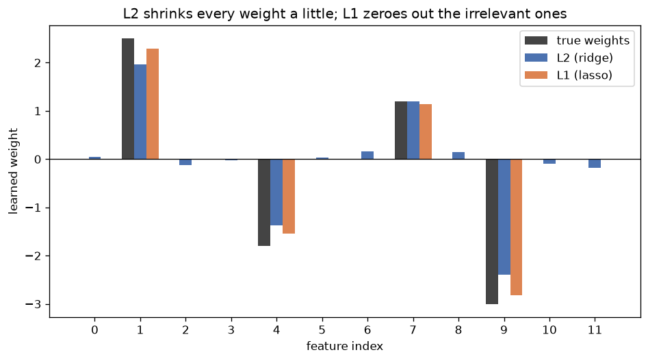

# Day 118 — Consolidation Day: Phase 3 (Concepts 24–31, regularization)

*(Day 117 flagged this as next: consolidation keeps rotating forward through the phases — Phase 1's foundations, Phase 2's optimizers, and now Phase 3, the toolkit for the variance failure mode Day 117's Connection 3 diagnosed but didn't yet treat.)*

## 🧠 CONSOLIDATION: PHASE 3 IN THREE CONNECTIONS

**Connection 1 — L2 weight decay (24) and L1 sparsity (25) are the same idea, "penalize large weights," with two different geometries, and one of them is quietly undone by Phase 2's own BatchNorm.**

Both add a penalty to the loss: $L_{\text{total}} = L + \lambda \sum_i |w_i|^p$, with $p=2$ for ridge and $p=1$ for lasso. The gradient tells you everything. L2's penalty gradient is $\lambda w$ — proportional to the weight itself, so it shrinks large weights hard and small weights barely at all, and it never actually reaches zero (shrinkage is multiplicative, geometrically decaying toward but not through zero). L1's penalty gradient is $\lambda \, \mathrm{sign}(w)$ — a constant pull regardless of magnitude, which *can* and does cross zero and stay there. Geometrically: L2's constraint region is a ball (round, no corners), L1's is a diamond (all corners), and the loss contour is far more likely to first touch a constraint region exactly at a corner — hence sparsity. This is why L1 is a feature-selection tool and L2 is a smoothing tool.

Here's the twist that ties back to Day 117 (Connection 2, He/Xavier init) and forward to Connection 2 below: once you add BatchNorm (27) between a linear layer and its activation, that layer's output becomes *scale-invariant* to its own weights — $\mathrm{BN}(\alpha \cdot Wx) = \mathrm{BN}(Wx)$ for any $\alpha > 0$, because BN normalizes out the scale. L2 decay is still pulling $\|W\|$ down every step, but the network can simply *grow the next layer's scale to compensate*, so the penalty stops controlling model complexity and instead just controls the *effective learning rate* (a smaller $\|W\|$ before a BN layer means gradients through it are larger, since BN's backward pass scales inversely with input norm). This is a real, well-documented interaction, not a hypothetical:

$$\text{effective } \eta \;\propto\; \frac{\eta}{\|W\|^2}$$

so weight decay before a normalization layer behaves like an implicit learning-rate schedule, not like Occam's-razor regularization anymore.

**Connection 2 — dropout (26), batch norm (27), and layer norm (28) all inject noise or normalize *during* training, but they act on three different axes, and mixing them up is a classic bug.**

Dropout zeros a random subset of units per forward pass (train-time only, scaled by $1/(1-p)$ at train or at inference — implementation detail, same expectation either way). It regularizes by preventing co-adaptation: a unit can't rely on any specific set of other units always being present, which is mechanistically an implicit ensemble of $2^n$ thinned subnetworks sharing weights. BatchNorm normalizes each *channel* across the *batch* dimension: $\hat{x} = (x - \mu_{\text{batch}})/\sigma_{\text{batch}}$, then rescales with learned $\gamma, \beta$. Its main effect (post-2018 literature has walked back the original "internal covariate shift" framing) is smoothing the loss landscape — bounding how much the loss and its gradient change as you take a step, which is exactly what lets you use a much larger learning rate safely, directly complementing Day 117 Connection 1's stability bound. LayerNorm normalizes across the *feature* dimension *per example*, independent of batch statistics entirely — which is why it's the norm of choice for Transformers and RNNs: sequence lengths vary, batch size can be 1 at inference, and BN's running statistics break down under both conditions.

The classic bug: putting dropout *before* BatchNorm in the same block. Dropout changes the variance of its output between train and eval (zeroing units at train time changes the activation statistics BN is normalizing), so BN's running mean/variance — estimated during training — no longer match the eval-time distribution once dropout is turned off. The fix is ordering: `Linear → BatchNorm → Activation → Dropout`, so BN normalizes a distribution dropout hasn't touched yet.

**Connection 3 — data augmentation (29), early stopping (30), and label smoothing (31) are direct responses to Day 117's loss-curve diagnostic, each attacking a different point in the same failure chain.**

Day 117 Connection 3 established the read: training loss keeps dropping, validation loss turns and rises → high variance → the model is memorizing training-set idiosyncrasies. The three tools here are three different interventions on that exact failure:

- **Augmentation** attacks the *data* side — it manufactures a larger effective dataset (crops, flips, noise, mixup) so the idiosyncrasies the model could memorize keep changing run to run, making memorization a moving target instead of a fixed one.
- **Early stopping** attacks the *training schedule* side — it's the direct, mechanical action on Day 117's diagnostic: the moment validation loss's local minimum passes, stop, because every additional epoch past that point is provably trading generalization for training-set fit.
- **Label smoothing** attacks the *target* side, and reaches back to Concept 5 (softmax + cross-entropy): hard one-hot targets push cross-entropy toward $-\infty \cdot \log(1) $, i.e. the optimal logit gap is unbounded, so the network is incentivized to make correct-class logits arbitrarily larger than the rest — which is itself a memorization pressure (increasingly confident, increasingly overfit to training examples). Smoothing the target to $(1-\epsilon)$ on the true class and $\epsilon/(K-1)$ elsewhere caps the achievable minimum loss at a finite logit gap, which is a *ceiling on confidence* — a regularizer applied directly to the loss function's fixed point rather than to the weights or the data.



Same synthetic problem (12 features, only 4 truly nonzero, `graph_DAY_118.py`), fit by gradient descent with an L2 penalty and an L1 penalty at matched strength. L1 drove 8 of the 8 irrelevant weights to within $10^{-2}$ of zero; L2 drove zero of them there — it shrank everything a little, including the 4 real signals, but never selected.

**Interview question:** *You train a ResNet with SGD, BatchNorm after every conv, and an L2 weight decay of 1e-4. A colleague claims the L2 term is "basically doing nothing" for this architecture. Are they right, and if so, what is the L2 penalty actually controlling instead?*

*(Answer at the very bottom.)*

## 🐍 PYTHONIC EDGE

The bug: reusing one `nn.Dropout` layer instance correctly across `forward()` calls but forgetting that `model.eval()` / `model.train()` is what actually toggles its behavior — a shockingly common source of "my validation loss looks weirdly good/bad" bugs when someone forgets to call `model.eval()` before validation (dropout keeps zeroing units, BN keeps using batch stats instead of running stats).

```python
import torch
import torch.nn as nn

class TinyNet(nn.Module):                 # single inheritance: class X(Base) == C++ `class X : public Base`
    def __init__(self, d_in, d_hidden):
        super().__init__()                # parent ctor call; C++ uses an initializer list instead
        self.fc1 = nn.Linear(d_in, d_hidden)   # self.x = ... sets an instance attr; C++ declares in header, inits in body
        self.bn = nn.BatchNorm1d(d_hidden)
        self.drop = nn.Dropout(p=0.5)
        self.fc2 = nn.Linear(d_hidden, 1)

    def forward(self, x):                 # never call model.forward(x) directly —
        x = self.fc1(x)                   # model(x) invokes __call__, which wraps forward() with hooks
        x = torch.relu(self.bn(x))
        x = self.drop(x)
        return self.fc2(x)

model = TinyNet(10, 32)
x = torch.randn(8, 10)                    # 8 = batch size; BatchNorm1d needs batch > 1 to compute stats

# --- the bad way: never toggling train/eval mode ---
model.train()                             # dropout + BN both active with batch statistics
train_out = model(x)
val_out_bad = model(x)                    # BUG: still in train() mode — dropout still zeroing units,
                                           # BN still using *this batch's* stats, not the running average

# --- the clean way ---
model.eval()                              # in-place mode flip; no `_` suffix here (that's for tensor ops like .mul_())
with torch.no_grad():                     # context manager: disables autograd tracking for the block
    val_out_good = model(x)               # dropout is now identity; BN uses running_mean/running_var
model.train()                             # flip back before resuming training

# a generator expression (no C++ equivalent) to sanity-check every BN layer's mode in one line
bn_eval_flags = (m.training for m in model.modules() if isinstance(m, nn.BatchNorm1d))
assert not any(bn_eval_flags), "BN should be in eval mode after model.eval()"  # assert: raises AssertionError, stripped under `python -O`
```

## 📡 SIGNAL LAB

Dropout applied to a signal's spectrum has a clean DSP reading: randomly zeroing entries of an activation vector is structurally identical to randomly zeroing frequency bins of a DFT — both are *random masking in some basis*. The interesting question: does the *basis* you drop in matter?

Take a length-$N$ real signal $x$ with a DFT $X = \mathcal{F}x$. Compare two corruptions at the same "keep probability" $q$: (a) zero a random $1-q$ fraction of *time-domain samples* directly, (b) zero a random $1-q$ fraction of *frequency bins* in $X$, then inverse-DFT back. For a signal that's sparse in frequency (e.g. a sum of 3 sinusoids plus small noise — the common case for the kind of generative-model spectral artifacts you work with), (a) barely changes the signal's energy spectrum shape at all (missing time samples smear as broadband noise across *all* bins, roughly, by Parseval — the corruption's energy spreads evenly since a time-domain delta has a flat spectrum), while (b) can silently delete an entire structural component if the wrong bin gets hit, because energy that's concentrated in frequency is *not* concentrated in time.

The "so what": this is exactly why dropout on raw pixels/samples is a mild, diffuse regularizer, while structured or channel-wise dropout (or, in your world, **spectral dropout** — randomly zeroing frequency-domain feature channels in a frequency-domain generative model) is a much more aggressive intervention per unit of "fraction dropped," because it can eliminate an entire basis component the network was relying on rather than spreading the damage thin. If you ever see a paper claim a fixed dropout rate is "equivalent" in a frequency-domain architecture to the same rate in a pixel-domain one, that equivalence is false for exactly this reason — check what basis the mask is applied in before trusting the comparison.

## 🏋️ THE GAUNTLET

**Problem — "Sliding Window Median for Early-Stopping Smoothing."**
You're watching a validation loss stream arrive one float at a time (could run for $10^6$ steps). To decide when to early-stop without reacting to single-step noise, you track the **median of the last $k$ values** at every step, and you must be able to query it in better than $O(k)$ per step.

Given a stream of $n$ floats and a fixed window size $k$, return an array of length $n-k+1$ where element $i$ is the median of `stream[i:i+k]`.

Constraints: $1 \le k \le n \le 10^5$, values are doubles, $k$ can be even (define median as the average of the two middle elements).

**Hint 1:** You need both "insert a new value" and "remove the value that's falling out of the window" in sub-linear time, plus fast access to the middle — think about what single data structure gives you ordered access *and* fast insert/delete, versus what it would cost you to re-sort every window from scratch.

**Hint 2:** One balanced structure isn't quite enough on its own to get the *middle* element cheaply after arbitrary deletions — consider splitting your window into two halves (a "low" half and a "high" half) and maintaining an invariant on their relative sizes, the same trick used for the classic "running median of a stream" problem, but now you additionally need to *remove* an arbitrary (not just the newest) element as the window slides.

**Hint 3:** Two heaps give you the middle in $O(1)$ but heaps can't delete an arbitrary interior element in less than $O(k)$ — so you need *lazy deletion*: mark the outgoing value as deleted, don't remove it from the heap immediately, and only pop-and-discard marked-deleted values when they surface at a heap's top. Track each heap's true size separately from its physical size to know when your two-heap balance invariant is actually violated.

**Pattern:** two-heap running median + lazy deletion. **Target complexity:** $O(n \log k)$ time, $O(k)$ space.

Full solution at the bottom under 🔓 GAUNTLET SOLUTION — work the two-heap invariant out on paper first.

## 🏗️ BLUEPRINT

no blueprint today.

## 🗺️ MARCHING ORDERS

Phase 3 is the toolkit you reach for *after* Day 117's diagnostic tells you which failure you actually have — don't grab dropout for a bias problem. With Phase 3 now consolidated, the rotation continues: next up is Phase 4, the convolutional architectures, which is squarely your home turf.

Tomorrow: Consolidation Day — Phase 4 (Concepts 32–44: convolution, pooling, receptive fields, and the CNN architecture lineage from LeNet to DenseNet).

---

## 🔓 GAUNTLET SOLUTION

```cpp
#include <vector>
#include <queue>
#include <unordered_map>
using namespace std;

vector<double> slidingWindowMedian(vector<double>& stream, int k) {
    // lo: max-heap of the smaller half, hi: min-heap of the larger half
    priority_queue<double> lo;
    priority_queue<double, vector<double>, greater<double>> hi;
    unordered_map<double, int> delayed;   // value -> count pending lazy deletion
    int loSize = 0, hiSize = 0;           // *true* sizes, excluding pending deletions

    auto prune = [&](auto& heap) {
        while (!heap.empty() && delayed[heap.top()] > 0) {
            delayed[heap.top()]--;
            heap.pop();
        }
    };

    auto rebalance = [&]() {
        if (loSize > hiSize + 1) {
            hi.push(lo.top()); lo.pop();
            loSize--; hiSize++;
            prune(lo);
        } else if (loSize < hiSize) {
            lo.push(hi.top()); hi.pop();
            hiSize--; loSize++;
            prune(hi);
        }
    };

    auto addNum = [&](double num) {
        if (lo.empty() || num <= lo.top()) { lo.push(num); loSize++; }
        else { hi.push(num); hiSize++; }
        rebalance();
    };

    auto removeNum = [&](double num) {
        delayed[num]++;
        if (num <= lo.top()) {
            loSize--;
            if (num == lo.top()) prune(lo);
        } else {
            hiSize--;
            if (num == hi.top()) prune(hi);
        }
        rebalance();
    };

    auto getMedian = [&]() -> double {
        if (k % 2 == 1) return lo.top();
        return (lo.top() + hi.top()) / 2.0;
    };

    vector<double> result;
    for (int i = 0; i < (int)stream.size(); i++) {
        addNum(stream[i]);
        if (i >= k - 1) {
            result.push_back(getMedian());
            removeNum(stream[i - k + 1]);
        }
    }
    return result;
}
```

Why it hits $O(n \log k)$: every value is pushed at most once and lazily popped at most once across both heaps (amortized $O(\log k)$ each), `rebalance` does $O(1)$ heap ops (each $O(\log k)$) per slide, and `getMedian` is $O(1)$ after pruning. The lazy-deletion map is what makes "delete an arbitrary interior element" tractable at all — heaps fundamentally can't do targeted deletion, so you defer the cost until that element would have surfaced anyway.

💡 CONCEPT ANSWER

They're partially right, but for a subtler reason than "L2 does nothing." Every conv layer immediately followed by BatchNorm is scale-invariant to its own weights ($\mathrm{BN}(\alpha W x) = \mathrm{BN}(Wx)$), so the L2 penalty cannot reduce the *effective* function the network computes by shrinking $\|W\|$ — the next BN layer just renormalizes away any scale change. What the L2 term is actually controlling is the **effective learning rate**: since BN's backward pass scales gradients roughly as $1/\|W\|$, keeping $\|W\|$ small via decay keeps the effective per-step update large, which changes the *optimization dynamics and the amount of gradient noise the network is trained with* — a real and useful effect — even though it is no longer "penalizing model complexity" in the classical Occam's-razor sense the term was designed for. This is why L2 decay still empirically helps ResNet/BN architectures despite this scale-invariance, and why AdamW's decoupled-decay redesign (Day 117) is a separate, orthogonal fix for a different problem (naive Adam scaling decay by $1/\sqrt{s_t}$).
