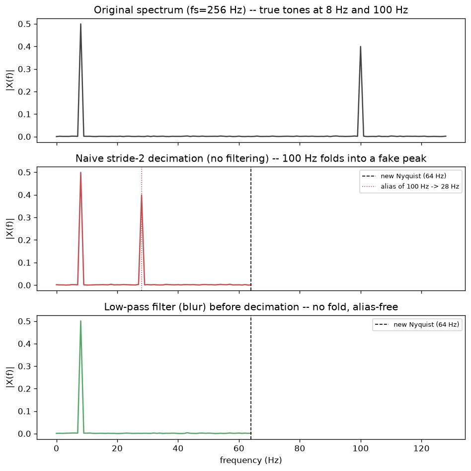

# Day 119 — Consolidation Day: Phase 4 (Concepts 32–44, convolutional architectures)

*(Day 118 flagged this as next: after Phase 3's regularization toolkit, the rotation reaches your home turf — convolution, receptive fields, and the CNN lineage from LeNet to DenseNet.)*

## 🧠 CONSOLIDATION: PHASE 4 IN THREE CONNECTIONS

**Connection 1 — the receptive field (36) is the real currency of every convolutional architecture, and it's what separates "stack small kernels" (VGG, 39) from "space out the taps" (dilated conv, 44).**

A convolution (32) with kernel size $k$, stride $s$, and padding $p$ maps an input of size $n$ to output size $\lfloor (n + 2p - k)/s \rfloor + 1$ (33). That's the *spatial map*; the receptive field is the separate, more important question: how many input pixels can influence one output pixel after $L$ layers? For stacked $3\times3$ convs, the receptive field grows linearly, $\text{RF} = 1 + L(k-1)$ — which is exactly VGG's bet: two stacked $3\times3$ convs give the same receptive field as one $5\times5$ conv ($\text{RF}=5$) but with fewer parameters ($2 \cdot 9C^2$ vs $25C^2$ for $C$ channels) and an extra nonlinearity in between. Dilated convolution (44) attacks the same problem differently: instead of more layers, it spaces out the kernel taps by a dilation rate $d$, so a $3\times3$ kernel samples a $5\times5$ *footprint* in one layer ($\text{RF} = k + (k-1)(d-1)$) — you buy receptive field growth without adding depth or parameters, at the cost of a gridding artifact if you're not careful about how dilation rates compose across layers (this is the standard segmentation-network trick — you want dense per-pixel context without downsampling it away).

Pooling (35) is the third lever on the same currency: a stride-2 max-pool doubles the *effective* receptive-field growth rate of every subsequent layer for free, which is exactly why LeNet/AlexNet (38) alternate conv and pool — pooling is receptive-field growth *and* downsampling in one operation, at the cost of the aliasing question Connection 3 below gets into.

**Connection 2 — $1\times1$ convolution (37) is not really "convolution" at all, it's a per-pixel linear layer across channels, and that reframing is the single idea that unlocks Inception (40), ResNet (41), and DenseNet (42) simultaneously.**

Feature maps (34) have shape $(C, H, W)$ — channels stacked over the same spatial grid. A $1\times1$ conv with a $k \times k$ spatial kernel where $k=1$ does zero spatial mixing; its whole job is $y_{c'} = \sum_c w_{c'c} \, x_c$ at every pixel independently — a matrix multiply applied identically across all $H \times W$ positions. Once you see it that way:

- **Inception's** parallel $1\times1 / 3\times3 / 5\times5$ branches use $1\times1$ convs *before* the expensive $3\times3$/$5\times5$ branches purely to compress channel count first — cutting the FLOPs of the big kernel without touching spatial resolution. It's a bottleneck (37) used for compute savings.
- **ResNet's** bottleneck block is the same shape ($1\times1$ compress → $3\times3$ process → $1\times1$ expand) for the same FLOP reason, but its headline idea is orthogonal: the residual connection $y = F(x) + x$ (41) means the block only has to learn the *residual* correction, and — critically — the gradient flowing backward gets an unimpeded path through the identity term, $\frac{\partial L}{\partial x} = \frac{\partial L}{\partial y}\left(1 + \frac{\partial F}{\partial x}\right)$. That $+1$ is a direct fix for Phase 2's vanishing-gradient problem (concept 20): no matter how small $\partial F/\partial x$ gets, gradient still flows at full strength through the identity branch.
- **DenseNet** takes the identity-shortcut idea further: instead of *adding* the input to the output, concatenate every prior layer's feature map as input to every subsequent layer. Each layer only needs to add a small number of new channels (the "growth rate"), and gradients reach every earlier layer directly through concatenation — but the feature-map count grows linearly with depth, which is exactly why DenseNet layers lean on cheap $1\times1$ bottlenecks to compress the ever-growing concatenated input before each expensive $3\times3$.

Same primitive (a channel-mixing linear map), three different motivations: compute (Inception), gradient flow (ResNet), and feature reuse (DenseNet).

**Connection 3 — transposed convolution (43) and strided downsampling (35, 33) are inverse operations, and neither one is a clean, information-preserving inverse of the other — which is a DSP problem in a thin disguise.**

Downsampling — whether via a stride-2 conv or a max/avg pool — is a sampling-rate reduction, full stop. If the feature map has energy above the new Nyquist frequency implied by the smaller grid, that energy folds back down as aliasing rather than disappearing (worked in detail in Signal Lab below). Transposed convolution, the standard "learned upsampling" op (43), runs the same kernel machinery in reverse to go from a coarse grid back to a fine one, but it's inserting zeros between input pixels and convolving — it cannot invent the high-frequency content that a lossy, aliased downsample already destroyed, and it has its own well-known artifact (checkerboard patterns from uneven kernel-stride overlap, which is why many decoders now prefer resize-then-conv). The honest way to think about the conv/pool/transposed-conv trio isn't "encode then decode symmetrically" — it's "a lossy resampling filter followed by a learned interpolator that can only work with what wasn't already destroyed."



`graph_DAY_119.py`: a synthetic 8 Hz + 100 Hz signal at $f_s = 256$ Hz, decimated by 2 two ways. Naive stride-2 decimation (top→middle) folds the 100 Hz tone to exactly the predicted alias frequency $|100 - 128| = 28$ Hz — verified by the script, printed peak matches prediction to the FFT bin. A 31-tap windowed-sinc low-pass filter applied before decimating (bottom) removes the fold entirely. This is precisely what a plain strided conv or max-pool does to any activation map with energy above the new Nyquist — which is the mechanism behind "blur pooling" / anti-aliased downsampling layers in modern CNNs.

**Interview question:** *A ResNet with plain stride-2 convs for downsampling produces predictions that flip when you shift the input image by a single pixel — small, seemingly irrelevant perturbations change the output class. A colleague says "that's just normal model uncertainty." Are they right, and what specifically in the architecture would you point to instead?*

*(Answer at the very bottom.)*

## 🐍 PYTHONIC EDGE

The bug: writing your own receptive-field or output-shape arithmetic by hand for every layer instead of trusting a shape probe — a classic source of silent bugs when someone tweaks a kernel size or stride and forgets to update a downstream `Linear` layer's expected input size.

```python
import torch
import torch.nn as nn

class TinyEncoder(nn.Module):                    # class X(Base): single inheritance (C++: class X : public Base)
    def __init__(self, in_ch=3):
        super().__init__()                        # parent ctor call; C++ uses an initializer list instead
        self.conv1 = nn.Conv2d(in_ch, 8, kernel_size=3, stride=2, padding=1)  # self.x = ...: instance attr (C++: declare in header, init in body)
        self.conv2 = nn.Conv2d(8, 16, kernel_size=3, stride=2, padding=1)
        # --- BAD: hardcoding the flattened size by hand ---
        # self.fc = nn.Linear(16 * 8 * 8, 10)     # silently wrong the moment input size or strides change

    def forward(self, x):                         # never call model.forward(x) directly --
        x = torch.relu(self.conv1(x))             # model(x) invokes __call__, which wraps forward() with hooks
        x = torch.relu(self.conv2(x))
        return x

# --- the clean way: probe the shape once with a dummy tensor, never hand-compute it ---
enc = TinyEncoder()
with torch.no_grad():                             # context manager: disables autograd tracking for the block
    dummy = torch.zeros(1, 3, 32, 32)             # 1 = batch size; shape is (N, C, H, W) in PyTorch, not (H, W, C)
    flat_dim = enc(dummy).flatten(1).shape[-1]    # [-1]: negative indexing, last axis

fc = nn.Linear(flat_dim, 10)                      # always correct, however conv1/conv2 change
print(f"flattened feature size: {flat_dim}")      # f-string: inline expression interpolation, no printf-style format needed

# a list comprehension (no C++ equivalent) to sanity-check every conv's stride in one line
strides = [m.stride for m in enc.modules() if isinstance(m, nn.Conv2d)]
assert all(s == (2, 2) for s in strides)          # assert: raises AssertionError, stripped under `python -O`
```

## 📡 SIGNAL LAB

Worked directly above the fold, but the "so what" deserves its own paragraph because it's a real, citable research result in your lane, not just a toy example: naive strided downsampling in CNNs (any stride-2 conv or max-pool with no low-pass step first) violates the sampling theorem exactly the way a poorly designed ADC does, and this has a measurable consequence for shift-invariance — a network is only truly translation-invariant if its downsampling operators are, and aliased downsampling isn't, because a 1-pixel input shift changes *which* samples survive the aliasing fold, which changes the folded frequency content, which changes the feature map the rest of the network sees. "Making Convolutional Networks Shift-Invariant Again" (Zhang, 2019) is the paper that formalized exactly this and proposed blur-pooling (a fixed low-pass blur kernel, like the 31-tap filter above, applied before every stride-2 op) as the fix. For your generative-forensics lane specifically: this cuts both ways — a generator's own upsampling stack (transposed convs, Connection 3) has checkerboard and spectral-replication artifacts from the *same* root cause (deconvolution can't cleanly invert an aliased or zero-inserted resample), which is a large part of *why* GAN/diffusion output has a detectable spectral signature (concept 88) in the first place — you're literally looking for the frequency-domain fingerprint of an imperfect inverse-resampling operation.

## 🏋️ THE GAUNTLET

**Problem — "Max Feature Map in Every Pooling Window."**
You're implementing max-pooling from scratch as a systems exercise: given an integer array `feats` of length $n$ (a 1D feature map) and a window size $k$ (the pool kernel width), return an array of length $n-k+1$ where element $i$ is $\max(\text{feats}[i..i+k-1])$ — i.e., a full max-pool with stride 1. This must run well beyond naive re-scanning: $n$ can be up to $10^6$, and re-computing the max of every window from scratch is too slow.

Constraints: $1 \le k \le n \le 10^6$, values fit in a 32-bit signed int.

**Hint 1:** Think about what information from window $i$ you can *reuse* for window $i+1$ — the two windows share $k-1$ elements. What's the cheapest structure that lets you drop the element falling out the back while still knowing the max of what's left, without rescanning?

**Hint 2:** A max-heap gives you the max in $O(1)$ but — same problem as always with heaps and sliding windows — you can't cheaply evict a specific *old* element that's falling out of the window unless you track it. Before reaching for lazy deletion again, ask: do you actually need to know the max of *every* element in the window, or only the max of elements that could *still possibly* be the max later?

**Hint 3:** An element that is smaller than a *more recent* element in the window can never become the window's max again — the more recent, larger element will always be in the window at least as long. So you only ever need to remember a shrinking set of "still-could-be-max" candidates, in decreasing order of value, ordered by position — a **monotonic deque** of indices. Push new indices after popping any smaller ones off the back; pop indices off the front once they've aged out of the window.

**Pattern:** monotonic deque (sliding window maximum). **Target complexity:** $O(n)$ time — each index is pushed and popped from the deque at most once — $O(k)$ space.

Full solution at the bottom under 🔓 GAUNTLET SOLUTION — work out the deque invariant (values strictly decreasing front-to-back) on paper before you look.

## 🏗️ BLUEPRINT

**Backbone choice under a latency budget:** ResNet-50 and a comparable-accuracy EfficientNet/MobileNet variant can have similar top-1 accuracy but very different FLOPs-to-latency curves on real hardware — depthwise-separable convs (a spatial conv done per-channel, then a $1\times1$ to mix channels, from Connection 2's reframing) cut FLOPs dramatically on paper but don't always translate to proportional wall-clock speedup, because they're *memory-bandwidth bound* rather than compute bound on many GPUs (lots of small ops, poor arithmetic intensity). The tradeoff that actually matters for a serving decision isn't FLOPs, it's measured latency on your target hardware — profile before you pick a backbone on a spec sheet.

## 🗺️ MARCHING ORDERS

Phase 4 gave you the vocabulary — receptive field, channel mixing, and the sampling-theory cost of downsampling — that every modern vision architecture, including the ViT you'll hit in Phase 9, still has to reckon with even when it throws away convolution entirely. With Phase 4 consolidated, the rotation continues: next up is Phase 5, recurrence — RNNs, BPTT, and the vanishing-gradient story replayed across *time* instead of *depth*.

Tomorrow: Consolidation Day — Phase 5 (Concepts 45–52: RNN cell through the fixed-context bottleneck that motivates attention).

---

## 🔓 GAUNTLET SOLUTION

```cpp
#include <vector>
#include <deque>
using namespace std;

vector<int> maxSlidingWindow(vector<int>& feats, int k) {
    deque<int> dq;  // stores indices, values strictly decreasing front-to-back
    vector<int> result;
    result.reserve(feats.size() - k + 1);

    for (int i = 0; i < (int)feats.size(); i++) {
        // evict indices that have fallen out of the window [i-k+1, i]
        if (!dq.empty() && dq.front() <= i - k) {
            dq.pop_front();
        }
        // maintain decreasing order: anything smaller than feats[i] can never
        // be the max again while feats[i] is still in the window
        while (!dq.empty() && feats[dq.back()] <= feats[i]) {
            dq.pop_back();
        }
        dq.push_back(i);

        if (i >= k - 1) {
            result.push_back(feats[dq.front()]);  // front is always the current max
        }
    }
    return result;
}
```

Why it's $O(n)$: every index enters the deque exactly once (`push_back`) and can leave at most once (either `pop_front` when it ages out, or `pop_back` when a larger value displaces it) — so total deque operations are bounded by $2n$, not $O(nk)$.

💡 CONCEPT ANSWER

The colleague is wrong — this isn't generic "model uncertainty," it's a specific, mechanistic failure: plain stride-2 convs downsample without a low-pass step first, so any energy in the feature map above the new Nyquist frequency folds back as aliasing (Signal Lab / Connection 3 above). A 1-pixel input shift changes exactly which samples the stride-2 operation keeps, which changes what the aliasing fold produces, which changes the downstream feature map the classifier head sees — this is a direct violation of the sampling theorem baked into the architecture, not a property of the data or an inherent limit of learning. The fix is architectural, not "train longer" or "use more augmentation": apply a fixed (or learned) low-pass blur immediately before every stride-2 conv/pool — "blur pooling" (Zhang, 2019) — which restores approximate shift-invariance because it satisfies the sampling theorem the naive stride operation was silently violating.
