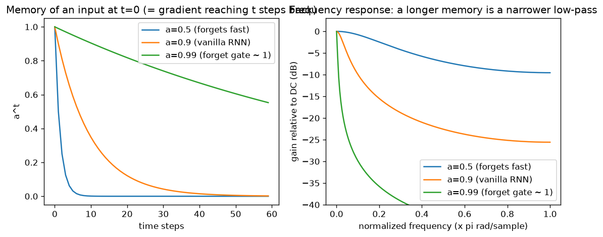

# Day 120 — Consolidation Day: Phase 5 (Concepts 45–52, recurrence and the fixed-context bottleneck)

*(Day 119 flagged this as next: after Phase 4's convolutional lineage, we replay the vanishing-gradient story across time instead of depth.)*

## 🧠 CONCEPT OF THE DAY — PHASE 5 IN THREE CONNECTIONS

**Connection 1 — An RNN cell (45) is one function applied at every step, so BPTT (46) is just backprop through a very deep network with tied weights, and "why RNNs forget" (47) is Phase 2's vanishing gradient in disguise.**

The cell is:

$$h_t = \tanh(W_h h_{t-1} + W_x x_t + b)$$

where $h_t$ is the hidden state, $x_t$ the input, and $W_h, W_x, b$ are the *same* parameters at every step. Unrolling over $T$ steps gives a depth-$T$ computational graph (6), and the gradient of a late loss with respect to an early state is a product of Jacobians:

$$\frac{\partial h_T}{\partial h_k} = \prod_{t=k+1}^{T} \operatorname{diag}\!\big(1-h_t^2\big)\, W_h$$

Every factor is the same $W_h$ times a $\tanh$ derivative in $(0,1]$. If the largest singular value of that product is below 1 the gradient shrinks like $\rho^{T-k}$ (vanishing, 20); above 1 it explodes (21), which is why clipping (21) is standard in RNN training. Weight sharing is what makes this worse than a plain deep MLP: the *same* matrix is powered, so the spectrum is either tamed or it isn't.

**Connection 2 — LSTM (48) and GRU (49) are the same fix as ResNet (41): give the gradient an additive path that is not multiplied by a squashing Jacobian.**

The LSTM cell state update is:

$$c_t = f_t \odot c_{t-1} + i_t \odot \tilde c_t$$

where $f_t, i_t \in (0,1)$ are the forget and input gates and $\odot$ is elementwise multiply. Differentiating gives $\partial c_t / \partial c_{t-1} = \operatorname{diag}(f_t)$ (plus gate-dependence terms). There is no $W_h$ and no $\tanh'$ on this path, so if the network learns $f_t\approx 1$ the gradient passes through nearly intact. Compare ResNet's $\partial L/\partial x = \partial L/\partial y\,(1 + \partial F/\partial x)$: the "+1" there and the "$f\approx1$" here are the same idea, an identity-ish highway across depth (or time). GRU (49) merges the gates and cell into one state, $h_t = (1-z_t)\odot h_{t-1} + z_t\odot\tilde h_t$, and the $(1-z_t)$ term plays the forget-gate role. Bidirectional RNNs (50) don't change this; they run two such chains in opposite directions and concatenate, which helps *understanding* tasks but is illegal for autoregressive generation (no future at inference).

**Connection 3 — Seq2seq (51) compresses a variable-length source into one fixed vector, and that fixed-context bottleneck (52) is the direct motivation for attention (53).**

The encoder reads $x_1..x_S$ and hands the decoder only its last state $h_S$. Whatever the decoder needs, it must be recoverable from $d$ numbers regardless of $S$; on long inputs the early tokens are both hard to preserve (Connection 1) and crowded out (a $d$-dimensional vector has a fixed capacity). The fix in Phase 6 is to stop discarding $h_1..h_S$ and let the decoder take a *learned weighted average* of all of them at each step. Nothing about the recurrence is fatal; the *single-vector interface* is.

**Interview lens:** all three connections answer one question, "how far back can information and gradient travel, and through what?" RNN: through a repeated matrix product (dies). LSTM/GRU: through gated additive paths (survives if learned). Attention: through direct links to every position, path length 1.



`graph_DAY_120.py` runs the linear recurrence $h_t = a h_{t-1} + x_t$ on an impulse and asserts it equals $a^t$. Left: memory (and equally, the BPTT gradient) half-lives of 1.0, 6.6 and 69.0 steps for $a=0.5, 0.9, 0.99$. Right: the matching frequency response.

**Interview question:** *You train a vanilla tanh RNN on sequences of length 500 and the loss plateaus; gradient norms at early timesteps are ~$10^{-12}$ of those at late timesteps. A teammate proposes "just raise the learning rate." Why won't that work, and what are two structural changes you'd try instead?*

*(Answer at the very bottom.)*

## 🐍 PYTHONIC EDGE

**Debugging trick: watch per-timestep gradient magnitude with a tensor hook instead of guessing.**

```python
import torch
import torch.nn as nn

rnn = nn.RNN(input_size=4, hidden_size=8, batch_first=True)   # nn.RNN(...): class instance; passing kwargs by name is idiomatic
x = torch.randn(1, 50, 4)                                     # (batch, time, features); torch.randn ~ std::normal_distribution
out, h_n = rnn(x)                                             # tuple unpacking; C++ would need std::tie or a struct. rnn(x) -> __call__ -> forward()

# --- BAD: retain everything and eyeball .grad on one tensor ---
# loss = out[:, -1].sum(); loss.backward(); print(out.grad)   # None! non-leaf tensors drop .grad by default

# --- CLEAN: retain_grad() on the non-leaf, then read every timestep in one expression ---
out.retain_grad()                                             # method call mutates tensor in place; no C++ equivalent of a tensor "keep my grad" flag
out[:, -1].sum().backward()                                   # slice notation [:, -1]: all batch, last timestep (negative indexing)
g = out.grad.norm(dim=-1).squeeze(0)                          # method chaining; squeeze(0) drops the batch axis
print(f"grad norm at t=0: {g[0]:.2e}, at t=49: {g[-1]:.2e}")  # f-string with format spec; g[-1] = last element

ratio = g[0] / g[-1]                                          # tensor / tensor is elementwise, and operator overloading via __truediv__
assert ratio < 1, "expected earlier steps to get less gradient"  # assert: raises AssertionError if False (no C++ macro needed)

# a generator expression: lazily walks named params without building a list (no C++ equivalent)
n_params = sum(p.numel() for p in rnn.parameters())           # `for p in ...` inline; sum() consumes the generator
```

`retain_grad()` is the standard way to inspect a non-leaf tensor's gradient; it beats sprinkling `print` inside the training loop.

## 📡 SIGNAL LAB

**Problem.** A linear RNN $h_t = a h_{t-1} + x_t$ is processing a signal. (a) What filter is it? (b) For $a=0.9$, what is the DC gain and roughly the $-3$ dB frequency? (c) Why does a forget gate near 1 make the network a *narrower* low-pass?

**Solution.** (a) Taking the $z$-transform: $H(z) = 1/(1 - a z^{-1})$, a one-pole IIR filter with impulse response $a^t$ (the graph asserts this numerically). (b) DC gain $H(1) = 1/(1-a) = 10$. The $-3$ dB point satisfies $|H(e^{j\omega})|^2 = \tfrac12 H(1)^2$, giving $\cos\omega_c = 1 - \tfrac{(1-a)^2}{2a} \approx 0.9944$, so $\omega_c \approx 0.106$ rad/sample $\approx 0.034\pi$. (c) As $a\to1$ the pole moves toward the unit circle at $z=1$, so the passband shrinks to $\omega_c \approx 1-a$ while the impulse response half-life grows as $\ln 0.5/\ln a$: **memory length and bandwidth are reciprocals.**

**So what.** An RNN with long memory can only respond to *slow* input changes; fast detail is averaged away. LSTM gates are *input-dependent* $a_t$, so the network can switch its bandwidth per step: keep $f\approx1$ to hold a slow context, drop $f\to0$ to admit a sharp event. For your frequency-domain work: a plain recurrent generator (e.g., autoregressive audio/pixel models) has a built-in low-pass bias on its state, which is one route by which high-frequency spectral content ends up under-represented in generated data.

## 🏋️ THE GAUNTLET

**Problem — "Subarray Sum Equals K."** Given an integer array `a` of length $n$ (values may be negative) and an integer $k$, count the number of contiguous subarrays whose sum is exactly $k$. (Framing: `a[i]` is a per-timestep gradient contribution; count the windows whose accumulated total hits a target.)

Constraints: $1 \le n \le 2\cdot10^5$, $-10^4 \le a_i \le 10^4$, $-10^9 \le k \le 10^9$. Answer fits in 64-bit.

**Hint 1:** A sliding window with two pointers works for non-negative arrays. Why does it break when negatives are allowed?

**Hint 2:** Define $P_j = a_0+\dots+a_{j-1}$. A subarray $[i, j)$ has sum $P_j - P_i$. Rewrite "sum equals $k$" as a condition relating two prefix values.

**Hint 3:** For each $j$ you need "how many earlier prefixes equal $P_j - k$". Maintain those counts as you sweep, remembering the empty prefix $P_0=0$ must be counted.

**Pattern:** prefix sums + hash map of counts. **Target complexity:** $O(n)$ expected time, $O(n)$ space.

Solution at the bottom under 🔓 GAUNTLET SOLUTION.

## 🏗️ BLUEPRINT

no blueprint today.

## 🗺️ MARCHING ORDERS

You now own the whole arc from a single neuron to the doorstep of attention: everything that follows in Phase 6 exists because Phase 5 hit a wall you can now describe precisely. Say the three connections out loud once without notes.

Tomorrow: Consolidation Day — Phase 6 (Concepts 53–64: attention intuition through FlashAttention)

---

## 🔓 GAUNTLET SOLUTION

```cpp
#include <bits/stdc++.h>
using namespace std;

long long subarraySum(const vector<int>& a, long long k) {
    unordered_map<long long, int> cnt;   // prefix value -> occurrences so far
    cnt.reserve(a.size() * 2 + 1);
    cnt[0] = 1;                          // empty prefix
    long long prefix = 0, ans = 0;
    for (int x : a) {
        prefix += x;
        auto it = cnt.find(prefix - k);  // earlier prefix P_i with P_j - P_i = k
        if (it != cnt.end()) ans += it->second;
        cnt[prefix]++;
    }
    return ans;
}
```

Why it works: each subarray $[i,j)$ corresponds to exactly one pair of prefixes with $P_j - P_i = k$; the map counts earlier $P_i$ in $O(1)$ expected, so the sweep is $O(n)$. Two pointers fail with negatives because extending the window no longer monotonically increases the sum.

💡 CONCEPT ANSWER

A higher learning rate scales the *update*, not the *ratio* between early and late gradients: the early-timestep gradients are $10^{-12}$ of the late ones because of the repeated Jacobian product $\prod \operatorname{diag}(1-h_t^2)W_h$ with spectral radius below 1. Multiplying everything by a bigger $\eta$ either leaves early steps still negligible or, once it's large enough to move them, blows up the late-step (already normal-sized) gradients and diverges. Structural fixes: (1) switch to an LSTM or GRU so the state has an additive, gate-controlled path (forget-gate bias initialised near 1 helps); (2) shorten the effective path, e.g. truncated BPTT, or replace recurrence with attention so any two positions are one hop apart. Orthogonal/identity-initialised $W_h$ with a bounded spectral radius is a third option, and gradient clipping addresses the opposite (exploding) failure, not this one.
