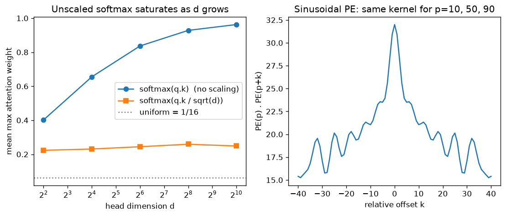

# Day 121 — Consolidation Day: Phase 6 (Concepts 53–64, attention through FlashAttention)

*(Day 120 flagged this as next: Phase 5 ended at the fixed-context wall; Phase 6 is the door through it.)*

## 🧠 CONCEPT OF THE DAY — PHASE 6 IN THREE CONNECTIONS

**Connection 1 — Attention (53–57) is a differentiable dictionary lookup, and every design choice (Q/K/V, √d, heads) exists to keep that lookup trainable.**

Intuition: a query asks "what am I looking for?", each key advertises "what do I contain?", and the output is a similarity-weighted blend of the values. Seq2seq's single vector (52) becomes a lookup over *all* encoder states, so path length between any two positions is 1. Formally:

$$\text{Attn}(Q,K,V)=\operatorname{softmax}\!\left(\frac{QK^\top}{\sqrt{d_k}}\right)V$$

where $Q\in\mathbb{R}^{n\times d_k}$, $K\in\mathbb{R}^{m\times d_k}$, $V\in\mathbb{R}^{m\times d_v}$ and the softmax is over keys. Why $\sqrt{d_k}$ (55)? If entries of $q,k$ are independent with zero mean and unit variance, then $q\!\cdot\!k$ has variance $d_k$, so logits grow like $\sqrt{d_k}$ and softmax saturates toward one-hot, where its gradient vanishes (Phase 2, again). Dividing by $\sqrt{d_k}$ restores unit variance. Multi-head (56) runs $h$ smaller lookups in parallel subspaces and concatenates them; self- vs cross-attention (57) differs only in where $K,V$ come from.



`graph_DAY_121.py` shows the left panel numerically: at $d=1024$ the unscaled softmax puts ~0.96 of its mass on one key, while the scaled version stays near 0.25 regardless of $d$.

**Connection 2 — Attention is permutation-equivariant, so position (58–59) and masking (62) are the only things that inject order, and the Transformer block (60–61) is the wrapper that makes it stackable.**

Without positions, shuffling the tokens just shuffles the outputs. Sinusoidal encoding (58) adds $PE_{p,2i}=\sin(p/10000^{2i/d})$, $PE_{p,2i+1}=\cos(\cdot)$; because $\sin/\cos$ of a shifted angle is a linear map of the original, $PE_{p+k}$ is a fixed linear function of $PE_p$, so the model can learn relative offsets. RoPE (59) makes this explicit by *rotating* $q,k$ so that $q_p\!\cdot\!k_{p'}$ depends on $p-p'$ directly. Causal masking (62) adds $-\infty$ above the diagonal before the softmax, which is what makes the same architecture a legal autoregressive model. The block (60) is $x\leftarrow x+\text{Attn}(\text{LN}(x))$, then $x\leftarrow x+\text{FFN}(\text{LN}(x))$: the residual (41) keeps a gradient highway, LN (28) stabilises scale, and the FFN does per-token nonlinear processing that attention (a linear mix of values) cannot. Encoder-only / decoder-only / enc-dec (61) is just *which mask and which K,V source* you choose.

**Connection 3 — The $O(n^2)$ cost (63) is the price of path length 1, and FlashAttention (64) shows the real bottleneck is memory traffic, not FLOPs.**

Materialising $S=QK^\top\in\mathbb{R}^{n\times n}$ costs $O(n^2)$ memory and compute. FlashAttention computes the *same* exact result by tiling $Q,K,V$ into SRAM-sized blocks and using an online softmax (running max $m$ and running sum $\ell$, rescaled as new blocks arrive) so $S$ never touches HBM. Same FLOPs, far fewer bytes moved, so wall-clock drops. The lesson generalises: on modern GPUs, count memory reads/writes first.

**Interview lens:** all three connections answer "how do you let every token talk to every token, stably, in order, and affordably?" Lookup (1) → order and masks (2) → hardware-aware exact computation (3).

**Interview question:** *You double the head dimension $d_k$ of a trained model but forget the $1/\sqrt{d_k}$ scaling. Training loss stalls early and attention maps look like sharp one-hot spikes. Explain mechanically why, and say what a quick diagnostic would show.*

*(Answer at the very bottom.)*

## 🐍 PYTHONIC EDGE

**Debugging trick: verify a mask/softmax pipeline with `torch.allclose` against a reference, and `register_buffer` for the mask so it moves with `.to(device)`.**

```python
import torch
import torch.nn as nn                                          # import X as Y alias: no C++ equivalent (closest: namespace alias)

class CausalScores(nn.Module):                                 # class X(Base): single inheritance; C++ is `class X : public Module`
    def __init__(self, n, *, scale=True):                      # __init__ = constructor; self ~ C++ this but explicit; `*` makes scale keyword-only
        super().__init__()                                     # parent constructor; C++ uses an initialiser list instead
        mask = torch.triu(torch.ones(n, n, dtype=torch.bool), diagonal=1)  # upper-triangle bool mask
        self.register_buffer("mask", mask)                     # self.mask set dynamically; C++ would declare it in the header
        self.scale = scale                                     # plain instance attribute, created on assignment

    def forward(self, q, k):                                   # called via __call__ (hooks!), never invoke forward() directly
        s = q @ k.transpose(-2, -1)                            # @ is matmul; -2/-1 are negative indices counted from the end
        if self.scale:                                         # truthiness test; no explicit bool cast needed
            s = s / q.shape[-1] ** 0.5                         # ** is exponentiation (C++: std::pow)
        return s.masked_fill(self.mask, float("-inf"))         # returns a new tensor; masked_fill_ (underscore) would mutate in place

torch.manual_seed(0)
q, k = torch.randn(1, 5, 8), torch.randn(1, 5, 8)
layer = CausalScores(5)                                        # constructing an object: no `new`, no `Type name(args)`
p = layer(q, k).softmax(-1)                                    # layer(...) -> __call__ -> forward()

# --- BAD: eyeball a 5x5 matrix for zeros above the diagonal ---
print(p)

# --- CLEAN: assert the invariants ---
assert torch.allclose(p.sum(-1), torch.ones(1, 5))             # rows sum to 1; assert raises AssertionError if False
assert (p.triu(1) == 0).all()                                  # no attention to the future; .all() reduces a bool tensor
first, *rest = p[0].unbind(0)                                  # star-unpacking (no C++ equivalent); unbind splits along dim 0
assert first[1:].sum() == 0                                    # slice [1:] = everything after index 0; row 0 can only see itself
n_masked = sum(1 for row in p[0] for x in row if x == 0)       # generator expression: lazy, no temporary list
```

Asserting invariants (`rows sum to 1`, `zero above diagonal`) catches off-by-one mask bugs that a printed matrix hides. Registering the mask as a buffer means it follows the module across devices and is saved in `state_dict` — but not trained.

## 📡 SIGNAL LAB

**Problem.** (a) Show that the sinusoidal PE dot product $PE(p)\cdot PE(p+k)$ depends only on $k$. (b) With $d=64$ (32 frequencies $\omega_i = 10000^{-2i/d}$), what does that kernel look like as a function of $k$, and what does it say about the encoding's frequency content? (c) Attention with $A=\text{softmax}(\cdot)$ applied to a signal $V$: when is it a low-pass filter?

**Solution.** (a) $PE(p)\cdot PE(p+k)=\sum_i[\sin(\omega_i p)\sin(\omega_i(p+k))+\cos(\omega_i p)\cos(\omega_i(p+k))]=\sum_i\cos(\omega_i k)$. The absolute position $p$ cancels: it is a pure function of the offset. (b) It is a sum of 32 cosines at geometrically spaced frequencies, largest ($=32$) at $k=0$ and decaying and oscillating for larger $|k|$ — a peaked, band-limited kernel; the graph (right panel) confirms it is identical for $p=10,50,90$. Fast frequencies ($\omega\approx1$) resolve neighbours; slow ones ($\omega\approx10^{-4}$) disambiguate far positions, like a multi-resolution Fourier basis. (c) Each output row is a convex combination (non-negative weights summing to 1) of value rows, i.e. a normalised, input-dependent smoothing kernel. If the weights are near-uniform it is a moving average, which is low-pass (attenuates high frequencies along the sequence axis). If the weights are sharp (unscaled, saturated softmax) it is close to an all-pass copy.

**So what.** Two spectral facts for your research lane: attention's convex-combination structure biases token features toward smoothness (deep stacks "over-smooth", a known rank-collapse effect), and positional codes are literally a Fourier basis. In generated-image forensics, ViT/diffusion-transformer generators inherit both: a fixed positional grid and repeated smoothing can leave periodic, patch-grid-aligned peaks in the spectrum, a fingerprint you can look for.

## 🏋️ THE GAUNTLET

**Problem — "Kth Smallest Element in a Sorted Matrix."** Given an $n\times n$ integer matrix in which every row and every column is sorted in non-decreasing order, return the $k$-th smallest element in sorted order (counting duplicates). (Framing: each row is one head's scores over keys; find the $k$-th score overall without flattening and sorting.)

Constraints: $1\le n\le 300$, $-10^9\le a_{ij}\le10^9$, $1\le k\le n^2$. Aim for better than $O(n^2\log n)$ time and $O(1)$ extra space.

**Hint 1:** Sorting all $n^2$ values works but ignores the structure. What does "rows and columns sorted" let you say about a single value $x$ and how many entries are $\le x$?

**Hint 2:** Counting entries $\le x$ can be done in $O(n)$ by starting at the top-right corner and walking left/down. Now the answer is the smallest $x$ whose count is $\ge k$ — what search does that suggest, and over what range?

**Hint 3:** Binary search over *values* (not indices), between `matrix[0][0]` and `matrix[n-1][n-1]`. When count $\ge k$ move the upper bound to `mid`, else `lo = mid + 1`. The result `lo` is always an actual matrix element.

**Pattern:** binary search on the answer + staircase counting. **Target complexity:** $O(n\log(\text{max}-\text{min}))$ time, $O(1)$ space.

Solution at the bottom under 🔓 GAUNTLET SOLUTION.

## 🏗️ BLUEPRINT

**Long-context serving is a memory-bandwidth problem before it is a compute problem.** Each generated token reads the whole KV cache, whose size is $2\cdot L\cdot n\cdot h\cdot d_k\cdot\text{bytes}$ (layers, tokens, KV heads, head dim). Doubling context doubles cache reads per token even if FLOPs per token are unchanged. The tradeoff: fewer KV heads (MQA/GQA) or a quantised cache cut bandwidth and memory (more concurrent users per GPU) at a small quality cost, while FlashAttention-style kernels fix the *prefill* $n\times n$ traffic but do nothing for the *decode* KV reads. Pick the fix for the phase that dominates your latency.

## 🗺️ MARCHING ORDERS

Phase 6 is the hinge of the whole roadmap: everything from BERT to diffusion transformers is these twelve ideas recombined. Draw the block diagram from memory once, labelling where each of √d, mask, residual and LN sits.

Tomorrow: Consolidation Day — Phase 7 (Concepts 65–77: tokenization through scaling laws)

---

## 🔓 GAUNTLET SOLUTION

```cpp
#include <bits/stdc++.h>
using namespace std;

int kthSmallest(const vector<vector<int>>& a, int k) {
    int n = a.size();
    long long lo = a[0][0], hi = a[n - 1][n - 1];
    while (lo < hi) {
        long long mid = lo + (hi - lo) / 2;          // floor toward -inf-safe midpoint
        // count entries <= mid via staircase from top-right
        int r = 0, c = n - 1;
        long long cnt = 0;
        while (r < n && c >= 0) {
            if (a[r][c] <= mid) { cnt += c + 1; ++r; }   // whole prefix of row r qualifies
            else --c;
        }
        if (cnt >= k) hi = mid;                       // answer <= mid
        else lo = mid + 1;                            // answer > mid
    }
    return (int)lo;
}
```

Why it works: `count(x)` is monotone non-decreasing in $x$, and the smallest $x$ with `count(x) >= k` must be a matrix entry (if it weren't, `count` would already reach $k$ at the next smaller value). Each count is $O(n)$ because the pointer only moves left or down, and there are $O(\log(\text{range}))\le 31$ iterations. Note `lo + (hi-lo)/2` with `long long` avoids overflow, and since `hi >= lo` the division floors correctly even for negative values.

💡 CONCEPT ANSWER

The logits $q\!\cdot\!k$ are sums of $d_k$ roughly independent terms, so their variance scales with $d_k$ and their standard deviation with $\sqrt{d_k}$. Doubling $d_k$ without rescaling therefore inflates logits by about $\sqrt2$ and pushes the softmax further toward one-hot. In the saturated regime $\partial\,\text{softmax}_i/\partial z_j = p_i(\delta_{ij}-p_j)\to0$ (since some $p_i\to1$ and the rest $\to0$), so gradients to $Q$ and $K$ vanish and the attention pattern stops learning, which explains the stalled loss and one-hot spike maps. Diagnostics: log the std of pre-softmax logits (should be ~1, not growing with $d_k$), the mean max attention weight and attention entropy per head (entropy near 0 = saturated), and the gradient norm of $W_Q,W_K$ relative to $W_V$. Fix: restore $1/\sqrt{d_k}$, or use QK-norm / lower temperature scaling if you need larger heads.
