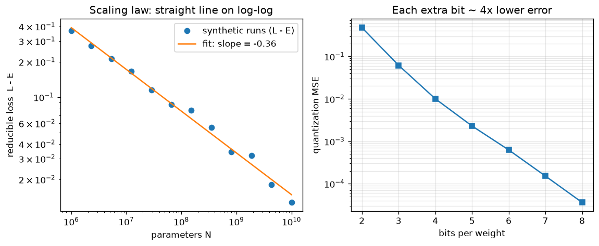

# Day 122 — Consolidation Day: Phase 7 (Concepts 65–77, tokenization through scaling laws)

*(Day 121 flagged this as next: Phase 6 gave us the Transformer; Phase 7 is how it gets fed, pretrained, adapted, shrunk and scaled.)*

## 🧠 CONCEPT OF THE DAY — PHASE 7 IN THREE CONNECTIONS

**Connection 1 — Tokenization and embeddings (65–66) decide what the model can see; BERT and GPT (67–68) are the same Transformer trained with two different masks.**

Intuition: a tokenizer is a compression scheme that turns text into integer IDs. BPE starts from characters and repeatedly merges the most frequent adjacent pair, so common words become one token and rare words fall back to pieces. An embedding table then turns each ID into a vector, and the Transformer layers turn those static vectors into *contextual* ones (the same token "bank" gets different vectors in different sentences). Formally, with vocabulary size $V$ and width $d$:

$$E\in\mathbb{R}^{V\times d},\qquad x_t = E[\text{id}_t],\qquad h_t = \text{Transformer}(x_1,\dots,x_T)_t$$

where $E[\text{id}]$ is a row lookup and $h_t$ is the contextual embedding. BERT (67) masks ~15% of tokens and predicts them from both sides (bidirectional, encoder-only, good for understanding). GPT (68) predicts token $t+1$ from tokens $\le t$ using the causal mask from Phase 6 (decoder-only, good for generation):

$$\mathcal{L}_{\text{CLM}}=-\sum_t \log p_\theta(x_t\mid x_{<t})$$

where $p_\theta$ is the softmax over the vocabulary. Same architecture, different mask and objective.

**Connection 2 — Adaptation (69–73) is a ladder of cheaper and cheaper ways to steer a pretrained model.**

Transfer learning and fine-tuning (69) update all weights. In-context learning (70) updates none: examples in the prompt steer the forward pass. Instruction tuning (71) fine-tunes on (instruction, response) pairs so the model follows requests. RLHF (72) then optimizes a learned reward with a KL leash to the reference model. LoRA (73) makes fine-tuning cheap by freezing $W_0$ and learning a low-rank update:

$$W = W_0 + \frac{\alpha}{r}BA,\qquad B\in\mathbb{R}^{d\times r},\; A\in\mathbb{R}^{r\times k},\; r\ll\min(d,k)$$

where $r$ is the rank and $\alpha$ a scale. Trainable parameters drop from $dk$ to $r(d+k)$; for $d=k=4096$, $r=8$ that is 65k instead of 16.8M per matrix (~0.4%). $B$ starts at zero so training begins exactly at the pretrained model.

**Connection 3 — Efficiency (74–76) shrinks the model, and scaling laws (77) tell you what to spend compute on.**

Quantization (74) stores weights in fewer bits: with scale $s=\max|w|/(2^{b-1}-1)$, $\hat w = s\cdot\text{round}(w/s)$, and each extra bit roughly quarters the error. QLoRA combines a 4-bit frozen base with LoRA adapters in higher precision. Distillation (75) trains a small student to match a teacher's soft outputs. MoE (76) routes each token to $k$ of $E$ experts, so parameters grow without per-token FLOPs growing. Scaling laws (77) say reducible loss follows a power law:

$$L(N,D)=E+\frac{A}{N^{\alpha}}+\frac{B}{D^{\beta}}$$

where $N$ is parameters, $D$ is training tokens and $E$ is the irreducible loss. On log-log axes $L-E$ is a straight line of slope $-\alpha$, and for a fixed compute budget there is a compute-optimal split between $N$ and $D$ (Chinchilla: roughly 20 tokens per parameter).



`graph_DAY_122.py` fits the slope from 12 noisy synthetic runs and recovers $\alpha\approx0.355$ (true 0.34); the right panel shows the error ratio settling near 4x per bit (the first bits deviate because 2–3 bit grids are too coarse for the max-scaled assumption).

**Interview lens:** Phase 7 answers "how do you get a general model, then make it yours, cheaply, and know how big to build it?" Pretrain (1) → adapt (2) → compress and scale (3).

**Interview question:** *You have a 7B decoder model and a single 24 GB GPU, and you need to fine-tune it on a domain dataset. Walk through why full fine-tuning fails, how QLoRA fits, and which memory terms remain.*

*(Answer at the very bottom.)*

## 🐍 PYTHONIC EDGE

**Debugging trick: count trainable vs frozen parameters with a generator expression, and freeze with `requires_grad_(False)`.**

```python
import torch
import torch.nn as nn                                          # import X as Y alias: no C++ equivalent (closest: namespace alias)

class LoRALinear(nn.Module):                                   # class X(Base): single inheritance; C++ is `class X : public Module`
    def __init__(self, base, r=4, *, alpha=8):                 # __init__ = constructor; self ~ C++ this but explicit; `*` makes alpha keyword-only
        super().__init__()                                     # parent constructor; C++ uses an initialiser list instead
        self.base = base                                       # instance attribute created on assignment; C++ declares it in the header
        self.base.requires_grad_(False)                        # trailing _ = in-place mutation of the module's flags
        self.A = nn.Parameter(torch.randn(r, base.in_features) * 0.01)   # nn.Parameter registers it as trainable
        self.B = nn.Parameter(torch.zeros(base.out_features, r))         # zeros: update starts at exactly 0
        self.scale = alpha / r                                 # / is true division in Python 3 (C++ int/int truncates)

    def forward(self, x):                                      # called via __call__ (hooks!), never invoke forward() directly
        return self.base(x) + (x @ self.A.T @ self.B.T) * self.scale   # @ is matmul; .T is transpose; self.base(x) -> __call__

def count(model):                                              # plain function: first-class, can be passed around as a value
    trainable = sum(p.numel() for p in model.parameters() if p.requires_grad)   # generator expression: lazy, no temp list
    total = sum(p.numel() for p in model.parameters())         # parameters() is a generator (yield under the hood)
    return trainable, total                                    # returns a tuple; C++ would need std::pair or a struct

# --- BAD: train everything and wonder why memory explodes ---
layer = nn.Linear(512, 512)
print(sum(p.numel() for p in layer.parameters()))              # 262,656 trainable

# --- CLEAN: wrap, freeze base, and assert only the adapter trains ---
lora = LoRALinear(nn.Linear(512, 512), r=4)                    # passing a constructed object; no `new`
trainable, total = count(lora)                                 # tuple unpacking: a, b = fn()
assert trainable == 4 * 512 + 512 * 4                          # assert raises AssertionError if False
assert not any(p.requires_grad for p in lora.base.parameters())# any() short-circuits over a generator
x = torch.randn(2, 512)
assert torch.allclose(lora(x), lora.base(x))                   # B is zero, so output equals the base model's
print(f"{trainable}/{total} trainable")                        # f-string: inline expression formatting
```

Counting trainable parameters and asserting `B=0` equivalence catches the two classic LoRA bugs: forgetting to freeze the base and initialising $B$ non-zero (which silently perturbs the pretrained model at step 0).

## 📡 SIGNAL LAB

**Problem.** (a) Uniform $b$-bit quantization of a signal with step $\Delta$ has noise power $\Delta^2/12$. Derive the SNR gain per extra bit. (b) Quantizing a weight matrix is a noise injection. Is that noise white in the frequency domain, and why do outlier weights/activations hurt? (c) An LLM trained at $N$ and $10N$ parameters: if $\alpha=0.34$, how much does reducible loss shrink?

**Solution.** (a) With range $R$ fixed, $\Delta=R/2^b$, so noise power is $R^2/(12\cdot4^{b})$. Each extra bit quarters the noise: $10\log_{10}4\approx6.02$ dB per bit, matching the graph's ~4x. (b) For a signal that is busy relative to $\Delta$, quantization error is approximately white (flat PSD at $\Delta^2/12$). But a single large outlier forces a large $R$, hence large $\Delta$, hence more noise on *every* other value, which is why per-channel scales, outlier handling and 4-bit formats designed for bell-shaped weights (NF4) exist. (c) Reducible loss scales as $N^{-\alpha}$, so $10^{-0.34}\approx0.457$: a 10x bigger model removes about 54% of the *reducible* loss, never the irreducible part $E$.

**So what.** The "6 dB per bit" rule is just Nyquist-era ADC theory applied to weights. For your frequency-domain forensics: low-bit generators and quantized/compressed images carry a *flat noise floor* plus clipping-induced harmonics, and a quantization grid leaves periodic structure in histograms that survives in the spectrum, which is a detectable artifact when a model or image was pushed through int8/JPEG-like quantization.

## 🏋️ THE GAUNTLET

**Problem — "Top K Frequent Elements."** Given an integer array `nums` and an integer `k`, return the `k` most frequent elements in any order. The answer is guaranteed to be unique. (Framing: BPE picks the most frequent pair, and an MoE router picks the top-$k$ experts; here you pick the top-$k$ values by count.)

Constraints: $1\le n\le10^5$, $-10^4\le \text{nums}[i]\le10^4$, $1\le k\le$ number of distinct elements. Aim for better than $O(n\log n)$.

**Hint 1:** First reduce the array to (value → count). What data structure gives $O(1)$ average updates?

**Hint 2:** A min-heap of size $k$ over the counts gives $O(n\log k)$. Can you avoid the log by exploiting that a count can never exceed $n$?

**Hint 3:** Index buckets by frequency: `bucket[f]` holds all values that occur exactly `f` times. Scan buckets from `n` down to `1`, collecting values until you have `k`.

**Pattern:** hash map + bucket sort (counting sort on frequencies). **Target complexity:** $O(n)$ time, $O(n)$ space.

Solution at the bottom under 🔓 GAUNTLET SOLUTION.

## 🏗️ BLUEPRINT

no blueprint today.

## 🗺️ MARCHING ORDERS

Phase 7 is the whole modern LLM recipe in thirteen steps; try explaining it aloud in two minutes, from tokenizer to scaling law, without notes. If you stumble, that stumble is tomorrow's review.

Tomorrow: Consolidation Day — Phase 8 (Concepts 78–88: autoencoders through spectral signatures of generated images)

---

## 🔓 GAUNTLET SOLUTION

```cpp
#include <bits/stdc++.h>
using namespace std;

vector<int> topKFrequent(const vector<int>& nums, int k) {
    unordered_map<int, int> cnt;                       // value -> frequency
    for (int x : nums) ++cnt[x];

    int n = nums.size();
    vector<vector<int>> bucket(n + 1);                 // bucket[f] = values occurring exactly f times
    for (auto& [v, f] : cnt) bucket[f].push_back(v);

    vector<int> ans;
    for (int f = n; f >= 1 && (int)ans.size() < k; --f)
        for (int v : bucket[f]) {
            ans.push_back(v);
            if ((int)ans.size() == k) break;
        }
    return ans;
}
```

Why it works: a value's frequency is in $[1,n]$, so frequencies index an array directly and no comparison sort is needed. Counting is $O(n)$, filling buckets is $O(\text{distinct})\le O(n)$, and the scan touches each bucket and each value at most once, so the total is $O(n)$ time and $O(n)$ space. The uniqueness guarantee means we never have to break ties inside a bucket.

💡 CONCEPT ANSWER

Full fine-tuning of 7B parameters in mixed precision needs weights (fp16, ~14 GB) plus gradients (~14 GB) plus Adam states (two fp32 moments, ~56 GB) plus an fp32 master copy (~28 GB), on the order of 110 GB before activations, far beyond 24 GB. QLoRA freezes the base and stores it in 4-bit NF4 (~3.5 GB plus small quantization constants), then trains only low-rank adapters $A,B$ in bf16/fp16: gradients and Adam states exist only for the adapter's tens of millions of parameters (a few hundred MB). The base weights are dequantized on the fly per layer for the matmul. Remaining memory terms: activations (grow with batch size and sequence length, reduced by gradient checkpointing and smaller micro-batches with accumulation), the adapter's own weights/gradients/optimizer states, the KV cache if you evaluate by generation, and quantization constants (reduced by double quantization). Paged optimizers help absorb memory spikes. The trade-off is a small quality loss from 4-bit rounding, which the adapters largely compensate for.
