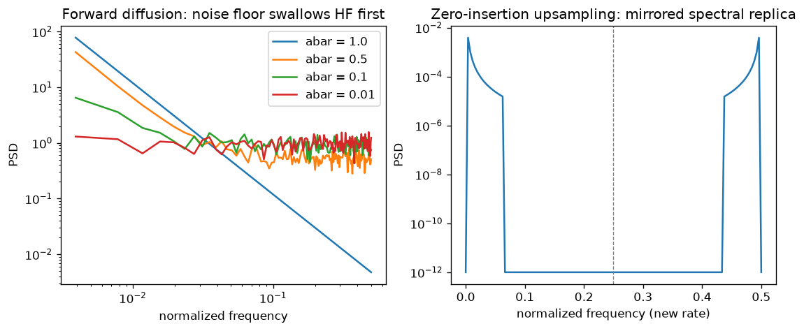

# Day 123 — Consolidation Day: Phase 8 (Concepts 78–88, autoencoders through spectral signatures)

*(Day 122 flagged this: Phase 8 is how models learn to generate images, and how those images betray themselves in frequency space.)*

## 🧠 CONCEPT OF THE DAY — PHASE 8 IN THREE CONNECTIONS

**Connection 1 — Autoencoders, VAEs and GANs (78–82) are three answers to "how do I sample from the data distribution?"**

Intuition: an autoencoder squeezes data through a bottleneck and rebuilds it, but its latent space has holes, so random latents decode to garbage. A VAE fills the holes by forcing the encoder to output a *distribution* close to a prior. A GAN skips the density entirely and lets a discriminator teach the generator. The VAE objective and its reparameterization trick (79):

$$\mathcal{L}=\mathbb{E}_{q_\phi(z\mid x)}[\log p_\theta(x\mid z)]-\mathrm{KL}\big(q_\phi(z\mid x)\,\|\,p(z)\big),\qquad z=\mu_\phi(x)+\sigma_\phi(x)\odot\epsilon,\ \epsilon\sim\mathcal N(0,I)$$

where $\mu,\sigma$ come from the encoder and moving the randomness into $\epsilon$ makes $z$ differentiable in $\phi$. The GAN (81) is the minimax game:

$$\min_G\max_D\ \mathbb{E}_{x}[\log D(x)]+\mathbb{E}_{z}[\log(1-D(G(z)))]$$

where $D$ outputs the probability a sample is real. Its instability (82) comes from vanishing discriminator gradients when the real and fake supports barely overlap; Wasserstein GAN replaces the JS divergence with a Lipschitz-constrained critic that still gives a gradient there.

**Connection 2 — Diffusion (83–87) turns generation into many easy denoising steps, and guidance and latents make it practical.**

Forward noising is a closed-form Gaussian, and the reverse process is learned by predicting the noise:

$$x_t=\sqrt{\bar\alpha_t}\,x_0+\sqrt{1-\bar\alpha_t}\,\epsilon,\qquad \mathcal L_{\text{simple}}=\mathbb E_{t,x_0,\epsilon}\big\|\epsilon-\epsilon_\theta(x_t,t)\big\|^2$$

where $\bar\alpha_t=\prod_{s\le t}(1-\beta_s)$. Score-based models (85) say the same thing differently: $\epsilon_\theta\approx-\sqrt{1-\bar\alpha_t}\,\nabla_{x_t}\log p_t(x_t)$, so denoising *is* estimating the score. Classifier-free guidance (86) mixes conditional and unconditional predictions,

$$\tilde\epsilon=\epsilon_\theta(x_t,\varnothing)+w\big(\epsilon_\theta(x_t,c)-\epsilon_\theta(x_t,\varnothing)\big)$$

where $w>1$ trades diversity for fidelity. Latent diffusion (87) runs all of this in a VAE's latent space, so the 64x64x4 latent costs far less than the 512x512x3 image. Note the loop: the VAE from Connection 1 is the compression stage of Stable Diffusion.

**Connection 3 — Spectral signatures (88) are what the decoder/upsampler of any of these leaves behind.**

Natural images have a power spectrum falling roughly like $1/f^{2}$. Forward diffusion adds a *flat* noise floor, so high frequencies are destroyed first and generation recovers coarse structure before fine detail; if the denoiser under-fits the highest band, the output has a deficit there. Separately, upsampling by zero insertion (transposed conv, Phase 4 Day 43 and Day 80) creates mirrored spectral replicas unless the interpolation filter removes them, giving the periodic peaks that forensics detectors exploit.



`graph_DAY_123.py` uses a synthetic $1/f$-amplitude signal (seed 42, $n=256$): on the left, as $\bar\alpha$ shrinks the PSD flattens from the high-frequency end inward; on the right, the replica above the dashed Nyquist-of-the-old-rate line has peak amplitude ratio 1.0 relative to the baseband, as theory predicts for pure zero insertion.

**Interview lens:** Phase 8 answers "how do you generate, and how do you tell it was generated?" Model the distribution (VAE/GAN/diffusion) → make it tractable (latents, guidance) → inspect the fingerprints (spectrum).

**Interview question:** *A colleague says "diffusion models don't use transposed convolutions, so they can't have upsampling spectral artifacts." Is that right? Give two distinct mechanisms by which a latent diffusion image can still show frequency-domain fingerprints.*

*(Answer at the very bottom.)*

## 🐍 PYTHONIC EDGE

**Radially averaged power spectrum without a Python loop: `np.indices` + `np.bincount`.**

```python
import numpy as np                                             # import X as Y alias: no C++ equivalent (closest: namespace alias)

rng = np.random.default_rng(42)                                # factory returns a Generator; no `new`, no constructor call
img = rng.standard_normal((64, 64))                            # tuple argument for shape; C++ would take an initializer list

# --- BAD: nested loops over every pixel ---
def radial_psd_slow(img):
    h, w = img.shape                                           # tuple unpacking: C++ needs structured bindings (auto [h, w])
    power = np.abs(np.fft.fftshift(np.fft.fft2(img))) ** 2     # ** is exponentiation (^ is XOR in Python)
    sums, counts = {}, {}                                      # dict literal; C++ std::unordered_map declared with types
    for y in range(h):                                         # range() is a lazy object, not a counter in the loop header
        for x in range(w):
            r = int(np.hypot(y - h // 2, x - w // 2))          # // is floor division (C++ int / int truncates toward zero)
            sums[r] = sums.get(r, 0.0) + power[y, x]           # .get(key, default); C++ operator[] would insert silently
            counts[r] = counts.get(r, 0) + 1
    return np.array([sums[r] / counts[r] for r in sorted(sums)])  # list comprehension + sorted() over dict keys

# --- CLEAN: build radius labels once, then bincount does the grouping ---
def radial_psd(img):
    h, w = img.shape                                           # same tuple unpacking
    power = np.abs(np.fft.fftshift(np.fft.fft2(img))) ** 2     # fftshift moves DC to the center
    yy, xx = np.indices((h, w))                                # returns a tuple of two arrays, unpacked on the spot
    r = np.hypot(yy - h // 2, xx - w // 2).astype(int)         # whole-array arithmetic, no explicit loop
    sums = np.bincount(r.ravel(), weights=power.ravel())       # weights= is a keyword argument; C++ has no named args
    counts = np.bincount(r.ravel())                            # histogram of how many pixels sit at each radius
    return sums / counts                                       # elementwise divide; the last bins are corners

assert np.allclose(radial_psd_slow(img), radial_psd(img))      # assert: runtime check, stripped under python -O
print(radial_psd(img)[:3])                                     # [:3] slice: first three entries, a view not a copy
```

Both versions agree, but the clean one is orders of magnitude faster on 256x256+ images, which matters when you average spectra over thousands of generated samples.

**OOP mechanic (class as a value):** `detectors = {"radial": radial_psd}` stores a *function* as a dict value; `detectors["radial"](img)` calls it. Python functions and classes are first-class, so you pass them around like data; C++ needs function pointers, `std::function` or templates.

## 📡 SIGNAL LAB

**Problem.** (a) Upsample a signal by 2 by inserting zeros between samples. Show what happens to its spectrum. (b) What filter removes the artifact, and what cutoff? (c) A generator's real-vs-fake average spectra differ only in a ring at radius $f\approx0.25$ of the (normalized) sampling rate. What does that suggest?

**Solution.** (a) Zero insertion gives $u[n]=x[n/2]$ for even $n$, and its DTFT is $U(\omega)=X(2\omega)$: the baseband spectrum is compressed to half the width and *repeated*, so a mirror image of the original band appears in the upper half (exactly what the right panel shows, replica peak ratio 1.0). (b) A low-pass interpolation filter with cutoff at the old Nyquist ($\omega=\pi/2$ in new-rate units, $f=0.25$) removes the replica, and the filter gain should be 2 to restore amplitude. Transposed convs with a learned kernel only approximate this, and with stride not dividing the kernel size they also give uneven overlap (the checkerboard). (c) A ring at $f\approx0.25$ is the signature of a 2x upsampling stage whose filter did not fully remove the replica; the *radius* tells you the stride, which is why spectral detectors can fingerprint architectures.

**So what.** This is the Phase 8 bridge for your research lane: diffusion models avoid GAN-style checkerboards in pixel space, but latent diffusion's VAE decoder still upsamples 8x, and the forward-noising spectrum argument predicts under-fit high frequencies. Two independent fingerprints, so a detector should look at both the replica rings and the high-frequency tail.

## 🏋️ THE GAUNTLET

**Problem — "Sliding Window Maximum."** Given an integer array `nums` and a window size `k`, the window slides from the left end to the right end one position at a time. Return the maximum of each window. (Framing: max-pooling from Phase 4 is the same operation at stride $k$; here the stride is 1.)

Constraints: $1\le n\le10^5$, $-10^4\le\text{nums}[i]\le10^4$, $1\le k\le n$. Aim for better than $O(nk)$.

**Hint 1:** A brute force rescans $k$ elements per window. What information from the previous window could you reuse?

**Hint 2:** If a new element is larger than an older one, can the older one ever be the maximum of a future window?

**Hint 3:** Keep a deque of *indices* whose values are strictly decreasing from front to back. Pop from the back while the new value is bigger, pop from the front when the index leaves the window, and the front is always the max.

**Pattern:** monotonic deque (sliding window). **Target complexity:** $O(n)$ time (each index is pushed and popped at most once), $O(k)$ extra space.

Solution at the bottom under 🔓 GAUNTLET SOLUTION.

## 🏗️ BLUEPRINT

no blueprint today.

## 🗺️ MARCHING ORDERS

Take one image from any generator you have, compute its radially averaged spectrum with today's snippet, and look for a ring or a high-frequency droop. That is your research lane, in twenty lines.

Tomorrow: Consolidation Day — Phase 9 (Concepts 89–95: ViT through object detection)

---

## 🔓 GAUNTLET SOLUTION

```cpp
#include <bits/stdc++.h>
using namespace std;

vector<int> maxSlidingWindow(const vector<int>& a, int k) {
    deque<int> dq;                                     // indices; a[dq] strictly decreasing front->back
    vector<int> out;
    for (int i = 0; i < (int)a.size(); ++i) {
        while (!dq.empty() && dq.front() <= i - k) dq.pop_front();   // index left the window
        while (!dq.empty() && a[dq.back()] <= a[i]) dq.pop_back();   // dominated by the new element
        dq.push_back(i);
        if (i >= k - 1) out.push_back(a[dq.front()]);  // window is full: front is the max
    }
    return out;
}
```

Verified on `[1,3,-1,-3,5,3,6,7]`, `k=3` → `3 3 5 5 6 7`. Each index enters and leaves the deque once, so the total is $O(n)$ time and $O(k)$ space.

💡 CONCEPT ANSWER

Not right. Mechanism 1: latent diffusion decodes with a VAE decoder that upsamples 8x via (transposed or nearest+conv) layers, so any imperfect interpolation filtering there leaves periodic replicas/rings at frequencies set by the strides, exactly like a GAN generator; pixel-space diffusion with a U-Net also has up-sampling blocks. Mechanism 2: the forward process adds white noise with a flat PSD while natural images fall off like $1/f^2$, so at high noise levels the high-frequency band has the lowest SNR and the denoiser under-fits it (and the training loss weights all frequencies equally in pixel MSE), giving a high-frequency deficit or distortion in samples. Additional contributors: the VAE's reconstruction loss/perceptual loss blurs the highest band, and few-step samplers or large guidance scales change the spectral tail. Diagnostic: compare radially averaged and azimuthal spectra of real vs generated sets; rings point to upsampling, a tail droop points to denoising/VAE under-fit.
