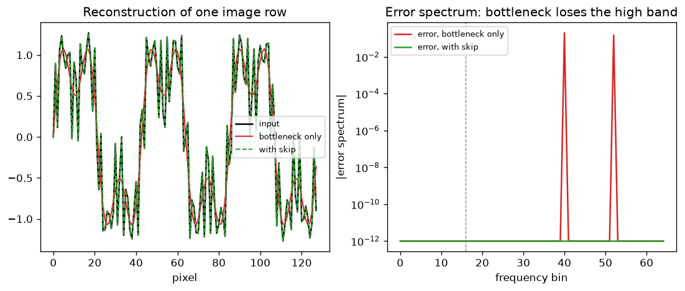

# Day 124 — Consolidation Day: Phase 9 (Concepts 89–95, ViT through object detection)

*(Day 123 flagged this: Phase 9 is where vision stops being "a CNN with a classifier head" and becomes tokens, contrast, masking and boxes.)*

## 🧠 CONCEPT OF THE DAY — PHASE 9 IN THREE CONNECTIONS

**Connection 1 — ViT, CLIP, SimCLR, MAE, DINO (89–93) are one recipe: patchify, embed, then invent a supervision signal.**

Intuition: ViT chops an image into patches and treats them like words. The architecture is just a Transformer, so everything interesting is *what you ask it to predict*: a label (supervised), a caption match (CLIP), "same image, different crop" (SimCLR), "fill in the hidden patches" (MAE), or "agree with a slowly moving copy of yourself" (DINO). Patchify is a strided convolution:

$$z_0=[x_{\text{cls}};\,E\,x_p^{1};\dots;E\,x_p^{N}]+E_{\text{pos}},\qquad N=\frac{HW}{P^2}$$

where $x_p^i\in\mathbb R^{P^2C}$ is a flattened patch, $E$ the shared linear embedding, and $E_{\text{pos}}$ the learned positions. The contrastive objective behind CLIP and SimCLR is InfoNCE:

$$\mathcal L_i=-\log\frac{\exp(\mathrm{sim}(z_i,z_i^+)/\tau)}{\sum_{k\ne i}\exp(\mathrm{sim}(z_i,z_k)/\tau)}$$

where $\mathrm{sim}$ is cosine similarity, $z_i^+$ the positive partner and $\tau$ a temperature. MAE needs no negatives: it masks about 75% of patches and regresses the missing pixels, which is cheap because the encoder only sees the visible 25%. DINO also needs no negatives: a student matches a teacher whose weights are an EMA of the student, $\theta_t\leftarrow m\theta_t+(1-m)\theta_s$, with centering and sharpening to avoid collapse.

**Connection 2 — U-Net (94) is the structural fix for "the bottleneck throws away detail", and it is a frequency argument.**

Encoder-decoder bottlenecks downsample, which is a low-pass filter, so the decoder cannot invent the lost fine detail. A skip connection concatenates the encoder feature at the same resolution:

$$h_\ell^{\text{dec}}=\phi\big([\,\mathrm{up}(h_{\ell+1}^{\text{dec}});\,h_\ell^{\text{enc}}\,]\big)$$

where $\mathrm{up}$ is the upsampler and $[\cdot;\cdot]$ is channel concatenation. Coarse path carries semantics, skip path carries high-frequency localization. This is why U-Net is the denoiser inside diffusion (Phase 8): noise prediction is a per-pixel task that needs the high band.



`graph_DAY_124.py` uses a synthetic 128-pixel row with tones at bins 3, 9, 40, 52 (all deterministic): the bottleneck keeps only bins below 16, so its error sits entirely at bins 40 and 52, while the skip drives the error to numerical zero.

**Connection 3 — Detection (95) turns a dense prediction into a set, and NMS is the glue.**

A detector predicts many overlapping boxes. IoU measures overlap and NMS keeps the best and suppresses the rest:

$$\mathrm{IoU}(A,B)=\frac{|A\cap B|}{|A\cup B|}$$

where $|\cdot|$ is area. NMS sorts by score, keeps the top box, drops every box with $\mathrm{IoU}>\theta$ against it, and repeats. It is the same greedy-by-score idea as today's Gauntlet.

**Interview lens:** Phase 9 answers "how do you get a useful visual representation without labels, and how do you read out localized structure?" Tokens plus a pretext task for the representation, skips and boxes for localization.

**Interview question:** *ViT patchifies with stride $P$ and no anti-aliasing filter, while a CNN stem usually blurs or pools. A tone in the image sits above the patch-grid Nyquist rate. What does the ViT embedding see, and does the patch embedding $E$ fix it?*

*(Answer at the very bottom.)*

## 🐍 PYTHONIC EDGE

**Pairwise IoU with broadcasting, no Python loop: `boxes[:, None]` versus `boxes[None]`.**

```python
import numpy as np                                             # import X as Y alias: no C++ equivalent (closest: namespace alias)

boxes = np.array([[0, 0, 10, 10],
                  [5, 5, 15, 15],
                  [20, 20, 30, 30]], dtype=float)              # nested list literal; dtype= is a keyword argument (C++ has none)

# --- BAD: double loop, O(n^2) Python-level iterations ---
def iou_slow(b):
    n = len(b)                                                 # len() calls b.__len__(); dunder method, not a member call
    out = np.zeros((n, n))                                     # tuple shape; C++ would use vector<vector<double>>
    for i in range(n):                                         # range() is a lazy object, not a counter in the loop header
        for j in range(n):
            iw = max(0, min(b[i, 2], b[j, 2]) - max(b[i, 0], b[j, 0]))   # b[i, 2]: one subscript with a tuple, not b[i][2]
            ih = max(0, min(b[i, 3], b[j, 3]) - max(b[i, 1], b[j, 1]))
            inter = iw * ih
            a_i = (b[i, 2] - b[i, 0]) * (b[i, 3] - b[i, 1])
            a_j = (b[j, 2] - b[j, 0]) * (b[j, 3] - b[j, 1])
            out[i, j] = inter / (a_i + a_j - inter)            # / is true division (C++ int/int truncates)
    return out

# --- CLEAN: broadcast (n,1,4) against (1,n,4) to get all pairs at once ---
def iou(b):
    a, c = b[:, None, :], b[None, :, :]                        # tuple unpacking; None inserts an axis (None is not nullptr here)
    lt = np.maximum(a[..., :2], c[..., :2])                    # ... is Ellipsis: "all leading axes"; [:2] slice, end exclusive
    rb = np.minimum(a[..., 2:], c[..., 2:])                    # [2:] slice from index 2 to the end
    wh = np.clip(rb - lt, 0, None)                             # None as "no upper bound" argument
    inter = wh[..., 0] * wh[..., 1]                            # negative-free indexing on the last axis
    area = (b[:, 2] - b[:, 0]) * (b[:, 3] - b[:, 1])           # whole-array arithmetic, no explicit loop
    return inter / (area[:, None] + area[None, :] - inter)     # broadcasting does the pairing

assert np.allclose(iou_slow(boxes), iou(boxes))                # assert: runtime check, stripped under python -O
print(iou(boxes).round(3))                                     # method chaining on the returned array
```

Both agree, and the clean version also runs unchanged on a `torch.Tensor`, which is exactly how detection libraries compute NMS suppression on GPU.

**OOP mechanic:** `detectors = {"iou": iou}` stores a *function* as a dict value and `detectors["iou"](boxes)` calls it. Functions are first-class objects in Python; C++ needs function pointers or `std::function`.

## 📡 SIGNAL LAB

**Problem.** A ViT uses non-overlapping patches of size $P=4$ and (for this exercise) the embedding averages pixels within a patch before sampling once per patch. (a) What is the patch-grid Nyquist frequency in cycles/pixel? (b) A tone at $f=0.3$ cycles/pixel enters. Where does it alias to, and how strongly is it attenuated by the box average? (c) What does this mean for ViT-based forensics?

**Solution.** (a) One sample per 4 pixels is a rate of $0.25$ cycles/pixel, so Nyquist is $0.125$. (b) The tone is above Nyquist, so it folds: $0.3$ cycles/pixel is $1.2$ cycles/patch, which aliases to $|1.2-1|=0.2$ cycles/patch (equivalently $0.3-0.25=0.05$ cycles/pixel). The box average has gain $\left|\frac{\sin(\pi fP)}{P\sin(\pi f)}\right|$, which at $f=0.3$ is $0.182$ (about $-14.8$ dB). For comparison $f=0.05$ gives $0.939$, $f=0.2$ gives $0.25$ and $f=0.45$ gives $0.149$. Box filtering attenuates but does not remove high frequencies, so aliased energy leaks into the low band. (c) A *learned* linear $E$ acts on one patch only, and a per-patch linear map cannot cancel an alias that has already been folded onto a lower frequency: aliasing happens at sampling, and $E$ is applied after. It can only learn to be selective about patterns inside the patch.

**So what.** For your research lane: ViT-based detectors see high-frequency generator fingerprints in two forms, aliased energy folded into patch-rate bands and patch-boundary seams at multiples of $1/P$ cycles/pixel. This is why resizing or JPEG at a different grid than the patch size can erase or fake a spectral cue. Sanity check any detector by shifting the image by a non-multiple of $P$.

## 🏋️ THE GAUNTLET

**Problem — "Non-overlapping Intervals."** Given a list of intervals `[start, end]`, return the minimum number of intervals to remove so that the rest do not overlap. Intervals that merely touch (`[1,2]` and `[2,3]`) do not overlap. (Framing: this is NMS where "overlap" means interval intersection and you want to keep as many boxes as possible.)

Constraints: $1\le n\le10^5$, $-5\cdot10^4\le\text{start}<\text{end}\le5\cdot10^4$. Aim for better than $O(n^2)$.

**Hint 1:** Removing the minimum is the same as keeping the maximum number of compatible intervals. Which single interval should you commit to first?

**Hint 2:** Intuition says "start earliest" or "shortest". Try to break both with a tiny counterexample, then ask which property leaves the *most room* for what comes next.

**Hint 3:** Sort by end time. Walk through, keep an interval if its start is at least the end of the last kept one, otherwise skip it. The answer is $n-\text{kept}$.

**Pattern:** greedy (interval scheduling, exchange argument). **Target complexity:** $O(n\log n)$ time for the sort, $O(1)$ extra space.

Solution at the bottom under 🔓 GAUNTLET SOLUTION.

## 🏗️ BLUEPRINT

no blueprint today.

## 🗺️ MARCHING ORDERS

Run `iou` on two boxes you draw by hand, then write NMS in ten lines on top of it. You will have rebuilt the last stage of every detector.

Tomorrow: Consolidation Day — Phase 10 (Concepts 96–103: mixed precision through serving)

---

## 🔓 GAUNTLET SOLUTION

```cpp
#include <bits/stdc++.h>
using namespace std;

int eraseOverlapIntervals(vector<vector<int>>& v) {
    sort(v.begin(), v.end(), [](auto& a, auto& b) { return a[1] < b[1]; });  // earliest end first
    int keep = 0, end = INT_MIN;
    for (auto& iv : v)
        if (iv[0] >= end) { ++keep; end = iv[1]; }   // compatible with last kept: take it
    return (int)v.size() - keep;
}
```

Verified: `[[1,2],[2,3],[3,4],[1,3]]` → `1`; `[[1,2],[1,2],[1,2]]` → `2`. Exchange argument: the interval with the earliest end can replace whatever an optimal solution picks first without causing a new conflict. Cost is $O(n\log n)$ for the sort.

💡 CONCEPT ANSWER

The ViT sees an *aliased* version: energy above the patch-grid Nyquist ($1/(2P)$ cycles/pixel) is folded down onto lower frequencies at the moment of patch sampling, and any pooling inside the patch only attenuates it. The embedding $E$ does not fix this, because it is a linear map applied per patch after the signal has been sampled; folded components are indistinguishable from genuine low-frequency content within that patch. Practical consequences: high-frequency generator fingerprints can alias into patch-rate bands, results change under shifts that are not multiples of $P$, and preprocessing (resize, JPEG on an 8x8 grid) that does not match the patch grid can create or erase cues. Overlapping patches, a conv stem with anti-aliasing, or augmenting with random shifts reduce the issue.
