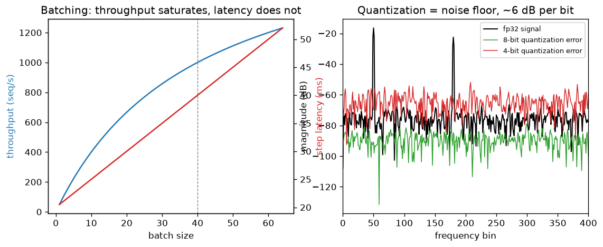

# Day 125 — Consolidation Day: Phase 10 (Concepts 96–103, mixed precision through serving)

*(Day 124 flagged this: Phase 10 is where a model that works on a whiteboard has to fit in memory, finish in time and serve real traffic.)*

## 🧠 CONCEPT OF THE DAY — PHASE 10 IN THREE CONNECTIONS

**Connection 1 — Mixed precision, accumulation and checkpointing, parallelism, ZeRO (96–99) are all one question: which bytes do I keep, where, and for how long?**

Intuition: training memory is a budget. Weights, gradients and optimizer state are the fixed cost; activations are the variable cost. Every trick in 96–99 trades one resource for another: precision for noise, memory for recompute, memory for communication. With $\Psi$ parameters and Adam in mixed precision, the fixed cost is:

$$M_{\text{states}} = \underbrace{2\Psi}_{\text{fp16 weights}}+\underbrace{2\Psi}_{\text{fp16 grads}}+\underbrace{12\Psi}_{\text{fp32 master, }m,\ v}=16\Psi\ \text{bytes}$$

where $\Psi$ is the parameter count and each term is bytes per parameter times $\Psi$. ZeRO shards these across $N$ data-parallel workers: stage 1 shards the 12Ψ optimizer state, stage 2 also the gradients, stage 3 also the weights, so stage 3 gives roughly $16\Psi/N$ per device (plus activations). Gradient accumulation fakes a big batch from $k$ micro-batches, $g=\frac1k\sum_{i=1}^k g_i$, and activation checkpointing stores only every $\sqrt{L}$-th layer, buying about $O(\sqrt L)$ activation memory for one extra forward pass. Mixed precision works because bf16 keeps fp32's exponent range (no loss scaling), while fp16 has more mantissa but overflows near $6.5\times10^4$, hence loss scaling and fp32 accumulation.

**Connection 2 — KV cache and batching (100–101) turn generation from compute-bound into memory-bound.**

Without a cache, producing token $t$ re-runs attention over all $t$ previous tokens, so a length-$T$ generation costs $O(T^2)$ per layer in projections alone. Caching keys and values makes each step $O(T)$ attention work against a stored cache of size:

$$M_{\text{KV}} = 2\cdot L\cdot n_{\text{kv}}\cdot d_h\cdot T\cdot B\cdot s$$

where $L$ is layers, $n_{\text{kv}}$ the number of KV heads, $d_h$ head width, $T$ context length, $B$ batch size and $s$ bytes per element. Each decode step must stream all weights from memory once regardless of batch size, so latency is roughly $t_0+cb$ and throughput $b/(t_0+cb)$. Throughput saturates near $b^*=t_0/c$ while latency keeps rising, so batch size is a dial between cost per token and time per token.



`graph_DAY_125.py` uses a synthetic two-tone signal at bins 50 and 180 plus small seeded noise, with a toy latency model $t_0=20$ ms, $c=0.5$ ms: throughput keeps rising but flattens past the knee at $b=40$ while latency grows linearly. On the right, quantization error is a flat noise floor, and the measured SQNR is 47.1 dB at 8 bits and 22.0 dB at 4 bits.

**Connection 3 — Export and serving (102–103) make the schedule, not the kernel, the bottleneck.**

ONNX/TorchScript freeze the graph so it can run without Python. Static batching waits for the slowest sequence in a batch; continuous batching (vLLM) re-forms the batch every decode step, admitting new requests as others finish, and PagedAttention allocates the KV cache in fixed blocks so fragmentation stops capping batch size. The common theme with Connection 1: both phases are about packing a scarce resource (memory, GPU time) without waste.

**Interview lens:** Phase 10 answers "can you reason about where the bytes and milliseconds go?" Expect to compute the 16Ψ and KV-cache numbers on a whiteboard and to say which regime (compute- or memory-bound) a workload is in.

**Interview question:** *You halve a model's weight precision from fp16 to int8, but decode latency at batch size 1 barely improves for a long-context request. Why, and what would you quantize or change instead?*

*(Answer at the very bottom.)*

## 🐍 PYTHONIC EDGE

**Accumulate in a wider dtype: `x.sum(dtype=np.float32)` instead of a half-precision running sum.**

```python
import numpy as np                                             # import X as Y alias: no C++ equivalent (closest: namespace alias)

x = np.full(10000, 0.1, dtype=np.float16)                      # dtype= is a keyword argument; C++ would need a template parameter

# --- BAD: a running total kept in the same low-precision type ---
def bad_sum(v):
    s = np.float16(0)                                          # numpy scalar type object; no C++ literal suffix needed
    for e in v:                                                # for-in iterates elements directly, no index or iterator
        s = np.float16(s + e)                                  # s + e is promoted, then rounded back to fp16 each step
    return s

# --- CLEAN: let the reduction accumulate in fp32 ---
good = x.sum(dtype=np.float32)                                 # keyword-only style argument picks the accumulator type
print(bad_sum(x), good)                                        # prints 256.0 and about 999.76 (true value is ~1000)

# --- CLEAN: turn silent overflow into an error while debugging ---
with np.errstate(over="raise"):                                # with: context manager, restores state on exit (C++ RAII)
    try:                                                       # try/except, not try/catch
        np.float16(60000) * np.float16(2)                      # exceeds fp16 max (65504)
    except FloatingPointError as e:                            # "as e" binds the exception object
        print("caught", e)                                     # f-strings not needed for a plain print
```

The naive loop stalls at 256 because the spacing between fp16 numbers there is 0.25, so adding 0.1 rounds back to the same value. This is the same reason frameworks keep an fp32 master copy and accumulate matmul partial sums in fp32.

**OOP mechanic:** `with np.errstate(...)` works because the object defines `__enter__` and `__exit__` dunder methods. C++ gets the same effect with a RAII class whose constructor and destructor save and restore state.

## 📡 SIGNAL LAB

**Problem.** (a) A full-scale sine is quantized to $b$ bits with a uniform quantizer. Derive the signal-to-quantization-noise ratio (SQNR). (b) In the graph, 8-bit gives 47.1 dB and 4-bit gives 22.0 dB for a two-tone signal. Is that consistent? (c) What does bf16's 8-bit significand mean for a spectral forensics pipeline?

**Solution.** (a) With amplitude $A$ the step is $\Delta=2A/2^b$. Rounding error is roughly uniform on $[-\Delta/2,\Delta/2]$, so noise power is $\Delta^2/12$. Signal power is $A^2/2$, so $\mathrm{SQNR}=\frac{A^2/2}{\Delta^2/12}=\frac{3}{2}\,2^{2b}$, which is $6.02\,b+1.76$ dB. (b) The difference between 8 and 4 bits is $47.1-22.0=25.1$ dB over 4 bits, or 6.3 dB per bit, close to the 6.02 theory. The absolute values sit below $6.02b+1.76$ because the signal is not full scale: the scale is set by the peak of the sum of two tones (0.9 plus noise), so average power is lower than for a single full-scale sine. (c) bf16 keeps about 8 significant bits, so the per-sample relative rounding noise is around $-48$ dB relative to each value. That is a floor, and it is multiplicative (relative to the value), not a fixed additive level.

**So what.** For your research lane: if a generator's fingerprint sits 50–60 dB below the dominant spectral content, a bf16 forward pass can bury it, while fp32 FFT preprocessing keeps it. Do the FFT in fp32 even when the network runs in half precision, and check detector accuracy under a bf16 versus fp32 cast before trusting a spectral cue.

## 🏋️ THE GAUNTLET

**Problem — "Koko Eating Bananas" (LeetCode 875).** There are `n` piles of bananas, `piles[i]` in pile `i`, and `h` hours. Each hour Koko picks one pile and eats up to `k` bananas from it; if the pile has fewer than `k`, she finishes it and eats nothing more that hour. Return the minimum integer `k` so she finishes all piles within `h` hours. (Framing: this is the serving question "what is the minimum capacity so that all requests finish within the deadline?")

Constraints: $1\le n\le10^4$, $n\le h\le10^9$, $1\le\text{piles}[i]\le10^9$.

**Hint 1:** If speed $k$ works, does $k+1$ also work? What does that say about the set of feasible speeds?

**Hint 2:** You do not know the answer, but you can *check* a candidate speed quickly. How many hours does a pile of size $p$ need at speed $k$ (be careful with the rounding)?

**Hint 3:** Binary search on the answer between 1 and `max(piles)`. Feasibility is a sum of ceilings, which can exceed 32 bits: use a 64-bit accumulator.

**Pattern:** binary search on the answer space (monotone predicate). **Target complexity:** $O(n\log(\max\text{piles}))$ time, $O(1)$ extra space.

Solution at the bottom under 🔓 GAUNTLET SOLUTION.

## 🏗️ BLUEPRINT

**Sizing an LLM endpoint: KV cache decides your batch size, not FLOPs.** Take weights as a fixed cost per GPU, subtract them from device memory, and divide the remainder by the KV bytes per sequence ($2\cdot L\cdot n_{\text{kv}}\cdot d_h\cdot T\cdot s$) to get the maximum concurrent sequences. The key tradeoff: grouped-query attention (fewer KV heads), int8 KV cache, or paged allocation each raise that ceiling and therefore throughput per GPU, at a small quality risk (quantized cache) or implementation complexity (paging). Set the batch cap from the latency SLO using the $t_0+cb$ curve, not from the memory limit alone.

## 🗺️ MARCHING ORDERS

Take any model you know, compute its fp16 weight bytes and its KV bytes at 4k context on a napkin, and see which one wins. That single comparison is half of what serving engineers do all day.

Tomorrow: Consolidation Day — Phase 11 (Concepts 104–112: RL basics through evaluation)

---

## 🔓 GAUNTLET SOLUTION

```cpp
#include <bits/stdc++.h>
using namespace std;

int minEatingSpeed(vector<int>& piles, int h) {
    int lo = 1, hi = *max_element(piles.begin(), piles.end());   // answer lies in [1, max pile]
    while (lo < hi) {
        int mid = lo + (hi - lo) / 2;
        long long hours = 0;                                      // 64-bit: sum of ceilings can overflow int
        for (int p : piles) hours += (p + mid - 1) / mid;         // ceil(p / mid)
        if (hours <= h) hi = mid;                                 // feasible: try slower
        else lo = mid + 1;                                        // too slow: speed up
    }
    return lo;
}
```

Verified by compiling and running: `[3,6,7,11], h=8` → `4`; `[30,11,23,4,20], h=5` → `30`; same piles with `h=6` → `23`. Feasibility is monotone in `k`, so binary search finds the smallest feasible value in $O(n\log\max)$.

💡 CONCEPT ANSWER

Batch-1 decode is memory-bandwidth-bound: each step streams the weights *and* the whole KV cache from HBM, and does very little arithmetic per byte moved. Int8 weights halve the weight traffic, but for a long-context request the KV cache can dominate the bytes read, and it was still in fp16, so total traffic (and latency) barely drops. Also, if the int8 kernels dequantize on the fly, you pay extra compute, and weight-only quantization does nothing for activations or the cache. The fix is to quantize the KV cache (int8/fp8), reduce KV size structurally with grouped-query or multi-query attention or windowed attention, and batch more requests so the weight reads are amortized. Measure bytes moved per step (roofline) before choosing, rather than assuming weights are the cost.
