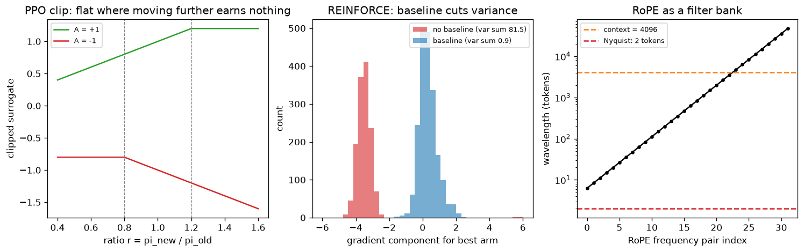

# Day 126 — Consolidation Day: Phase 11 (Concepts 104–112, RL basics through evaluation)

*(Day 125 flagged this: Phase 11 is where the model stops predicting and starts acting, retrieving, using tools and being judged.)*

## 🧠 CONCEPT OF THE DAY — PHASE 11 IN THREE CONNECTIONS

**Connection 1 — RL basics, Q-learning, policy gradients, actor-critic and PPO (104–107) are one trade-off: bias versus variance in the learning signal.**

Intuition: an agent learns from a noisy score. You can trust the score fully (Monte Carlo returns: unbiased, noisy), or lean on your own prediction of the future (bootstrapping: lower variance, but biased by your own errors). Every algorithm in 104–107 picks a spot on that dial. Q-learning bootstraps a value; REINFORCE uses the raw return; actor-critic subtracts a learned baseline; PPO also limits how far each update may move the policy.

$$Q(s,a)\leftarrow Q(s,a)+\alpha\Big[r+\gamma\max_{a'}Q(s',a')-Q(s,a)\Big]$$

Here $\alpha$ is the step size, $\gamma$ the discount, and the bracket is the TD error. The policy-gradient counterpart, with advantage $A_t=G_t-b(s_t)$ for baseline $b$, is:

$$\nabla_\theta J=\mathbb{E}\Big[\sum_t \nabla_\theta\log\pi_\theta(a_t\mid s_t)\,A_t\Big]$$

Subtracting $b(s_t)$ leaves the expectation unchanged (it only depends on the state) but can slash variance. PPO keeps updates safe with the ratio $r_t=\pi_\theta/\pi_{\text{old}}$:

$$L^{\text{CLIP}}=\mathbb{E}\Big[\min\big(r_tA_t,\ \text{clip}(r_t,1-\epsilon,1+\epsilon)A_t\big)\Big]$$

where $\epsilon$ (typically 0.2) sets the trust region. Once $r_t$ leaves $[1-\epsilon,1+\epsilon]$ in the direction the advantage favors, the gradient is zero.



`graph_DAY_126.py` uses a 3-armed bandit with rewards 10, 11, 12 (plus unit Gaussian noise), seed 42. The mean gradient barely changes with a baseline (about 0.28 vs 0.32 on the best arm, both pointing the right way), but the total variance drops from 81.5 to 0.9, roughly 90×. The left panel shows the clip going flat beyond $1\pm0.2$.

**Connection 2 — RAG, agents and multimodal models (108–110) are all "give the network something it did not memorize".**

A frozen model has a fixed knowledge cutoff and a fixed input type. RAG fetches text at query time and conditions on it. Agents wrap the model in a loop of act → observe → act, where the "environment" is a set of tools. Multimodal models project another modality into the token space so the same transformer can read it. Notice the link to Connection 1: an agent loop *is* an MDP, with the tool output as the next state and the task success as a sparse reward, which is exactly why RL fine-tuning of tool use is hard (long horizons, credit assignment, noisy returns).

**Connection 3 — Long context and evaluation (111–112) are the same worry viewed from two sides: does the number you see reflect the capability you want?**

Long-context methods (RoPE scaling, position interpolation, sparse or ring attention) stretch the *input*; evaluation asks whether the model really uses it. Needle-in-a-haystack accuracy can be 100% while multi-hop reasoning over the same context fails, and contamination or Goodhart effects can inflate any public benchmark. A position-encoding change that lowers perplexity on long text has not shown the model can retrieve from it.

**Interview lens:** Phase 11 asks "can you reason about signal quality?" Expect to explain why a baseline does not bias policy gradients, what the PPO clip does, and why a benchmark score might not mean what the leaderboard says.

**Interview question:** *In REINFORCE, you subtract a state-dependent baseline $b(s_t)$ from the return. Why does this not bias the gradient, and what happens if the baseline depends on the action $a_t$?*

*(Answer at the very bottom.)*

## 🐍 PYTHONIC EDGE

**Debug an RL loop with a detached, in-place-safe running statistic: `torch.no_grad()` plus `.detach()` for baselines and logged values.**

```python
import torch                                                    # import module; C++ would use #include and a namespace

class Baseline:                                                 # plain class, no base: C++ "class Baseline {...};"
    def __init__(self, momentum=0.9):                           # constructor; self is C++'s this but explicit
        self.momentum = momentum                                # instance attribute created on assignment (C++: declare in header)
        self.value = None                                       # None is Python's nullptr-like sentinel

    def update(self, returns):
        m = returns.mean()                                      # method call on a tensor, no pointer syntax
        if self.value is None:                                  # "is None" compares identity, not ==
            self.value = m.detach()                             # detach(): cut the autograd graph, keeps the data
        else:
            self.value = self.momentum * self.value + (1 - self.momentum) * m.detach()
        return self.value

# --- BAD: baseline built from tensors that still carry gradients ---
logp = torch.randn(5, requires_grad=True)                       # requires_grad is a keyword argument
G = torch.tensor([10., 11., 12., 11., 10.])                     # float literals in a list, no brace init
bad_adv = G - G.mean() * logp.exp().mean()                      # baseline now depends on the policy: gradient leaks into it

# --- CLEAN: baseline is a constant w.r.t. the policy ---
b = Baseline()                                                  # calling the class object runs __init__
with torch.no_grad():                                           # with: context manager, restores grad mode on exit (C++ RAII)
    adv = G - b.update(G)                                       # no graph recorded inside this block
loss = -(logp * adv).mean()                                     # advantage acts as a constant weight
loss.backward()                                                 # call the method; grads flow only through logp
print(logp.grad.shape, adv.requires_grad)                       # tuple-like torch.Size; prints torch.Size([5]) False
```

The point: the advantage must be treated as a fixed weight. If it carries gradient you are secretly optimizing the baseline too, and the variance-reduction argument (which relies on the baseline not depending on the action) stops being valid.

**OOP mechanic:** `b.update(G)` is a method looked up on the instance; Python passes `self` automatically as the first argument. In C++ the same call compiles to a member function with an implicit `this`.

## 📡 SIGNAL LAB

**Problem.** RoPE rotates query/key pair $i$ by angle $m\theta_i$ at position $m$, with $\theta_i=10000^{-2i/d}$. (a) For $d=64$, what wavelength (in tokens) does each frequency pair have, and how many pairs never complete a full cycle within a 4096-token context? (b) Does the highest-frequency pair alias? (c) What does position interpolation by a factor $s$ do, in signal terms?

**Solution.** (a) The wavelength of pair $i$ is $\lambda_i=2\pi/\theta_i=2\pi\cdot10000^{2i/d}$. It runs from $2\pi\approx6.28$ tokens at $i=0$ to about $5.4\times10^4$ tokens at $i=31$. Running `graph_DAY_126.py` gives 9 of 32 pairs with $\lambda_i>4096$: these pairs act as near-constant "absolute position" features inside the window, since they never complete a cycle. (b) The Nyquist limit for integer positions is a wavelength of 2 tokens. The fastest pair has 6.28 tokens, so no pair aliases for integer positions (0 of 32 below 4 tokens). (c) Position interpolation divides positions by $s$, i.e. $m\theta_i\to m\theta_i/s$, which stretches every wavelength by $s$. It is equivalent to *resampling* the position axis: low-frequency pairs stay inside the range they were trained on, but the fast pairs now resolve neighbouring tokens less sharply (their angular spacing per token shrinks by $s$), which is why short-range precision degrades unless the model is fine-tuned.

**So what.** RoPE is a bank of sinusoids with geometrically spaced frequencies, i.e. a filter bank over position. Extrapolating past the training length means evaluating the slow sinusoids at phases never seen in training; interpolating compresses the bank so all phases stay in-range but at coarser resolution. For your frequency-domain generative work: the same view helps when analyzing positional artifacts in generated images, where periodic position-dependent patterns show up as sharp spectral lines at specific frequencies.

## 🏋️ THE GAUNTLET

**Problem — "Coin Change" (LeetCode 322).** Given `coins` (distinct positive integers) and an `amount`, return the fewest coins needed to make exactly `amount`, or `-1` if impossible. You have an unlimited supply of each coin. (Framing: this is value iteration on a tiny MDP: states are remaining amounts, actions are coins, every step costs 1.)

Constraints: $1\le\text{coins.length}\le12$, $1\le\text{coins}[i]\le2^{31}-1$, $0\le\text{amount}\le10^4$.

**Hint 1:** If you already knew the best answer for every smaller amount, how would you get the answer for `amount`? Which last coin could you have used?

**Hint 2:** Greedy "take the biggest coin" fails (try coins `{1,3,4}` and amount 6). Define the answer for amount $a$ in terms of amounts $a-c$ for each coin $c$.

**Hint 3:** Build a table bottom-up from 0. Initialize unreachable amounts with a sentinel larger than any real answer (careful: do not use `INT_MAX` and then add 1).

**Pattern:** unbounded-knapsack style 1D dynamic programming (the Bellman optimality equation). **Target complexity:** $O(\text{amount}\cdot|\text{coins}|)$ time, $O(\text{amount})$ space.

Solution at the bottom under 🔓 GAUNTLET SOLUTION.

## 🏗️ BLUEPRINT

**Evaluating an agent in production: score the trajectory, not just the final answer.** Log every tool call, its arguments and the result, then grade (1) task success, (2) steps and cost, and (3) unsafe or irreversible actions. The key tradeoff: an LLM-as-judge scales cheaply but inherits its own biases and can be gamed, while human or programmatic checks are trustworthy but slow. Use cheap automatic checks on every run, a judge on a sample, and humans on disagreements and on a frozen held-out set that never feeds back into prompt tuning (otherwise you contaminate your own benchmark).

## 🗺️ MARCHING ORDERS

Eleven phases done: you now have the whole map from a single neuron to agents. Pick one connection from today and explain it out loud in two minutes without notes; whatever stalls is your next review topic.

Tomorrow: Concept 114 — the roadmap is complete; the next run starts the full-roadmap review (Phases 1–11)

---

## 🔓 GAUNTLET SOLUTION

```cpp
#include <bits/stdc++.h>
using namespace std;

int coinChange(vector<int>& coins, int amount) {
    const int INF = amount + 1;                         // sentinel above any real answer, safe to add 1 to
    vector<int> dp(amount + 1, INF);
    dp[0] = 0;                                          // zero coins make amount 0
    for (int a = 1; a <= amount; ++a)
        for (int c : coins)
            if (c <= a) dp[a] = min(dp[a], dp[a - c] + 1);   // last coin was c
    return dp[amount] >= INF ? -1 : dp[amount];
}
```

Verified by compiling and running: `[1,2,5], 11` → `3`; `[2], 3` → `-1`; `[1], 0` → `0`. Each amount depends only on smaller amounts, so a single forward pass is a valid evaluation order.

## 💡 CONCEPT ANSWER

The policy-gradient identity uses $\mathbb{E}_{a\sim\pi}[\nabla_\theta\log\pi_\theta(a\mid s)]=\sum_a\nabla_\theta\pi_\theta(a\mid s)=\nabla_\theta\sum_a\pi_\theta(a\mid s)=\nabla_\theta 1=0$. So for any $b(s_t)$ that does not depend on the action, $\mathbb{E}[\nabla_\theta\log\pi_\theta(a_t\mid s_t)\,b(s_t)]=b(s_t)\cdot0=0$ and the expected gradient is unchanged, while the variance of $G_t-b(s_t)$ can be much smaller (about 90× in today's bandit). If the baseline depends on $a_t$, $b$ can no longer be pulled out of the expectation over actions, the term no longer vanishes, and the gradient estimate becomes biased (unless it is corrected, as in action-dependent baselines with an added analytic term).
