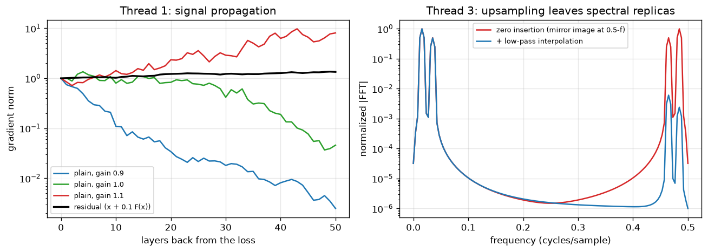

# Day 127 — Consolidation Day: The Whole Roadmap (Phases 1–11, three threads)

*(Yesterday closed Phase 11. Today you zoom out: the roadmap is complete, so this is the full-map review, with no new concept.)*

## 🧠 CONCEPT OF THE DAY — THREE THREADS THAT RUN THROUGH ALL 11 PHASES

**Thread 1 — Signal propagation: forward activations and backward gradients must both survive depth (7, 8–9, 18–21, 27–28, 41, 48, 60, 96).**

Intuition: a deep network is a long game of telephone, in both directions. Each layer multiplies the message by a Jacobian. If the typical gain is below 1 the message fades (vanishing gradients); above 1 it blows up (exploding). Almost every trick in the course is a way to keep that gain near 1: Xavier and He init set it at step 0, normalization re-sets it every layer, gating (LSTM/GRU) and residual connections give the message a path with gain exactly 1, and mixed-precision loss scaling stops tiny gradients underflowing.

For a plain stack of $L$ layers, backprop gives the product:

$$\frac{\partial \mathcal{L}}{\partial x_0}=\Big(\prod_{\ell=1}^{L} J_\ell^{\top}\Big)\frac{\partial \mathcal{L}}{\partial x_L},\qquad J_\ell=D_\ell W_\ell$$

where $W_\ell$ is the weight matrix, $D_\ell=\text{diag}(\phi'(z_\ell))$ is the activation derivative, and $J_\ell$ is the layer Jacobian. A residual block changes one thing:

$$x_{\ell+1}=x_\ell+F_\ell(x_\ell)\ \Rightarrow\ \frac{\partial x_{\ell+1}}{\partial x_\ell}=I+\frac{\partial F_\ell}{\partial x_\ell}$$

Expanding the product of $(I+\partial F)$ terms gives a sum that always contains the pure identity path, so the gradient reaches the first layer with at least gain 1 along that path.



`graph_DAY_127.py` (width 32, depth 50, seed 42). In the left panel the plain nets drift away from gain 1 by orders of magnitude: gain 0.9 vanishes, gain 1.1 explodes, and even exactly 1.0 wanders because ReLU masks and random weights make the product a random walk. The residual net (branch scaled by 0.1) stays near norm 1. The right panel belongs to Thread 3 below.

**Thread 2 — Inductive bias versus data: every architecture is a prior about structure, and scale buys you out of the prior (32–44, 53–64, 77, 89, 92).**

A convolution hard-codes locality and translation equivariance with $k^2C_{\text{in}}C_{\text{out}}$ weights regardless of image size. Attention hard-codes nothing but "any token may look at any token", paying $O(n^2)$ and needing positional encodings to know order at all. That is why ViT (89) underperforms a ResNet on small datasets but wins at scale, why MAE (92) and CLIP (90) lean on huge unlabeled corpora, and why scaling laws (77) are the currency: loss falls roughly as a power law in parameters, data and compute.

$$\mathcal{L}(N,D)\approx E+\frac{A}{N^{\alpha}}+\frac{B}{D^{\beta}}$$

Here $N$ is parameter count, $D$ is tokens, $E$ is the irreducible loss and $\alpha,\beta$ are fitted exponents. Weak prior means a larger $B/D^{\beta}$ penalty at small $D$, which is the whole story of "ViT needs more data than a CNN".

**Thread 3 — The spectral view: convolution, pooling, positions and generation all have a frequency-domain reading (32, 35, 58–59, 80, 83–88).**

Convolution in space is multiplication in frequency, so a kernel is a filter. Strided conv and pooling *downsample*, so they alias anything above the new Nyquist. Sinusoidal and rotary positions are a bank of sinusoids with geometrically spaced wavelengths, i.e. a multi-resolution basis. Transposed-conv upsampling inserts zeros, which creates spectral replicas; diffusion's forward process adds white noise that wipes out high frequencies first (their SNR is lowest). For your research lane this is the punchline: *the architecture leaves fingerprints in the spectrum*, which is why generated images can be detected there (88).

$$x\ast h\ \xleftrightarrow{\ \mathcal{F}\ }\ X(f)\,H(f),\qquad \text{zero-insert}\times2:\ X_{\uparrow}(f)=X(2f)$$

$X(f)$ is the signal spectrum, $H(f)$ the kernel's frequency response, and $X_\uparrow$ the spectrum after inserting a zero between samples: the baseband is squeezed and a mirror image appears around the new Nyquist (right panel of the graph).

**Interview lens:** a senior interviewer rarely asks "define X". They ask "why does training this thing break, and which earlier idea fixes it?" Those answers are almost always Thread 1.

**Interview question:** *A 100-layer plain network won't train, but the same network with residual connections trains fine under the same initialization. Using the Jacobian, explain why. Then explain why post-LN transformers are still harder to train deeply than pre-LN ones.*

*(Answer at the very bottom.)*

## 🐍 PYTHONIC EDGE

**Debug Thread 1 directly: a pass-through "probe" module with a tensor hook logs the gradient norm at every depth, with no manual `retain_grad()` bookkeeping.**

```python
import torch                                                     # import module; C++ would use #include
import torch.nn as nn                                            # "as nn" alias: import X as Y has no C++ equivalent

# BAD: retain_grad on every activation, then read .grad by hand after backward
acts = []                                                        # empty list literal; C++ would be std::vector<...>
h = torch.randn(4, 16, requires_grad=True)                       # keyword argument at the call site
for layer in [nn.Linear(16, 16) for _ in range(5)]:              # list comprehension builds the layers inline
    h = torch.relu(layer(h))                                     # calling a module object invokes __call__, which wraps forward()
    h.retain_grad()                                              # non-leaf tensors drop .grad unless asked
    acts.append(h)                                               # append is push_back
h.sum().backward()                                               # method chaining, no -> or ::
print([a.grad.norm().item() for a in acts])                      # list comprehension; .item() converts 0-d tensor to float


# CLEAN: a reusable probe layer that logs on the way back
class Probe(nn.Module):                                          # single inheritance; C++ would be class Probe : public nn::Module
    def __init__(self, name, log):                               # constructor; self is C++'s this but explicit
        super().__init__()                                       # parent constructor call; C++ uses an initializer list
        self.name = name                                         # instance attributes created on assignment (C++: declared in header)
        self.log = log                                           # a reference to the shared list, not a copy

    def forward(self, x):                                        # call probe(x), never probe.forward(x), so hooks still run
        if x.requires_grad:                                      # bool test on a Python bool, no parentheses needed
            x.register_hook(lambda g: self.log.append((self.name, g.norm().item())))  # lambda = inline anonymous function; g is the grad
        return x                                                 # identity: forward values are untouched

log = []
net = nn.Sequential(*[m for i in range(5)                        # * unpacks a list into positional args (C++ has no direct form)
                      for m in (nn.Linear(16, 16), nn.ReLU(), Probe(f"L{i}", log))])  # f-string; nested comprehension flattens
net(torch.randn(4, 16)).sum().backward()                         # hooks fire during backward, deepest layer first
print(log)                                                       # list of (name, grad_norm) tuples; tuples are immutable pairs
```

The probe order in `log` is the backward order, so a monotonic drop from `L4` to `L0` is vanishing gradients caught in one run. Remove the hooks (or the probes) before training for real, since `.item()` forces a GPU sync.

## 📡 SIGNAL LAB

**Problem.** A feature map contains two tones, at 4 and 9 cycles per 128 samples. A decoder upsamples it ×2 by inserting a zero between samples (as a stride-2 transposed conv with no smoothing does). (a) Where do spurious spectral peaks appear? (b) A 3-tap kernel $[0.5,\,1,\,0.5]$ is applied afterwards: how much do they shrink, and why?

**Solution.**

(a) At the new rate the tones sit at $4/256\approx0.016$ and $9/256\approx0.035$ cycles/sample. Zero insertion makes $X_\uparrow(f)=X(2f)$, which is periodic with period $0.5$ in the new frequency axis, so each tone gets a mirror image at $0.5\pm f$. For a real signal the images land at about $0.484$ and $0.465$ cycles/sample, right below the new Nyquist (0.5).

(b) The kernel's frequency response is

$$H(f)=1+\cos(2\pi f)$$

so $H(0)=2$ (the baseband is passed, scaled by 2) while $H(0.5)=0$ and it is tiny near $0.47$. The images are therefore attenuated by roughly $10^{-2}$ relative to the baseband in amplitude. In `graph_DAY_127.py` the energy above $0.25$ cycles/sample drops from about $1.9$ (normalized units) to about $10^{-4}$.

**So what.** A learned transposed conv is only a low-pass filter *if training makes it one*. When it doesn't, the replicas stay and show up as periodic, checkerboard-like peaks in the 2D FFT of generated images. That is exactly the artifact family from Concepts 80 and 88, and it is why spectral detectors work: the generator's upsampling path is a fingerprint you can read off the spectrum. The fix on the architecture side is resize-then-conv (interpolate with a proper low-pass, then convolve) instead of raw transposed convs.

## 🏋️ THE GAUNTLET

**Product of Array Except Self.** Given an array `a` of `n` integers, return an array `out` where `out[i]` is the product of every element of `a` except `a[i]`. **Do not use division**, and use $O(1)$ extra space beyond the output.

**Constraints:** $1\le n\le 10^5$; every prefix and suffix product fits in a signed 32-bit integer (store results in `long long` anyway); `a` may contain zeros and negatives.

**Hint 1:** Why is division banned? Try `[1,2,0,4]`. What does `out[i]` look like if you split the array at `i`?

**Hint 2:** `out[i]` is (product of everything to the left of `i`) times (product of everything to the right of `i`). Can you compute each half in one linear pass?

**Hint 3:** Fill `out` with the left products in a forward pass. Then sweep backward carrying a single running variable for the right product and multiply it in as you go.

**Pattern:** prefix/suffix scan (two-pass accumulate). **Target complexity:** $O(n)$ time, $O(1)$ extra space.

*Connection to today:* this is the backward pass of a product node in a computational graph: $\partial(\prod_j a_j)/\partial a_i=\prod_{j\ne i}a_j$. Reverse-mode autodiff computes it as a forward prefix and a backward suffix, which is why it's divide-free and handles zeros.

## 🏗️ BLUEPRINT

no blueprint today.

## 🗺️ MARCHING ORDERS

You now own the whole map. Pick one thread, pick one real model you have used (a ResNet, a ViT, a diffusion U-Net), and trace where that thread shows up in its source code; the place you can't find it is your next reading session.

Tomorrow: the roadmap is complete, so the next run continues the full-roadmap review (a consolidation day, no new concept number).

---

## 🔓 GAUNTLET SOLUTION

```cpp
#include <bits/stdc++.h>
using namespace std;

vector<long long> productExceptSelf(const vector<int>& a) {
    int n = a.size();
    vector<long long> out(n, 1);
    long long pre = 1;
    for (int i = 0; i < n; ++i) { out[i] = pre; pre *= a[i]; }        // out[i] = product of a[0..i-1]
    long long suf = 1;
    for (int i = n - 1; i >= 0; --i) { out[i] *= suf; suf *= a[i]; }  // times product of a[i+1..n-1]
    return out;
}
```

Compiled and run: `[1,2,3,4]` → `24 12 8 6`; `[-1,1,0,-3,3]` → `0 0 9 0 0`; `[5]` → `1`. Zeros need no special case because no division ever happens. Extra space is two scalars (`pre`, `suf`) besides the output.

## 💡 CONCEPT ANSWER

**Residual vs plain.** In a plain stack the gradient to layer 0 is a product of 100 Jacobians $J_\ell^\top$. If their typical singular values are even slightly below 1 the product shrinks exponentially (about $0.9^{100}\approx3\times10^{-5}$); slightly above 1 it explodes. With $x_{\ell+1}=x_\ell+F_\ell(x_\ell)$ each factor is $I+\partial F_\ell/\partial x_\ell$, and expanding the product gives $I+\sum_\ell \partial F_\ell+\text{higher-order cross terms}$. The identity term is untouched by depth, so a gradient path of gain 1 always exists. Each block only has to learn a small correction, and early layers receive a direct, undamped learning signal.

**Post-LN vs pre-LN.** Post-LN computes $x_{\ell+1}=\text{LN}(x_\ell+F(x_\ell))$, so the normalization sits *on* the residual path: every layer rescales the identity path, and the gradient through it is no longer exactly 1. At initialization the gradient near the output is large and shrinks toward the input layers, so training needs careful warmup and small learning rates. Pre-LN computes $x_{\ell+1}=x_\ell+F(\text{LN}(x_\ell))$, which leaves the residual stream a clean identity highway while only the branch is normalized. The gradient scale is more uniform across depth and training is stable without long warmup. The trade-off is that pre-LN can give slightly worse final quality at the same depth and lets the residual-stream norm grow with depth.
