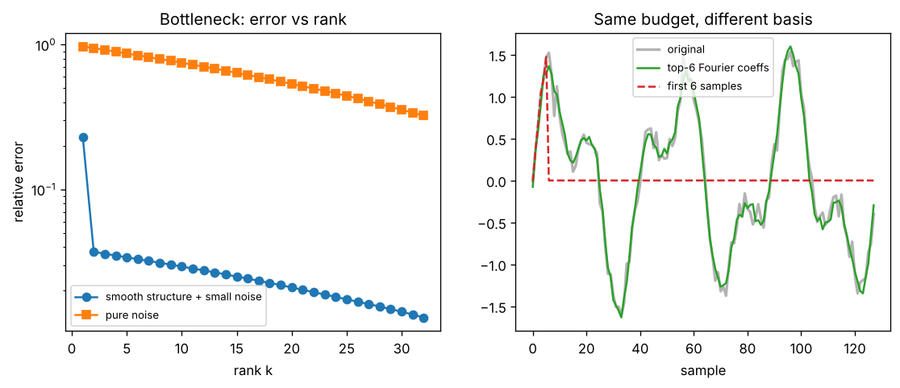

# Day 128 — Consolidation Day: The Bottleneck Thread (1×1 conv → seq2seq → LoRA → VAE → latent diffusion)

*(No new concept number. Yesterday reviewed signal propagation, inductive bias and the spectral view. Today is a fresh cross-phase thread: **compression through a bottleneck**.)*

## 🧠 CONCEPT OF THE DAY — WHY SQUEEZING WORKS: THE BOTTLENECK THREAD

**Intuition.** Imagine describing a face over the phone. You don't read out 262,144 pixel values; you say "oval, brown eyes, glasses". That works because real data lives near a low-dimensional surface inside its huge ambient space. A *bottleneck* forces the network to keep only the directions that matter and throw away the rest. The same trick shows up in six different places in the roadmap:

- **1×1 conv bottlenecks (37, 41):** shrink channels, do the expensive 3×3 work cheaply, expand back.
- **Fixed-context seq2seq (51–52):** the whole source sentence squeezed into one vector, and the pain that causes, which attention (53) fixes by *removing* the bottleneck.
- **LoRA (73):** the weight *update* is assumed low-rank.
- **Quantization & distillation (74–75):** squeeze precision, or squeeze a teacher into a smaller student.
- **Autoencoders & VAEs (78–79):** squeeze the input into a latent code and rebuild it.
- **Latent diffusion (87):** run the expensive generative process in the squeezed space instead of pixel space.

**The math.** The cleanest model of a bottleneck is truncated SVD. For a matrix $M=U\Sigma V^\top$ the best rank-$k$ approximation is

$$M_k=\sum_{i=1}^{k}\sigma_i\,u_i v_i^\top,\qquad \|M-M_k\|_F^2=\sum_{i>k}\sigma_i^2$$

Here $\sigma_i$ are the singular values in decreasing order, $u_i,v_i$ are the left and right singular vectors, and $\|\cdot\|_F$ is the Frobenius norm (Eckart–Young: no rank-$k$ matrix does better). If the spectrum decays fast, a small $k$ loses almost nothing.

Parameter economics make it practical. A dense $d_{\text{out}}\times d_{\text{in}}$ weight has $d_{\text{out}}d_{\text{in}}$ parameters, while the factored form $W\approx BA$ with $B\in\mathbb{R}^{d_{\text{out}}\times r}$, $A\in\mathbb{R}^{r\times d_{\text{in}}}$ has

$$r\,(d_{\text{out}}+d_{\text{in}})\ \ll\ d_{\text{out}}\,d_{\text{in}}\quad\text{when } r\ll\min(d_{\text{out}},d_{\text{in}})$$

For $d=4096$, $r=8$ that is $65{,}536$ versus $16{,}777{,}216$ parameters, about 256× fewer. The 1×1-conv bottleneck is the same arithmetic over channels, and an autoencoder's latent of size $r$ is the nonlinear version.



`graph_DAY_128.py` (64×64 matrix, seed 42). On the left, the smooth matrix drops to about 3.7% error at rank 2 and then flattens at its noise floor (about 3%), while pure noise is still at about 80% error at rank 8: *noise has no low-dimensional structure to exploit.* On the right the same 6-number budget gives 12% error when spent on the best Fourier coefficients and 97% when spent on the first 6 samples. The choice of basis is the compression.

**Why it matters / where it leads.** The thread explains *when* a bottleneck is safe (the data has structure) and *what it costs* (whatever lives outside the kept subspace is gone, which for images is usually the high frequencies). That is exactly the VAE blurriness story and the reason latent diffusion decoders leave spectral fingerprints. Interviewers love the LoRA version: "why would a fine-tuning update be low-rank?"

**Interview question:** *You fine-tune a 7B model with LoRA at rank 8 and it matches full fine-tuning on a narrow task, but falls well short on a task that teaches the model a lot of new knowledge. Using the SVD picture, explain why, and say what you would change.*

*(Answer at the very bottom.)*

## 🐍 PYTHONIC EDGE

**Truncated SVD without building a diagonal matrix: scale columns by broadcasting, then use `@`.**

```python
import numpy as np                                    # "as np" alias: import X as Y has no C++ equivalent

rng = np.random.default_rng(42)                       # object-style RNG; no global seed state like srand()
M = rng.standard_normal((64, 8)) @ rng.standard_normal((8, 64))   # @ is matmul (C++: no operator, call a BLAS routine)
k = 4                                                 # no type declaration; Python infers int at runtime

# BAD: materialise a k x k diagonal matrix and do three matmuls
U, s, Vt = np.linalg.svd(M)                           # tuple unpacking: a, b, c = fn() (C++: std::tie / structured binding)
Mk_bad = U[:, :k] @ np.diag(s[:k]) @ Vt[:k, :]        # [:, :k] slice notation [a:b]; ":" alone means "all rows"

# CLEAN: broadcast the singular values across the columns of U, one matmul
Mk = (U[:, :k] * s[:k]) @ Vt[:k]                      # (64,k)*(k,) broadcasts over rows; * here is elementwise, not matmul
assert np.allclose(Mk, Mk_bad)                        # assert: runtime check (C++ assert is stripped by NDEBUG; Python's by -O)

err = np.linalg.norm(M - Mk) / np.linalg.norm(M)      # default norm of a 2-D array is Frobenius
tail = np.sqrt((s[k:] ** 2).sum() / (s ** 2).sum())   # ** is exponentiation (C++ ** would be a pointer deref); s[k:] open-ended slice
print(f"rank-{k} error {err:.3e}  vs tail formula {tail:.3e}")   # f"..." f-string: inline formatting, {x:.3e} is a format spec
```

I ran this: the rank-8 matrix at $k=4$ has relative error equal to the tail-energy formula to float precision, and the broadcast version equals the three-matmul version. The clean way skips a $k\times k$ allocation and one matmul, and the same `* s[:k]` trick is how you fold $\Sigma$ into either factor for LoRA-style initialisation (`B = U[:, :r] * s[:r]`, `A = Vt[:r]`).

## 📡 SIGNAL LAB

**Problem.** A length-$128$ signal is $x[n]=\sin(2\pi\cdot3n/128)+0.6\sin(2\pi\cdot7n/128)+0.1\,\eta[n]$ with $\eta\sim\mathcal{N}(0,1)$. You may store exactly $6$ real numbers. Compare (a) the first 6 samples against (b) the 6 largest-magnitude real-FFT coefficients. Predict the error without running anything, then explain why.

**Solution.** The signal has two pure tones, so in the DFT basis its energy sits in two bins ($f=3$ and $f=7$), plus a thin noise floor spread over all 65 bins. By Parseval, the energy is preserved by the transform:

$$\sum_n |x[n]|^2=\frac{1}{N}\sum_k |X[k]|^2$$

so dropping the small coefficients loses only their energy. Keeping the 2 tone bins already captures almost everything (each bin is stored as a complex number, so 6 real numbers cover 3 bins; the third bin buys a little extra). The measured relative error is **12%**, essentially the noise energy. The first 6 samples, in contrast, describe only 6/128 of the time axis and discard the rest: the measured relative error is **97%**.

**So what.** A basis is a prior. The Fourier basis is a good prior for periodic or smooth signals, a poor one for sparse spikes, and that is the same reason convolution (a filter in frequency) is a good inductive bias for natural images. For your generative-forensics lane: a VAE or latent-diffusion decoder reconstructs from a bottleneck, so it can only reproduce the spectrum the latent carries. Real photos have a $1/f^{\alpha}$ spectrum with energy out to the highest frequencies; decoded images tend to be too clean at the top of the spectrum or to show upsampler replicas. Compare the radially averaged power spectrum of real versus reconstructed images: the gap *is* the bottleneck's fingerprint.

## 🏋️ THE GAUNTLET

**Sliding Window Maximum.** Given an integer array `a` of length `n` and a window size `k`, return the maximum of every contiguous window of length `k`, from left to right (so the output has `n - k + 1` values).

- $1\le k\le n\le 10^6$
- $-10^9\le a[i]\le 10^9$
- Your solution must run in well under a second in C++.

Example: `a = [1,3,-1,-3,5,3,6,7], k = 3` gives `[3,3,5,5,6,7]`.

**Hint 1.** Recomputing each window's max is $O(nk)$. When the window slides, which old elements can *never* be the answer again, no matter what comes next?

**Hint 2.** If a newer element is at least as large as an older one, the older element is dominated: it will leave the window first and is never larger. So the candidates you keep should be in strictly decreasing order of value.

**Hint 3.** Keep indices, not values, in a double-ended queue. On each new element: pop the front if it has left the window, pop the back while it is dominated, push the new index, and read the maximum from the front.

**Pattern:** monotonic deque (sliding window). **Target complexity:** $O(n)$ time, $O(k)$ extra space, since every index is pushed and popped at most once.

*Connection to today:* max-pooling (35) is exactly a windowed maximum with stride; this is the 1-D, stride-1 version done in linear time.

## 🏗️ BLUEPRINT

no blueprint today.

## 🗺️ MARCHING ORDERS

Pick one layer in a model you use and ask "what is the rank of what this layer actually learned?" Run an SVD on one weight matrix and plot the singular values; the elbow tells you how much of it is bottleneck-compressible.

Tomorrow: the roadmap is complete, so the next run is another consolidation day (no new concept number), picking a new cross-phase thread.

---

## 🔓 GAUNTLET SOLUTION

```cpp
#include <bits/stdc++.h>
using namespace std;

vector<int> slidingMax(const vector<int>& a, int k) {
    deque<int> dq;                                                  // indices; values strictly decreasing front -> back
    vector<int> out;
    out.reserve(a.size() - k + 1);
    for (int i = 0; i < (int)a.size(); ++i) {
        if (!dq.empty() && dq.front() <= i - k) dq.pop_front();     // front index left the window
        while (!dq.empty() && a[dq.back()] <= a[i]) dq.pop_back();  // dominated by the newer, larger-or-equal a[i]
        dq.push_back(i);
        if (i >= k - 1) out.push_back(a[dq.front()]);               // window is full: front is the max
    }
    return out;
}
```

Compiled and run: `[1,3,-1,-3,5,3,6,7], k=3` → `3 3 5 5 6 7`; `[1], k=1` → `1`; `[4,3,2,1], k=2` → `4 3 2`; `[2,2,2], k=2` → `2 2` (the `<=` in the pop condition handles ties). Each index enters and leaves the deque at most once, so total work is $O(n)$.

## 💡 CONCEPT ANSWER

**LoRA rank limit.** LoRA assumes the weight update $\Delta W$ is low-rank: $\Delta W=BA$ with rank $r$. Think of the SVD of the *ideal* full fine-tuning update. A narrow task (a style, a format, a small skill) moves the model along only a few directions, so the singular values of $\Delta W$ decay fast and rank 8 captures nearly all of the energy; by Eckart–Young the error is just the tail $\sum_{i>8}\sigma_i^2$, which is tiny. A task that injects a lot of new knowledge needs many independent directions of change, so the spectrum of the ideal $\Delta W$ is flat or slowly decaying and the rank-8 truncation throws away most of the energy, exactly like the pure-noise curve in the graph.

**What to change.** Raise $r$ (cost grows linearly: $r(d_{\text{out}}+d_{\text{in}})$ parameters), apply LoRA to more matrices (all attention projections plus the MLP, not just $W_q,W_v$), or use a rank-allocation method that gives more rank to layers whose updates need it. If the task is really adding knowledge rather than behaviour, consider continued pre-training or full fine-tuning, or retrieval (RAG) instead of forcing it through a narrow subspace. A useful diagnostic is to fine-tune once with full rank on a small budget and inspect the singular values of $\Delta W$ to pick $r$ from the elbow.
