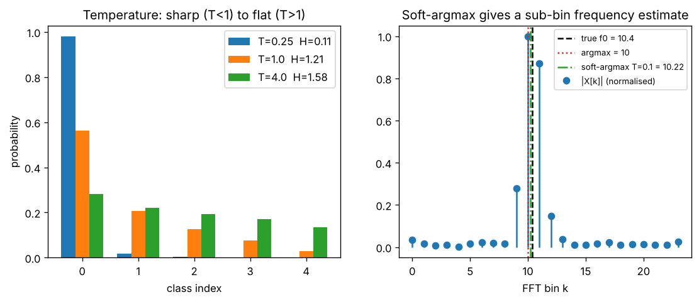

# Day 129 — Consolidation Day: The Softmax Thread (softmax → cross-entropy → attention → label smoothing → CFG/temperature → PPO)

*(No new concept number. Day 128 followed the bottleneck thread; today's cross-phase thread is **exponential normalisation: turning scores into a distribution**.)*

## 🧠 CONCEPT OF THE DAY — ONE FUNCTION, SIX DISGUISES

**Intuition.** Softmax is a "winner-take-most" vote. Every candidate has a raw score; exponentiating makes all scores positive and exaggerates gaps; dividing by the total makes them sum to 1. A temperature dial decides how winner-take-all the vote is. The same dial appears all over the roadmap:

- **Softmax + cross-entropy (5):** logits become class probabilities; the loss gradient collapses to the clean form $p-y$.
- **Attention (53–55):** a *soft lookup*: softmax over query–key scores gives mixing weights over values; the $\sqrt d$ in (55) is a temperature that keeps the vote from saturating.
- **Label smoothing (31):** softens the one-hot target so the logits do not run off to infinity.
- **Sampling and temperature (68, 70):** the same dial at inference time trades diversity against determinism.
- **Classifier-free guidance (86):** extrapolating between conditional and unconditional scores, which sharpens the implied distribution like a temperature below 1.
- **Policy gradients and PPO (106–107):** the policy is a softmax over action preferences; PPO clips how far the ratio of new to old probabilities may move.

**The math.** For logits $z\in\mathbb{R}^K$ and temperature $T>0$:

$$p_i(T)=\frac{e^{z_i/T}}{\sum_{j}e^{z_j/T}}$$

Here $z_i$ is the score of class $i$ and $T$ the temperature. As $T\to0$ the distribution becomes one-hot on $\arg\max z$; as $T\to\infty$ it becomes uniform. Its entropy rises monotonically with $T$.

Two identities make it practical. First, softmax is shift invariant, so subtracting $m=\max_j z_j$ changes nothing but avoids overflow. Second, the log-probability is computed with log-sum-exp (LSE), never by taking the log of a softmax:

$$\log p_i=z_i-\mathrm{LSE}(z),\qquad \mathrm{LSE}(z)=m+\log\sum_j e^{z_j-m}$$

With one-hot target $y$ the cross-entropy loss $L=-\sum_i y_i\log p_i$ has gradient

$$\frac{\partial L}{\partial z_i}=p_i-y_i$$

so a confident wrong answer gives a large gradient and a confident right answer gives almost none. That is the credit-assignment signal from backprop (8, 9) in its simplest form.



`graph_DAY_129.py` (seed 42, nothing downloaded). On the left, the same five logits give an entropy of about 0.11 nats at $T=0.25$, 1.21 at $T=1$ and 1.58 at $T=4$ (the maximum for five classes is $\ln5\approx1.61$). On the right, a tone at 10.4 bins is reported as bin 10 by hard argmax; a soft-argmax at $T=0.1$ returns 10.23, and at $T=0.05$ it returns 10.07. Both move toward the truth only partially, and at $T=0.3$ the estimate drifts to 12.8 because the many small off-peak bins start to pull the mean toward the middle. Temperature trades *bias from the peak* against *bias from the tails*; there is a sweet spot, not a free lunch.

**Why it matters / where it leads.** Almost every "why is my training unstable?" question in this roadmap reduces to a saturated or overflowing softmax: attention without $\sqrt d$, fp16 logits (96), a model over-confident after label-free training. Next in the roadmap sequence is simply a fresh thread, but the interview payoff is immediate: you should be able to say *why* the numerically stable form exists and *what the gradient is*.

**Interview question:** *Your classifier trains in fp32 but produces NaN loss after you switch to fp16. The last layer is `loss = -torch.log(torch.softmax(logits, -1))[range(B), y].mean()`. Explain precisely what breaks, and give the fix.*

*(Answer at the very bottom.)*

## 🐍 PYTHONIC EDGE

**Never write `log(softmax(x))`: fuse it as `log_softmax`, and test it with an `assert`.**

```python
import torch                                          # plain import (C++: #include <torch/torch.h>)
import torch.nn.functional as F                       # "as F" alias: import X as Y has no C++ equivalent

z = torch.tensor([[1000.0, 999.0, 0.0]])              # nested list -> 2-D tensor; no explicit dtype or type declaration needed
y = torch.tensor([1])                                 # integer class index per row

# BAD: two separate kernels; exp(1000) overflows to inf, then inf/inf = nan
p = torch.softmax(z, dim=-1)                          # dim=-1: negative index counts from the end (C++: no negative indexing)
bad = -torch.log(p)[0, y]                             # [0, y] tuple index (row, col tensor); log(0) would be -inf

# CLEAN: one fused op that subtracts the max internally (log-sum-exp trick)
logp = F.log_softmax(z, dim=-1)                       # keyword argument dim=...; C++ has no named arguments
good = F.nll_loss(logp, y)                            # nll_loss takes log-probs; y is a LongTensor of class ids
also = F.cross_entropy(z, y)                          # the one-liner: takes RAW logits, applies log_softmax internally

assert torch.isfinite(good), "loss blew up"           # assert expr, msg: raises AssertionError (C++ assert aborts, can be compiled out)
assert torch.allclose(good, also)                     # allclose: float-tolerant equality; never use == on floats
print(f"bad={bad.item()} good={good.item():.4f}")     # f"..." f-string; .item() pulls a Python float out of a 1-element tensor
```

The classic slip is wrapping a model's final layer in `nn.Softmax` and then feeding it to `nn.CrossEntropyLoss`, which applies `log_softmax` again. Return raw logits from `forward()`, call the module object (`model(x)`, which invokes `__call__` and its hooks) rather than `model.forward(x)`, and only apply softmax at inference time.

## 📡 SIGNAL LAB

**Problem.** A 64-sample sinusoid has frequency $f_0=10.4$ cycles per window, so its energy straddles bins 10 and 11. (a) What does `argmax(|FFT|)` report and why is that a bias? (b) Replace argmax with a softmax-weighted mean of bin indices. How does the temperature change the estimate?

**Solution.** The DFT samples the spectrum only at integer bins. With a Hann window the main lobe is about four bins wide, so bins 10 and 11 both carry energy, but bin 10 is the larger since 10.4 is closer to 10. Hard argmax therefore returns 10: a quantisation error of 0.4 bins, which is the Nyquist-grid resolution $f_s/N$ showing up as an estimation floor.

The soft-argmax computes $\hat f=\sum_k p_k\,k$ with $p=\mathrm{softmax}(|X|/\max|X|\,/\,T)$. It is differentiable, which is why it appears in keypoint heatmaps and learned frequency estimators. Measured on the seeded signal (see the graph): $\hat f=10.07$ at $T=0.05$, $10.23$ at $T=0.1$, and $12.76$ at $T=0.3$. A low $T$ hugs the peak bin (still biased low); a moderate $T$ blends bin 11's contribution and improves; a high $T$ lets the flat noise floor, spread over all bins, drag the mean away from the peak.

**So what.** The proper fixes for sub-bin accuracy are zero-padding or parabolic interpolation around the peak, because softmax averaging over the *whole* spectrum is contaminated by the floor. The general lesson transfers to attention: a softmax over many weak candidates is a *diluted* average, which is exactly why long-context attention loses focus (63) and why sharper scores or sparse attention help. For your generative-forensics lane, note the same trap in learned spectral detectors: a soft pooling over frequency bins averages away a narrow upsampling-replica peak unless the temperature is low or the pooling is restricted to the suspect band.

## 🏋️ THE GAUNTLET

**Top K Frequent Elements.** Given an integer array `a` of length `n` and an integer `k`, return the `k` values that occur most often, in any order. The answer is guaranteed to be unique.

- $1\le k\le$ (number of distinct values) $\le n\le 10^5$
- $-10^4\le a[i]\le 10^4$
- Aim for better than $O(n\log n)$.

Example: `a = [1,1,1,2,2,3], k = 2` gives `[1,2]`.

**Hint 1.** First count occurrences. After counting, what is the *largest* frequency any value could possibly have, in terms of $n$?

**Hint 2.** A frequency is an integer in $[1,n]$. Does that remind you of something you can index by directly instead of sorting?

**Hint 3.** Make an array of $n+1$ buckets where bucket $f$ holds the values that appear exactly $f$ times, then walk from the highest bucket downward until you have collected $k$ values.

**Pattern:** hash map + bucket sort (frequency counting). **Target complexity:** $O(n)$ time, $O(n)$ space. (A size-$k$ min-heap gives $O(n\log k)$ and is the acceptable fallback.)

*Connection to today:* top-$k$ sampling in language models keeps the $k$ most probable tokens before the softmax renormalises; this is the discrete version of the same selection.

## 🏗️ BLUEPRINT

no blueprint today.

## 🗺️ MARCHING ORDERS

Open one of your own training scripts and grep for `softmax` and `log(`: any place where they sit next to each other is a latent NaN. Replace each with `log_softmax` or the fused loss.

Tomorrow: the roadmap is complete, so the next run is another consolidation day (no new concept number), picking a new cross-phase thread.

---

## 🔓 GAUNTLET SOLUTION

```cpp
#include <bits/stdc++.h>
using namespace std;

vector<int> topKFrequent(const vector<int>& a, int k) {
    unordered_map<int,int> cnt;
    for (int x : a) ++cnt[x];                       // frequency table
    vector<vector<int>> bucket(a.size() + 1);       // bucket[f] = values that occur exactly f times
    for (auto& [v, f] : cnt) bucket[f].push_back(v);
    vector<int> out;
    for (int f = (int)a.size(); f >= 1 && (int)out.size() < k; --f)
        for (int v : bucket[f]) {
            out.push_back(v);
            if ((int)out.size() == k) break;
        }
    return out;
}
```

Compiled and run: `[1,1,1,2,2,3], k=2` → `1 2`; `[1], k=1` → `1`; `[4,4,5,5,5,6,6,6,6], k=2` → `6 5`. Counting is $O(n)$, filling buckets is $O(\text{distinct})$, and the downward walk touches each bucket once, so the total is $O(n)$.

## 💡 CONCEPT ANSWER

**What breaks.** With logits of magnitude above roughly 11 in fp16 (max value 65504, and $e^{11}\approx 59874$), `exp` overflows to `inf`. Then `softmax` computes `inf/inf = nan`, and even when it does not overflow, a tiny probability underflows to exactly `0`, so `log(0) = -inf`, and the loss or its gradient becomes `inf` or `nan`. fp32 survives longer simply because its range is larger (overflow near logit 88), so the bug stays hidden until precision is lowered or logits grow. Splitting the computation into `softmax` then `log` also discards the algebraic cancellation that makes the result well behaved: $\log p_i=z_i-\mathrm{LSE}(z)$ is perfectly finite even when $p_i$ is not representable.

**Fix.** Use `F.cross_entropy(logits, y)` (or `log_softmax` plus `nll_loss`), which subtracts the max before exponentiating and evaluates the log-sum-exp stably. Under autocast, keep this loss in fp32 (PyTorch does so for you) and return raw logits from the model rather than probabilities. As a secondary guard, watch for logit growth with label smoothing or a small logit penalty.
