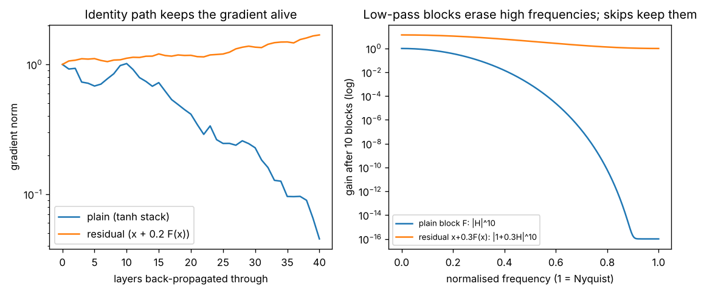

# Day 130 — Consolidation Day: The Identity-Path Thread (vanishing gradients → ResNet → DenseNet → LSTM → U-Net → LoRA)

*(No new concept number. Day 129 followed the softmax thread; today's cross-phase thread is **"keep an identity path open"**: the one trick that lets depth, time and adapters train at all.)*

## 🧠 CONCEPT OF THE DAY — THE EXPRESS LANE

**Intuition.** Imagine a motorway with an express lane. Each exit (a layer) may add or remove a little traffic, but the express lane carries the original flow to the end unchanged. Information going forward and blame going backward both ride that lane. Every architecture below is the same idea in a different costume:

- **Vanishing gradients (20):** a product of many Jacobians with norm below 1 shrinks to zero. This is the disease.
- **ResNet (41):** $y=x+F(x)$ puts an identity term in every Jacobian.
- **DenseNet (42):** every layer sees every earlier output via concatenation: many express lanes.
- **LSTM cell state (48):** $c_t=f_t\odot c_{t-1}+i_t\odot g_t$ is a residual update through time; with $f_t\approx1$ the gradient flows unchanged.
- **Transformer block (60):** two residual sums around attention and the FFN; the layer norm sits on the branch (pre-LN) so the lane stays clean.
- **U-Net (94):** encoder features are concatenated into the decoder, so fine detail skips the bottleneck.
- **LoRA (73):** $W+BA$ with $B=0$ at init: the adapted model *starts* as the identity edit of the base model.

**The math.** For a residual block $y=x+F(x)$ with Jacobian $J=\partial F/\partial x$, the backward pass multiplies the upstream gradient by $(I+J)$. Over $L$ blocks:

$$\frac{\partial \mathcal L}{\partial x_0}=\frac{\partial \mathcal L}{\partial x_L}\prod_{l=1}^{L}\left(I+J_l\right)=\frac{\partial \mathcal L}{\partial x_L}\left(I+\sum_l J_l+\sum_{l<m}J_mJ_l+\cdots\right)$$

Here $x_l$ is the activation after block $l$, $J_l$ the Jacobian of branch $F_l$, and $\mathcal L$ the loss. Expanding the product shows the leading term is exactly $I$: whatever the branches do, a path with gradient $\partial\mathcal L/\partial x_L$ reaches the input untouched. There are also $2^L$ paths of different lengths, so a residual net behaves like an ensemble of shallow and deep networks. Compare the plain stack, whose gradient is $\prod_l J_l$ and has no identity term, so if each $\|J_l\|\approx\rho<1$ it decays like $\rho^L$.

The 56-layer vs 20-layer *degradation* result is not overfitting (training error got worse). A plain deep net must *learn* the identity in its extra layers, which is hard; a residual net only has to push $F\to0$.



`graph_DAY_130.py` (seed 42, width 32, nothing downloaded). On the left, after 40 layers the gradient norm in the plain tanh stack is about $4.5\times10^{-2}$ (down from 1 at the output), while the residual stack ($x+0.2\tanh(Wx)$) sits at about 1.7: the gradient has not vanished. On the right, a branch that is a low-pass filter $H(\omega)=(2+2\cos\omega)/4$ is applied ten times. In a plain stack the gain at $\omega=\pi/2$ is $9\times10^{-4}$ and at Nyquist it is exactly 0. In the residual version $|1+0.3H|^{10}$ is 4.0 at $\omega=\pi/2$ and exactly 1 at Nyquist, so nothing is erased. The residual stack also boosts low frequencies the most (13.8 at DC), which is why real networks normalise.

**Why it matters / where it leads.** If you can explain "$I+J$" you can answer why pre-LN beats post-LN, why we zero-initialise the last layer of a residual branch, why LoRA starts from $B=0$, and why a gradient never reaches a frozen-but-detached branch. With no new numbered concept left, the next consolidation will pick another cross-phase thread.

**Interview question:** *A 56-layer plain CNN has higher **training** error than a 20-layer one. Why can't overfitting explain it, and in one equation, why does adding skip connections fix it?*

*(Answer at the very bottom.)*

## 🐍 PYTHONIC EDGE

**Wrap the skip in a tiny module, and assert it is the identity at init.**

```python
import torch                                          # plain import (C++: #include <torch/torch.h>)
import torch.nn as nn                                 # "as nn" alias: import X as Y has no C++ equivalent

# BAD: skip written inline, repeated in every forward(), nothing checks the init
class BadNet(nn.Module):                              # class X(Base): single inheritance (C++: class X : public Base)
    def __init__(self):                               # constructor; self is C++'s this, but explicit
        super().__init__()                            # parent constructor (C++: initialiser-list syntax)
        self.a = nn.Linear(8, 8)                      # instance attribute set in the body (C++: declare in header first)
        self.b = nn.Linear(8, 8)
    def forward(self, x):                             # called via __call__ (net(x)), never net.forward(x), so hooks run
        x = x + self.a(x)                             # easy to forget one of these "+ x" terms when copy-pasting
        return x + self.b(x)

# CLEAN: one reusable wrapper; the branch is passed in as a value
class Residual(nn.Module):
    def __init__(self, fn):                           # fn is any callable: first-class, no C++ equivalent without std::function
        super().__init__()
        self.fn = fn                                  # storing a module registers its parameters automatically
    def forward(self, x):
        return x + self.fn(x)                         # + on tensors is element-wise; shapes must match

branch = nn.Sequential(nn.Linear(8, 8), nn.ReLU(), nn.Linear(8, 8))   # modules compose by passing them as arguments
nn.init.zeros_(branch[-1].weight)                     # branch[-1]: negative index = last element; trailing _ means in-place
nn.init.zeros_(branch[-1].bias)                       # in-place: mutates the tensor, returns it
block = Residual(branch)

x = torch.randn(4, 8)                                 # seedless random input: fine for a sanity check
assert torch.allclose(block(x), x), "block is not identity at init"   # assert: message after the comma, no C++ <cassert> needed
```

If the assert fails, someone changed the init or the wiring; catching it at construction time is far cheaper than a flat training curve on day three.

## 📡 SIGNAL LAB

**Problem.** A branch $F$ is the 3-tap filter $[1,2,1]/4$ with frequency response $H(\omega)=(2+2\cos\omega)/4$. (a) What is the gain at DC, $\pi/2$ and Nyquist for a plain stack of 10 such layers? (b) Same for 10 residual blocks $x+0.3F(x)$. (c) How many residual blocks until the DC gain exceeds 1000?

**Solution.**

(a) $H(0)=1$, $H(\pi/2)=0.5$, $H(\pi)=0$. Ten layers: $1$, $0.5^{10}\approx9.8\times10^{-4}$, and $0$. (The graph shows $9\times10^{-4}$ because it samples the nearest grid frequency.)

(b) Gain per block is $1+0.3H(\omega)$: $1.3$, $1.15$, $1.0$. Ten blocks: $1.3^{10}\approx13.8$, $1.15^{10}\approx4.0$, and $1$.

(c) $1.3^N>1000\Rightarrow N>\ln1000/\ln1.3\approx26.3$, so 27 blocks.

**So what.** A plain low-pass stack is a spectral eraser: high frequencies die exponentially. A residual stack can never drop below gain 1 for a non-negative $H$, so the highest frequencies survive untouched. For a frequency-domain forensics researcher this is the key point: upsampling artifacts (80, 88) sit at high frequency, and U-Net skips and residual paths are exactly what let them reach the output, or the detector. It is also the reason decoders without skips look over-smooth, and why the unnormalised DC growth (13.8x) has to be tamed by normalisation layers.

## 🏋️ THE GAUNTLET

**Product of Array Except Self.** Given an integer array `nums`, return an array `out` where `out[i]` is the product of every element of `nums` *except* `nums[i]`. **You may not use division.**

Constraints: $2\le n\le10^5$; $-30\le \texttt{nums[i]}\le30$; every prefix and suffix product fits in a 32-bit integer (use `long long` anyway). Zeros may appear.

**Hints.**
1. Why is division tempting, and why does a single zero (or two) wreck it? Which products *don't* involve `nums[i]` at all?
2. `out[i]` splits into a part to the left of `i` and a part to the right. Can each part be accumulated in one sweep?
3. Write the left-products straight into `out`, then sweep right-to-left with one running variable instead of a second array.

**Pattern:** prefix/suffix scan, a forward pass then a backward pass (the same shape as forward and backward in a network).

**Target:** $O(n)$ time, $O(1)$ extra space beyond the output.

*(Full solution at the very bottom.)*

## 🏗️ BLUEPRINT

no blueprint today.

## 🗺️ MARCHING ORDERS

Open your own model, find every `x + f(x)` and ask: *is the branch's last layer zero-initialised or scaled?* If not, write the identity assert from today's Pythonic Edge and see if it fails.

Tomorrow: the roadmap is complete, so the next run is another consolidation day (no new concept number), picking a new cross-phase thread.

---

## 🔓 GAUNTLET SOLUTION

```cpp
#include <bits/stdc++.h>
using namespace std;

vector<long long> productExceptSelf(const vector<int>& a) {
    int n = a.size();
    vector<long long> out(n, 1);
    long long left = 1;
    for (int i = 0; i < n; ++i) { out[i] = left; left *= a[i]; }          // out[i] = product of a[0..i-1]
    long long right = 1;
    for (int i = n - 1; i >= 0; --i) { out[i] *= right; right *= a[i]; } // times product of a[i+1..n-1]
    return out;
}
```

Compiled and run: `[1,2,3,4]` → `24 12 8 6`; `[-1,1,0,-3,3]` → `0 0 9 0 0`; `[0,0,5]` → `0 0 0`; `[7,2]` → `2 7`. Both sweeps are linear and the only extra storage is two scalars, so the cost is $O(n)$ time and $O(1)$ extra space. Zeros need no special case because we never divide.

## 💡 CONCEPT ANSWER

**Not overfitting.** Overfitting means *low training error and high test error*. Here the deeper network is worse on the **training** set, and a deeper plain net can represent everything the shallow one can (copy the 20 layers, make the other 36 identities). So the failure is one of **optimisation**: gradient descent cannot find even that identity solution through a long stack of non-identity Jacobians, whose product shrinks or distorts the gradient.

**The equation.** With $y=x+F(x)$,

$$\frac{\partial \mathcal L}{\partial x_0}=\frac{\partial \mathcal L}{\partial x_L}\prod_{l}\left(I+J_l\right)=\frac{\partial \mathcal L}{\partial x_L}\left(I+\sum_l J_l+\cdots\right)$$

The identity term guarantees a gradient path of unit gain from the loss to every layer, and the "extra" layers only need $F\to0$ (easy: small weights) to reproduce the shallow network. Skips therefore turn "learn the identity" into "learn nothing", and the degradation disappears.
