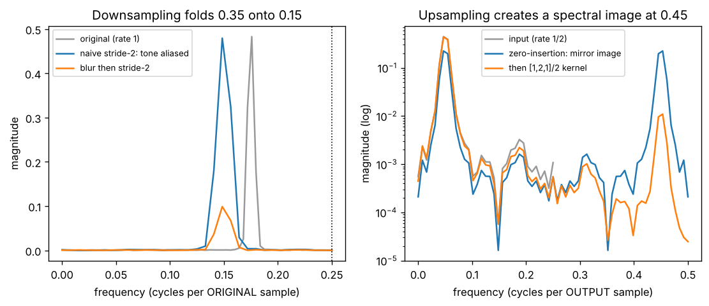

# Day 131 — Consolidation Day: The Aliasing Thread (strided conv → pooling → transposed conv → VAE decoder → spectral signatures → ViT patchify)

*(No new concept number. Day 130 followed the identity-path thread; today's cross-phase thread is **"every resampling step is a sampling-theorem problem"**, which is your research lane.)*

## 🧠 CONCEPT OF THE DAY — THE RESAMPLING TAX

**Intuition.** Photograph a spinning wheel with a camera that is too slow: the wheel appears to turn backwards. The camera did not lose information at random; it *folded* a fast rotation onto a slow, wrong one. Every time a network changes resolution it is that camera, and the folded frequencies are indistinguishable from real ones afterwards.

The same trap shows up across the roadmap:

- **Strided conv & pooling (33, 35):** keeping every 2nd sample halves the rate. Anything above the new Nyquist folds down to a false low frequency.
- **Receptive field & dilation (36, 44):** a dilated kernel is a filter with zeros inserted, so its frequency response *repeats*: it has built-in aliasing.
- **Transposed conv / upsampling (43):** inserting zeros makes a spectral *image* (a mirrored copy of the spectrum). If the kernel does not remove it, you get the checkerboard.
- **VAE decoder artifacts (80):** the decoder is a stack of upsamplers, so every one leaves a residual image at a predictable frequency.
- **Spectral signatures of generated images (88):** those residual images are the peaks a forensic detector reads.
- **ViT patchify (89):** a stride-$P$ conv with a $P\times P$ kernel is decimation with a box filter, the weakest anti-alias filter there is.

**The math.** Let $x[n]$ have spectrum $X(e^{j\omega})$. Keeping every $M$-th sample gives $y[n]=x[Mn]$ with

$$Y(e^{j\omega})=\frac{1}{M}\sum_{m=0}^{M-1}X\!\left(e^{j(\omega-2\pi m)/M}\right)$$

Here $\omega$ is angular frequency in radians per sample, $M$ the decimation factor, and the sum has $M$ shifted copies of $X$ stretched by $M$. If $X$ has energy above $\pi/M$, the copies overlap and cannot be separated: that is aliasing. A tone at $f_0$ cycles/sample with $f_0>1/(2M)$ lands at the folded frequency

$$f_\text{alias}=\left|f_0 M-\operatorname{round}(f_0 M)\right|\quad\text{(cycles per new sample)}$$

For upsampling by $L$ with zero insertion, $y[n]=x[n/L]$ if $L\mid n$ else $0$, and

$$Y(e^{j\omega})=X(e^{j\omega L})$$

so the spectrum is compressed by $L$ and repeated $L$ times: $L-1$ unwanted images. The cure is a low-pass kernel after the zero insertion (this is what bilinear upsampling is). A kernel cannot be perfect with 3 taps, so a small residue remains.



`graph_DAY_131.py` (seed 42, 128 samples, nothing downloaded). On the left, a tone at 0.35 cycles/sample is above the post-decimation Nyquist, so naive stride-2 folds it to $|2\times0.35-1|=0.3$ cycles per new sample, i.e. 0.15 per original sample, and the measured peak is at 0.148. A $[1,2,1]/4$ blur first has gain $H=(2+2\cos 2\pi\cdot0.35)/4\approx0.21$ at that frequency, so the false peak drops from 0.48 to 0.10. It is reduced, not removed: the blur is only a weak filter. On the right, a tone at 0.05 cycles per output sample has a mirror image at 0.45 of equal height (0.223 each) after zero-insertion. The $[1,2,1]/2$ kernel cuts the image to 0.011 (a 3-tap kernel has gain only about 0.012 at 0.45; the measured residual also holds noise and window leakage), so it is small but never zero.

**Why it matters / where it leads.** Since no numbered concepts remain, the next consolidation threads can be "normalisation" or "sampling and temperature". The practical lesson: *anti-aliased* resampling (blur-pool, antialiased interpolation) improves shift-stability, and the leftover images are exactly the fingerprints that forensics exploits.

**Interview question:** *A CNN's prediction flips when you shift the input image by one pixel. Why, and what is one architectural fix?*

*(Answer at the very bottom.)*

## 🐍 PYTHONIC EDGE

**Check a resampler's aliasing with the FFT, using `rfft` and a boolean mask instead of loops.**

```python
import numpy as np                                    # "as np" alias: import X as Y has no C++ equivalent

x = np.sin(2 * np.pi * 0.35 * np.arange(128))         # np.arange(128) builds an array; ** (not pow()) is Python's exponent operator
y = x[::2]                                            # slice [start:stop:step]; empty start/stop = whole range; a view, not a copy

# BAD: python loop to find the dominant frequency
best, best_k = 0.0, 0                                 # tuple-style multiple assignment (C++: two declarations)
S = np.abs(np.fft.rfft(y))                            # rfft: real-input FFT, returns n//2+1 bins
for k in range(len(S)):                               # range() is an object (lazy sequence), not a loop macro
    if S[k] > best:
        best, best_k = S[k], k                        # tuple unpacking swap/assign in one line

# CLEAN: vectorised, named, and returns a tuple
def peak_freq(sig, rate=1.0, *, floor=1e-3):          # * makes 'floor' keyword-only: must be written peak_freq(s, floor=..)
    mag = np.abs(np.fft.rfft(sig))                    # no explicit loop; runs in C
    freqs = np.fft.rfftfreq(len(sig), d=1.0 / rate)   # d= is the sample spacing
    keep = mag > floor * mag.max()                    # boolean mask, same shape as mag
    return freqs[keep][np.argmax(mag[keep])], mag.max()   # boolean indexing; returns a tuple (C++: std::pair / struct)

f, m = peak_freq(y)                                   # tuple unpacking: a, b = fn()
assert abs(f - 0.3) < 0.02, f"alias expected at 0.3, got {f}"   # f-string; assert with message, runs only if no -O
```

One caveat: `x[::2]` is a *view*, so `y *= 2` would also change `x`. Use `.copy()` when you need independence.

## 📡 SIGNAL LAB

**Problem.** (a) A 224×224 image feature map is downsampled by a stride-2 conv three times (to 28×28). What is the highest spatial frequency, in cycles per original pixel, that can survive without aliasing? (b) A texture has a periodic stripe pattern of period 3 pixels. Where does it land (in cycles per *new* sample) after one stride-2 step with no pre-filter? (c) A transposed conv with stride 2 is followed by a 3-tap kernel $[1,2,1]/2$. At what frequency is the strongest residual image if the content is at 0.05 cycles/output sample, and what is the kernel gain there?

**Solution.**

(a) Each stride-2 step halves the rate, so after three steps the rate is $1/8$ and the Nyquist limit is $1/16=0.0625$ cycles per original pixel. Anything with finer detail than 16 pixels per cycle is already aliased unless it was filtered out.

(b) Period 3 means $f_0=1/3\approx0.333$. After $M=2$: $f_0M=0.667$, nearest integer 1, so $f_\text{alias}=|0.667-1|=0.333$ cycles per new sample, i.e. a period-3 stripe again but now at the wrong scale. The pattern stays "stripe-like" but its spacing is wrong.

(c) The image sits at $0.5-0.05=0.45$. The kernel's response is $H(f)=(2+2\cos 2\pi f)/2$, so $H(0.05)\approx1.95$ (content kept, DC gain is 2) and $H(0.45)\approx0.012$. The image is therefore suppressed by about $0.012/1.95\approx0.6\%$ relative to the content, roughly 160× in amplitude. In the graph the measured residual (0.011) is higher than this ideal because it also contains the 0.01 noise floor and Hann-window leakage from the (doubled) content peak; the point is that it is small but never zero.

**So what.** The image frequency is *deterministic*: it depends only on the stride and the content frequency. A generator with stride-2 upsamplers puts energy at $f_s/2-f$ for every content frequency $f$, producing a regular grid of spectral peaks in the 2-D FFT. That grid is the forensic fingerprint (Concept 88), and it is also why a detector trained on one generator fails on another with a different upsampling kernel: the peaks move.

## 🏋️ THE GAUNTLET

**Sliding Window Maximum** (the exact computation of 1-D max pooling with stride 1). Given an integer array `nums` and a window size `k`, return the maximum of every contiguous window of length `k`, left to right.

Constraints: $1\le n\le10^5$; $1\le k\le n$; $-10^4\le \texttt{nums[i]}\le10^4$.

**Hints.**
1. The naive scan is $O(nk)$. When the window slides by one, which old elements could *still* become the maximum later?
2. If a newer element is at least as large as an older one, can the older one ever be the answer again? What does that say about the order in which you should keep candidates?
3. Keep candidates in a structure you can pop from both ends. Store *indices*, not values, so you know when the front has left the window.

**Pattern:** monotonic deque.

**Target:** $O(n)$ time (each index is pushed and popped at most once), $O(k)$ space.

*(Full solution at the very bottom.)*

## 🏗️ BLUEPRINT

no blueprint today.

## 🗺️ MARCHING ORDERS

Take any downsampling layer in a model you trust and feed it a pure sine at 0.35 cycles/pixel: if the output has a peak at the wrong frequency, you have just measured your own aliasing.

Tomorrow: the roadmap is complete, so the next run is another consolidation day (no new concept number), picking a new cross-phase thread.

---

## 🔓 GAUNTLET SOLUTION

```cpp
#include <bits/stdc++.h>
using namespace std;

vector<int> slidingMax(const vector<int>& a, int k) {
    deque<int> dq;                       // indices; values strictly decreasing front -> back
    vector<int> out;
    for (int i = 0; i < (int)a.size(); ++i) {
        if (!dq.empty() && dq.front() <= i - k) dq.pop_front();    // front left the window
        while (!dq.empty() && a[dq.back()] <= a[i]) dq.pop_back(); // dominated: can never be a max again
        dq.push_back(i);
        if (i >= k - 1) out.push_back(a[dq.front()]);              // front is the window max
    }
    return out;
}
```

Compiled and run: `[1,3,-1,-3,5,3,6,7], k=3` → `3 3 5 5 6 7`; `[1], k=1` → `1`; `[9,8,7,6], k=2` → `9 8 7`; `[1,2,3,4], k=4` → `4`; also matched a brute force on 2000 random cases. Each index enters and leaves the deque at most once, so the cost is $O(n)$ time and $O(k)$ space.

## 💡 CONCEPT ANSWER

**Why it flips.** Strided convolutions and pooling decimate without a proper low-pass filter, so they violate the sampling theorem. A one-pixel shift moves the sample grid relative to the image, so high-frequency content aliases to a *different* false frequency (its phase changes), and the downstream features change. The network is only equivariant to shifts by multiples of the stride, not to every shift.

**Fix.** Low-pass before decimating: *blur-pool* (apply a fixed binomial filter such as $[1,2,1]/4$ before the stride), i.e. anti-aliased CNNs. Alternatives are antialiased bilinear/Lanczos resizing and global average pooling at the end. Per the graph above, a 3-tap blur cut the aliased peak by about 5× (0.48 → 0.10), so it helps a lot but does not make the layer perfectly shift-invariant.
